[英]MartinFowler著 陈师注释  

# 分析模式一可复用的对象模型  

# 注释版  

  

# 目录  

Ralph Johnson序 Ward Cunningham序  

# 前言  

# 第1章绪论  

1.1概念模型1.2模式世界1.2.1 Christopher Alexander 1.2.2描述格式1.2.3关于模式的抽象程度1.3本书中的模式1.3.1建模实例1.3.2模式的来源1.3.3跨领域的模式1.4概念模型与业务过程重组 1.5模式与框架1.6本书的使用  

# 第一部分分析模式  

# 第2章责任模式  

2.1团体 --18 2.2组织层次2.3组织结构2.4 责任 .22 2.5 责任知识级 24 2.6 团体类型泛化 26 2.7 层次型责任 27 2.8 操作范围 29 2.9职位  

# 第3章观察和测量模式  

3.1数量 34 3.2转换率 ..36 3.3复合单位.373.4测量 ..38

 3.5观察 :40

 3.6观察概念的子类型化

3.7 观察方案 -44

 3.8双时间记录-44

3.9 被否决的观察 -45

 3.10 临床观察、假设与推理 -45

 3.11 关联观察 .46

 3.12观察过程  

# 第4章针对公司财务的观察模式  

4.1企业片断..534.1.1定义维度 -57 4.1.2维度的属性以及企业片断....59

4.2测量方案 .60 4.2.1保持计算的有效性4.2.2 比较和因果测量方案 .....62 4.2.3状态类型：定义计划的和实际的状态 -63 4.2.4构造测量 .66 4.2.5维度合并-66

4.3范围 -69

 4.4带范围的现象-704.4.1带范围属性的现象 -71 4.4.2范围函数.73

4.5使用最终框架-75  

# 第5章引用对象  

5.1名称

5.2标识方案 79

 5.3对象合并 81 5.3.1复制并替换 82 5.3.2替代 82 5.3.3本质/表象 83 5.4对象等价  

# 第6章库存与账务  

6.1账目. .-87

 6.2事务

6.3汇总账目

6.4备注账目

6.5记人规则 .

 6.5.1可逆性

6.5.2不使用事务....94

6.6个体实例方法

6.6.1使用singleton类实现..95

6.6.2使用策略模式实现

6.6.3使用内部case语句实现..97

6.6.4使用参数化方法实现..98

6.6.5使用解释器实现...98

6.6.6实现方式的选择.99

6.7记人规则的执行 -+.99

 6.7.1急切触发 .....99

 6.7.2基于账目的触发 ..101

 6.7.3基于记人规则的触发 -102

 6.7.4向后链式触发 ...102

 6.7.5触发手段的比较 ..-102

 6.8多个账目的记人规则 ..-103

 6.9选择条目.-106

 6.10账务实践 .107

 6.11条目来源...109

 6.12结算单和所得计算书

6.13对应账目

6.14专门化的账目模型

6.15登记条目到多个账目.....3

6.15.1使用备注账目

6.15.2派生账目进一步阅读 118  

# 第7章使用财务模型  

7.1结构模型120

 7.2结构的实现-122

 7.3设置新的电话服务..12474建立通话/26

 7.5实现基于账目的触发 27

 7.6 把电话分成白天和夜晚两类

 7.7按时间收费30

 7.8计算税款..33

7.9结论\*-134 7.9.1记人规则的结构-134 7.9.2什么时候不能使用框架/36 7.9.3账务实践图137  

# 第8章计划39  

8.1提议和执行的动作/40

 8.2完成和放弃的动作141

 8.3挂起 ./42

 8.4计划143

 8.5方案-146

 8.6资源分配-149

 8.7输出和启动函数-/53  

# 第9章交易  

9.1合同 -/56

  $9.2$ 合同夹160

 9.3报价--165

9.4场景168  

# 第10章派生合同/76  

10.1期货合同 -177

 10.2期权 779

 10.2.1多头、空头、看涨和看跌：体现  

一种谋略的词汇87  

10.2.2子类型化或者非子类型化 -/82

 10.3产品-184

 10.4子类型状态机-/88

 10.4.1确保状态图的一致-/90

 10.42一致性的使用问题-/92

 10.5并行的应用和领域层次结构-194

10.5.1应用外观的类型检查 ....195

 10.5.2给超类型一个包装性接口--196

10.5.3使用一个运行时属性  

# XII  

10.5.4使应用外观对领域模型可见 ....98 10.55使用异常处理9第11章交易包..20111.1对一个包的多重访问级别-20111.2 相互可见性 + 205 11.3 包的子类型化 "208 11.4结论 .209  

# 第二部分支持模式  

# 第12章信息系统的分层构架213  

12.1两层构架 ..-214 12.2三层构架--21512.3表示层和应用逻辑层-21812.3.1表示层/应用逻辑层分离的优点...22212.3.2在客户/服务器环境中伸展外观......22212.4数据库交互22412.4.1把领域层连接到数据源22412.4.2数据库接口层22512.5结论 -227  

# 第13章应用外现  

13.11一个医疗保健示例..22913.2外观的内容"-23113.2.1方法的类型"-23213.2.2样本方法.23313.3公共方法23413.4 操作 .235 13.5类型转换 .236 13.6多重外观 .237  

# 第14章类型模型的模式一设计模板·240  

14.1实现关联 -242 14.1.1双向关联和单向关联--24314.1.2关联的接口--24314.1.3基础类型--24514.1.4实现一个单向关联-24614.15在两个方向上都使用指针的双向  

14.1.6在一个方向上使用指针的双向  

实现 ..247 14.1.7使用关联对象的双向实现14.1.8双向实现的比较 .248 14.1.9派生映射 ++... ..2449 14.1.10非集合映射 .249 14.2实现泛化14.2.1用继承实现 .249 14.2.2用多重继承组合类实现 14.2.3用标志实现 .250 14.2.4用委托给一个隐藏类来实现...2514.2.5通过创建一个替换来实现..25314.2.6泛化的接口 .254 14.2.7实现hasType操作 ..255 14.3对象创建..-25514.3.1创建的接口-25614.3.2创建的实现-.-25614.4对象析构.. 14.4.1析构的接口 .....257 14.4.2析构的实现--25714.5人口点..258145.1查找对象的接口.25914.5.2查找操作的实现.26014.5.3使用类或者登记表对象14.6实现约束. .260 14.7其它技术的设计模板261第15章关联模式.26315.1关联类型 .264 15.2带键值的映射 266 15.3历史映射26816章后记 -273  

附录A技术和符号附录B模式列表索引  

# RalphJohnson序  

当我们“四人帮”在写《设计模式》（DesignPalterns）一书时，就知道除了面向对象设计模式外，还存在大量的软件模式。在阅读本书以前，我们已经了解了分布式编程模式、用户界面模式，甚至还见过如何组建软件开发小组的模式。然而，我们还没有见过能够清楚地表述面向对象分析的任何模式。PeterCoad的模式最接近于分析模式，可是这些模式却跟我们的设计模式非常相似，而我们认为纯粹的分析模式应该不是这样。  

当找在阅读MartinFowler的这本《分析模式》的手稿时，我找到了自己一直想要的东西。书中所提到的分析模式虽然包含了大量的领域知识，但适用于所有的业务软件。像设计模式一样，这些分析模式很抽象，足以帮助你的软件适应需求的变化；同时它们又非常具体化，很容易理解。它们不是最显而易见的建模问题解决方案，然而我认为它们是正确的。我以前曾经见过许多这样的解决方案，它们都发挥了很好的作用。  

我首先是一个设计人员，其次才是一个建模人员，而且我对MartinFowler所描述的领域也没有多少经验。起初，虽然我感觉这些模式非常好，但对于这种自我感觉缺乏足够的信心。自从阅读了本书以后，我就在项目开发和教学实践中试用了这些模式，它们果真发挥了作用！当我偶然看到DavidHay的《数据模型模式）（DataModelPatterns）一书时，就更增强了信心，并且意识到，虽然MartinFowler和DavidHay具有不同的背景且所用的词汇不同，但是他们所总结的模式却非常相似。模式应该是总结已存在的客观事物，而不是凭空创造一个新事物。MartinFowler准确地阐述了业务软件面向对象模型中的各种模式。他所描述的这些橙式是值得信检的  

虽然MartinFowler在本书中阐述了许多建模原则，但你并不需要再花时间去学习如何应用这些原则。它也不是一本必须先加以通读然后才能给你的实践带来神益的书。它是一本充满可以马上采纳的经验性模式的书。找到你当前所要解决问题的对应章节，将发现其中的许多思想会给你带来帮助。也可以逐章阅读本书，每一章都会给出新的启发。  

万」更对地便用本书，需要明白两件事情。首先，大部分模式的实际效果都比看起来要好。像责任这样的模式可以用在几乎所有项目中。不要只阅读那些跟你的项目明显相关的章节，应该了解尽可能多的模式，并试试看它们是否适用。第二，确保你的同事也阅读过本书。模式的最大好处之一就是它们可以帮助我们更好地交流。你会发现当你与你的同事拥有共同的词汇后，小组会议会开得更加顺畅。本书可以帮助你们把文档组织得更加连贯一致，且更易于理解。此外，本书也会把你的同事培养成更优秀的分析人员，而同优秀人员共事本身就是一件非常愉快的事情！  

Ralph Johnson  

# Ward Cunningham序  

当我面对一个软件开发项目时，首先看重的是经验。软件开发小组成员是否拥有相关的工作经验？他们能否将自身的经验有效地应用到他们所创建的对象中？不幸的是，答案往往是否定的。  

越来越多的像我们这样从事面向对象开发的人员都感觉到：已经有一段时间我们把集体的注意力放错了地方。事实上，我们已不再需要把注意力放在诸如工具、技术、图符甚至是代码上，我们已经章提了建造复杂程序的机制。如果我们失败了，那仅仅是因为缺乏经验。  

MartinFowler发现了一种给予我们所需东西的途径：那就是以书本的形式总结并介绍经验。  

他研究了领域对象，就像EricGamma等人在他们的代表作《设计模式》中研究了实现对象一样。MartinFowler使用了与其相似的术语，但是方法却不一样。比如，他使用“模式”一词，并不是在抄袭或者扩充EricGamma的著作（或当前市面上突然出现的那些新书）。他把经验的书面形式称为“模式”，只不过是因为那就是它们本来的名称。作为一个信息系统对象建模方面的顾问，他在工作中再三地发现反复出现的问题的解决方案，并发现在该过程中的模式的组成形式。  

MartinFowler本来可以很容易地写一本有关面向对象分析的书。但是，他并没有那样去做。其结果是我们拥有了一本对分析结果进行分类的书。书中每一章都汇集了他（以及他的同事）对通常性业务同题的分析工作的结论。涉及的领域很广，从医疗记录的保存到金融行生交易，中间还经历了凡个最段。哪一章适于你呢？令人惊讶的是，所有章节都很有用。MartinFowler将每个问题置于特定垫上下文环境中。然后给出相应的解决方案。你会在每种上下文环境中看出相似的地方，你也将运点问题之所在。更重要的是，你将获得意外的收获，那就是：经验！  

最后，ManinFowler果用 $\leftharpoondown$ 种较为个性化的书写方式，来表达他的想法和见解。我们可以感受到他对客户和同事的尊重，他承认绝大部分灵感都是受他们（客户和同事）启发的结果。我们察觉他保持了与实现的反复无常的行为的距离，同时兼顾了可实现性，而且拿捏得恰到好处。其实。当我们考察 $-$ 个分析专家的想法时，我们主要向专家学习的是如何进行分析的思路和方法，以便进一步丰富我们自己的经验。  

WardCunningham  

# 前言  

不久前，还没有任何有关面向对象分析和设计的书籍。而现在，却有如此之多的书籍，以致于任何一个专业人员都无法全部涉猎。其中大部分书籍都专注于：传授一种图符表示法，提出一个简单的建模过程，并用几个简单的示例来加以说明。本书是一本与它们完全不同的书。它并不把重点放在过程一即如何建模，而是把重点放在过程的结果一—即模型本身。  

我是一个信息系统对象建模方面的顾问。客户常常聘请我训练他们的员工如何建模和为他们的项目提供指导。我的大部分技能来自对建模技术以及如何运用这些技术的了解。然而，更重要的是我的实际经验，这些经验是在建造许多模型和经常分析重复出现问题的过程中积累起来的。我经常发现项目在很多方面会遇到以前我曾面对的同样问题。这些经验使得我可以重用以前所建造的模型，我只需要对这些模型加以改进，使之适应新的需求。  

仕辽去的儿年里，越来越多的人已经意识到这一现象，并且认识到那些通常介绍方法论的书籍虽然很有价值，但都只提出了学习过程的第一步，而这个学习过程还必须捕获要被建模的实际事物本身。这种认识逐渐发展成为“模式”运动，在这一运动中汇集了各种各样的人，他们有着不同的兴趣和观点，却抱着共同的目标，即传播有用的软件系统模式。  

田丁这个模式群体构成的多样性，我们很难给“模式”一个准确的定义。我们中的所有人都相信，一旦我们看到一个模式，就能辨别出它；我们认为我们在大多数情况下是一致的，但我们无法给出一个筒单的定义。我对模式的定义是：模式是一种问题解决思路，它已经适用于一个实践环境，并且也可能适用于其它环境。  

我喜欢给出一个宽松的定义，因为我希望能尽可能地接近模式研究的初衷，而不需要增加太多限制性的内容。模式可以有多种形式，而每一种形式增加了对于该模式有用的特性（1.2节讨论有关模式研究的现状以及本书所处的地位）  

本节讨论的是分析方面的模式，这些模式反映的是业务过程的概念架构，而不是实际的软件实现。绝大部分章节讨论不同业务领域的模式。这些模式很难按照传统的行业（如制造、金融、医疗保健等）进行分类，因为它们通常可用在多个领域。这些模式非常重要，因为它们可以帮助我们了解人们对世界的认识。基于这样的认识去设计计算机系统并确实去改变这种认识是非常有价值的，而认识中需要改变的地方正是要进行业务过程重组（BPR）的地方。  

然而，概念模式不可能孤立存在。对于软件工程师来讲，只有在他们明白如何实现概念模型时，这些概念模型才有用。本书介绍了一些可用于将概念模型转化成软件实现的模式，并且讨论了在一个大型信息系统中这些软件实现是如何适应系统构架的，另外还讨论了使用这些模式的具体实现技巧。  

我写本书是因为它也正是我在开始时想要阅读的书。建模人员会从本书中找到可以帮助他们如何在新领域中大展举脚的基本思路。这些模式包括：有用的模型、设计背后的论证以及适用范围。拥有这些信息，建模人员就可以为特定的问题改造现有的模型。  

本书中的模式也可用于评审已有的模型—看看其中哪些可以省略，并给出一些有助于模型改进的可选方案。当我在评审一个项目时，通常会将所看到的东西同我在以前工作中所总结出的模式加以比较。我发现了解我的书中包含的模式有助于我更容易地应用自己过去的经验。像这样的一些模式还揭示了在简单的教科书中没有谈及的建模问题。通过探讨为什么要按照我们的方法去进行建模，我们在即使没有直接使用这些模式的情况下也可以更深刻地认识到如何改进我们的建模方法。  

# 本书结构  

本书分为两个部分。第一部分介绍各种分析模式，即来自概念业务模型的模式。它们提供来自贸易、测量、财务以及组织关系等多个问题域的关键抽象。这些模式都是概念性的，因为它们表征了人们考虑业务的方式，而不是设计计算机系统的方式。该部分的各章重点阐述了可用的可选模式以及这些模式的优缺点。对于同一领域的建模人员来说，每种模式都是明显有用的、但是其中的基本模式通常在别的领域也能够发挥作用。  

第二部分重点介绍支持模式，这类模式帮助我们使用分析模式。支持模式展示：分析模式如何适合：个信息系统构架，概念模型的构造如何演变成为软件接口和实现，以及那些特定的高级建模构造如何与更简单的结构关联。  

为了描述这些模式，需要借助于一种新的图符表示法。附录简要地讨论了这种图符表示法，并提供了其中各种符号表示的含义。我没有采用单一的方法，而喜欢综合采用来自不同方法的多种技术。附录并不是一个技术指南，但它可以提供一个大纲，使你能回想起技术内容。此外，附录还告诉你应该到何处去查找我所采用技术的指南。  

书中每个部分都划分成若干章节，有关分析模式的各个章节阐述了相关的模式，这些相关模式同属一个些念较为松散的主题空间，并受到产生它们的项目的影响。这种组织形式反映了这样一个事实：任何一种模式都必须来自于一个实际的环境。每个模式都由一章中的单独小节加以阐述。哦没有采用其他一些模式作者所用的任何正式标题（参见1.2.2节），而是采取尽可能具体而又尽量合理地接近原始项目形式的方式去描述模式。我还增加了一些例子来说明如何将模式应用于其原有领域以及如何将模式应用于其它领域。有关模式研究的最困难的一件事是如何对它们加以抽象，并用于其它领域；我所采取的策略是把这一问题留给读者自己去思考和解决（参见1.2.3节）。  

本书更像是一本目录册，而不是一本从头读到尾的书。我尽量按照可单独阅读的方式撰写书中的每一章。（但是，这一点并非总是能做到的。在阅读一章时如果需要先了解其他章的内容，我将在引盲中加以说明。）每一章都有引言，引言部分概要地说明该章所针对的问题域，并概要地描述该章所包含的相关模式，此外还会谈到这些模式来自什么项目。  

# 如何阅读本书  

建议先通读第1章，然后阅读每一章的引言部分，接下来就可以自由地按照自己喜欢的顺序去钻研各章。如果你还不熟悉我所采用的建模方法、表示法或者概念，请参见附录A。附录B“模式表”简要地总结各模式的概况，因此你可以在再次阅读本书时利用它来协助钻研本书的内容或查找所需的模式。需要特别强调的是本书中的模式也可用于其它领域，不局限于模式所产生的领域，因此我鼓励你浏览一下你可能认为不属于自己兴趣范围之内的章节。比如，我发现为医疗保健行业而设计的观察和测量模型在企业金融分析中就被证明是非常有用的：  

# 本书的读者  

虽然不同的读者会从本书学到不同的东西并且可能需要一些不同的准备知识，但本书适合的读者范围非常广。  

我认为最大的读者群是面向对象（（0）计算机系统的分析人员和设计人员，尤其是那些主要从事系统分析的人员。这一类读者应该或多或少地使用过某种00分析和设计方法。本书并不提供任何有关面向对象分析与设计的内容，因此如果你对这一领域还很陌生，建议你先阅读有关的书籍。必须强调的是，本书中的模式本质上是一种概念，而我是使用一种完全概念化的方法建模，这使得本书在表述风格上与使用更趋向基于实现的方法建模的书籍有某些区别。  

另外一群读者虽然数量很少，但却非常重要，他们主要是那些在建模项目中担当领域专家的人员。这些读者不需要计算机方面的专门知识，但需要了解概念建模。我在本书中使用概念模型的主要原因之一就是要使书中内容更适合于这一类读者。这里的建模项目可能是指针对计算机系统开发或业务过程重组（BPR）的分析。我曾经教过许多专业人士（包括医生、金融交易人员、会计人员、护士以及薪资监管人员等）进行这种类型的建模，并且发现软件背景知识对于概念建模来讲可有可无。本书的业务模型模式恰好介于计算机系统分析和业务建模之间

（参见1.4节）。任何这一类型的读者最好都应学习着重于概念性内容的面向对象分析课程。

（Odell的著作[1]在这方面特别有价值。）  

虽然一些编程人员会对缺少代码和倾向于概念性的描述存在异议，但我希望大多数编程人员能够研读本书的内容。对于这些读者，我建议你们特别注意第14章，该章阐述了概念模型与最后得到的软件之间的关系。  

这是一本面向对象方面的书，我坚信面向对象方法是开发软件的上好途径。然而，本书中的这些模型主要是概念模型，而大量数据建模人员已有很悠久的使用概念（或逻辑）模型的传统。数据建模人员会发现很多模式非常有用，尤其是在他们使用了更先进的语义技术的情况下。模型的面向对象特征将揭示面向对象方法与传统方法的许多不同之处。我非常希望这一类型的读者能将本书与其它着重于概念性建模的面向对象分析书籍相结合，并能将面向对象与语义数据建模联系起来。  

管理人员会发现可以将本书作为开发活动的一个起点。从模式开始着手开发工作可以帮助我们搞清楚开发工作的目标，而项目计划的制定也可以利用模式所提供的广泛基础。  

我并没有把本书的读者定位为普通学生，而主要是针对专业的软件工程师。但我希望普通学生也能关注本书。在学习分析和设计时，我曾感到非常困难，因为只有很少的好例子可以参考，而这些实例又来自大学校园以外的世界。正如看好的代码可以教给你大量的编程技巧一样，看好的模型也可以教给你大量的分析和设计技巧。  

VIII  

# 一本动态更新的书  

我所知道的每位作者都曾有过这样的挫折感：一本书一旦出版，书中的内容就很难进行改变。书在读者之问传播：但是作者却没有什么途径可以传达可能出现的变化。随者我不断地学习新的东西，肯定会改变某些想法。我希望这些改变能够传递给读者  

在我的个人主页（http://martinfowler.com/）上会提供更多的资料，使本书可以保持动态更新。因此请随时关注该站点的动态，并通过它让我了解如何改进和发扬本书的思想。  

# 致谢  

任何作者都会感激那些给过其帮助的人。而本书的编写过程尤其如此，因为我所写的大多数的模式是在我的客户、同事和朋友的协助下创建的。在此我向他们表示最衷心的感谢。  

首先也是最需要感谢的是JimOdell，他是我事业上的良师益友。他传授给我大量有关信息系统开发的知识，并且是我不断获得灵感、有益建议以及强烈曲默感的源泉。可以这么讲，如果没有他的支持，就不可能有本书的面世  

其他需要要感谢的人是：  

在伦敦Coopers&Lybrand的开发小组。他们在早期阶段给予我很大的帮助，并帮助我在Smithfield度过了很多个夜晚。  

JohnEdwards。他协助我形成了有关概念性建模及其在软件开发中的作用的早期思想，他还向我介绍了许多有趣的想法，其中包括ChristopherAlexander的想法。  

JohnHope。他建议我首先要考虑领域，再考虑技术，并在几个关键点上为我的工作提出了很好的建议。  

伦敦圣·玛丽医院的两位医生TomCairms、MarkThursz。他们和我一起开发了组成第2、38章的基本内容的医疗保健模型：他们的工作证明了计算机背景知识并不是一流的概念性建模人员所必须具备的。其中，Mark精通医药术语，他欣然为我们提供了各种医疗保健案例。  

医疗保健项目还得到来自圣·玛丽医院、儿童医院（HSC）圣·托马斯医院以及威尔斯大学的软件专业人员和医疗保健专家的帮助。儿童医院的护士AnneCasey和系统分析员HazinTimimi协助将最终的Cosmos模型汇集在一起。GerryGold发起并推动了该项目。  

BradKain。他深深地影响了我，使我考虑到构件和重用。  

对我来讲，将医疗保健模型应用到第4章的公司财务模型中的实践证明了分析模式可以在不同领域中使用在此特别感谢VivekSalgar以及施乐公司中领导MBFW小组的LynneHalpin和CraigLockwood，是他们用C++把我们的概念性想法变成了客观实现。  

DavidCreager、SteveShepherd以及他们在Citibank（都市银行）工作的小组。他们和我一起开发了在第9到11章中刻画金融模式时用到的模型。他们还从原始的医疗保健工作中进一步提出了第12章的大量构架性思想，并向我讲述了伦敦城许多精神病人的生活。  

FredPeel，他发起并负责维护我在Citibank中的工作，并且由于他的强力推动，解除了我的后顾之忧。来自Valbccc的DaniclPoon和HazimTimimi，他们将我的模糊的思想变成了详细的规格说明。  

第6章中的账务模式经过长期的配酿。其间，TomDaly、PeterSwettenham、TomHadfield以及他们各自小组开发的模型引发了本书中账务模式的诞生。RichGarzaniti把我的会计学术语挑选了出来。而KentBeck在完善我的Smalltalk程序方面做了大量工作。  

JamesOdell，他协助我编写了第14章。  

我是模式研究团体的后来者，在写完本书的大部分章节之后，我才逐步较好地了解了模式这一概念。正是这一非常开放和友好的团体所做的大量工作激励了我进行研究工作。KentBeck、WardCunningham以及JimCoplein鼓励我加入这一团体，将一些想法总结成为模式。RalphJohnson特别为本书的第一稿提出了中肯的意见。  

还有许多给予我很好建议的审阅者，他们是：Dave Colins、Ward Cunningham（Cunningham&Cunningham公司）、Henry A.Etlinger（RIT计算机科学系）Donald G.Firesmith（KnowledgeSystems公司）、Erich Gamma、Adcle Goldberg、Tom Hadfield （TesserAct Technology ）、LynneHalpin(Nescape Communications）Brian Henderson-Sellers、Neil Hunt（Pure Software $\beta_{\delta}$ RalphE.Johnson（伊利诺伊大学厄巴纳-尚佩思分校）、Jean-PierreKuilboer（波士顿马萨诸塞大学）、Patrick D. Logan （Intel公司）、James Odell、Charles Richter(Objective Engineering公司）Douglas C.Schmidt（华盛顿大学）以及DanTasker。还需要特别指出的是 $^{,}$ DonFiresmith负责收集了以上审阅者提出的需要修改的问题。  

# 参考文献  

1.Martin,J.,andJ.Odell.Object-Oriented Methods:AFoundation.Englewood Clitts NJ:Prentice-Hall,1995.  

# 第一部分  

# 分析模式  

本书的这一部分将阐述来自多个业务领域的模式。从第2章开始，我们将着重讨论用于描述人系的模式，而这些关系定义了团体之间的职责，其中包括规范的组织和结构关系以及较不规范的关系。第3章和第4章将讨论观察和测量模式，这些模式用于记录客观世界的各种实际情况。第3章的内容来源于医疗保健行业：第4章的大量模式来自企业财务分析的领域。  

第5章的内容将考虑到对象的索引，当然不是讨论语言的寻址和内存管理问题，而是给出在实际工作中要准确查阅对象时所需要的索引信息。第6章和第7章讨论基本的账务模式，阐述了一个账户网络和记人规则是如何组成一个能起作用的账务系统的。计划是第8章要讨论的内容，在该章将讨论标准的计划和一次性计划之间的关系：以及如何计划和记录资源的使用。  

第9章将讨论在价格可变情况下的交易问题，我们需要了解这些价格变化是如何影响商业利润的。第10章将着重讨论衍生交易这个更特殊的领域，但把注意力放在各种可能导致我们建造具有继承性的业务对象层次机构的具体情况上。衍生是众多共同问题的一个实例。最后，在第1章将讨论对象和对象包，并谈一谈为了增进它们的可维护性和适应性，如何对它们进行组织的问题。  

#  

# 2772600  

# 责任模式  

当某人或某个组织对别人或别的组织承担某种责任时会运用到责任概念。它是一个非常抽象的概念，可以用来描述很多特殊的向题，包括组织结构、合同协议或者雇佣关系等。  

本章首先介绍一个重要的模式，团体模式（参见2.1节）一人和组织的超类型。我们将用组织结构问题来展示责任模型的发展由来。简单的组织结构可以用组织层次模式（参见2.2节）来建模。当层次结构过多时，会使模型变得复杂，这时需要用到组织结构模式（参见2.3节）。团体模式和组织层次模式组合在一起构成责任模式（参见2.4节）。责任模式可以处理团体之间的许多关系，包括组织结构、患者同意、服务协议、雇佣关系以及专业机构注册等。  

当用到责任模式时，有必要描述可形成哪种类型的责任模式，以及这些责任模式的约束规则。这些规则可以用责任知识级（参见2.5节）的类型实例来描述。该知识级包括团体类型，该类型用团体类型泛化模式（参见2.6节）来对各种团体进行分类和子类型化，而不用改变模型。 层次型责任模式（参见2.7节）用于表示确实需要严格分级的团体间关系。这样，责任模式既可用于刻画层次型关系，也可用于刻画更复杂的网络型关系。  

责任模式定义了团体的职责。这些职责可通过操作范围模式（参见2.8节）来定义。操作范围是责任合同中的一项条款，就像一条命令中的一个子命令。当这些职责逐渐增多，让它们隶属于特定的职位模式（参见2.9节）而不是隶属于拥有该职位的人员会更有好处。  

本章基于多个项目，因为责任是一种很通用的概念。其最初思想来自为一个公用事业开发的客户服务项目和为一个电信公司开发的财务项目。而完整的责任模型则是在做英国国民医疗服务制度的Cosmos项目[2]中开发出来的  

关键概念：团体、责任  

2.1团体  

留意一下你的通讯簿，你看到些什么？如果不出我所料的话，你会看到大量的地址、电话号码、E-mail地址等，这些信息都与特定的某个事物有关。通常该事物是某个人，但有时也可能是某个公司。这使我想起我经常会给出租车公司打电话，但我开不是要与某个特定的人通话一我只是想要一辆计程车而已。最初为通讯薄建造的模型可能如图2-1所示，但是我对该图不是很满意，因为其中有些概念性的重复。我马上就很自然地想到要找一个能概括人和公司的类型。该类型是一个典型的还没有命名的概念一一所有人都知道并用到了，但没有人给它命过名。我曾在数不清的数据模型中见过不同的名称：人员/组织、参与者、法定实体等。  

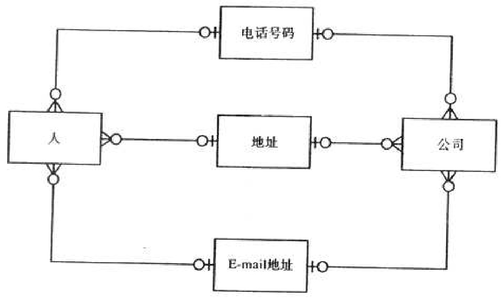  
图2-1最初的通讯薄模型  

该模型显示人和组织具有相似的职责。  

我喜欢用“团体”一词。在图2-2中定义了一个团体作为人和组织的超类型。这样，就可以为公司的各个部门或者甚至非正式的小组建立地址和电话号码等通讯记录。  

多数事物都与“团体”相关而不是与个人或组织相关。比如，跟个人和组织互通信件；付款给个人和组织：组织和个人都会产生某些行为，都会有银行账户，都会缴纳税款。我想，这些例子已经足够体现“团体”概念的价值所在了  

例：在英国国民医疗服务制度系统中，有如下一些“团体”：TomCairns医生、圣·玛丽医院的肾病治疗小组、圣·玛丽医院、公园路地区卫生当局以及皇家医学院。  

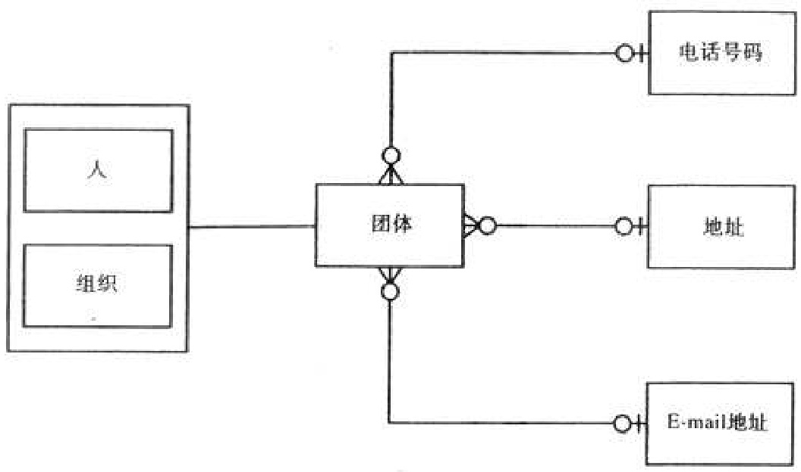  
图2-2用“团体”来概括人和组织  

“团体”应该被用于许多使用了个人或组织的情况中。  

首先我们看一下跨国公司芳香咖啡机制造公司（ACM），它有很多分公司，每个分公司又分成不同的区域子公司，而每个区域子公司又分成不同的部门，每个部门又有很多个销售办事处。我们可以用图2-3来模拟这种结构关系。然而我对该图也不是很满意。因为如果公司的组织发生变化，比如说去掉了区域子公司划分，我们就必须改变模型。图2-4提供了一个 更简单的模型，该模型可以很容易地加以改变。但该模型的递归关系隐含着某种危险，比如它允许将部门作为销售办事处的一部分。我们可以通过定义相应的子类型并对每种子类型施以一定的约束的方式来处理这一问题。一旦组织层次发生变化，我们可以改变这些子类型和约束规则。通常，改变规则比改变模型结构要容易得多，所以我倾向于用图2-4取代图 $^{2-3_{9}}$  

  
图2-3带有显式的上下级关系的组织结构  

这样的一种结构没有柔性，很难重用。  

上面提到的层次结构具有一定的通用性，但仍然有其局限性。其不足之处在于它只支持单一的组织层次关系。假设ACM公司针对每种主要的咖啡机系列为所属的销售办事处配备一个服务小组，那么这个小组就具有双重的责任结构：既向各销售小组负责，也向各产品生产单位的服务部门负责，而这些服务部门则轮流向产品的支持单位负责。例如，为波士顿的2176大容量卡布奇诺（一种意大利咖啡）咖啡机（每小时生产50杯）设立的服务小组既向波士顿的销售办事处负责，还向2170系列产品的服务中心负责。该产品服务中心又向大容量意大利咖啡机服务部门负责，而大容量意大利咖啡机服务部门又向大容量咖啡机服务部门负责，该部门则向咖啡机服务部门负责（这可不完全是我编造出来的！）。面对这种情况，我们可以再增加一个层次结构，如图2-5所示（像图2-4那样，该图中还需要一些约束规则，但我把它留给读者去完成一当成一种练习）。该方法确实是有效的，但随着更多层次的出现，整体结构会变得非常复杂而无法实用。  

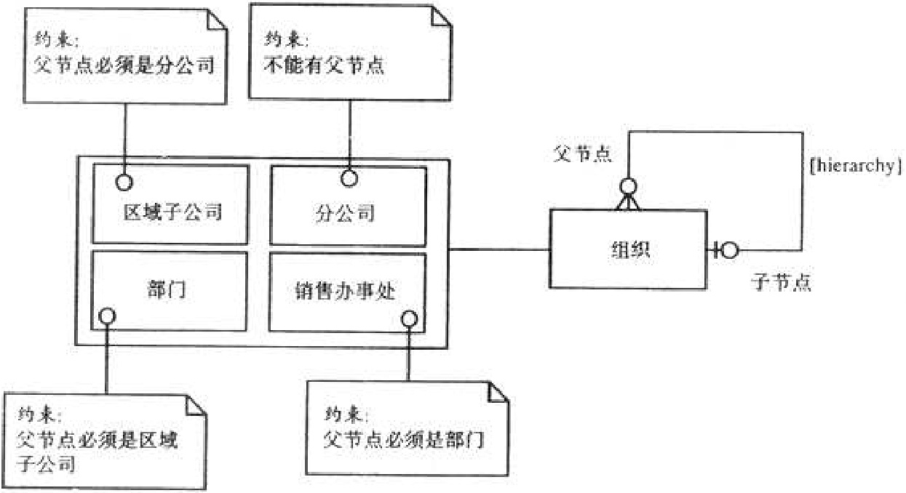  
图24带有层次关系的组织超类型  

层次关系提供非常好的柔性。必须将针对级别的约束以规则形式附加给每种子类型。  

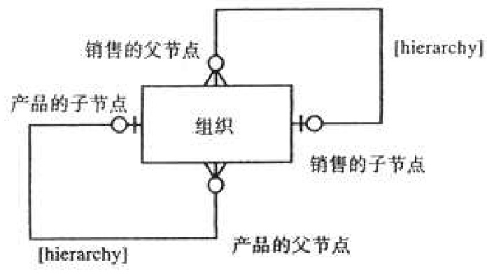  
图2-5双组织层次结构  

没有显示组织的子类型。如果层次数量太多，就很难加以处理了。  

如果一个模型有多个隶属层次关系，我们可以用一种类型化的关系（如图2-6所示）来表示。我们把层次关联关系转化成一种类型，通过使用组织结构类型的不同实例来区分不同的层次关系。这样就能用组织结构的两个实例（销售组织和服务组织）来处理上一节的场景（双层次关系。新产生的层次关系可以通过简单地增加新的组织结构类型的方式加以处理。显然，这种抽象方式使我们能够在复杂性适度增加的情况下的增加更多的系统柔性。对于双层次关系，这样去做并不值得，但对于多层次关系，就很有必要。另外请注意，组织结构有时间周期：这使我们可以有效地记录组织结构的周期性变化。进而要注意的是，我并没有把组织结构类型看成是一种属性一类型属性是一个很重要的概念，我们将在后面具体谈到  

例：为波士顿的2176大容量卡布奇诺咖啡机而设立的服务小组向波士顿的销售办事处负责。我们可以将其刻画成这样一个组织结构模型：父节点是波土顿的销售办事处，子节点是波士顿的2176服务小组，组织结构类型叫做产品线管理。  

例：为波士顿的2176大容量卡布奇诺咖啡机而设立的服务小组向产品支持结构中的2170产品系列服务中心负责。我们可以把它看成是一个单独的组织结构，它的父节点是2170产品系列服务中心：而子节点是波士顿的2176服务小组，组织结构类型叫做产品支持。  

要简化对象结构，应把重点放在约束规则上。这些规则的具体形式可以是：“对于一个组织结构，如果其类型是销售组织并且其子节点是一个部门的话，那么其父节点必须是一个区域子公司”。请注意，药束规则被表示成指向组织结构的属性，其暗含着约束规则针对该组织结构。然面，这也意味着当通过增加新的组织结构类型的方式来扩展系统时，会改变该组织结构中的约束规则。而且，随着组织结构类型数量的增加，这些规则将变得难以处理。  

可以把约束规则放到组织结构类型中（如图2-7所示）。针对特定的组织结构类型的所有规则被集中到一个地方，这样便于增加新的组织结构类型。  

然而，如果我们很少改变组织结构类型而是经常增加新的组织子类型，图2-7就难以处理了。在这种情况下，组织子类型的每次增加都会导致约束规则的改变。更好的方法是让约束规则跟随组织子类型。概括起来，我们的目标是尽量减小模型的变化。我们应该按照这种方式，在不影响模型的其它部分的前提下，把约束规则放在最容易发生变化的地方。  

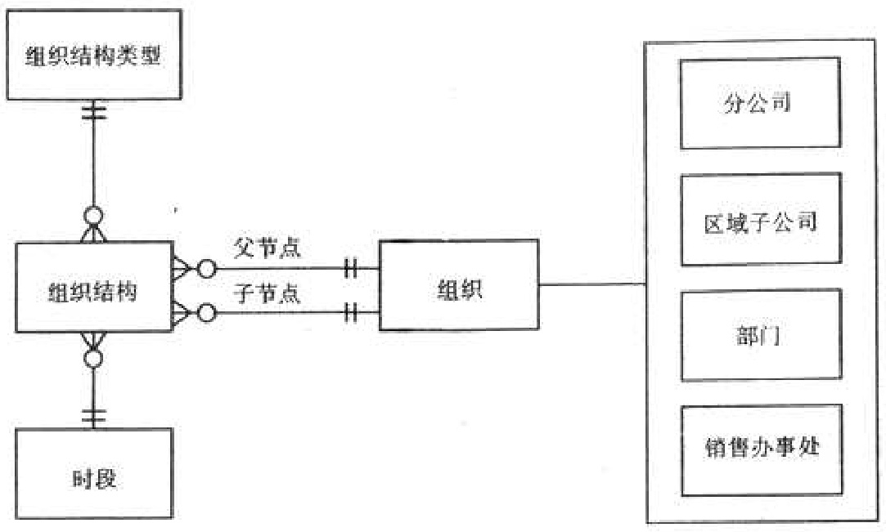  
图2-6使用类型化关系  

组织间的每个关系由一个组织结构类型来定义，如果存在多种关联关系，这样的定义会比显式定义（图2-3所示）更好。  

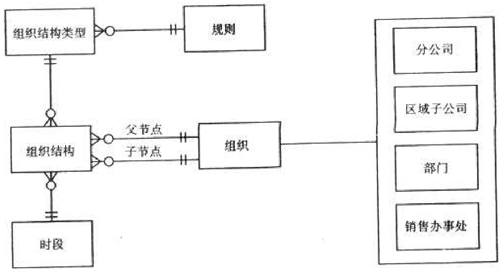  
图2-7在图2-6中增加一条规则  

规则体现了约束，比如销售办事处向部门负责。  

建模原则：设计一个模型时应使该模型中最频繁修改的部分所影响的类型数量达到最少  

2.4责任  

图2-7展现了一个组织按照某种定义好的规则，在某段时间里与其它组织存在某种关联关系。虽然一直是在围绕组织进行讨论，但考虑是否能将相同的描述方式也应用到人身上总是值得的。也就是要问：人是否可以按照某种定义好的规则，在某段时间里与组织或者别的人存在关联关系？”答案是肯定的，因此我能够并且也应该将图2-7进一步抽象化，以应用到团体上面。在我这样去做的过程中，我将这种新的抽象概念命名为责任模式，如图2-8所示  

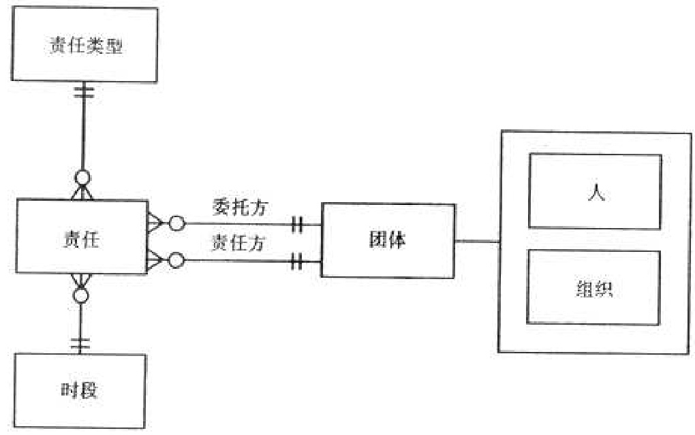  
图2-8责任模式  

利用团体可以使责任模式适用于很广的范围（团体间的职责关系），包括管理雇佣关系和合同协议等。  

例：JohnSmith为ACM工作，这可以被建模为一个责任模型，其中ACM是委托方，JohnSmith是责任方，责任类型是雇佣关系。  

例：JohnSmith是波士顿2176服务小组的管理人员，这可以被建模为一个管理者类型的责任模型，其中JohnSmith对波士顿2176服务小组负责。  

例：MarkThursz是皇家医学院的成员，这可以被建模为一个职业注册类型的责任模型，其中MarkThursz对皇家医学院负责。  

例：JohnSmith允许MarkThursz做内窥镜检查，这可以被建模为一个患者许可类型的责任模型，其中MarkThursz对JohnSmith负责。  

例：圣·玛丽医院与公园路地区卫生当局签订有1996/1997年度内窥镜检查方面的执行合同，这可以被建模为一个内窥镜检查服务类型的责任模型，其中圣·玛丽医院对公园路地区卫生当局负责，该责任的有效期是从1996年1月1日到1997年12月31日。责任的子类型可以提供一些额外的信息，比如所包括的具体工作内容以及在合同期内的执行次数。  

建模原则：只要为一个拥有超类型的类型定义了特征，就应该考虑将这些特征放在该超类型上是否有意义。  

正如前面这些例子所显示的，从组织结构中抽象出责任模型为我们带来更广阔的空间，可以应付更多的情形，而模型的复杂度并没有增加。基本的模型与图2-7有着相同的结构，惟一的变化是将组织替换成团体。  

# 2.5责任知识级  

然而，责任的引人带来了复杂性，因为责任的类型比组织结构的类型要多得多。相应地，定义责任类型的规则将变得更加复杂。  

这种复杂性可以通过引人知识级来管理。知识级将模型分成两部分：操作级和知识级。操作级包括责任、团体以及它们之间的关联关系：知识级包括责任类型、团体类型以及它们之间的关联关系，如图2-9所示。  

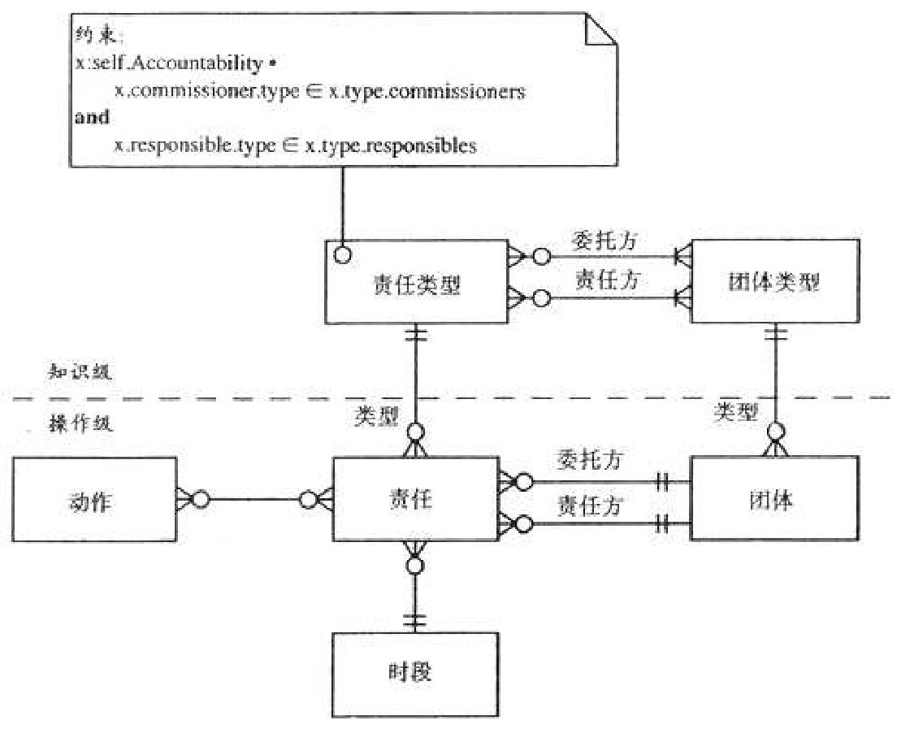  
图2-9责任的知识级和操作级  

知识级对象定义了操作级对象的合法配置，根据相应的责任类型与团体类型的约束，只能在允许的团体之问创建责任。  

在操作级，模型记录该领域每天所发生的事件：在知识级，模型记录控制着结构的各种通用规则。知识级的实例支配着操作级的实例的具体配置。在该示例中，责任实例（实际团体之间的关联）受到责任类型与团体类型之间的关联的约束。  

例：区域子公司又可细分成各个部门。这可以由一个区域子公司结构的责任类型来处理，其中委托方是区域子公司，责任方是部门。  

例：患者许可可被定义成责任类型，其中委托方是患者，责任方是医生。  

请注意如何用团体类型映射来替代团体子类型化。这是0dell在31所讲的“强力类型”的一个实例，其主要出现在用映射来定义子类型时。团体类型与团体的子类型有很紧密的关系，因为子类型“区域子公司”必须有它的类型作为团体类型“区域子公司”。从概念上讲，可以把团体类型的实例看成是与团体子类型相同的对象，虽然用主流的编程语言无法直接实现该概念。团体类型是团体的一种强力类型。通常，我们只需要映射（mapping）或者子类化（subtyping）这两者中的一个。但是，如果子类型具有特殊的行为并且强力类型也拥有自己的特征，那么子类型和到强力类型的映射都是需要的（Odell用一种特殊的表示法来表示这种情况I31）  

知识级和操作级相互对应但并不完全一样，因为父节点与子节点的映射在知识级是多值的而在操作级是单值的。这是由于操作级刻画的是参与责任的实际团体，而知识级刻画的是参与责任类型的可能的团体类型。这种用多值的知识映射来表示单值的操作映射的可能类型的方式是很常见的。  

知识级和操作级是模型所具有的一个共同特征，虽然我们经常不显式指明两者之间的差异。我将两者明确地分开是因为我发现这样做有助于理清建模思路。本书中有大量关于操作级与知识级的例子，尤其是在第3章。  

建模原则：将模型清晰地分解成操作级和知识级。  

多数的数据建模人员用“元模型”一词来描述知识级，我对这样的用法不是很赞同。因为元模型也可用于建模技术，其中，元模型包括了诸如类型、关联、子类型以及操作等（例如Rational软件的统一方法[1]的元模型）。知识级则不同，它不描述用于操作级的各种图符。因此我只在刻画用于描述模型语言（图符的语法）的模型时才使用元模型”一词  

责任模型表达了一些相当原始的抽象概念。就像在爬山的过程中，在高原反应到来前，我们会停下来做适当的准备。虽然对象模型的结构非常简单，但在知识级的实例中却隐藏着大量的知识。仅仅做这些工作还不足  

以实现对象模型，必须对知识级加以初始化。初始化知识级是一个受限的因而也是简单的编程过程，目的是要有效地配置系统。虽然简单，但仍然是属于程序设计，因此应当考虑如何加以测试。  

丰富的知识级也会影响系统间的通信。如果两个系统要进行通信，它们不仅必须共享对象模型，还必须拥有同样的知识对象（或者至少是如5.4节所述的知识级间的一些等价物）接下来最终我们会遇到下面这个向题：如果责任类型的数量非常庞大，使用图2-9的结构更容易些还是扩展图2-5为每种责任类型配置关联关系更容易些？问题本身的复杂度是回避不了的，我们只能比较权衡类型结构和知识对象，判断哪个模型更简单。  

需要注意的是，对关系加以类型化并不是可以应用在所有的团体关系上。比如，生物学上的父子关系就不能作为责任类型的一个实例，因为没有团体之间的责任关系，也不存在固有的责任期限，但是，法定的监护关系属于责任类型。  

2.6团体类型泛化  

正如模型自身所体现的那样，其功能的强大不容置疑，但如果能够增加一些有用的变化，则可以使得模型具有更强的适应能力。这些变化可以用在任何使用了知识级/操作级划分方式的模型中。  

我们来分析一下Edwards医生，他是一个普通的分析模式实践者（简称GP）。使用图2-9所示的模型，我们可以把他看成是GP或者是医生，但不能两者都是。针对医生所定义的而又适用于GP的所有责任类型都必须重复描述。我们可以采用多种技术来缓解这个问题。其中一种方法就是允许团体类型拥有子类型或者超类型关系（如图2-10所示）。这样就引人了团体类型的泛化概念，其作用与类型的泛化相似。泛化使得针对责任类型的约束发生了变化，因此既需要考虑团体的类型（来自类型映射），又需要考虑团体的超类型（来自所有的类型映射）  

图2-10给出了团体类型的一个单继承关系。多继承可以通过允许超类型的映射是多值的方式来实现。此外，图2-10只支持单一分类，即如果Edwards既是一个GP，又是一个儿科医生的话，我们只能通过创建一个特殊的GP/儿科医生”团体类型来刻画，其中GP和儿科医生都是超类型。多分类充许在团体类型的泛化结构之外，赋予团体多种团体类型，这可以通过充许映射到团体的类型可有多个取值的方式来实现。  

有关知识级和操作级之间的内在关系的许多讨论与元模型建模中的对象和类型的关系是类似的。  

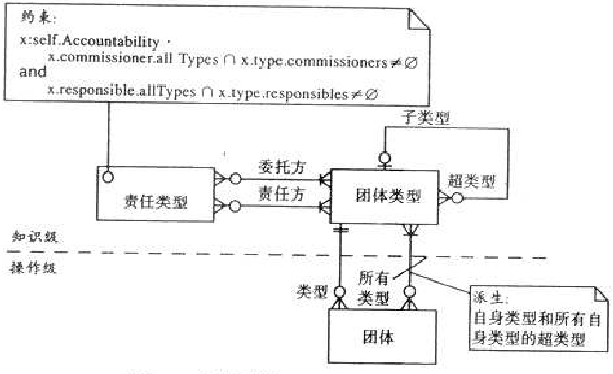  
图2-10允许团体类型拥有子类型和超类型  

给团体类型增加泛化使得定义知识级更容易。  

要实现责任模型所给出的柔性结构，还需要在一些责任类型的约束规则上多下功夫。比如，图2-3所示的组织结构定义了一个严格的层级序列：分公司被划分成若干区域子公司、区域子公司被划分成若干部门、部门被划分成若干销售办事处。定义一个区域子公司结构的责任类型是可能的，但是如何才能保持图2-3中的严格规则呢？  

首要的问题是图2-3刻画了一个层次型的结构，而责任模型没有相应的规则来约束这样一种结构。这可以通过提供附加有约束规则的责任类型的子类型的方式来加以处理（如图2-11所示）这些附加的约束规则和惯例性的约束规则一起共同作用于责任类型，从而保持操作级结构的层次特性。类似的责任类型子类型可用于实现一个有向无循环图结构。  

利用图2-11，通过一系列的责任类型，我们可以刻画图2-3所示的情形。责任类型“区域子公司结构层1对分公司负有区域性的责任，“区域子公司结构层2”对区域子公司负有部门性的责任，以此类推。这种方法确实可行，但是有点笨拙。另一种方式是使用一种如图2-12所示的分级的责任类型，采用这种方式就只有一种“区域子公司结构”责任类型，其中，各级分别映射到相应的团体类型一一分公司、区域子公司、部门、销售办事处。这种模型使得可以很容易地增加新的级别的责任类型，并使于修改所需结构中的级别。分层的责任类型捕获团体的责任关系并组成一个层次型的模型，而分级的责任类型用于捕获其中具有固定次序的团队责任关系。  

“区域子公司结构”责任类型可以既是分级的又是分层的。  

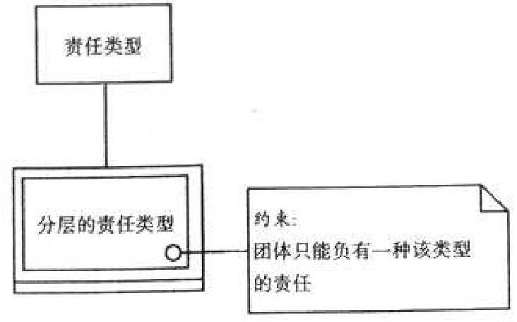  
图2-11分层的责任类型  

新增的约束的意思是通过该类型的责任关系所连接起来的团体必须组成一个 层次型的模型。  

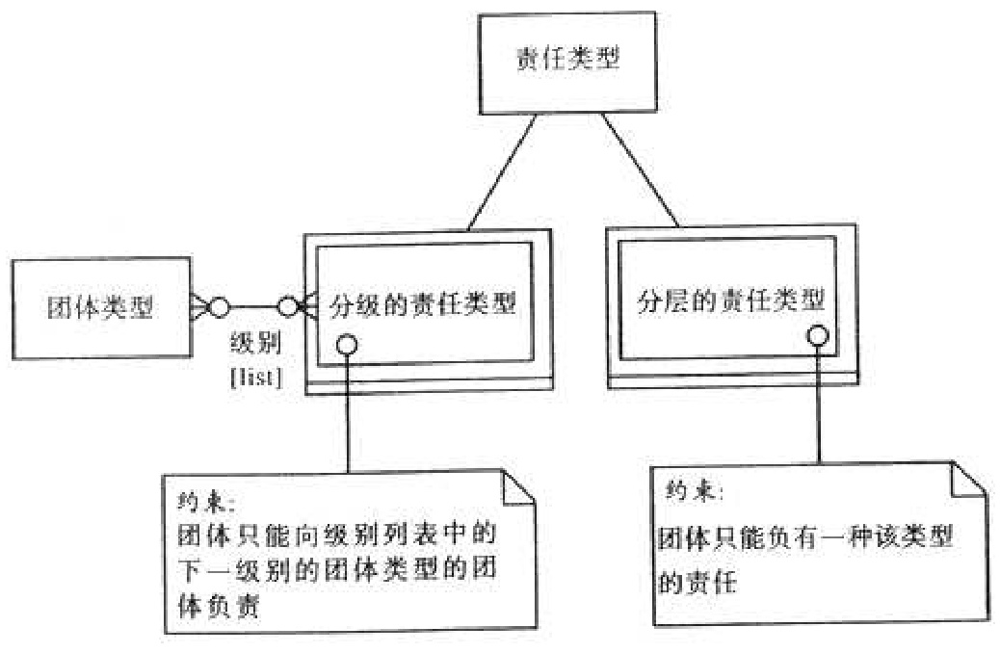  
图2-12分级的责任类型  

分级责任支持固定的级别关系，例如销售办事处、部门和区域子公司之间的隶属关系。  

遵循“契约式设计”[4]的原则，为责任类型所定义的约束规则与附 加的约束规则一起共同作用于子类型。对于存在分级责任类型的情况，约束包括了对超类型的约束，并使得委托方和责任方的映射显得多余。这样的一种想法可用图2-13所示的模型来表达。需要特别强调的是，图2-12并非不正确。分级的责任类型是一种非常好的责任类型子类型，因为施加于责任类型的约束规则仍然会适用于分级的责任类型，而其中的责任方和委  

托方的映射仍然继续得以保持，虽然它们需要从级别映射关系中派生而来的。我倾向于采用图2-12的模型。分级的责任类型可能并不总是必需的，只要不违反模型，添加起它们来也很容易。图2-12还具有这样的优点：它使得知识级和操作级的关系更加明确。  

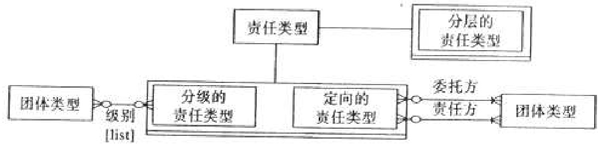  
图2-13反复权衡责任类型的子类型  

一种组织责任类型层次的更好的方法。  

2.8操作范围  

责任提供了一条描述团体之间如何相互联系的颇有价值的途径。责任的类型描述了它们所具有的关系的种类；通常还需要其它一些更详细的信息来具体阐明责任的内涵。举例来讲，1997年，一一名医生被聘用为肝脏方面的外科医生，其任务是为伦敦东南部地区实施20例的肝脏移植手术：某医院的糖尿病治疗小组应红十字会的要求，为马萨诸塞州西部地区依赖胰岛素的糖尿病患者提供医疗服务。  

诸如此类的详细说明称为责任的操作范围（如图2-14所示）每个操 作范围定义了责任团体所担当的某部分责任。很难用抽象的方式来列举操作范围的具体属性。因此，我们认为责任应当拥有大量的操作范围，每一操作范围是某种描述实际特征的子类型。  

例：某位要在一年内负责伦敦东南部地区20例肝脏移植手术的外科医生，他参与一个雇佣责任模型，该责任有一个协议范围：数量是20；肝脏移植方面的协议：地点是伦敦东南部地区。  

例：糖尿病治疗小组和红十字会参与一个责任模型，其临床治疗范围如下：其中“观察概念”对象是依赖胰岛素的糖尿病患者：地点是马萨诸塞州西部地区。  

例：芳香咖啡机制造公司（ACM）与印度尼西亚咖啡出口公司（ICE】签订有每年3000吨爪哇咖啡和2000吨苏门答蜡咖啡的合同。这可以用ACM与ICE之间的责任模型来描述，其责任期限是一年，资源类型有两种：3000吨/年的爪哇咖啡和2000吨/年的苏门答蜡咖啡。  

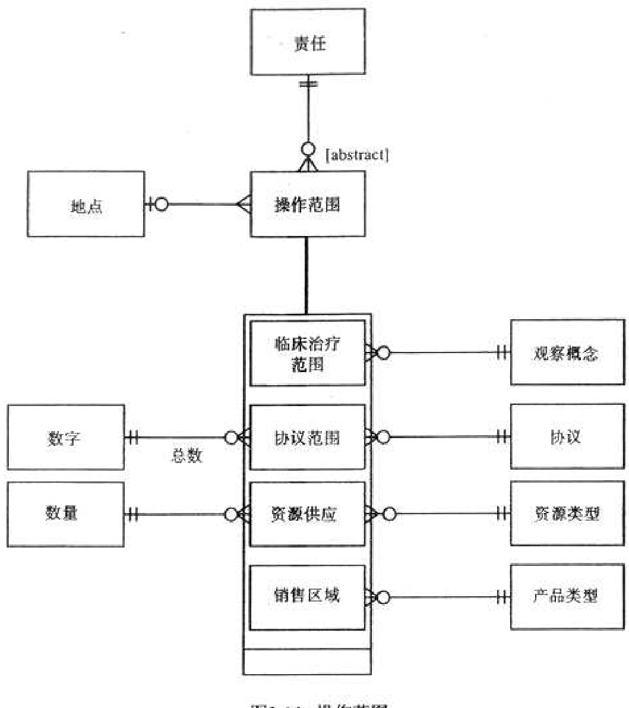  
图2-14操作范围  

在创建责任模型时，操作范围规定了应承担的具体责任。这些操作范围可用于工作说明。  

例：JohnSmith为ACM销售1100和2170系列的大容量咖啡机。他在新英格兰既销售1100系列又销售2170系列，在纽约仅销售2170系列。因此他与ACM之间存在雇佣类型的责任模型，其销售区域是：新英格兰，1100系列：新英格兰，2170系列：纽约，2170系列。  

在针对特定的组织使用操作范围时，需要识别其所具有的操作范围类型及属性。要用很抽象的方式来概括操作范围是非常困难的，但地点好像是一个各种操作范围都具有的属性。操作范围的子类型如果很多的话，其间的继承关系可能会形成层次结构。在特别复杂的实例中，你可能会见到在知识级放置有操作范围类型，用来说明哪些责任类型具有哪些操作范围类型。  

# 2.9职位  

通常，对于人的操作范围一他们的职责（包括他们的诸多责任中的许多责任）一已经预先在工作说明中做了具体规定。当某人辞去工作时，替代者将继承所有的职责。也就是说，职责与工作相关，而不是与人相关。  

我们可以通过引进“职位”概念（作为团体的第三个子类型）来处理这种情况（如图2-15所示）隶属于工作的任何职责，无论谁拥有它，都只与职位相关。通过在人员和职位之间建立责任模型来表示人员占据该职位。具体来讲，就是某人在规定的时间内负责某个职位的各项职责。  

例：PaulSmith是大容量产品开发小组的负责人，这可以通过设立大容量产品开发小组负责人这样一个职位的方式来描述，该职位和大容量产品开发小组（一个团体）之间有管理责任关系，而PaulSmith和该职位之间有另一个责任关系（聘用关系】  

例：某医院做器官移植手术的外科医生这一职位，其工作要求是每年完成50例肾脏和20例肝脏移植手术。该职位与医院之间存在责任关系：协议范围涉及50例肾脏移植手术和20例肝脏移植手术。  

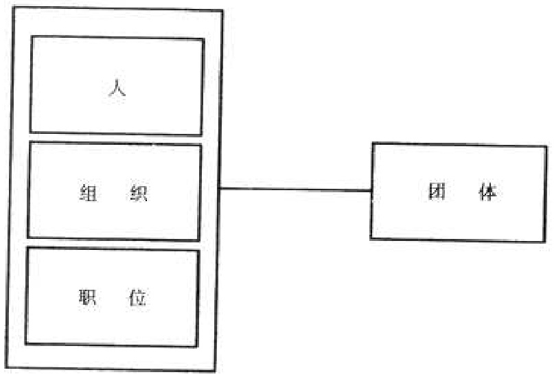  
图2-15职位  

职位这个模式适用于当责任及其操作范围由职位来定义的情况，并且当职位的拥有者变化时，职位并不发生变化。人员和职位之间具有聘用关系。  

不应该在所有时候都使用职位，因为它们引人了更多的间接联系，会增加操作级的复杂性。只有职位中体现了一些稳定的重要职责，而人员经常变换职位的情况下才使用职位概念。对于模型中所有的职责都与某个特定的人相关的情况，就没有必要再使用职位这一概念。  

# 参考文献  

1.Booch,G.,andJ.Rumbaugh.UnifiedMethod for Object-Oriented Development Rational Software Corporation,Version 0.8,1995 2： Cairns,T,A.Casey.M.Fowler,M.Thursz,and H.Timimi. The Cosmos Clinica Process Model.National Health Service,Information Management Centre,15 FrederickRd,Birmingham,B151JD,England.ReportECBS20A&ECBS20B http://www.sm.ic.ac.uk/medicine/cpm,1992.

 3. Martin,J.andJ. Odell.Object-OrientedMethods:A Foundation.Englewood Cliffs NJ:Prentice-Hall,1995.

 4. Meyer,B."Applying‘Design by Contract,IEEE Computer.25,10(1992).pp 40-51.  

# 观察和测量模式  

现实世界中，大多数的计算机系统都记录有关现实世界各种对象的信息。这些信息以记录、属性、对象或者其它表现形式存在于计算机系统之中。典型的方式是将信息片断记录成某个对象的一个属性。比如，将我的体重为185磅的信息记录成“人”这种类型的一个属性。本章将讨论该方法为什么会失效，并将提出更精确的方法。  

首先，我们将讨论数量模式（参见3.1节）一由数字和相关的单位组合而成的一种类型。通过将数字和单位组合起来，我们能够更准确地对客观世界进行建模。将单位建模成为对象，再将数量模式与之关联，我们就可以描述如何按照一定的转换率（参见3.2节）实现数量的换算。可以用复合单位模式（参见3.3节）来进一步扩展数量模式，复合单位模式可以用组成元素清楚地表示复杂的单位。几乎所有的计算机系统都涉及到数量：币值总是应该使用这种模式来表示。  

数量模式可用作对象的属性，以记录相关的信息。然而，当类型存在大量的属性（这些属性和方法使得类型急剧膨胀）时：这种方法就会失去效用。在这种情况下，可以用测量模式（参见3.4节）其将各种测量视为相应的对象：这种模式还可用在需要为单独的测量保存相关的信息时。本章我们将从操作级和知识级（参见2.5节）的运用人手开始讨论。  

测量模式允许我们记录数量信息。观察模式（参见3.5节）为了处理数量信息，进一步扩展了该模式；进而可以在知识级中进行观察概念的子类型化（参见3.6节）为一个观察记录相关的观察方案模式（参见3.7节）通常是很基本的要求，这样做可以使临床医生更好地解释观察的结果，并更好地确定观察的准确度和灵敏度。  

为了扩展观察模式需要大量的小模式。观察所发生的时间和被记录的时间之间的差异可以用双时间记录模式（参见3.8节）来刻画。通常，保存已经确认为错误的观察记录非常重要，这就需要用到被否决的观察模式（参见3.9节）。观察结果最让人头疼的是处理其可靠性，因为在一般情况下所记录的主要内容都是有关对象的假设。临床观察、假设与推理（参见  

3.10节）的子类型化是处理该问题的一种途径。  

有关观察模式的大多数陈述是用一个诊断过程来实现的。我们基于其它的观察来推断某个观察。关联观察模式（参见3.11节）可以用于记录作为证据的观察以及用于诊断的各种知识  

上述的各种模式可加以组织并用于刻画观察概念。要理解它们是如何发挥作用的，就很有必要看一看观察过程模式（参见3.12节）可以采用基于事件的技术来对其进行建模。  

很少有专业像医药行业那样对测量和观察有如此复杂的要求。本章中的模型来自一个医疗保健系统（英国国民医疗服务制度的Cosmos项目）的建模工作。在该项目中，在一起工作的是一个由医生、护士和分析员组成的联合小组，他们所面对的是一个非常难处理的领域。在本书里，我们并没有把Cosmos模型完整地包括进来，如果你对其感兴趣，请参阅参考文献[1]中所述的完整模型。在这里所谈到的一些模式还能应用到其它领域：第4章将讨论这些模式是如何应用到公司财务分析中的。  

关键概念：数量、单位、测量、观察、观察概念、现象类型、关联函 数、被否决的观察、假设  

3.1数量  

在日前的计算机系统中，记录测量信息的最简单和最常用的方法是将数字记录到为特定的测量而设计的域中（如图3-1所示）该方法的问题之一是仅仅用一个数字来表示人的身高是很不够的。如果说我的身高是6或者体重是185，那究竞表示什么意思呢？要搞清楚这些数字的真实含义，需要使用单位。方法之一就是将单位引入到关系名称中，比如体重（磅）单位可以澄清数字的具体含义，但这样一种表示方法显得十分笨拙，另外的问题就是记录人员必须为信息使用正确的单位。如果某人告诉我他的体重是80公斤：那我将如何记录？事实上对于某些行业，尤其是医药行业，要求非常精确地记录所测量的结果一不能多，也不能少：如果记录的是经过转换的结果：即使转换方法是很确定的，也显得不够忠实。  

  
图3-1数字类型的属性  

这种方法没有特定的单位。在这个上下文中，数量是一个很有用的概念。图3-2展示一个由数字  

和单位组成的对象类型（比如，6英尺或者180磅）。数量还包括适当的算术运算和相应的操作。比如，其中的一个操作能够实现数量相加功能，但是在相加之前会检查单位是否一致（34英寸就不能跟68公斤直接相加）数量是用户界面可以解释和显示的“完整值”[2]（一个简单的打印操作可以显示数字和单位）这样，数量就可以像整型或者日期类型那样，广泛地应用到对属性的定义中。  

  
图3-2用数量将测量定义为属性  

数量可以应用到需要用单位的地方。  

例：我们可以将数字185和单位磅组合成为数量来表示体重为185磅。  

币值总是应该表示为数量，用币制作为单位（在本书中我使用“金钱一词）使用数量可使你很容易地处理多币制的情况，从而摆脱单一币制的局限性（只有在我自己所使用的财务程序中我才使用单一币制）。金钱对象还可以控制数量的表达方式。在财务系统中，如果使用了浮点数来表示币值，常常会产生四舍五人的问题：采用数量可以用定点数来定义数量属性。  

例：80美元可以用由数字80和单位美元所组合成的数量来表示。  

数量的使用是面向对象分析的一个重要特征。许多建模方法都明确区分属性和关联。在模型中，关联是连接两个类型，而属性则是根据某个属性类型来包含某个值。问题是：什么时候用属性而什么时候又用关联？通常，在绝大多数的编程环境中，属性类型都是典型的固有类型（比如整型、实型、字符串型、日期型等）。属性与关联的这种区别对于像数量这样的类型不一定适用。某些建模人员认为数量应该作为关联来使用（因为它不是一种固有类型），而另外一些建模人员认为数量应当作为属性来看待（因为它是一个自包含的且被广泛加以采用的类型）在概念性建模中并不太在意你究竟采用了什么方法，最重要的是你是否寻找并使用了形如数量这样的类型。因此，我并不太关心属性与关联之间的区别，也不想陷人有关的争论中。（我强调这一点是因为我发现在我所见到的绝大多数模型中，很少用到像数量这样的类型。  

建模原则：当多个属性与可能会在几个类型中使用的行为相关时，就把这些属性组合成新的基础类型。  

3.2转换率  

我们可以很好地利用模型中明确表示的各种单位。这些单位的用处之一是使我们可以实现从一个单位到另一个单位的数量转换。如图3-3所示，我们可以在单位之间使用“转换率”对象，并赋予数量对象一个操作：convertTo（Unit），该操作能够将给定单位的数量转换成为新的单位下的数量。该操作考察各个单位间的转换率，在原单位和目标单位间寻找合适的转换路经，将源单位下的数量转换成为目标单位下的数量。  

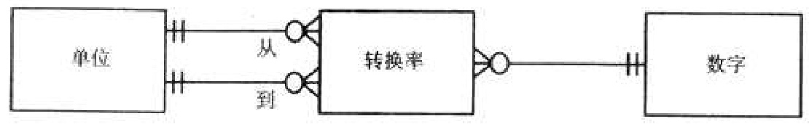  
图3-3给单位增加转换率  

例：通过定义一个1：12（英尺比英寸】的转换率，我们可以将英尺转换为英寸。  

例：转换率具有复合传递性，比如，英寸与毫米之间的转换率是1:25.4，那么通过将这个转换率与上一个转换率复合，可以将英尺转换成毫米。  

转换率可用在很多地方，但并不是万能的。比如，摄氏温度与华氏温度之间的转换就不是简单的乘法关系，而需要通过更复杂的运算来实现。在这种情况下，需要单独的实例方法（参见6.6节）。  

如果是多个单位之间存在转换关系，我们可以使用多维单位转换阵列。比如，力的单位转换阵列MLT1。对于非国际单位制单位，可以使用梯形单位转换阵列。利用多维单位转换阵列和梯形单位转换阵列，可以实现单位之间的自动转换，虽然建立这样的转换阵列需要花点功夫。  

要注意：日和月之间的转换关系是不确定的，因为每月的天数是不固定的。  

如果存在候选的转换途径，可以在测试用例中加以利用一可以用各种途径去验证转换过程。  

对于币值，其单位是特定的货币，转换率并不固定。我们可以通过给转换率指定可用的时间范围来解决这一问题。  

当进行单位转换时，既可以使用在这里所阐述的转换率，也可以使用9.4节所介绍的场景。如果转换关系频繁变化，而且转换时需要了解一系列的转换，就可以考虑采用场景。否则，采用简单的转换率是再好不过的。  

# 3.3复合单位  

单位可以是原子单位，也可以是复合单位。复合单位由原子单位组合面成，如“平方英尺”或者“米／秒”。特定的操作可以将针对原子单位的转换率应用到复合单位的转换上。需要记住的是，复合单位中用到了哪些原子单位以及它们的幕。图3-4给出一个例子，展示一个较直接的复合单位转换模型。请记住，各原子单位的幂可能是正数，也可能是负数。  

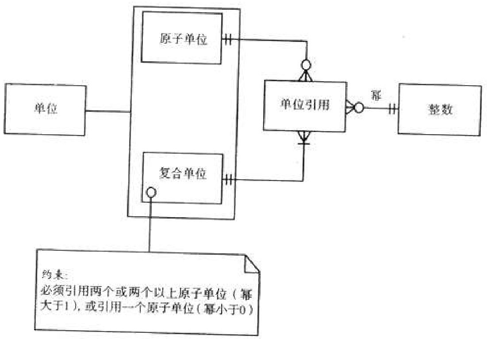  
图3-4复合单位  

该模型可用于描迷加速度和类似的现象。  

例：150平方码的一个区域面积可以表示成一个数量，其数值是150单位是9平方英尺”的复合单位。  

该模型的一个变种是使用一种叫“bags”（袋）的映射描述方式。和我们通常所讲的集合不同，“bags”允许我们在一个映射中多次使用同一个对象（如图3-5所示）。“bags”尤其适用于当拥有某种具有单一数字属性的关系时  

例：由重力所引起的加速度可以表达成一个数量，其数值是9.81，单位是由“米”做分子、二次方秒”做分母的复合单位。  

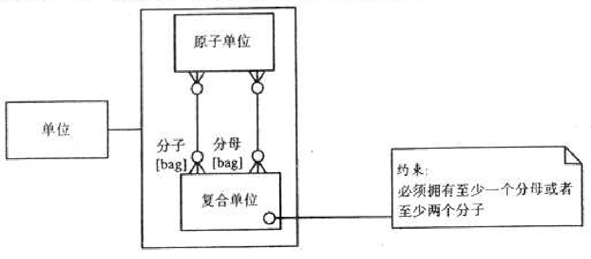  
图3-5使用了bags的复合单位  

该模型比图3-4中的模型更简洁。  

图3-4和图3-5的区别并不太大。我更倾向于采用图3-5的模型，因为它回避了单位引用（一个并没有多大用处的类型）。如何选择这些模型对大多数使用复合单位的客户说并不重要。只有那些需要将复合单位分解成原子单位的客户才会关心模型的选择问题，而绝大多数的这类客户都只需要书面表述。很显然，如果在映射关系中不充许使用bag，就必须采用图3-4的模型  

3.4测量  

对于一个仅仅为每个前来看病的患者提供少量测量结果的医疗部门来讲，将数量建模成属性可能是有效的。然而，如果我们考虑到医疗的方方面面，就会发现在整个医院里，针对一个患者存在着成千上万种可能的测量为每种测量定义一个相应的属性，意味着一个患者对象可以拥有成千上万的操作一其接口的复杂性是难以想像的！解决方法之一是考虑将所有可以被测量的不同事物（身高、体重、血糖水平.）都作为测量对象，并引人一种叫“现象类型”的对象类型（如图3-6所示）。这样，每个患者就可能拥有多种测量，每种测量是一个带有数量属性的现象类型：而该患者只需要拥有一个专门针对所有测量的属性。测量处理的复杂性就被转移到了对成千上万的测量和现象类型的实例的查询上。进而，我们可以给测量增加别的属性以描述其它的一些信息，比如谁来做、什么时候做、在哪里做等。  

例：JohnSmith身高6英尺，该信息可以通过-个测量来表达，其中人员是JohnSmith，现象类型是身高，数量是6英尺。  

例：JohnSmith的肺部呼气峰流量是每分钟180升（肺部呼吸空气的数量和速度），该信息可以用一个测量来表示，其中人员是JohnSmith现象类型是肺部呼气峰流量，数量是每分钟180升。  

例：一个混凝土样本能够承受每平方英寸4000磅的压力，用一个测量来表示时，人员就变成了混凝土，而现象类型是所能承受的压力（压强）数量是每平方英寸4000磅。  

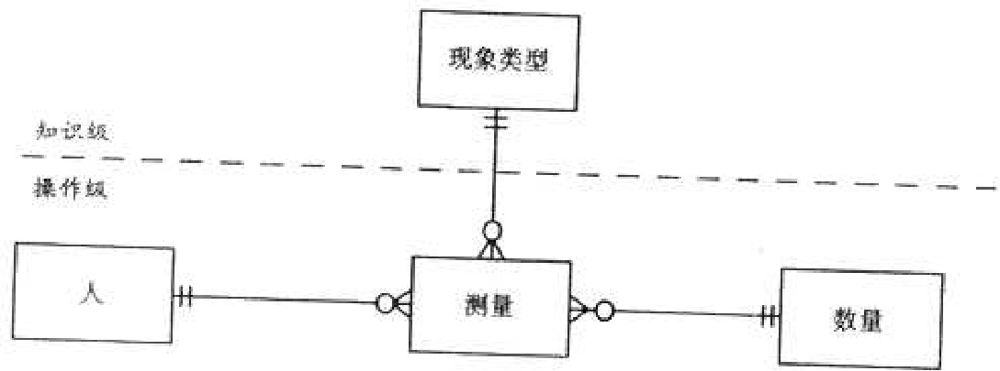  
图3-6引人测量和现象类型  

该模型所适用的情形是：存在大量可能的测量会使得人员类型过分复杂。现象类型是我们知道如何测量的事物，具体的内容位于模型的知识级中。  

该模型中存在简单的划分关系，其在后续的分析中会非常有用。基于该模型的系统，其日常工作的一部分就是创建各种测量。然而，现象类型是最基本的，不会发生多大变化，它们描述了要测量的事物的基本知识。因此，可以把模型看成是由两个级别构成的：操作级囊括具体的测量，而知识级中包含现象类型（参见2.5节）虽然在上面的几个简单的例子中还 看不出该划分的重要性，但随着建模活动的进一步深人，我们就会明百这种两级划分方式是非常实用的。（虽然图3-6给出了一条分界线，但还有大量的信息没有描述，我们将把它们留到后面的图表中去描述：此外，我还有一个习惯，就是喜欢将知识级的内容放在图的上半部分。）  

建模原则：操作级中的对象会经常发生变化。它们的配置由很少发生变化的知识级来约束。  

建模原则：如果某个类型拥有多种相似的关联，可以为这些关联对象定义一个新的类型，并建立一个知识级类型来区分它们。  

我们可以有选择性地为现象类型增加测量单位，并用数字来取代测量中的数量。我自己更倾向于在测量中使用数量，这样就能够更方便地支持“一个现象类型，多种单位”的情形。也可以为现象类型建立一个单位集合，用来检查所输人的测量单位的正确性，并为用户提供一个可选择的单位列表。  

3.5观察  

针对患者除了需要大量定量的描述外，还需要一些定性的描述，比如性别、血型以及是否患过糖尿病等。我们无法使用属性来定义这些描述，因为这样的描述实在太多了，于是就需要用到一种类似于测量的结构。  

设租一下我们电加向记卖一个人的牌利性利舒住网种叫能的值： $\div$  现发的本世来节福测量利定性迎条时拍尖型时用巴  

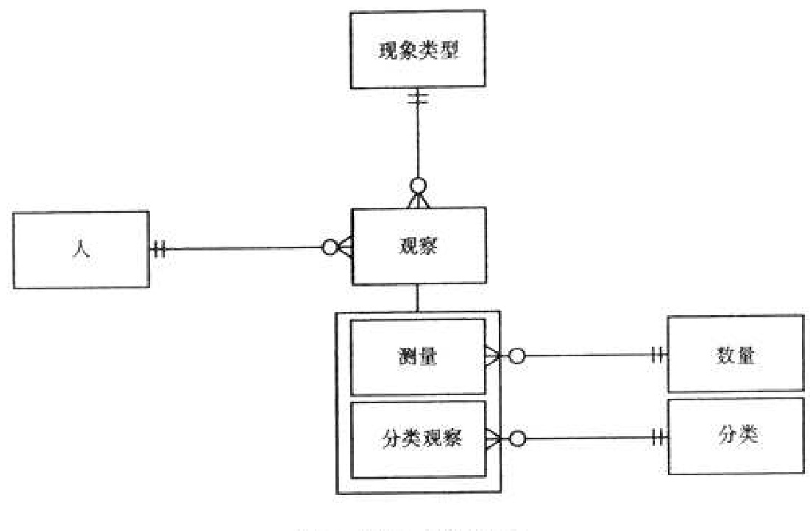  
图3-7观察和分类观察  

该模型支持定性测量，例如血型A。  

通过图3-7，可以认为性别是现象类型的实例，“男”和“女”是分类的实例。要刻画一个性别为男性的人，我们可以创建一个观察对象，其分类是男性，现象类型是性别。  

我们现在不得不考虑一下如何才能保证特定分类只能用于特定的现象类型。高、中等、矮可能是身高这种现象类型的可选分类值、而A、B、A/B、O可能是血型这种现象类型的可选分类值。这可以通过给出分类与现象类型之间的映射关系的方式来实现。这里就出现了一个有趣的问题，即从分类到现象类型的映射集合的基数。我们可能会问，血型A是否会对应不只一个现象类型？一种答案是“当然如此”：比如在Childs-Pugh等级测定中，我们用A（合理的）、B（中等的）C（差的）来表示肝功的正常性。但是这又引出另外一个问题，A的具体含义是什么？如果仅仅从字面上来理解“A”的含义：其结果是该映射是多值的，而且分类与现象类型无关。只有当现象类型产生自某个定性观察时，分类的含义才是清楚明确的。可采取的办法是使分类与现象类型之间的映射为单值，此时分类是在现象类型的上下文环境中加以定义的：也就是说，并不是简单的A”，而是血型A。  

这对于我们来讲究竞有何不同呢？单值方式有利于我们记录有关分类的一些有用的信息，比如对于肝功检查结果，A比B要好，而对于血型就不存在这样的优劣顺序。  

我对临床过程做过初步的研究，发现通常的顺序是：患者走到医疗设备前一收集各种有关患者病情的症状一临床医生给出诊断结论。比如，某患者来到后就首先抱怨感到异常口渴，而且体重也减轻了，还尿频（多尿症），这些症状引导医生给出该惠者患了糖尿病的诊断结论。对于该次诊断，还有两件事情非常重要。第一，仅仅简单地说明患者是糖尿病患者是不够的，医生还必须清楚地记录下得出这样的诊断结论的各种症状：第三，医生不能无中生有地做出这样的推演，不能利用很随意的症状进行很随意的推演，医生必须基于临床知识加以诊断。  

设想将该诊断过程放到迄今为止我们所拥有的模型中。患者痛苦于体重的减轻，我们可以通过如下方式来捕获该信息：存在这样的现象类型一一“体重的变化”，其可能的取值是“增加”、“减轻”或者“保持稳定”。同样地，存在“糖尿病”这样的现象类型，其可能的取值是“有”或者“没有”。显然，我们可以通过给观察对象设置合适的递归关系的方式，来刻画观察之间的这种关联关系（如图3-8所示）。这样，我们就能够刻画糖尿病及其症状之间的关联关系。我们还需要记录诊断性的知识，如体重减轻与糖尿病之间的关联关系。使用图3-7所示的模型，我们很难刻画这样的关联关系。只有在创建了观察对象之后，体重减轻这样的现象类型与减轻分类之间的关联关系才建立起来。我们需要通过某种方式来说明体重减轻这样的事实，其确确实实存在着，并不会因为观察是否建立而消亡，这样的事实应该放在知识级中。具体来讲，可以通过建立从分类到现象类型之间的单值映射的方式来实现。（在3.11节将做进一步论述。）  

很明显，这种使分类与现象类型之间形成单值映射是一种强制性的行为。其将分类信息转移到知识级中，并重命名为现象（如图3-9所示）。现象为现象类型定义了可能的取值。  

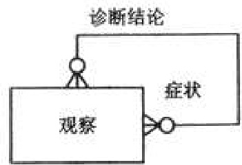  

图3-8递归关系刻画了症状与诊断结论之间的关系  

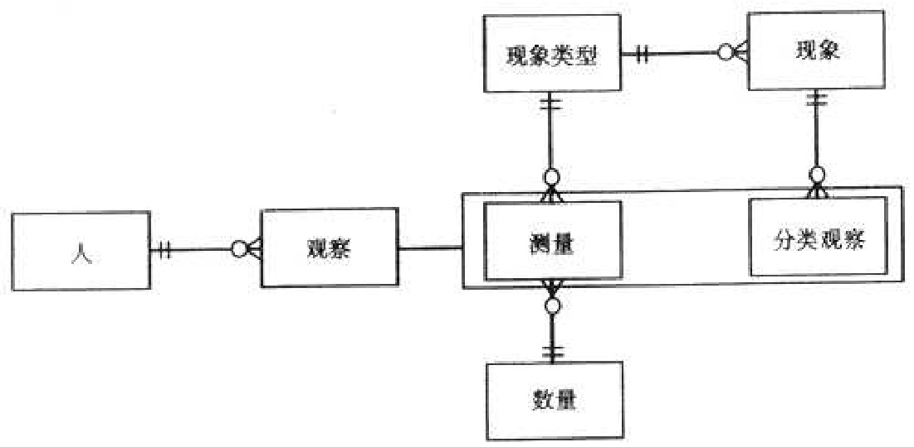  
图3-9知识级中的现象（原来叫分类）  

将定性的描述（例如血型A）放到知识级中使得可以按照规则来使用它们。  

例：“某人的血型为A”这样的事实可以由一个人的分类观察来简要说明，其中现象是血型A”。“血型A”这一现象与血型的现象类型相关联。  

例：我们可以建造一个汽车的分类观察模型来刻画汽车油量的不足。其中，现象类型是油量的多少，可能的现象（取值）是“过量”、“刚好”“不足”：而观察将汽车和油量不足联系起来。  

图3-9中的模型可以很好地刻画一种现象类型具有多个取值的分类观察。但很多观察可能只有两种取值一“有”与“没有”，而不是一个很大的取值范围。糖尿病就是一个很好的例子：糖尿病要么是处于“有”状态，要么是处于“没有”状态。清楚地记录“没有患糖尿病的迹象”固然重要，但如果能记录下“体重没有减轻”的事实又何尝不是明智之举。（如果某个前来看病的患者表现出糖尿病的症状，但体重没有减轻，就不能简单地判断他患有糖尿病。此时并不用强调体重究竞是增加了或者保持 着稳定，只需要说明没有减少就可以了。）事实上，我们可以对任何一种现象处于“没有”状态加以刻画，尤其是对于带排除性的假定性诊断。因而，图3-10所示的模型充许任何分类观察可以具有“有”和“没有”的取值。增加观察概念作为现象的超类型。这样就可以将糖尿病看成是一个观察概念，而与现象类型无关。  

例：我们可以通过将JohnSmith的一个“有”状态的观察与糖尿病的观察概念关联起来的方式来记录JohnSmith患有糖尿病这一事实。  

例：我们可以用一个观察（其中将观察中的人换成隧道）和一个混凝土碎裂的观察概念来表示隧道中发生的混凝土碎裂现象我们还需要为观察追加一个特征，来说明在隧道中混凝土碎裂所发生的具体位置。（在医学上：对于某些观察概念，还需要通过解部来定位）  

# 3.6观察概念的子类型化  

图3-10引人一种超类型关系，允许观察概念的泛化的存在。这在医疗领域非常普遍而且非常实用，因为这样的话，就可以创建具有任意通用度的观察对象。如果某个观察是在子类型处于“有”状态下创建的，那么可以认为其所有的超类型都应该处于“有”状态。相反，如果某个观察是在某个子类型处于“没有”状态下创建的，那么就表示超类型的状态是不确定的。观察处于“没有”状态表示所有的子类型也处于“没有”状态。因而，“有”状态沿超类型层次向上传播，而“没有”状态则向下传播。  

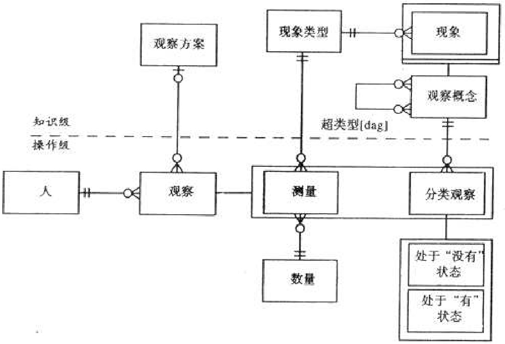  
图3-10观察概念的两种状态（“有”与“没有”  

发现一个现象的“没有”状态和发现一个“有”状态一样，都是有价值的。  

例：糖尿病具有两种子类型：类型I和类型Il。如果JohnSmith患有类型I的糖尿病，则可以说JonhSmith患有糖尿病。  

例：我们常说血型A是多形态的，因为它可以分为A1和A2两种子类型。其它的血型不是多态的。  

# 3.7观察方案  

观察方案是刻画观察模型的一个非常重要的概念（处于知识级）一其给出进行观察的具体方法。我们可以采取将温度计放在口中、腋下或者直肠里等方式来测量一个人的体温。通常，各种方式所得到的最后结果是同一类型的测量，然而，至关重要的是要记录究竞采取的是什么方式。某种奇特的观察结果往往可以通过对所采用的具体技术加以分析来做出解释。因此，在医疗保健领域中，普遍使用的做法就是记录下什么测试被用于记录这些观察。  

观察方案的用处之一在于它能够用来确定一个测量的精确度和灵敏度。有关精确度与灵敏度这样的一类信息可以跟随测量本身一起加以描述但通常是基于用于特定观察的观察方案来加以阐述，将这些信息保存在观察方案中可以使得获取它们时更加容易。  

# 3.8双时间记录  

通常，观察都会有一定的适用期限，一旦过期，就没有什么用处。时间段不同于观察的记录时间，因此，如图3-11所示，每种观察都需要两个时间记录（可能是时间段或者单独的时间点）：一个用于记录观察的有效时间，一个用于记录观察的记录时间。  

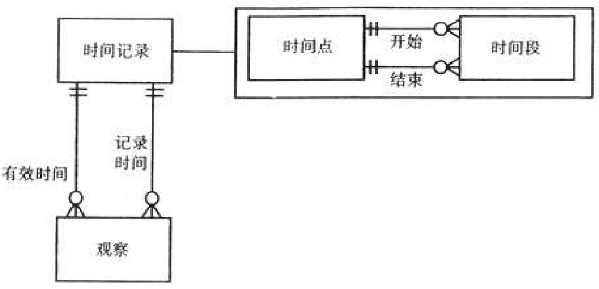  
图3-11针对观察的双时间记录  

允许一个时间记录可以是时间段，也可以是单独的时间点。绝大部分事件的发生时问（即有效时间）和记录时间是不一样的。  

例：在1997年5月1日的一次会诊中，JohnSmith告诉他的医生，他在六个月前曾胸口疼痛，并持续了一周左右的时间。医生就将其记录为一个观察出现胸口疼痛（观察概念）症状。发生时间（有效时间）是开始于1996年11月1日、结束于1996年11月8日的一个时间段。记录时间是1997年5月1日（时间点）（请注意：某些记录大致时间点的方法在此处会非常有价值。）  

3.9被否决的观察  

在进行观察的时候，不可避免地会犯一些错误。但是，在医疗记录中，却不能简单地将它们抹掉。治疗过程可能曾经是基于这些错误的方案而进行的，通常会涉及到法律责任问题。要处理这样的情况，在发现观察结果过去和现在都是错误的时候，可以将其归为被否决的观察，如图3-12所示。（要注意这种观察与另一种过去是正确的但现在不再正确的观察（如 $\rightharpoonup$ 条已治愈的断臂）之间的不同。一条已治愈的断臂现在不会是被否决的，但它的有效时间被给定一个结束时期。）被否决的观察必须与否决掉它们的观察相关联。  

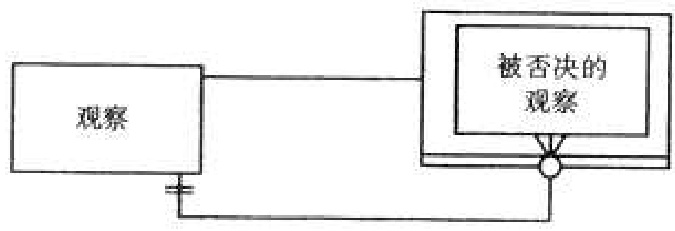  
图3-12被否决的观察  

当需要完整的审查线索时，不能将观察清除掉。  

例：JohnSmith的验血结果显示其血球浓度大大高于平均值。这可能是因为严重贫血引起的，也可能是由于饮酒过度导致的。JohnSmith告诉医生他喝酒时喝得很少，这表明其患有严重的贫血，于是就做了进一步的润试和治疗。6周后却发现JohnSmith大量饮酒，这表明并不是严重贫血，而是饮酒过度。这样，基于严重贫血的被否决的观察需要保留下来，以说明后续治疗的必要性。  

# 3.10临床观察、假设与推理  

当观察结果被记录后，还要给其一个确信度。临床医生可能会面对一个患者，其具有患糖尿病的所有典型症状。于是该医生就会做如下的记录：我认为该患者可能惠有糖尿病。但是直到相关的检验结果出来后她才能给出确切的诊断结果：况且，对于多数疾病，即使做过相应的化验，也不一定能提供百分之百的确定性。记录这类信息的方法之一是给观察设置可能性系数，但这种方法太模糊，而且看起来也不是很自然。另一种方法是采取两分类法：即分为“临床观察和“假设”两类（如图3-13所示）。两种分类有着很细微的差别：临床观察是临床医生已经获得的证据，可能会作为治疗的基本依据：而假设会导致做更进一步的检查或者测试。  

  
图3-13临床观察、假设与推理  

例：当患者呈现口渴、体重减轻和多尿等临床观察症状时，表明其惠有糖尿病。然而，基于这些症状，临床医生只是做出患有糖尿病的假设，并安排做空腹情况下的血糖水平测量。根据化验结果才能对假设加以确认 【也可能加以否决】  

观察的两种子类型，临床观察与假设，都表征了患者的当前状态 的观察。而推理是医生认为在将来可能会发生的观察。通常，医生在决定具体的治疗方案时，会考虑到未来可能会发生的情况。如果这种推测确实可能会发生，就需要将其当成是一个附加的临床观察来加以记录。  

例：如果某人患了风湿热，紧接着又患风湿性关节炎，就有患心内膜炎的可能。这种可能会被记录为“预计会患心内膜炎”这种推理，而相应的治疗方案就会基于该推理来加以制定。  

观察的确定性问题是Cosmos项目中的一个热点问题。项目组和评审人员在其上所做的更改和所花的时间比模型中的其它任何部分都要多。最后的模型从临床医生的角度给出了最自然的表达方式。设置可能性的方式对于一个科幻爱好者来讲是有意义的，但对于临床医生来讲显然不是这样（他们事先可能会问这样的问题：我应该怎样解释可能性0.7与0.8之间的不同之处？”。虽然在应该选择使用哪种分类时会存在一些困难，但是，最终只有由富有经验的临床医生组成的小组才有资格按照一种本能的方式，为项目组在该问题上做出有用的结论；小组中的专业分析人员只能在其中提出一些常规的结论。  

3.11关联观察  

在这里，我们将寻求一种途径来记录隐藏在诊断后面的证据链。基本思路是允许将观察相互连接起来（某患者口渴预示其忠有糖尿病），对观察概念亦是如此（口渴预示着患糖尿病）。从而，我们会看到知识级和操作级相互映射（如图3-14所示）。这些映射通过关联（展示知识级的概念是如何应用到操作级中的）连接起来。这样的话，不仅观察与观察概念之间会产生连接关系，在证据和结论之间也会产生连接关系。因而，当我们说惠者口渴预示患者患有糖尿病时，我们使用了，而且应该明确地记录我们确实使用了口渴与糖尿病之间的常规性的连接关系。图3-14显示我们是如何构造相应的类型来既支持观察和观察概念，又支持操作级（关联观察）和知识级（关联函数）中的连接关系。  

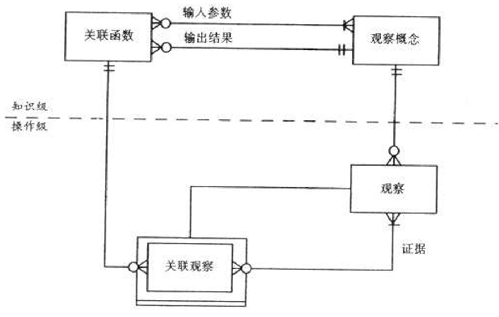  
图3-14观察之间的连接  

针对一个患者的实际的证据链被记录在操作级中，而知识级描述可能的连接关系。  

例：临床医生观察到某个患者呈现如下症状：体重减轻、口渴、尿频。他基于这些证据，构造了一个有关糖尿病的关联观察（并做出相应的假设）。该关联观察与一个关联函数相连，而该关联函数的输入参数是关联概念一体重减轻、口渴和尿频，输出结果是糖尿病。  

例：如果我的汽车无法启动，而且车灯也不亮，这两条观察结果就可以作为电池没有电【关联观察）的证据。汽车无法启动、车灯不亮以及电池没有电是所有由一个关联函数连接的观察概念。  

请注意，知识级与操作级中的元素之间的关联关系并不是完全对等的。比如，关联观察是观察的子类型，但关联函数就不是观察概念的子类型。在操作级，将关联观察当成是观察的子类型是一件很自然的事情，因为确实需要一个特定的观察来支持各种证据。而在知识级，则记录了  

各种带有参数与结论的规则。一个观察概念可能作为多个关联函数的输出结果，但一个特定的观察只能有一个关联集合作为证据。  

3.12观察过程  

本章的前面一些小节主要是在阐述观察模型的一些静态元素：什么是观察和测量，以及如何按照一种通用的途径去刻画它们，以支持对临床医生实际工作的分析。在建模过程中，我们发现一个很有意思的问题，即我们可以构想出一个非常通用的静态模型，但是在具体操作时，根据部门的不同会有很大的差异。当然，一个静态模型中确实隐含着大量的行为。行为的存在是为了创建观察，并提供不同的方式来浏览观察间的关联关系，以理解一些观察是如何与其它观察相配合使用的。然而，也有一些行为是在静态模型中不能隐含的，比如一个典型部门创建的观察的具体顺序。通常，每个医生都会遵循一些特定的观察顺序，而部门也可能会把这些观察顺序记录成高级协议，但要设计一个通用的而且是所有医生都来用的过程非常困难，并且基本上是不可能的。  

然而，勾画出一个实施观察的过程的大致轮廓是可能的。我的做法是从考察创建一个新观察如何能够引发更进一步观察开始（如图3-15所示）在临床医生创建观察时，他们会考虑到其它关联观察的可能性。他们使用已知的关联函数提出一个可能的观察概念清单，这些观察概念可能与将要启动的观察相关。然后他们可以进一步提出所需的其它观察。  

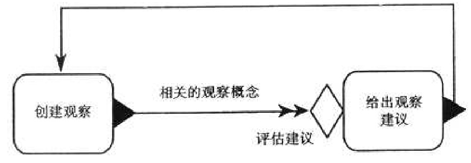  
图3-15创建一个观察引发更进一步的观察  

更进一步的观察由知识级给出。  

在图3-15中，将并发触发器规则标记为“相关的观察概念”。在事件图中使用触发器规则有两个目的：一是用于指示因果关系，在考思业务过程时就是如此；但如果要考虑的因素更多，就会涉及到其另外一个目的。任何操作都具有输人和输出，连接两个操作的触发器必须能够描述如何从触发（源）操作获取输出，并传递给被触发的操作作为输人。在多数情况下，这是微不足道的，尤其是当它们是同一对象时（如图3-15所示，从“给出观察建议”到“创建观察”之间的触发器）然而，在寻找“相关的观察概念过程中，可能就会变得非常复杂。  

当触发器规则过于复杂时，我们可以用别的事件图来表示它们（如图3-16和图3-17所示）。首先是寻找所有的关联函数，其输人参数包括初始观察的观察概念：然后对每个关联函数加以评估：对于通过评估的关联函数，就将其输出添加到结果集合中。既然这些事件图描述了一个触发器规则查询，则所有操作都只是附属物而已，不能改变任何对象的可观察状态。  

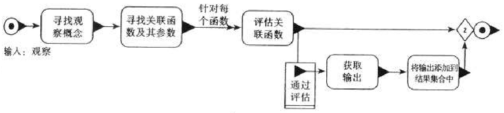  
图3-16本事件图描绘寻找关联观察的查询  

本图基于图3-15的并发触发器或图3-18中的操作。  

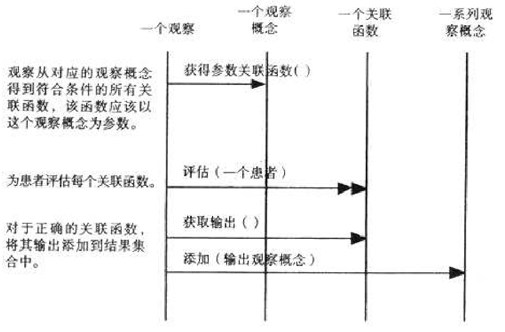  
图3-17寻找观察中所隐含的各种可能的观察概念的交互图  

如果触发器规则查询非常复杂，也可以如图3-18所示的那样将该查询表示成一个操作。总之，两种方法都可行。  

  
图3-18将该查询清晰地表示成一个操作  

该图等价于图3-15，也就是说：既可以用操作来刻画查询，也可以把它们看成是触发器的一部分。总之，要力求简洁紧。  

即使在查询之后，在给出新的观察建议之前，还会增加一个控制条件（对建议加以评估）。这个查询基于关联函数提供了可能的观察概念。该步骤可以很容易地由一个决策支持系统软件来实现。控制条件是一个额外的步骤，用于确定所提议的观察概念是否值得尝试。我感到很难用很正规的方式对该过程进行建模，因为该步骤只是驻留在临床医生的脑子里，超出了软件的处理范围。  

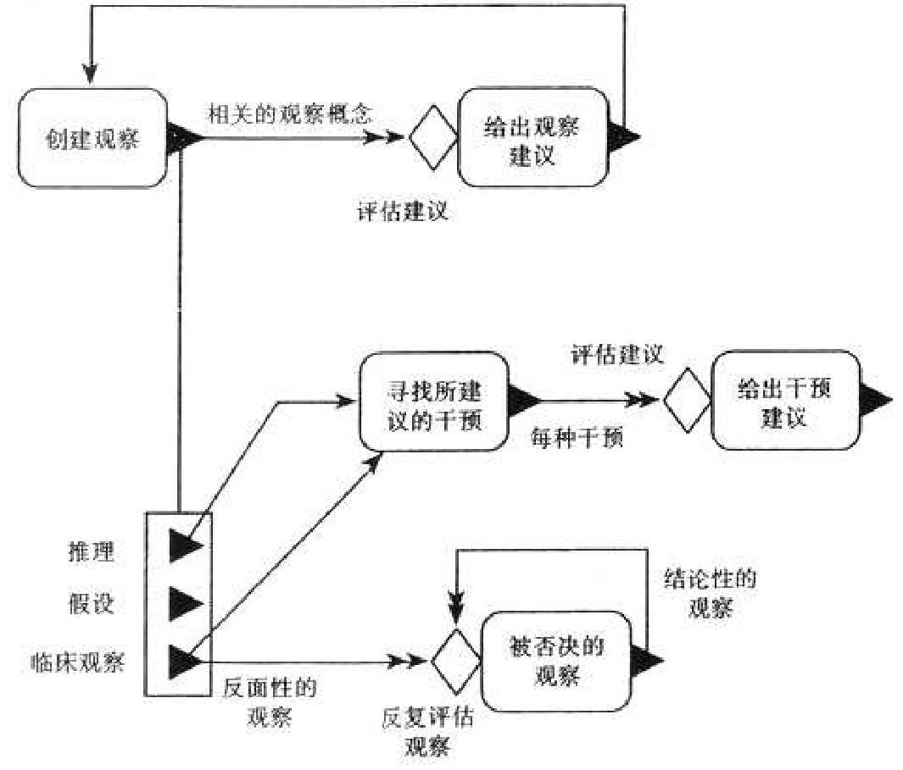  
图3-19观察的处理过程的事件图  

该图用类似的用于干预和否决的触发器扩展了图3-15。  

图3-19包含额外的触发器，它们是在推理和临床观察活动中产生的。针对给出干预建议的触发器的工作方式与针对前述病例的方式类似。我们所给出的干预建议，是由临床医生事先评估过的。这是为了进一步强调这样一个事实：虽然任何观察都可以导出进一步的观察，但只有临床观察和推理（不是假设）才导出干预。（干预是一种活动，用于预防在患者身上可能发生的病变与危险。）该触发器查询按照与知识级类似的方式工作，但包含启动函数（我们将在8.7节对其做简要介绍）。  

图3-19中的最后一个触发器表明：通过临床观察可以发现其它观察存在的矛盾，从而否决掉它们。同样地，在这里需要用到关联函数，但这一次我们主要是要找出矛盾之处。一旦某个观察（可能是一个假设）被否决掉，则由其支持的进一步的观察也必须被重新考虑。  

在这些模式的产生过程中，我们感兴趣的事情之一是它们的发现方式。虽然在这里所论述的最终结果都是规范化的，但是行为建模对于理解这些概念如何工作起到了关键作用。由临床医生自已来完成这些建模工作也是至关重要的。对观察进行抽象对于这些模式的总结是非常重要的：它将迹象、症状和诊断结果联系在一起，而长期以来临床医生认为它们是完全不相关的。只有通过建模，临床医生才能发现这些抽象的概念。如果是由软件工程师提出类似的抽象概念，我担心临床医生会质疑其正确性。产生这样的质疑是有根据的，因为软件工程师一般都不会具有很深厚的医疗卫生知识。最好的概念模型是由领域专家建造的，他们通常是最好的概念建模人员。  

1. Cairns,T.,A.Casey,M.Fowler,M.Thursz,and H.Timimi.The Cosmos Clinica ProcessModel.NationalHealth Service,Information Management Centre,15 FrederickRd.Birmingham,B151JD,England.Report ECBS20A&ECBS20B <http://www.sm.ic.ac.uk/medicine/cpm>,1992

 2. Cunningham,W.“The CHECKS PatternLanguage of Information Integrity.”In Pattern Languages of Program Design J.O.Coplien,and D.C.Schmidt,ed.Reading MA:Addis0n-Wesley,1995,Pp.145-155.

 3. Thursz,M,M.Fowler,T.Cairns,M.Thick,and G.Gold.“Clinical SystemsDesign, In Proceedings of IEEE 6 th International Symposiumon Computer Based Medical  

# 第4章  

# 针对公司财务的观察模式  

要想完全读懂本章的内容，你需要首先阅读第3章。  

对大公司来讲，要识别其中的高层次问题是很容易的事，但要找出这些问题的根本原因却很费事。这些公司产生的海量信息，能将任何一个试图分析它们的人员迅速淹没。  

例如，对一个公司业绩进行评估的主要标准是它的最终收益。如果收益与以往相比有明显减少，就应做进一步的分析，以确定减少的原因。对ACM公司所做的分析显示：尽管他们所销售的设备的价格还是比较合理的，但销售收人仍然减少了。这一点在他们的东北部子公司最为明显。进一步分析发现：他们生产的1100系列的大容量咖啡机的销售量明显低于预计的销售量，特别是在政府部门中，这种情况尤为突出。许多这样的分析都是基于数字的，但更进一步的分析应着重于定性方面，而不仅仅是定量方面。也许这次不是很好的销售业绩是由于销售赔偿计划做得不好、政府预算的削减，或者是因为夏季太炎热，又或是因为在该地区又出现了一个 强有力的竞争对手等。  

所有这些分析都和一个医生根据他的患者的症状进行诊断这一过程很相似。我们利用所掌握的领域知识并通过一些可能的途径，来对一些明显的症状进行回溯分析。我们希望能够找到根本原因，进而对其加以处理。通过将类似过程举一反三，我们可以设想将这种诊断模式应用到公司财务分析中。  

在第3章里，阐述了在一个医疗保健项目的上下文环境中如何得出关于患者的定性和定量的描述。在第3章结尾处：还简要地提到了这种模式可以应用于像公司财务分析这样类型的其它分析中。本章将着重讨论如何做到这一点。该模式的效果不错，但是仍需要做一定的改进。幸运的是，改进后的模式都是对现有模型的扩充而不是改变。  

第一种模式是用待分析的企业片断来代替观察和测量模式中的人员。企业片断（参见4.1节）描述了由一系列维度所组成的企业的某一部分。其中每一维度指的是对企业进行分级式分解后的产物，如地点、产品范围或者市场等。企业片断是这些维度的组合，类似的技术在多维数据库中已经广泛使用。  

测量方案模式（参见4.2节）描述的是如何使用公式（模型类型的实例）从一些测量计算出另外一些测量。在第3章中曾经讨论过每种测量是如何测量现象类型的：在这里将讨论针对特定的现象类型，测量方案是如何定义 相应的测量创建方法的。我们总结了三种测量方案：因果测量方案（参见

4.2.2节）该模式描述如何将不同的现象类型组合起来计算其它现象类型

（比如，销售利税就是由单位销售量和平均价格计算出来的）比较测量方案（参见4.2.2节），该模式描述单个现象类型在不同状态类型（参见4.2.3节）情况下的区别（比如，实际的销售利税与计划的销售利税间的偏差）维度合并（参见4.25节）.该模式利用在企业片断模式中所定义的维度来计算总值（比如，通过累计东北部各州的销售利润值来计算东北部的销售利税总额）这些测量方案子类型都用到了多态性原理来计算其值。  

我们通常利用定性现象来描述定量现象类型。此时，可以来取将现象及其类型的取值范围关联起来的方式来定义该现象。首先，我们需要一个范围（参见4.3节）该模式可以帮助我们描述两个不同的量之向的范围以及根据该范围所要做的不同操作。接下来就可以通过两种方式来定义一个带范田的现象（参见4.4节）.一种方式是利用一个带范围属性的现象（参见4.4.1节）.另一种方式是利用范围函数（参见4.4.2节）。  

可以把本章中的模式和第3章中的模式结合起来分析公司的财务数据。4.5节讲的是如何利用这些模式去识别大型企业中的问题根源。  

本章中的模型基于某个大型制造企业的一个小组的工作成果。该小组针对公司财务创新性地使用了医疗保健模型，并且发现它是一个非常有用的基础模型。本章的模型都是用 $C++$ 来实现的。  

关键概念：企业片断、维度、测量方案、状态类型  

本章所探讨的向题与第3章中所讨论的问题的最为明显的一个差别就是：在这里所观察的对象不再是一个单独的患者。有时我们着眼于整个企业，但有时我们只是关注该企业的某一部分，比如10-11浓咖啡在东北部的政府部门的销售情况。要做到这一点，可以通过把企业的每一部分以及整个企业作为独立团体来加以处理。然而，特别重要的一点就是要确保这些企业的各部分之间的关系是明确的。  

这样一来，我们就必须将从护理程序到惠者的映射更改为到其它一些类型的映射。我在第3章有关映射的论述把这个问题略过去了，但其实这个问题并不是一个很简单的问题。最初的Cosmos模型[!]（它是第3章的基础）并没有考虑要将观察和人关联起来。在实际请况中，这种关联是连接到一种叫“关照对象”的类型上。关照对象本来是对患者和人群的一种泛指。人群由很多人组成，这样就可以允许观察的对象是一群人，这对公共保健非常有用。  

对于公司财务，我们需要一种称为“企业片断”的新类型，它是“关照对象”的一种子类型（如图4-1所示）。一个企业片断是企业的某一部分，并且是通过一种非常特别的方式加以定义的。  

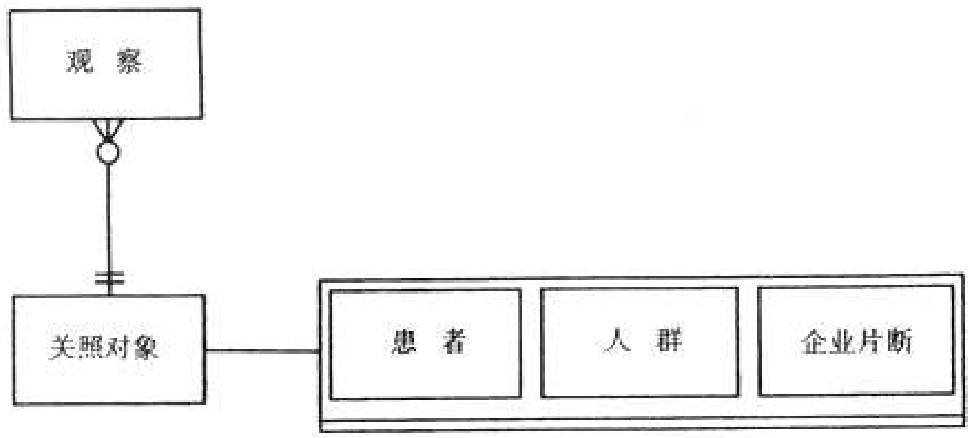  
图41关照对象及其子类型  

第3章中的惠者是可观察的关照对象中的一种。  

当我们在观察一家企业时，会发现可以根据一些标准来把它划分成不同的组成部分。比如，可以按照组织单位或地理位置来划分，也可以按照产品或者产品销售对象等来划分。每一种划分方法都可以说是独立的，而且每一种划分方法都会产生一个层次结构。例如，一家跨国企业可以首先按照市场（美国），然后按照区域（东北部）最后按照地区（新罕布什尔州）来划分。其中每一个独立的层次结构都是该企业的一个维度。新罕布什尔州和东北部在地理维度中是处于不同层次上的元素。一个企业片断由多个维度元素（每个维度元素对应一个企业维度）组成。这样，ACM中的“东北部地区，11-10系列，政府部门”部分就可以定义为“地理维度上的东北部”、“产品维度中的11-10系列”，“行业维度中的政府部门”这三种维度元素所组成的企业片断（如图4-2所示）。该分析方法通常被称为“星型模式”[4]，普遍用在多维数据库[2]中。  

利用所定义的企业片断，就可以构造出不同类型之间的关系模型（如图4-3所示）可以将维度元素连接成为维度元素层次结构。可以定义多个维度元素层次结构。需要注意维度元素层次结构是如何约束父关联的，因为单靠基数还无法维持一个维度元素层次结构（尽管允许循环）。企业片断必须从每一个维度元素层中获得一个维度元素，就像前面所提到的拥有三个维度元素的企业片断那样。针对维度元素的约束确保了维度元素层次结构的所有元素都是在同一维度中。该模型可以很好地处理这种情况，但是它也存在两个缺点。首先，还没有确切地定义维度和维度级别的概念。其次：添加一个新的维度就会导致模型的改变。  

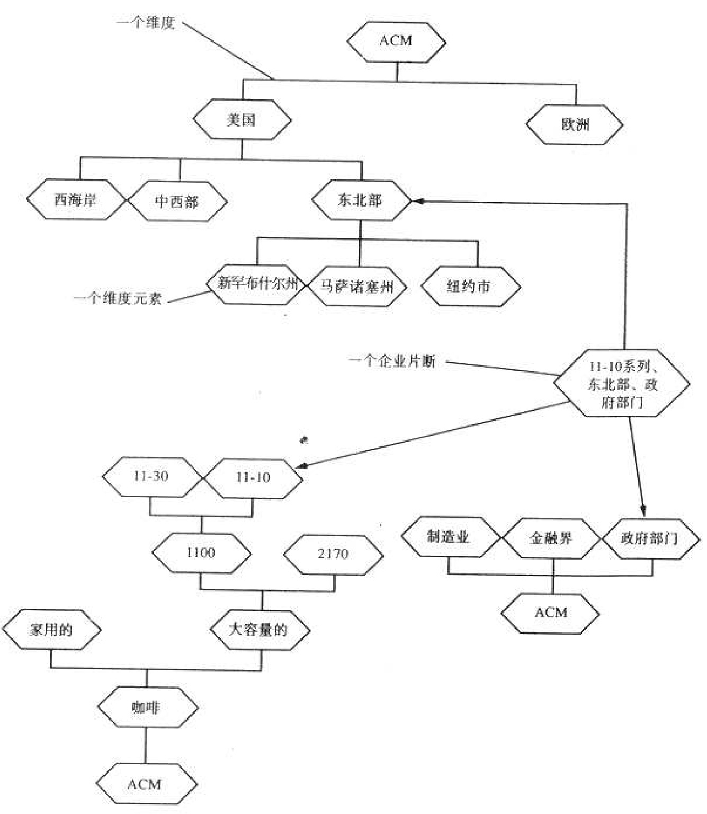  
图4-2如何将企业片断与维度元素关联起来  

一个企业片断就是各维度元素的组合体。  

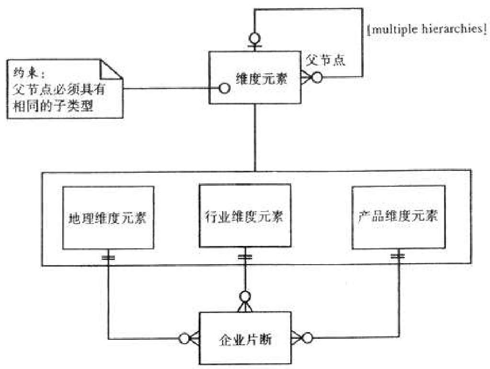  
图43用维度元素定义企业片断  

使用该模式时，无论何时增加一个维度都需要增加一种新的子类型。  

图4-4所示的模型用到了一种显式的维度类型。每一维度拥有一层维度元素。这样，企业片断就需要和每一维度中的一个元素有一个连接。我们可以通过带键值的映射来做到这一点（参见15.2节）。当结合基数一起考虑时，该映射规定，对于每一个键的实例（维度）有且仅有一个维度元素。  

  
图4-4利用维度和维度元素来定义企业片断  

此模型充许我们在不改变模型的情况下添加新的维度，而且也很简洁。  

例：我们可以定义“11-10系列、东北部、政府部门”的企业片断，并把它和“11-10系列”、“东北部”、“政府部门”这样的维度元素联系起来。11-10系列是在产品维度中，东北部是在地域维度中，政府部门是在行业维度中。  

要注意的是：每一种层次结构都会有一个顶点，且其并不一定是有名有姓的东西。一般的习惯是将顶点标为“all”，表明任何一个参考该顶点的片段都没有进行任何的细分。另一个习惯是对维度元素的映射是可选的：这时常用“nil来命名树的顶点。前一种方法更为可取，尽管该顶点  

元素在一定程度上是凭空造出来的。  

例：如果我们增加了渠道维度，那么企业片断“11-10系列、东北部、政府部门”就和渠道层的顶点维度元素建立起一种连接关系。我们称该维度元素为all  

给维度级别添加一种类型的效果并不十分明显。一般来说，每一个维度元素都有一个维度级别。然而，这种级别是由它在维度层次结构中的位置所决定。图4-5所示的模型是通过给每一维度分配一个维度元素列表的方式来加以处理的。维度元素的级别是根据其在维度层次结构中所处的级别和维度级别列表来决定的。  

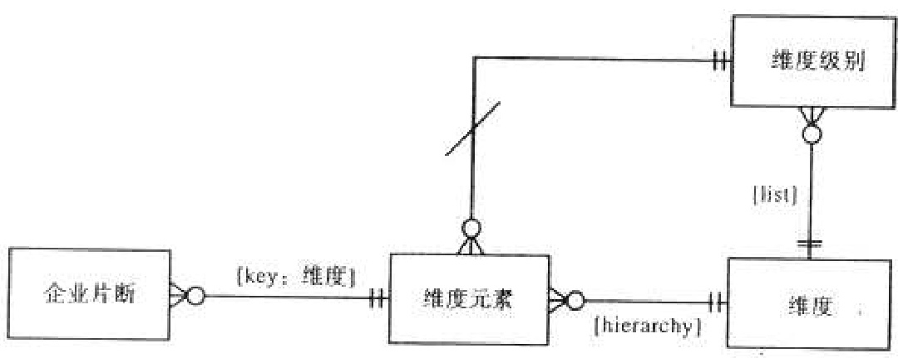  
图4-5在图4-4中添加了维度级别  

维度级别充许我们对维度的每一级别进行命名。  

例：在ACM例子中，地域维度有这样一个维度级别列表：市场、地区以及区域。新罕布什尔州定义在父辈是东北部的层次中，东北部的上一层是美国，美国的上一层是“all”。由于它是自上而下的三级结构，新罕布什尔州的维度级别就在列表中的第三个位置（即区域】上。  

4.1.1定义维度  

我们如何对维度进行定义？最简单的定义就是：维度是一种通过组织结构对一个庞大的组织进行划分的方法。然而，该定义通常并不是最令人满意的，因为一个组织可以按很多种方式来划分。另外，一些维度对于组织系统也并不是必需的。图4-2中的模型包含了ACM的产品所销售到的行业的一个详细分类，但是这并不能用来代表ACM中的某个组织架构。  

通过考虑层次结构的底部并了解此处维度对什么进行分类，我们可以找到一种更好的维度定义方法。在前面的例子中我们可以发现，ACM将重点放在了咖啡机的销售或租用上。我们可以根据销售的是哪一种机器、销售的区域以及销售到的行业对维度进行分类。这些维度来自于焦点事件  

的分类，焦点事件是“星型模式”[4]中的事实表。  

在决定在这类分析中使用维度时，我们首先需要理解什么是焦点事件。接下来我们可以着手研究对这些焦点事件的分类方法。从图4-2中我们可以发现，焦点事件涉及拥有产品系列的产品，该产品系列包含着一个产品组，而该产品组中又包含着 $\rightarrow$ 种饮料。在销售维度上，可以看到区域、地区和市场等元素。  

这些维度和级别应该由业务分析人员来定义。图4-6所示的就是一种非常好的定义方法。正如图4-6所显示的那样，这种结构可以变得相当复杂，维度也不必完全相互独立。例如，你会注意到价格范围维度和产品维度存在着交叉关系。这表明，任何一种产品沿着产品维度和价格范围维度存在一个特定的父辈。基于这一点，图4-5中的模型需要做适当的调整。但调整会使模型变得复杂化，因此这样做是否值得仍然是一个问题。该回题可由维度的生成过程来解决  

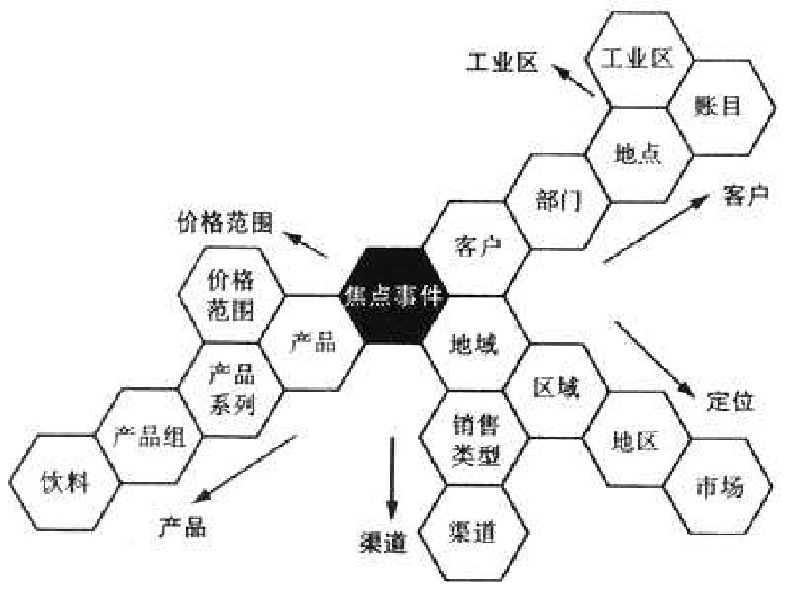  
图4-6典型的一套维度和级别  

该图非常有用，它告诉我们在任何一个级别上最好不要产生6个以上的分支。实际上我们也很少这样去做。  

维度不需要可测量到最低级别。因此，不值得或者甚至不可能分析到单个销售者的销售区域或单个消费者。这样，只能按维度向下分析到基础事件。为了将来的开发以及作为理解更高级别的基础，对较低级别的了解仍然是必要的。  

对消费者域的全面分析将包括为消费者区域生成业务模型，其中将包括一个结构模型，而该结构模型会用于对维度的严格定义。每一维度都应  

该代表一个沿着结构模型的层次路径。该过程的细节超出了本章范围，为了便于讨论，我们假设维度都已经被确定。  

维度可由分析系统的用户明确地加以定义。此外，也可以根据公司的数据库来确定。对于后者，每一维度都需要一个生成操作来告诉它如何访问公司的数据库。这就允许系统随时给维度添加节点。  

4.1.2维度的属性以及企业片断  

关于维度的一个重要规则是：对低级别维度的测量结果可以以适当的方式综合到高级别维度的测量之中。这样一来，如果我们想考察东北部的销售收人，可以把东北部的所有下级分区的销售值累加起来。所定义的任何一个维度都必须支持该属性。一般来讲，维度都是通过相加来实现综合的，但也有一些特例（参见4.2.5节）。  

除了通过业务结构定义的维度以外，另一种常用的维度就是时间。通过把基础事件划分为时间段，可以把时间看成是一种维度。如果时间段是月份，那么我们就可以讨论（11-10系列，东北部，1994年3月）的收人向题。这意味着维度元素“1994年3月”可以作为维度元素“1994年”的“儿子”。倘若仅仅是考虑当月（而不是累计）的收人问题，那么时间维度就可以很好满足上面所讨论的组合属性。我们可以很容易地根据月份收入计算出年度收人  

企业片断和许多基础类型一样，具有一个共同的有趣的属性：所有的企业片断都只是概念上的存在。不存在数字5、数量5美元或者2314年1月1日这样的单独概念。所有这些东西都存在于我们的头脑之中，但在计算机中可能需要作为对象来生成。企业片断具有这样的共性，一旦所有的维度都确定了具体的维度元素，则所有企业片断在概念上就存在了，尽管可能并没有把它们创建成软件对象。  

这种共性引出一个问题，即可否把一个企业片断当成是一种基础类型（参见A.1.5节）。如果是这样的话，就不应该有任何与非基础对象的映射。维度元素和（从关照对象中继承而来的）观察都是非基础的。虽然后者可以被排除，但前者由于是企业片断的一部分，因此不可以被排除。因为为指定的企业片断找出所有观察是一个非常普通的需求，所以需要意识到保持从企业片断到观察的映射的重要性。总而言之，虽然企业片断具有“普遍的概念存在性”这样的性质，但看上去它仍然是非基础的。  

把企业片断看成是非基础的，对接口确实会存在一些影响。生成操作其实是查找或创建动作。首先要检查所需要企业片断的实例是否存在；如果存在就将其返回，如果不存在就创建它。（或者你可以认为它没有创建操作，而仅仅是一个查找操作，在需要的时候会自动创建。  

4.2测量方案  

我们所讨论的企业分析用到了大量的测量。这些测量不是用手工记的：通常或者是从一个或多个数据库中加载而来，或者是由其它的测量算得来。我们要记住是如何获得这些测量的，即用于创建测量的具体方案是什么。图4-7展示测量和测量方案的一个基本轮聊，其中大部分内容和第3章类似。  

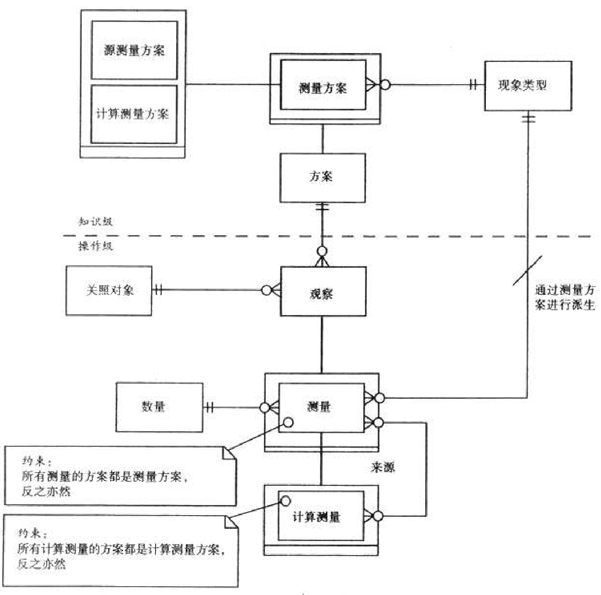  
图4-7测量和测量方案  

图4-7展示两种测量方案。源测量方案涉及对一些企业数据库的访问。通常，一个对象在逻辑上是知道它正在访问哪一个数据库的，尽管实际的命令是在其它层。用户可以决定所要访问的数据库。计算测量方案表示要围绕该领域已经出现的测量做某种运算。  

关于该模型的重要特点一其临床背景的反映一是任何一种现象类型都可以用多种测量方案来确定它的值。一些读者可能会觉得这个特点很奇怪。用多种方法计算的测量到底有什么意义？如果有多个公式，它就一定是另外一种现象类型。而这里最明显的一点就是一个现象类型可以有多种计算方案和多种源方案。我们可以在不同时期使用不同的方案。也可能会有多种源方案，选用哪一个取决于系统的可用性。有些数据库要比其它数据库更可靠，但没有任何数据库的可用性是完美的。  

同样地，用户可以考虑利用不同的计算来生成相同的现象类型。选用哪一种计算取决于源的可用性，或者从用户角度考虑一些更细微的区别。关于这一点的一个很好的例子就是库存值。一般来说，库存值只有在年底才进行真正的计算，而在其它时间只是对该值进行估算。这两种情况算得的值都可以作为进一步财务分析所需的基本信息。  

该模式的一些用户可能会选择指定用哪种测量方案来产生测量值。而另一些用户可能只是想得到一个现象类型，而让系统决定如何产生测量值。对于后一种情况，需要用某种方法来为现象类型进行测量方案的优先级排序。这可以通过建立一个从现象类型到测量方案的映射表来实现，映射表的前部定义首选的方案，以此类推。  

要注意那些与其源测量有返回连接的计算测量。这需要遵循一个一般的规则，即当把计算结果作为一个对象时，应该知道该结果是由什么计算（方案）产生的以及该方案的输人是什么（源）  

# 2.1保持计算的有效性  

计算测量方案包括所使用的计算公式，如图4-8所示。这是一个独立的实例方法（参见6.6节）的例子。计算测量的公式通常都十分简单，所以我们可以利用一个简单的解释程序[3]并将公式刻画成电子表格形式。  

该模式的一个重要特点是参数的提交方式。每一种计算测量方案都有一个参数列表。该列表代表了那些综合到公式中的现象类型。上面说的从现象类型到测量方案的映射表就是一个列表。为了使公式有意义，映射的元素必须是确定的。列表可以很好地做到这一点，当然，也可以使用字符串。  

例：销售收入是一种把因果计算作为其测量方案的现象类型。因果计算的参数是一个列表，该列表有两种现象类型：销售量和平均价格。方法是公式：参数[1]×参数[2]。  

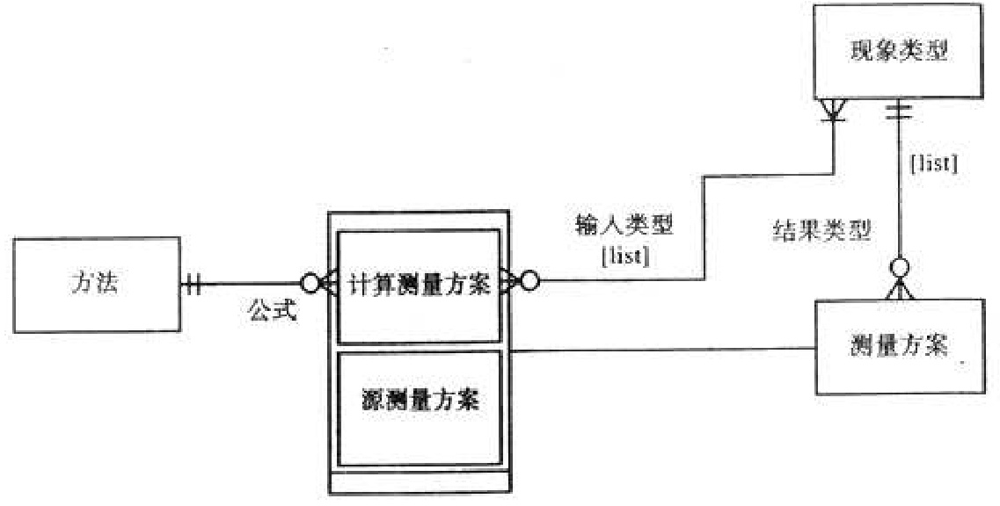  
图4-8计算测量方案中的方法  

例：体质指数是医学中的一个重要参数。它的体重和身高两个参数是通过因果计算产生的。方法是公式：体重/身高。  

# 4.2.2比较和因果测量方案  

在公司财务应用中，测量并不都是绝对的值。用户通常并不在乎收人的具体数字，他们更想了解的是实际的和计划的数字之间的差异或者是对今年收人与往年收人的比较。  

为了考虑这些比较型的测量，我们需要描述一下可能出现的不同类型的测量。典型的比较是对实际值和前段值或计划值之间的比较。前段值可 以通过两种途径获得：适用时段起始点的参考值（参见3.8节）或者是寻 找一个具有前段时间维度的企业片断的测量。计划测量要求我们区别看待实际值与计划值，这与我们在3.10节所讨论的临床观察和推理观察是相对应的。此外，推理观察必须记录下什么样的计划是推理的源，以便我们能够区分年度计划、季度预测等，如图4-9所示。  

在这一点上，两类计算之间的基本差别应该是很明显的。一种类型是以其它现象类型值为基础确定某种现象类型值。例如，我们可以通过将销售量乘以平均价格来计算销售收人。这种类型的计算被称为因果计算，因为它遵循因果分析。在因果计算中，输人现象类型的数量和关系可以是任意的，计算所用的公式也可以是任意的表达式。  

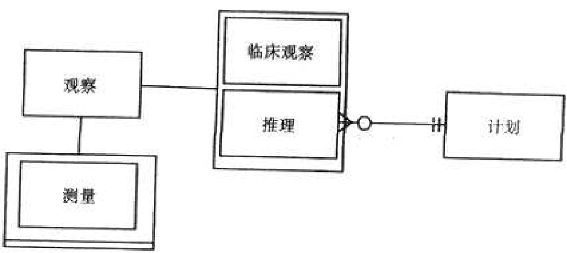  
图49支持计划值和实际值的观察类型  

另一方面，比较计算更具有结构性。它们通常有两个输人测量，且这两个测量必须是相同的现象类型。输出测量的现象类型通常源自于计算形式以及输人现象的类型。因而，如果我们想了解销售量偏差，那么输人就是销售量现象类型，而输出就是销售量偏差现象类型。这些计算所用的公式不外乎是：绝对偏差（ $x{-}y{\big)}$ 或相对偏差 $((x-y)/y)$  

这两种计算类型之间的差别可以通过将计算测量方案子类型化来形式化地表示，如图4-10所示。计算测量方案拥有这种结构的关键元素。每一种计算测量方案都有一个单独的结果类型和一些输人类型。对于比较计算，测量方案都被限制为两个参数，且必须是相同的现象类型。所有的计算测量方案都有一种方法，该方法包含用来从输人值计算出新值的公式。两个方案可以共享一种方法，例如“参数1-参数2”这种方法就可用于确定所有现象类型的绝对误差。当然，这种情况极为普通，值得为其专门构造一种子类型来将该方法固化在类型中。  

4.2.3状态类型：定义计划的和实际的状态  

由源测量方案导出的测量或计算测量方案所确定的测量通常是由它们的测量方案计算出来的。该测量方案为测量提供一种工厂方法[3]°。当客户要求某测量方案创建一个测量时，需要告知该测量方案他需要参考什么样的关照对象。同时还需要告知方案该测量是实际值还是计划值：如果是计划值，则要说明是何种计划：如果是实际值，则要说明是哪一天。  

在这一点上讲，图4-9的模型还存在不足。我们还需要一种更简单的方法为方案提供所需的信息。图4-9的确给出了一种好办法：从已经存在的测量中确定这些信息，但是它没有提供查询该信息的简便方法。我们可以通过图4-11中的模型来解决这个问题，该模型将相关属性集中放置到一个单独的状态类型中，该抽象状态类型拥有两个子类型。实际的状态类型可能会有一个时间偏移量。对于当前值将不会有偏移量（或者偏移量为零）6个月或一年前会有适当的偏移量。计划状态类型就像推理一样，拥有相关的计划。  

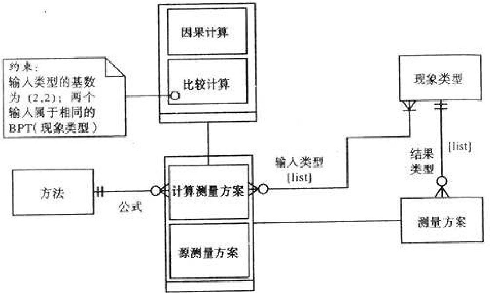  
图4-10用计算测量方案展示的计算类型  

因果计算将不同的现象类型关联起来，而比较计算则显示同一现象类型的不同状态类型之间的差异。  

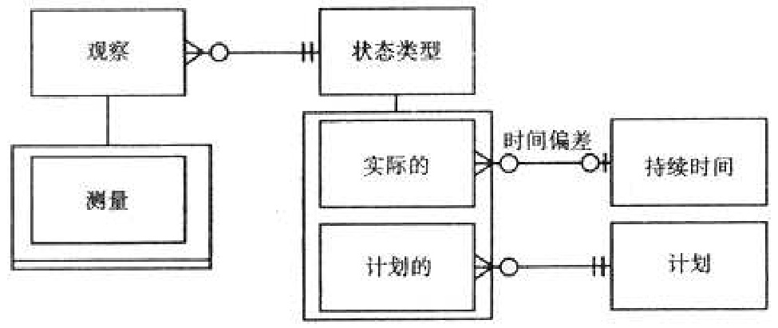  
图4-11状态类型是图4-9的一种可选方案  

该可选方案使得描述所需的比较测量的种类变得更为简单（如图4-12所示）  

例：公司评估4类财务状况：实际值、前一年 $\eqcirc$ 年度计划以及最近的本度预调，实际值将是一个具有零时间偏移量的实际获念类型。前一年是具有一年时间偏移量的实际状态类型。年度计划是一个与年度计划相关的计划状态类型。季度预测是一个与最近的李度预测相关的计划状态类型。所有的季度预测都是计划的实例。  

我们已经有效地将我们所掌握的观察方面的知识从观察本身分离到了一种类型中。该类型可以列举出现有观察的所有可能的变化。该类型属于知识级，由此可以计算出新的测量，但事实上该类型并不需要属于知识级。我们应该注意到这和图4-9中的模型有所不同。两种方法说明的是同样的问题，只是在方式上略微不同，而且两者可同时使用。  

现在，客户仅需要说明测量方案的状态类型以便有足够的信息来构造测量，假定测量方案是一个因果方案。比较计算需要两个状态类型，每一个对应一个输人。一种处理方法是区分构造测量操作，使因果测量的构造操作需要一个状态类型，而比较测量的构造操作需要两个状态类型。另一种方法是充许有“比较状态类型”，如图4-12所示。我更主张后一种方法，因为这样的话，比较自身也是一个对象，构造所有测量的接口就一样了。  

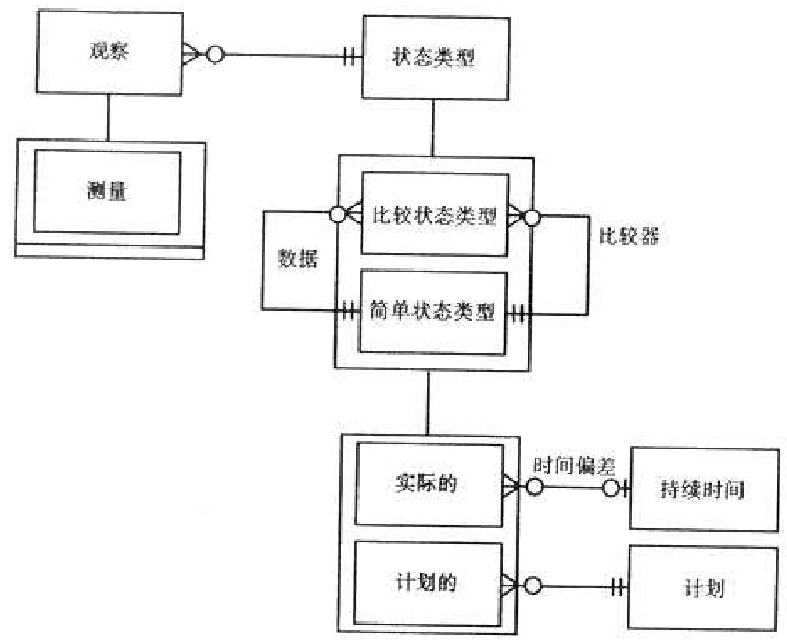  
图4-12用比较状态类型来减弱比较测量的规格说明  

例：ACM的管理者想查看实际销售收入与预计销售收入之间的偏差。为满足需要，模型必须包括 $-$ 种销售收入的现象类型和一种销售收入偏差的现象类型。销售收入偏差是一个用“参数[1]-参数[2]”这样的方法得到的比较计算结果。该需求构造一种带有比较状态类型的销售收入偏差的观察。该比较状态类型将包含有预计的基准数据以及实际值比较器。  

# 4.2.4构造测量  

既然现在我们已经知道如何识别新的测量，就可以把注意力放到测量的构造过程上，图4-13和图4-14说明这个过程。该过程有3步：寻找参数、执行公式以及用结果值构造一个新的测量对象。  

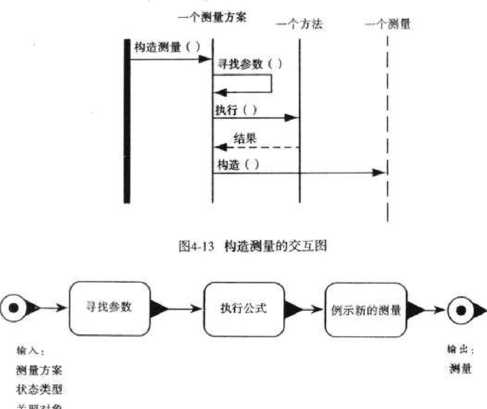  

图414用于描述测量构造过程的事件图  

参数寻找操作是多态的，它依赖于我们用的是因果测量方案还是比较测量方案。图4-15所示的因果方案需要找出所有具有相同状态类型的测量以及关照对象，其关照对象的类型和方案的输人类型要相互匹配。图4-16中的比较公式寻找两种测量，其现象类型与输人类型相同，其状态类型是方案的基准数据和比较器，而且这两种测量有相同的关照对象。  

在找到参数之后，就可以把它们应用到公式中，然后用所得的结果构造测量。  

4.2.5维度合井  

第三类计算是要实现对维度内部值的合并。前面提到的例子是通过把东北部的所有子区域的销售值加在一起的方法来计算东北部的销售收人。  

更准确地讲，对于类似于东北部这样的企业片断，其现象类型的测量是通 过找出该现象类型的所有子区域的测量值，再加以计算而得到的。这些值累加在一起便生成新的值。  

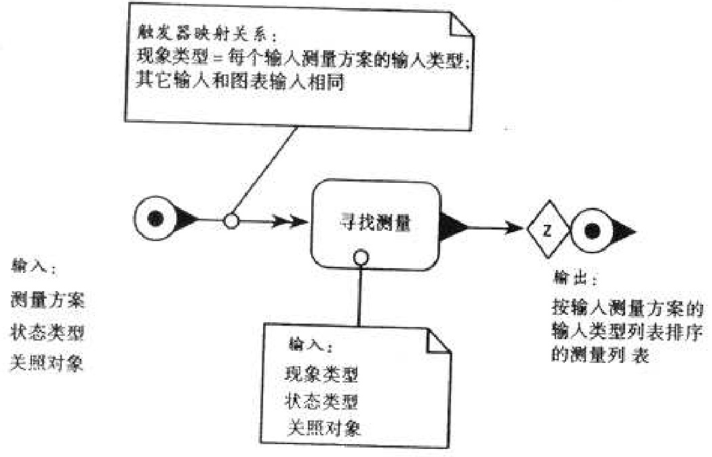  
图4-15因果计算中寻找参数的操作  

该操作为每一个参数类型寻找一个测量，所有其它元素也一样。  

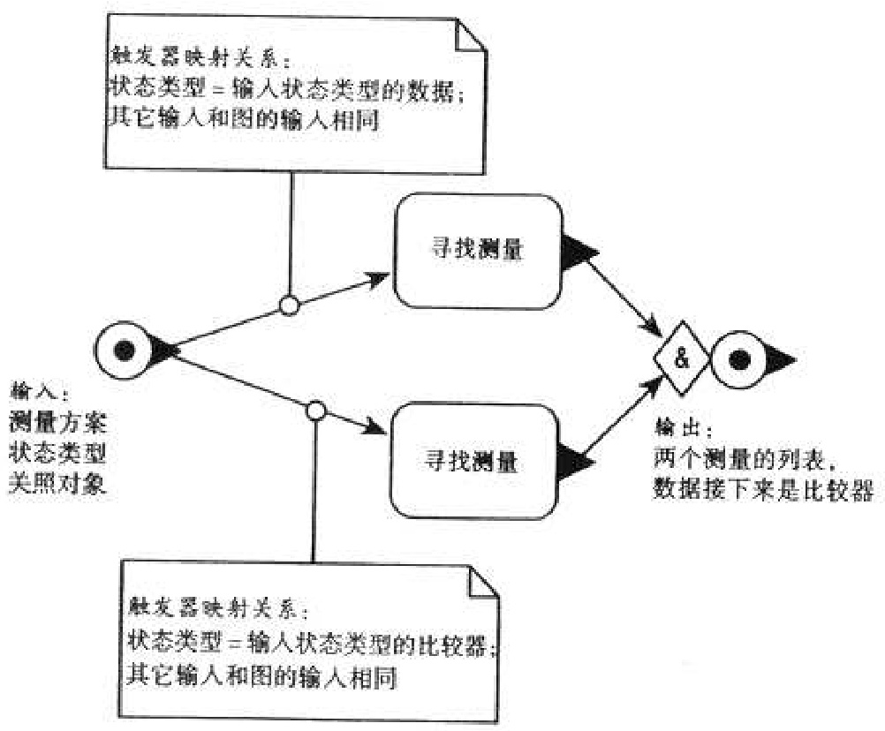  
图4-16比较计算中寻找参数的操作  

这样就能像图4-17所示的那样增加维度合并方案。我们必须指明被合并的维度。该计算并不需要任何输人类型（尽管它通常和输出类型具有相同的现象类型）。可以考虑将输人类型的映射基数减小到零，但我认为更好的方式是保持映射的强制性并增加一条约束。可以使用图4-18所示经过改进的参数寻找操作，按照图4-14所示的常规步骤来构造测量。  

计算方法的任务非常简单：把所有的参数累加起来。通常加法用于合并，但也并不完全这样。例如，平均价格这种现象类型就不是简单的相加，而是用求平均值的方法。具体算法依赖于现象类型，因此每一种现象类型都需要有一种合并方法。计算方法将合并方法应用于参数，以此来确定结果。  

请注意：比较方案和维度合并方案可以自动生成。对于维度合并，可以为每一种现象类型和每一维度的合并定义一种方案。对于比较计算，可以为每一种现象类型和每一种比较计算定义一种方案。  

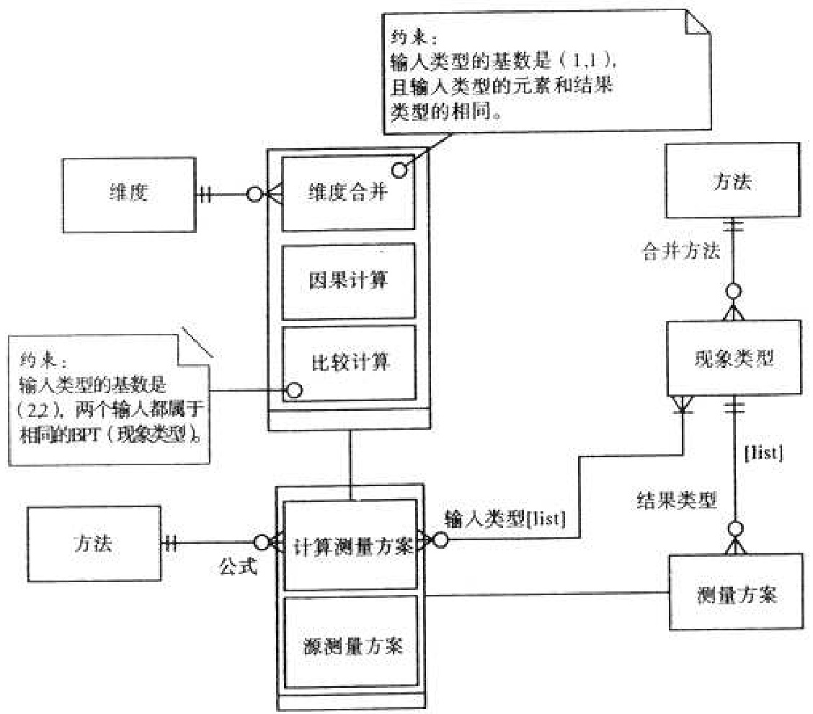  
图417将维度合并加入计算测量方案  

计算测量在医疗保健系统中也是很有用的。我们是在本章而不是在第3章中讨论计算测量，主要原因是它们被广泛地应用在对公司财务的研究  

中。因此，它们是一个示例，向我们展示如何把一个模型用到不同的领域从而产生更多的思路，然后又将这些思路反馈回原来的领域。  

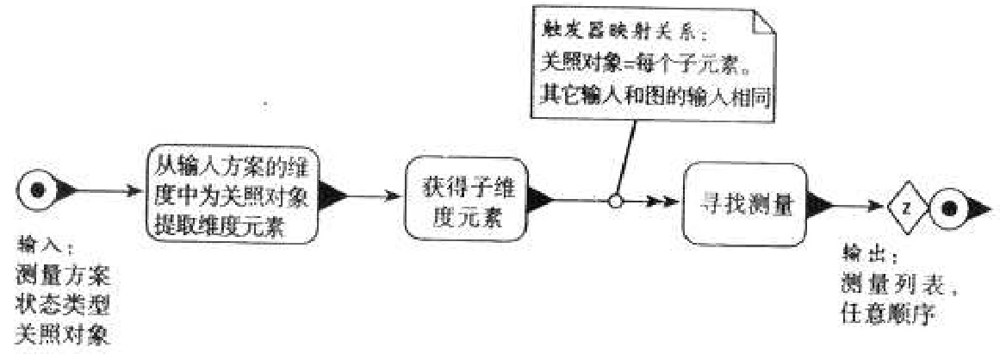  
图4-18维度合并计算中寻找参数的操作  

迄今为止，我们已经探讨了如何利用计算测量和源测量来研究一个企业的财务状况。测量方案模式为我们提供了一种研究财务信息的量化方法。然而，为了搞清大量数字的具体含义，通常会对测量加以分组，形成不同的类别。比如我们可能会将绝对岁人分成若干段，或者我们会把低于基准数据的 $10\%$ 的比较测量作为问题专门提出来。  

我们第一步是要描述测量的范围，这是该模式的主题。接下来是要把这些范围连接到观察的更广系统中，这一点我们会在4.4节中做具体的讨论。  

我们经常会遇到这样的要求：对一些值的范围加以控制。该范围可能由数字（如1..10）数据（如1/1/95.5/5/95）数量（如10.20公斤）或者甚至是字符串（如AAA.AGZ）组成。通常情况下，范围放置在类型中，类型通过给出带有上限值和下限值的映射来表达和使用范围，如图4-19所示。  

  
图419在类型中使用带上限和下限的范围  

我并不推荐这种范围表示方法，而建议采用范围类型。  

该方法的问题在于：我们更多关心的是范围而不仅仅是上下限值。我们可能想知道一个实际值是否在某个范围之内，或者某两个范围是否有交  

选，或者两个范围是否相邻，或者一系列范围是否构成一个连续的范围。对于每一个带上下限值的类型都会存在这样的要求。具体的解决办法是使范围成为一种相对独立的对象，如图4-20所示。这样一来，有关范围的一些本质性的东西都包含在范围对象中，从而不需要在那些用到范围的类型中对范围加以重复定义  

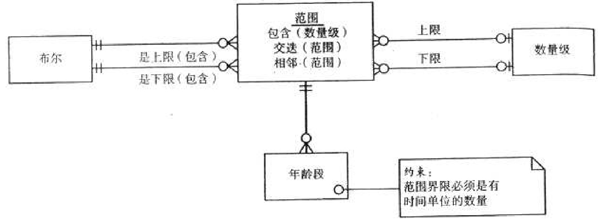  
图4-20使用一种更直观的范围对象  

在需要上下限的值时通常都是这样做。上限映射和下限映射可以是随意的，这样就允许有无限大的范围，如少于6个月。要区分少于6个月和少于等于6个月时，需要使用布尔值  

篮来进共用可出在两个任章的部量级之旧形成：任本顶里 $(\geqslant\varphi,\varphi=\varphi)$   $>$  第同的：所我们可证奖用听能找到的最简里的力法：仕实现时找市现没有任何关系。  

4.4带范围的现象  

范围为我们提供了一种定义测量分类的方法。现在，我们需要将它们同观察和测量的更广泛的模型联系起来。为了做到这一点，我们可以将某些现象类型的现象归纳成一类。如果现象类型是岁人百分比误差，就可以 构造一个有关岁人问题的现象一一当岁人百分比误差低于-10%时，该现 象即存在。这意味着“岁人百分比误差为-12%”的测量隐含着有岁人问题的一个分类观察（参见35节）。  

我们需要回答的第一个问题是有一种还是有两种观察。根据图3-9所示的模型，观察不是测量就是分类观察，而不能两者皆是。但通过使用图4-21所示的模型，就可以充许某个特定的观察既是测量又是分类观察。对模型的选择取决于是将概念过程首先当做一种测量，然后当做观察有岁人问题的一个单独的步骤（这意味着要用图3-9），还是将测量和观察视为同一个过程。对于这类简单情形，同我一起工作的领域专家更倾向于后者。  

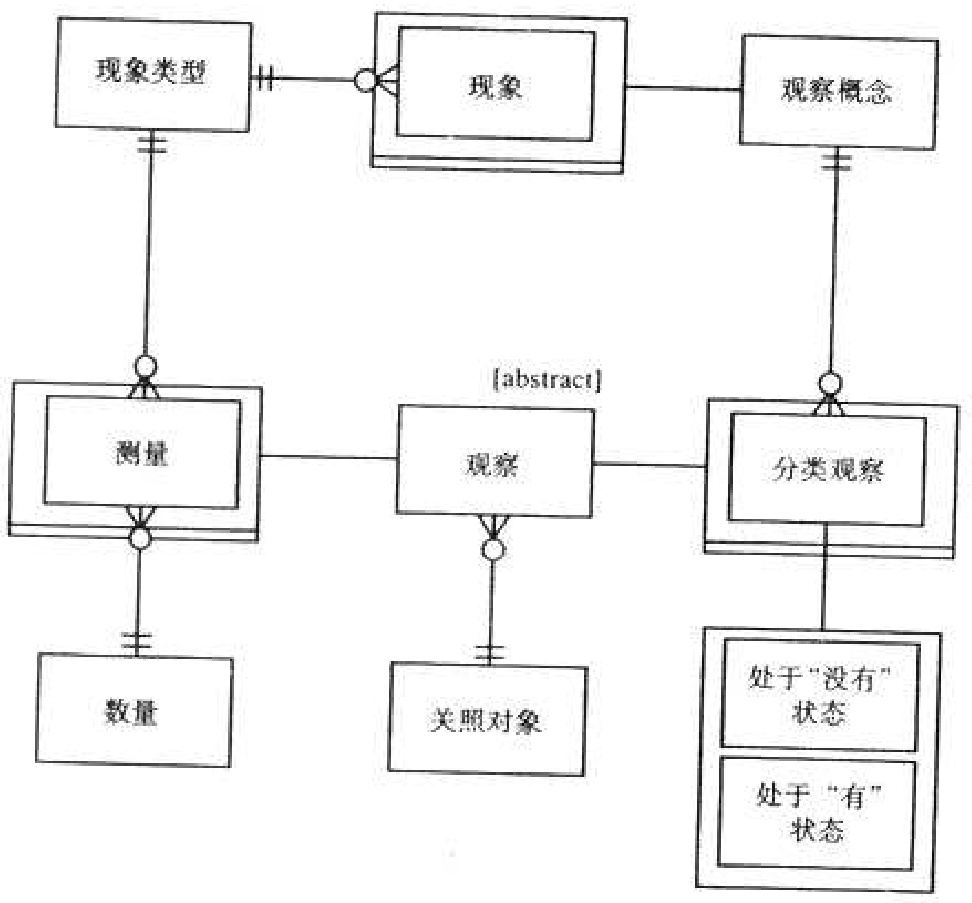  
图4-21允许观察既是测量又是分类观察  

[abstract]表明一个观察必须至少是其子类型中的一种。  

由于有了定义明确的范围，让计算机自动地将任意这样的测量同相关的现象联系起来就是很自然的事。为了做到这一点，我们需要一种在知识级定义范围的方法。  

最简单的方法是给现象增加一个范围，如图4-22和图4-23所示。如此  

一来，当我们创建一个测量时，就可以留心观察它是否落在该测量的现象类型的任何现象的范围之内。的确，我们需要考虑是否希望现象类型的范围不产生重叠，以及是否希望现象类型的范围是完整的。这两种情况都表明需要有一个约束。  

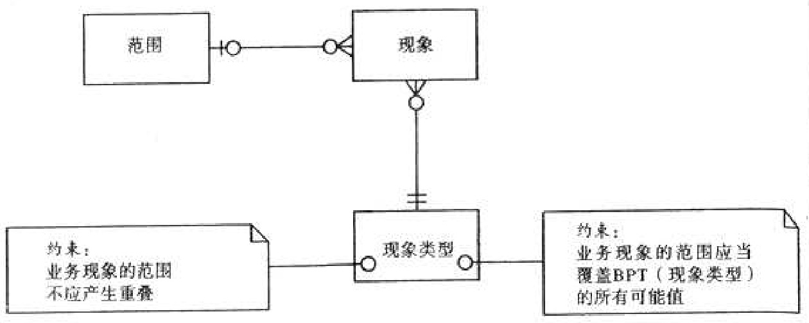  
图4-22给现象增加范围  

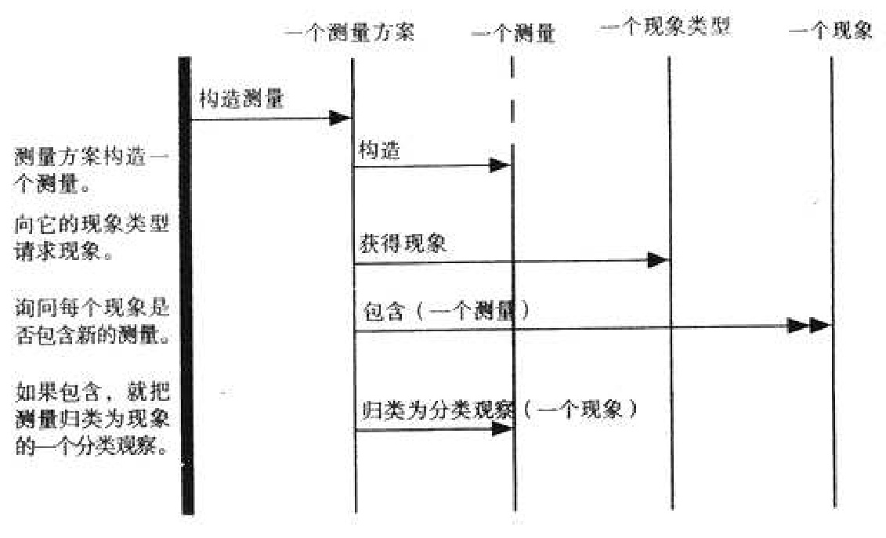  
图4-23构造测量和检查现象的交互图  

检查现象的任务也可以由测量对象来完成。我倾问于测量万案：因为我认为那是一个以后很可能需要重定义的地方。  

商：岁入百分比误差可分为四大类：大子5%是优等，5络到一 $s e$ 常.-5%到 $-10\%$ 是要受警告，低于 $=10\%$ 是有回题。这可以描还成是岁入百分比误美（RPD】现象类型的四类现象。优等RPD的现蒙具有的范围无上限，下限为 $5\%$ 正常RPD的现象具有的范围上限为 $-5\%$ 下限为 $-5\%$  

要受警告的RPD的现象具有的范围上限为 $-5\%$ ，下限为一 $10\%$ 有问题的RPD的现象具有的范围无下限，上限为 $-10\%$ 核实恰好为上下限时属于什么分类以及将该信息包含在范围中是非常重要的：因为我们会遇到恰好为 $5\%$ 是优等RPD还是正常RPD这样的问题？  

例：体质指标通常定义成四组：正常为 $20\sim25\mathrm{kg/m^{2}}$ ，超重为 $25\!\sim\!30$  $k_{\mathrm{E}}/\mathrm{m}^{2}$ 肥胖为 $30\sim40~\mathrm{kg/m^{2}}$ 病态肥胖为 ${>}40\;\mathrm{\bf~kg}/\mathrm{\bf~m}^{2},$ 这可以描绘成四种对于体质指标现象类型的现象。超重现象具有的范围下限为25kg/m²，上限为 $30~\mathrm{kg/m^{3}}$ 其它每种类型都有类似的范围。  

4.4.2范围函数  

一种可选的方案是将单个范围函数创建成关联函数的子类型，如图4-24和图4-25所示。在多种范围同时存在时，该方法是有用的，具体情况依赖于由观察概念所描述的上下文。该模型充许存在多个系列的范围，这依赖于用的是哪种观察概念。范围函数不仅要评估一些参数的表达式（就像在关联函数中那样），还要检查测量是否落在现象类型的范围中。如果两者都是，那么输出观察概念就是适用的。相对于将范围直接应用于现象来讲，使用约束来确保只有一种范围函数适用于任何给定的测量要困难许多。  

例：某些企业片断被定义为关键片断。对于这些片断，有问题的岁入百分比误差（RPD）定义在 $=5\%$ ，而不是 $-10\%$ 。为处理这种情况，我们要定义一种关键片断的观察概念。那些关键片断需要有相应的观察（这 也会为我们提供随时间改变关键状态的能力 $\}_{6}$ 我们要定义一种范围函数，它具有（关键片断）参数、有问题的RPD的输出、 $<\!5\,\%$ 的范围、RPD的现象类型  

例：一个人的betaHCG的正常范围会由于怀孕而增加。为了表示这种情况，我们将使用两个具有betaHCG正常输出的范围。其中一个范围具有怀孕参数，而另一个具有非怀孕参数。范围函数上的现象类型是betaHCG  

这两种方法都有它们各自的优点，如果把它们混在一起使用就会显得不伦不类。直接和现象联系在一起是最简单的方法，如果它确实可以正确地描述情况，那么它就是首选的方法。范围函数要更复杂一些，但是它可以描述更复杂的情况。一般的原则是：在能够使用时应该尽量使用直接和现象关联的方式，不得已才考虑使用范围函数。如果情况变得比这里所描述的模型所能够处理的情况更复杂，就应该给范围函数增加特性，要么直接增加，要么通过子类型。  

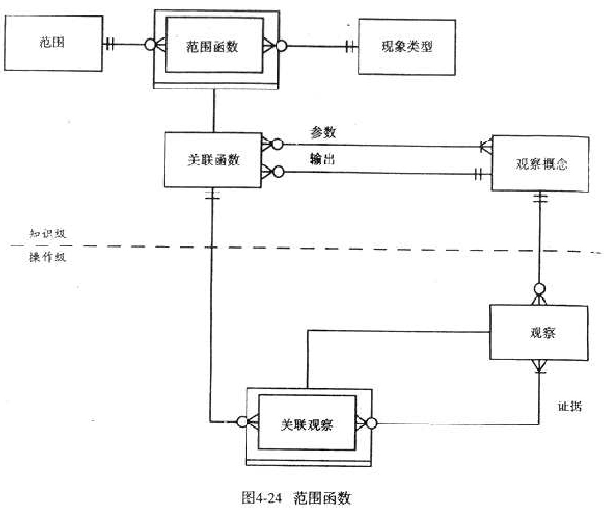  

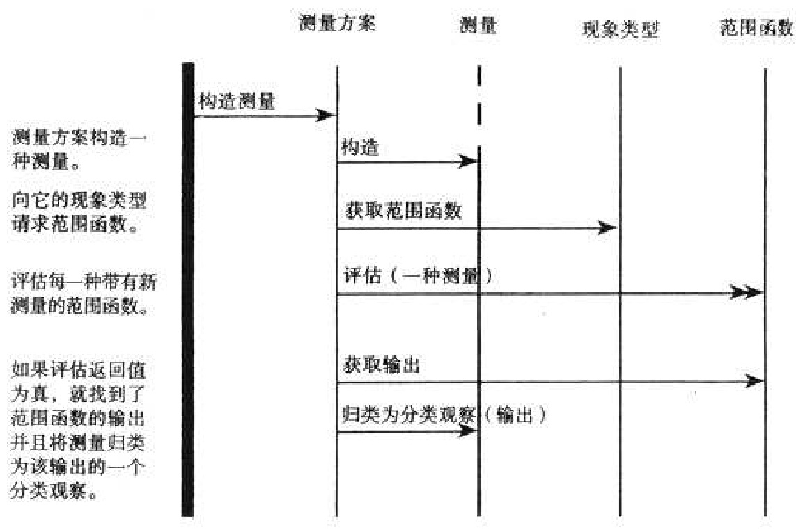  
图4-25构造一个测量并检查范围函数  

迄今为止，本章已经阐述了对第3章中所介绍的模式做进一步的扩展后所获得的模式的大体情况。现在我们可以来探讨如何使用这些模型  

我们从查找ACM的全部岁人开始。如此，会用到一个测量：其企业片断是整个企业；也就是说，企业片断的维度元素都处于维度层次的顶层。测量通常不是一个绝对值，而是一个和特定计划值或前段值相比较的相对值。此外，可以通过一个带范围的现象来凸显存在的问题。分析人员接下来就可以通过查找由现象所定义的有问题的观察来着手开展进一步的工作。  

为了断定问题是与设备销售收人相关，我们需要从总岁人往分析（总岁人是由销售收人减去销售成本构成的因果计算）。要注意的是：果计算指出一种可能的分析途径，而无论测量是否由该方法确定。也许该最终数值事实上是从一个数据库中获得的。（由于脏数据的原因，也许它与公式的计算结果并不完全吻合。）  

下一步是利用维度合并方案。沿着地域维度观察，会发现东北部片断的误差明显偏高。我们现在就可以将注意力集中在这样一些企业片断上：企业片断的地域维度指向东北部维度元素，并且在其它所有维度的顶层。重复这一过程两次以上，我们就会得到（东北部、1100系列产品、政府部门的企业片断。  

这里存在一定程度的间接性。比如，当涉及比较计算时，计算方式可能就不那么直接。整个岁人的误差可能并不等于销售收人的误差减去销售成本的误差。一种替代方案是先单独计算出实际和计划的销售收入，然后在因果计算中使用。对于绝对误差，两种方式都是可行的，但对于百分比误差，就不行了。方案的存在与否将决定最合适的计算方式是什么。  

我们还可以选择其它方式。上面我们先进行因果分析，然后做维度合并。我们还可以先分解地域维度，然后进行因果分析，然后再分解其它维度。分析的途径可能有很多种，并不是每种都需要同数据计算时所采取的途径保持完全一致。  

使用3.11节所阐述的关联函数，我们可以得到定性的描述，如“一个强有力的竞争者可能导致销售收人的减少”。定性和定量的观察是通过指定的范围现象关联起来的。  

具体应用中可以来用多种技术来浏览这种结构。现在的多维度数据库大多都支持用户定制，从而提供最大程度的适应性。另一种可选的方式是采用由方案层次所定义的分解途径，这种技术在迅速到达问题根源方面被证实是有效的，层次分析器可以很容易地被构建在该框架的顶层。另一种  

方法是使用代理在结构中游历，以找出所关注的测量。  

本章做了一次具体的尝试，即将医疗保健系统中的模型应用到公司财务分析中。在公司财务分析中对这些模型所做的扩展又可以反馈回医疗保健系统模型中。测量方案的确是可用的：企业片断模式可应用于流行病学研究，尽管还需要做进一步的分析。通过充许对模式做类似于这样的跨领域应用，我希望会出现越来越有用的模式：如果我们倾向于把模式固定在特定的应用领域，估计就不会有什么模式出现。  

# 参考文献  

1.Cairns,T.,A.Casey,,M.Fowler,M.Thursz,and H.Timimi.The Cosmos Clinica ProcessModel.National Health Service,Information Management Centre,15 FrederickRd,Birmingham,B151JD,England.ReportECBS20A&ECBS20B <http://www.sm.ic.ac.uk/medicine/cpm>,1992.

 2. Dejesus,E.X."Dimensions of Data,"in Byte,April 1995,pp.139-148 3 Gamma,E.,R.Helm.R.Johnson,and J.Vlissides.Design Patterns:Elements of Reusable Object-Oriented Software.Reading,MA:Addison-Wesley,1995 Peterson,S."Stars:a patternlanguage for query-optimized schemas,"In Pattern Languages of Program Design.J.O.Coplien and D.C.Schmidt,ed.Reading.MA: Addison-Wesley.1995,pp.163-177.  

# 引用对象  

大多数面向对象方法都将注意力放在对象识别上。在面向对象计算机系统中，每个对象都拥有惟一的ID，利用该ID能够确保可直接访问到任何对象。这种观念同时也影响了我们的概念思维。只有很少的对象方法使用主键和次键概念，虽然它们在传统的数据建模中扮演了非常重要的角色。我们也需要有某种方法来引用一个特定的对象：例如，我可能需要找-个要付给他账单的人：而一个医生可能需要将一个患者标记为糖尿病忠者。对象系统为我们提供了强大的浏览能力，这种浏览能力揭示了概念对象之间的自然联系，但有时候确实需要一种更直观的标识符。  

针对对象的最简单的标识符是名称（参见5.1节），名称由一串字符组成通常用来标识一个对象。问题在于并不能确保名称可适用于所有的情形。可能需要一种更人工的构造物：由标识方案（参见.52节）所限完的标然  

我们本来认为对象是易定义的和静态的，但当我们意识到通常情况下并非如此的时候，问题就变得更为复杂。在计算机以外的世界中，很容易找到我们认为是两个对象而实际是一个对象的情形。对于这种情况，我们需要做对象合并（参见5.3节）。既然我们在合并过程中可能会犯错误，那么我们就可能需要到后面将它们分拆。可以通过复制并替换、替代或者本质/表象等方式来合并对象。有时候，有一些分离的对象可能本应该是一样的，但是我们不能十分肯定，或者我们不能和其他相关人员达成一致。此时，我们只能说存在对象等价（参见54节）。  

要记住，本章所阐述的内容是对对象的概念性引用，即人们通常所使用的引用方式。这些引用出现在除软件所使用的任何对象标识方案之外的模型中。本章不讨论任何软件标识技术，但是会假设它们存在于任何面向对象的实现中。我还会假设这些软件标识技术对于用户是隐藏的。  

关键概念：标识符、标识方案、替代对象、对象本质、对象等价  

在我所讲授的一门面向对象设计的课程中，我使用过一个习题，包括对一个人的出生情况的各项细节的记录。其中一个要求就是需要记录某个人的出生医院和出生城市。就常识而言，如果知道某个人的出生医院，那么很自然地，就应该知道其出生的城市，因为每所医院只能在一个城市中。但事实并非如此，有人会指出情况不是这样的，因为世界上很多城市都有一所圣·玛丽医院。  

该错误是逻辑上和哲学上最古老的问题的一个表现，即事物名称和事物本身之间出现的混淆。一所医院不是一串字符所能代表的：正是因为建筑、组织、人员、法人实体等众多的事物使得怀特岛的圣·玛丽医院和伦敦的圣·玛丽医院不同。很明显，如果人们实际遇到了这些对象，就不会真的把这些对象搞混。就像可能存在拥有同样名称的医院对象一样，名称仅仅是一串和医院相关的字符，而不是医院本身。我们为对象本身建模，而不是为对象名称建模，这样就可以有充分的理由称每一所医院都坐落在惟一的一所城市中。  

什么是名称？名称只是一种标识对象的非正式的方法。我强调“非正式”是因为相对于其它特性，名称用起来更加随意和方便。“Martin”这个字符串是一个有用的标识符，它在许多场合都足以用来标识我。但是我曾经和另外一个叫Martin的人共住一所房子。两位居住者共享了该字符串，所以它作为标识符的价值就减小了。在我们的朋友圈中，“Martin”仍然是最通常的用来标识我们俩的方式，但是由此而产生的混乱也的确发生过。在很多应用中，我们认为有必要给一个人起一个单独的名称，如图5-1所示，尽管该名称可能是有结构的。更复杂的例子是充许一个人有别名，给他很多名称，如图5-2所示。例如，可以用字符串“MartinF”来标识我，以便和另一个Martin区分开。  

  
图5-1有一个名称的对象  

该模型表明并不是所有的对象都必须要有一个名称。你可以争辩说：没有名称就暗示着和一个空串存在必然的联系，因此映射是强制的。在任何一种情况下，这种模型都表明一个字符串可以被作为多个对象的名称。在概念上，所有相等的字符串都是相同的字符串：也就是说，你没有完全相同的复制。  

通常，名称是标识对象的一种有效方法，但是在建立人事档案系统时，不会把一个人的名字作为这个人的惟一标识。人可以有很多名字，同样的名字也可能会被不同的人使用，而且人还会改名。所有这些因素使得名称成为不可靠的标识符，但是到目前为止，名称仍然是最普通的标识符。  

  
图5-2有多个名称的对象  

该模型模拟有多个别名的对象。一种变形可以是有一个（常用的）名称和多个别名。  

要特别留意名称和标识符的另外一个方面：名称是刻画对象的一种简洁的方式。它可以描述一个对象的某些属性。比如，某款汽车叫16GL是指其引擎大小和舒适度。尽管该名称是对该款车的简洁描述，但它不是一个标识符，因为许多车型都可以称为16GL。  

一个真正的标识符有这样几个特点：它必须可靠地为用户指明一个且是惟一的一个对象，同时无论何时使用该标识符，它都必须是指称同样的对象。图5-3显示了一个标识符的公共模型。与通常的拥有基础对象的情形不同的是，从标识符到对象的映射是单值的。  

  
图5-3一个标识符对应-个对象  

该模型表明，并不是所有的对象都有一个标识符，这在概念上可以是真实的，即使它在软件系统中并不是真实的。标识符是一个字符串，但并不是所有的字符串都用来标识一个对象，要成为一个真正的标识符，它应该标识的是一个惟一的对象。如果使用一个标识符类型：将是非常可取的一种做法，这时这个标识符类型与一个对象之间就存在强制的映射关系。  

在简单系统中，典型的做法是给每个对象一个单独的标识符：但是在更复杂的系统中，一个对象往往会有多个标识符。医疗保健行业就有很多套用来标识患者的方案：比如每家医院会分配给惠者一个病例号，而各科室又会分配给患者单独的号码：银行界也有好几套用来标识银行的方案：如SWIFT、sortcodes（分类编码）、CHAPS等。图5-4中的模型给出了更一般化的描述方法。  

例：世界卫生组织的疾病国际分类法用E10编码来标识型糖尿病。这可以用字符串“E10”作为标识符，而标识方案是ICD-10，对象是I型糖尿病。  

  
图5-4标识方案  

例：假设我有一个编号为 $"123456"$ 的护照。这可以用学符串 $"123456"$ 作为标识符，标识方案是英国护照，对象是我自己。当然，根据实际情况，对象可以就是我的护照。  

标识方案表征了用于标识一个对象的上下文。一个账户会有单独的SWIFT和CHAPS编码。同样的字符串序列在SWIFT和CHAPS编码体系中表征的是两个不同的银行，但是如果这些学符串处于不同的标识方案中，就不至于产生混乱了  

图5-4所示的模型尚不完整。它所给定的格式还很粗略，不足以阻止在同一方案中用同一个字符串来表征多个对象。在这里还需要用到一个概念，即惟一性约束[，用以表明映射的一个特定组合必须有针对一个对象类型的惟一值。  

我们可以考虑给针对标识方案和字符串组合的映射关系一个惟一性约束。该约束将声明两个标识符不能具有相同的标识方案和字符串组合。由于从标识符到对象的映射是单值的，因此标识方案和字符串的组合就标识了一个推一的对象一一这也正是我们所需要的。另外一种思路也值得考忠即假定对象和字符串存在惟一性约束关系。这种约束关系将声明一个特定的对象和一个特定的字符串只能引用一个特定的标识方案。换句话说，一个对象不能在两个不同的标识方案中用同样的字符串来表征。这种惟一性约束类型既不太行得通，也不太方便。人们通常喜欢在不同的方案中使用相同的字符串，使得他们不必记住太多的标识符。银行卡中的个人身份号码（PIN）和社会保障号码就是两个实例。  

标识方案和对象的惟一性约束表明，在每个标识方案中只能用一个字符串来标识一个对象。这样在一个标识方案中就不能使用别名。别名是有其一定的用处，但并不是必需的；它们也有不方便之处，特别是在人们将标识符和对象搞混治的时候，当然，它们也未必会带来灾难性的后果。针对所有三元映射的约束可以防止产生无用的标识符副本，但不会在本质上改变整个方案。  

惟一性约束的第二条约定是：一个对象的标识符不能改变。这就意味若在一个标识方案中，同样的一个字符串只能用在一个对象上，而不能再用在别的对象上。这可以通过以下强制性的方式来保证：即确保标识符不能被删除，并且起自标识符的各种映射也是不可改变的一也就是说，它们一旦产生就不能再改变。一旦一个标识符被分配出去，那么它就永久地被分配了。在现实生活中，一些标识方案的确重新使用了标识符，但是只有那些从未被使用过的标识符才可以被重新使用。  

在一个典型的面向对象语言中，惟一性约束是如何实现的呢？其中，标识符的不变性就起了相当大的作用。不变性不充许软件中的映射更新，所以没有一个公共的调整操作。映射必须在创建操作过程中通过以参数的方式来传递值而建立。在创建过程中，需要进行合法性检查，以确保其它的标志符不会跟它一样，具有相同的（组成惟一性约束关系的）映射组合。  

通常，标识方案要负责检查由其标识符所用的字符串的格式。这种检查要在创建标识符的时候进行。如果该字符串中嵌人了任何关于所引用对象的有意义的信息，那么该信息也应该被检查。我可能拥有一个叫U123的标识符，这里U表示我住在美国。如果我返回英国的话，该标识符将会带来问题。一般来说，把一个对象的特征信息嵌入到标识符的字符串中是一种不好的做法，因为这样做就意味着该字符串将随着特征的改变而改变。明智的做法是生成一个单独的字符串来提供这类简洁的信息。  

我们习惯把对象想像成是一成不变的：一旦对象被标识，就永远这样去标识了。现实生活中，事情井没那么管单。请设想一个患者到某家医院去看病，几天之后，医院的工作人员发这个惠者同时还是另一个科室的非住院患者，但是此时他们已经在计算机系统中为他建立了两个单独的记录。这种情况很普遍，而且在人员发现针对这个患者有重复记录前可能已经过去了几个星期或几个月的时间。  

存在重复记录不仅影响计算机系统，也影响医院工作人员的理解。意识到你现在按照左心室功能衰竭症对待的患者在一年前还曾是一名甲状腺功能亢进惠者这一点，不仅对计算机系统，更对整个治疗过程有着非常重要的意义。我们需要有一种概念上的机制来把两个对象联系在一起。  

我将概略地论述针对这种情形的三种策略：复制并替换、替代以及本质/表象。  

5.3.1复制并替换  

通常，我们认为第一种策略是把一个对象的所有属性复制到另一个对象，并且删除被复制的对象（复制并替换）。旧的被删除对象的标识符要发生改变，使它映射到保留的对象，这样就打破了不变性规则。在允许别名标识符时，这种策略是可行的，但是在处理软件中对被删除对象的任何引用时，就会出现问题。这样就存在“虚悬引用”的风险，它通常会带来不良后果，除非你可以捕获到所有的引用关系。  

例：JohnSmith进入急诊室接受治疗，医院分配给他JS777这个号码。后来该医院发现他以前在本医院的注册号是JS123。JS777对象的信息必须要加载到JS123对象的记录上，所有对JS777对象的引I用要转移到JS123对象上，而且要删除JS777对象。  

5.3.2替代  

第二种策路是进行对象替代（如图5-5所示）。一个对象被分类为被替代对象，并且和另一个对象（主动对象）链接。将来，所有的工作都是针对主动对象的，被替代对象因为历史原因而保留下来。不需要替换对被替代对象的引用。可以把被替代对象中的当前数据复制到主动对象中，也可以是任何到主动对象的消息都必须反映到所有被替代对象的数据中。所有给被替代对象的消息都被授权由主动对象来处理。如果所有的数据都被复制了：那么主动对象就可以完全忽略被替代对象的存在。  

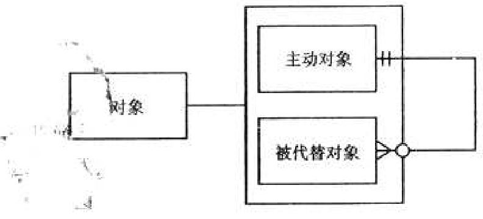  
图5-5被另一个对象替代的对象  

例：利用替代策略，对象JS777被标记为被替代对象，而对象JS123被标记为活动对象。任何发送到JS777的消息都被授权由JS123来处理。  

例：研究人员曾发现两种不同类型的肝炎：血液传染型肝炎和非A非B型肝炎。后来这两种肝炎被认为是同一类型的肝炎，并且被称为C型肝炎。这种情况可以通过用主动对象C型肝炎替代血液传染型肝炎和非A非B型肝炎，并且将它们联系起来的方式来描述。  

从概念上来说，复制并替换策略和替代策略在很大程度上是相同的。惟一的区别在于你可以看清楚最早附属于被替代对象的东西。以下这一点是重要的：如果医院在没有发现Smith先生是两种病的患者时就做了一世治疗的话，只有替代策略可以准确地反映已经发生过的事情。  

5.3.3本质/表象  

最后一种可以考惠的策略是本质/表象模型，如图5-6所示。对象保留了自已的大部分内容，但是它的背后还有另一个对象一对象本质。对象本质的存在仅仅是为了把各个相关的对象关联起来：它没有其它的属性。在这种策路中，是通过把多个对象同一个单独的对象本质连接起来而实现合并的。这就意味着当一些消息传递了更改信息时，对象必须知道它们的其它表象：而且在响应时会对它们加以考惠。  

  
图5-6对象本质和表象  

例：利用本质/表象策略，就产生了一个将IS123和JS777作为其表象的新的对象本质。  

例：这种模型并不能很好地适用于前面所举的肝炎的例子，因为血液传染型肝炎和非A非B型肝炎的概念已逐渐不再使用，而C型肝炎的概念已渐渐地被人们所接受。  

上面的讨论主要集中在合并对象上：然而，到后来可能又需要取消合并。比如，在将两个患者的记录合并后，医院可能会在几个月后发现他们的确是两个不同的患者。如果采用的是本质/表象策略的话，那么再将对象分离是很容易的事，因为它保留了原始对象。可以这样讲，如果在很长一段时间内都无法确定是否真的要进行对象合井的话，本质/表象策略是最好的一种策略。  

例：如果发现两个JohnSmith是完全不同的人，就必须消除把他们联系在一起的对象本质。  

# 5.4对象等价  

前面几节重点都放在闸述一个对象如何才能由不同的人用不同的方式来标识。而此处将着重讨论不同对象的相似性向题。例如，医学术语使用许多意义相近但程度不同的标准词汇来定义不同的临床情况。然而，重点就在于“程度不同”上。“意义相近但程度不同”的具体定义可以是非常准确的，但有时也不完全是这样。为了处理这种不精确性：人们为医学术语建立了不同的编码方案，这意味着有多个编码方案可供选择。  

我们可以选择其中一套编码方案作为自己的术语标识方案。这样一来，如果某个临床医生要描述一系列特定的生物现象，他就可以通过把编码方案当成是一种标识方案来标识这些生物现象。其他的临床医生也可以这样做。这样就便于信息的交流和传递，最起码是可以到编码方案粒度这一级。在这里，可能忽略一个重要的问题，即此时等价还没有被普遍认可。也就是说，有些团体可能会认为两个对象是相同的，而别的团体并不这么认为。图5-7的模型通过定义一个由某些团体所认同的等价来解决这个向题。一个团体只有在认同了该等价之后才可以使用它。  

  
图5-7对象之间的等价  

例：许多医生认为G型肝炎和GBC型肝炎是一种病，但这并没有被普遍认可。这时就可以用这两种病症之间的一个等价来表征。如果一个医生想要一个G型肝炎患者的清单，而且该医生是这种等价的认同者，那么那些GBC型肝炎惠者也会被列入其中。  

# 参考文献  

1.Martin.J.and J. Odell.Object-Oriented Methods:A Foundation Englewood Cliffs Nj:Prentice-Hall,1995  

# 第6章库存与账务  

在商业计算系统中，大多数程序都被设计用于跟踪企业的资金流动，也就是记录钱是怎样赚来的，又是怎样花掉的。而跟踪库存和账务的主要思想就是要记录钱和货物是如何一笔笔流动的。  

本章中的库存和账务模式就是因此面产生的。它们给出一个核心的概念集合，我们可以使用这些概念来作为资金核算、库存或资源管理的基础。这些模式并没有直接描述这些过程，而是描述建立这些过程的基本思想第7章介绍一个简单的例子，该例子使用这些思想来记录电话账目清单。  

在本章中，我使用一个简单的个人财务示例来解释库存和账务的基本思想。我所使用的术语有别于传统的财经账务术语，尽管它们大同小异。因为我想要建立一个更为抽象的模型，而这需要一些新的名词和术语。本章中模式的独特之处在于：它们展示了处理规则是如何被嵌人到账目系统中的。这种方法允许账目自行更新和管理，从而将一个传统的被动型账目记录系统转变成一个主动型账目记录系统，我们可以按照合适的方式，通过搭配账目清单来配置该系统。  

第一个模式是有关账目（参见6.1节）的。一个账目包含着有价值的东西一货物或者资金一它们只能按条目方式进行增加和删除。条目保存着账目的所有变更历史。当我们用一个账目来记录一个值的变更历史时，很重要的一条就是要确保不能丢失任何条目。事务（参见6.2节）把所有条目关联起来，提高了可审计性。在一个事务中，从一个账目上取下的条目必须存放到另一个账目上：条目不能被随意创建或销毁。  

存在两种事务：双腿事务一把一笔账从一个账目转移到另一个账目；多腿事务一一可以在多个账目中拥有条目，只要事务在总体上始终保持平衡。  

可以使用汇总账目（参见63节）把多个账目组合集中起来，汇总账目可把大多数针对单个账目的处理（报告行为）应用到成组账目上。有时我们需要生成一些不要求其保持平衡的账目条目，这时可以使用备注账目（参见64节）  

账目可以包含固定的规则，由这些规则来控制账目间的金额转移。我们可以使用记入规则（参见6.5节）来建立能互相更新并能反映业务规则的动态账目网络。为此，记人规则的实例要有自己的可执行方法，该需求又引出一个重要的建模概念一个体实例方法（参见6.6节）。个体实例方法可以用单个子类型、策略模式、内部的casc语句、解释程序和参数化方法的某种组合来实现。  

记入规则的执行模式（参见6.7节）描述触发记人规则的具体方式：一旦创建事务时触发：请求账目来处理相关规则；请求记人规则来触发：或者请求账目自动更新，从而向后链式融发其前驱。  

要在多个账目中使用记人规则，需要定义一种多个账目的记入规则（参见6.8节）。一种方式是使用知识级，即将记人规则定义在账目类型上另一种方式是将记人规则和汇总账自关联起来。  

在账务系统中，各种对象都需要提取账目条目和账目结算的子集，两者都需要一个选择条目（参见6.9节）的模式。在我们想从多值映射中获取对象选集的时候，这个模式就会派上用场。替代方案还有：返回整个集合并由用户自行选择，针对账目做一些额外的操作，或使用账目过滤器。  

我们可以使用账务实践模式（参见6.10节）把记人规则的巨大网络划分成若干的组。在长时间的计算中，我们经常需要返回头去了解为什么不同的事务会给出这样或那样的结果，此时我们需要用到条目来源模式（参见6.11节）%  

结算单和所得计算书（参见6.12节）用于区分现有资产账目和流动资产账目。不同的人对账自的看法是相近的：例如，对于我的银行账户，我和银行的看法就基本雷同。其中一个是另一个的对应账目（参见6.13节）。  

作为最终结果的模式非常抽象；而在实际应用中，一些特殊情形需要专门化的账目模型（参见6.14节）。这样的账目就通过子类型化通用的账务模式而得到。  

本章最后一个模式描述如何登记条自到多个账自（参见615节）在有不只一种报告条目轨迹的方式时，该模式就能派上用场。另外还有两种替代技术：使用备注条目或使用派生账目。当我们只想要账日的报告功能（不要结算和审计功能）时，我们可以选用派生账目来替代账务模式。  

这些模型是总结儿个项自中的想法而得到的。它们起初是我在为一个美国服务公司设计开发客户服务系统时想到的，而且我在为一个国际电话公司检查账务结构的过程中对它们做了进一步的发展和完善。最近，我在为一个美国制造企业开发付账系统时又一次对这些模型做了深人的完善。  

关键概念：账目 $\searrow$ 事务、条目、记人规则  

在很多领域，不仅强调要记录某个事物的当前值，而且还强调要记录影响该值的每次变化的具体细节。一个银行账目就需要记录每一次的存款和取款：而库存记录要记住每一次的物品出/人库情况。  

一个账目类似于一个数量属性，再加上一系列条目（数量属性的值每做一次改变，都会附加一个条目）（如图6-1所示）结余反映账目的当前值，是所有与账目相关的条目共同作用的结果。这并不意味着结余值在每一次被访问时都需要重新计算。结余的派生值可以被临时缓存，即便该缓存值对用户是不可见的。通过使用条目，用户可以查看一段时间内账目的变化情况以及存取的总量（参见6.9节）。数额的符号表示该条目属于存入还是取出。一个账目清单包含一段时间内账目上的所有存取条目。  

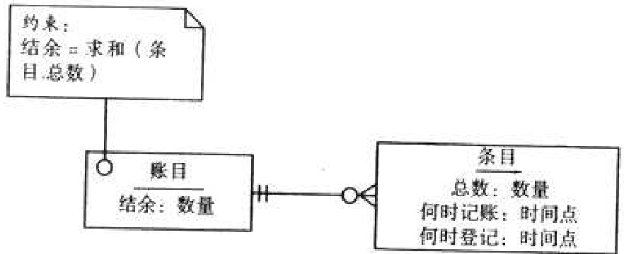  
图6-1账目和条目  

条目记录账目的每次改变。  

例：我从自己的户头上取出100美元。这可以用一个连接到我的账目的金额为一100美元的条目来表示。  

例：我从商店买了4令标准信纸。商店会用一个连接到标准信纸的数量为-4令的条目来表示。  

例：一月份我用了350KWH（千瓦小时）的电。这可以用一个连接到我家用电账目的数量为350KWH的条目来表示。  

建模原则：要记录一个值的变更历史，可以为这个值设立一个账目。  

计算结余的一种具体实现方式就是把条目集中起来形成一个数值集合。Smalltalk语言就有一个特殊操作collect来做这件事。这样做有一个危险，那就是collect操作总是把对象按原样收集到集合中：这样一来，在一个条目集合上运行collect就会产生一个数量集合：而集合是不允许有重复数值的，所以如果存在有相同金额的条目，就只会把一个条目的数额计算  

常采取的方式是使用允许重复的袋（bag）。在 $\mathrm{C++}$ 中，这个问题不太常见，因为在 $\mathrm{++}$ 中很少使用集合操作； $\mathbf{C++}$ 使用者可以使用一个没有这个间题的外部选代器[1]来解决这个问题。此外，为验证正误，在测试时所用的测试用例也要包含具有相同数额的条目（甚至是所有属性都相同的条目）  

图6-1表明，每个条目需要记录两个时间点：一个是办理时间，另一个是条目登记到账目的时间。这在需要追溯收费时尤为重要。办理费用在办理时间和登记时间之间可能会有所变化，所以这两个时间都是需要的。我们既需要知道事件的历史记录，也需要知道有关该历史记录的其它情况（参见153.1节）。时间点既要包含日期也要包含时间：很多应用只需要包含日期就足够了  

例：4月1日我在JaesCafe吃了顿饭，信用卡公司在4月4日收到付账通知。相关条目就要包含4月1日作为记账日期，而4月4日作为登记日期。  

6.2事务  

使用条目来协助记录账目的变更情况。这些变更通常包括把物品（钱或其它实物）从一个账自转移到另一个账目。当我从我的银行账目中取款的时候，我就在往我的钱包里面放钱或者支票。对于很多物品仅仅记录它们的来来去去还是不够的，还要记录它们来自哪里和去向哪里。  

如图6-2所示，事务明确地把取款条目和存款条目联系起来。双条目法反映一个基本的账务原理，就是钱（或其它我们要核算的东西）永远不能凭空生成和消失，它仅仅是从一个地方移到另一个地方。  

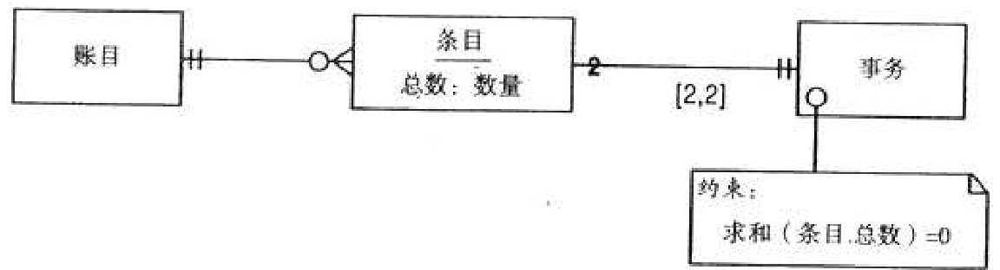  
图6-2带两个条目的事务  

例：我用信用卡购买机票，要支付给波士顿航空公司500美元。这是一个金额为500美元、从信用卡账目到波士顿航空公司账目的事务。稍后我将生成一个从我的支票到信用卡的事务来把信用卡的结算值恢复到零。  

例：芳香咖啡机制造公司（ACM）从纽约运送5吨阿拉伯穆哈咖啡到波士顿。这是一个数量为5吨、从纽约账目到波士顿账目的事务。  

在复杂的账务结构中，我们的目的是要使账目达到平衡，也就是说，在业务周期上的各点都要使结算值归零。通过守恒原理建立模型，我们很容易发现系统中的不守恒之处。虽然在使用账目的时候事务并不是必需的，但我倾向于多使用这一概念。  

建模原则：在使用账目时要遵守守恒原理：需要清算的物品不能凭空生成和消失，它仅仅是从一个地方转移到另一个地方。这使得发现和防止不守恒变得容易。  

# 多腿事务  

图6-2表明，每一个事务由一个取走和一个相应的存人动作组成。事实上，我们在一个事务中可以包含很多个取走和存人动作。比如，我可以从Megabank取走3000美元，又从TotalTelecommunications那里取走2000美元。然后决定把这两笔款都存人我的支票。我的银行账单将显示5000美元的存款。要注意到：即便有两个款项到达我的银行账户，但只会显示一个条目。这个事务可以表示成图6-3的多腿事务。从事务到条目的映射上限被提高。最重要的就是：所有条目要依照事务来达到总体平衡，对于各条目之间不需要是完全匹配的。这样的话，我就可以把我的银行账目状态建模成有三个条目的事务：[账日：支票账目，金额：5000美元][账目：Megabank，金额：3000美元][账目：TotaTelecommunications，金额：2000美元]。事务负责确保钱没有凭空产生和消失。  

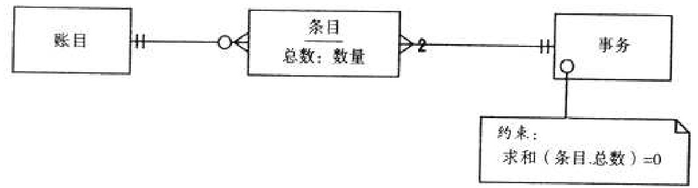  
图6-3多腿事务  

生成事务时，多腿事务模型比双腿事务模型更有弹性。  

例：芳香咖啡机制造公司（ACM）从纽约运走5吨爪哇咖啡，2吨运往波士顿，3吨运往华盛顿。这是单个事务，并带有三个条目：[账目：纽约，一5吨]、[账目：波士顿，2吨]、[账目：华盛顿，3吨]  

双腿模型是多腿模型的特例。在双腿模型中，事务只有两个条目。在  

有些应用中，双腿模型占主流，这种情况与图6-4中的模型类似。其它一些应用可能会有大量的多腿事务。因为多腿事务更加有弹性，所以我建议使用多腿事务。在多腿事务中通过一个特殊的创建操作可以很轻易地生成双腿事务，具有很强的方便性与适用性。本节的其余部分都假定使用多腿模型。  

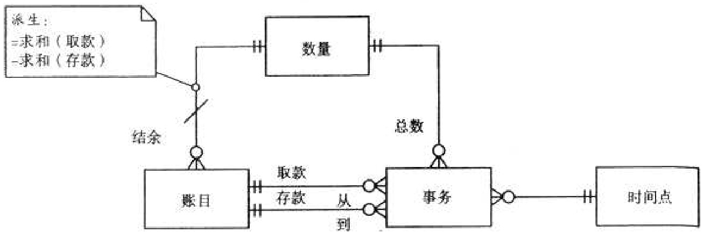  
图6-4不使用条目的双腿模型  

在所有使用双腿事务的地方都能见到这个模型。该图和图6-2具有相同的效能。但我还是乐意使用图6-2，因为可以更容易地将它转化为多腿事务。  

事务和条自之间的相互制约关系引出一个“先有鸡还是先有蛋”的向题。因为存在约束关系，所以如果不创建一个事务就不能生成一个条目。类似地，如果没有一个条目就不能创建一个事务，因为对事务有同样的约束。  

一种解决方法是：提供事务的一个创建操作，它使用局部定义的条目列表，或甚至是带有合适参数的数组列表。条目的创建操作被声明为私有，但可以在事务的创建中调用。事务的创建成为生成条目的惟一地方。显然，在这个创建操作的执行中，对象违背了约束。约束规则是：所有的公共操作必须以所有约束都得到满足作为结束[51。如果只有事务的创建例程被声明为公共，则这个规则还是可以被实施。  

6.3汇总账目  

在账目系统中，把账目组织在一起往往会有很大的用处。比如：我可能想把我的TotalTelecommunications和Megabank的账目组合成一个业务收人账目：类似地，我想把租金和食物放到我的个人花销账目中，把差旅费和办公费放到业务花费账目中。由细目账目和汇总账目所构成的简单层 次模型就可以支持这类结构，如图6-5所示。  

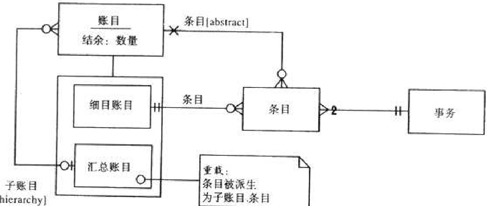  
图6-5汇总账目和细目账目  

一个汇总账目既可以由汇总账目组成，也可以由细目账目组成。这就形成一个以细目账目作为叶子的层次关系（组成模式[1]的例子）。汇总账目的条目是由子账目的条目递归地继承来的。  

利用该层次结构，可以把多个账目组合成汇总账目。同时强制规定：条目仅充许登记到细目账目中，而不能登记到汇总账目中。汇总账目仍然可以像细目账目一样进行处理，因为它们的条目是从组成它们的子账目的条目继承而来的。一个汇总项目的子账目中如有汇总账目，则它将在它的子账目中或是在子账目的子账目中递归地查找条目。这种条目映射的继承关系，可以充许我们在父类型层次上描述基于条目的结余属性或是其它操作和属性。  

例：我有一个有关航空旅行的汇总账目，它由Megabank和TotalTelecommunications的航空旅行细自账目组成。  

例：芳香咖啡机制造公司有一个爪哇咖啡的汇总账目，它由每个仓库的细目账目组成。因此，通过该汇总账目，可以算出爪哇咖啡的库存总量。  

注意：需要做一些标记来确保子账目间的层次关系。通过集合的基数还不足以实现这个约束。在这样的结构中，绝对不充许有循环的存在。  

汇总账目和细自账目的区分在账务中很常见，但并不是必须如此的。图6-6中的模型显示如何去除这种区分。其中，任何账目都可以有条目，所有的账目都可以放人层次结构中。这可以通过提供从账目到条目的两个映射来实现：一个映射用来表示一层中都有哪些条目，另一个映射可以把子账目的条目累积起来。第一个是可以更新的，第二个是继承来的，不可以更新，常用于结余、账目清单和图6-5模型中父类的其它特征。  

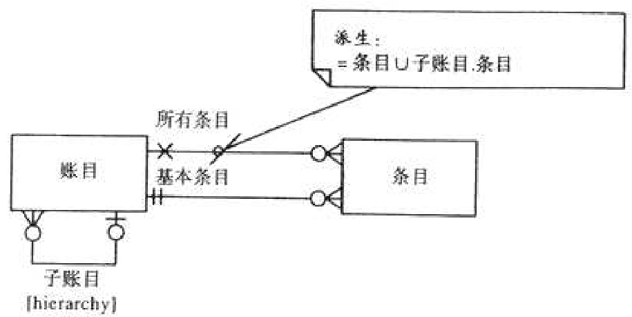  
图6-6不区分汇总账目和细目账目的账目层次  

我们可以使用这个模型把条目记入汇总账目中。  

至此，我们已经依照惯例介绍了账目要按层次结构来组织，并且条目要登记到账目中。我们将基于以上假设继续我们后面的话题，不过，在6.15节会介绍其它一些替代方案的可能性。  

6.4备注账目  

BenjaminFranklin曾经说过，“在这个世界上，除了死亡和征税，没什么事情是笃定会发生的。”我们无法消除交税的痛苦，但我发现如果能够在见到退税单时不产生惊讶，那么这种痛楚可以得到一定程度的缓解。我是这样做的，每当赚到钱时，我都把其中一部分归人我的税务账目：这样我就知道哪些钱才真正是我的，哪些钱是用来交税的。  

请注意，采取这种做法，“真正”属于我的钱不会被拿走。如果不交税的话，我也不必从经常性账户支付款项。此外，这里所讲的税务项目包括州税和联邦税。当真的需要交税（或做预算）时，我就会从自己的经常性账户中支取款项，打人到州税和联邦税的银行账户：同时，需要从我的税务账目中减去相同的数量。这样，正式账目（经常性账目、联邦税、州税）和税务账目间其实并没有款项流动。税务账目对我来讲就像是一个备忘录，提醒我该交多少税，因此称之为备注账目。  

一个备注账目中的钱并不是“真”钱。事实上，并不会在备注账目中存取真正的款项，这一点很重要。所以，在税款示例中，在我从收人账目取钱放人经常性账目的同时，我也会在税务备注账目上生成条目。备注账目成为账目的另外一种子类型，我还必须确保在备注账目和别的账目间不会产生款项移动。可以这样来实现，即在事务的结算约束中不包含备注账目。  

如果使用事务，我们要确保仅仅在账目间移动钱款，并且不能凭空生成或者销毁款项。这表明，在税务（备注）账目中生成条目时，在某处还要生成结算条目。因为很难看出哪个账目是该结算条目的宿主，所以会计师们通常会使用反账目。这样，税务账目就有了一个额外的反税务账目，它作为税务账目中所有存取条目的反面。该方式可以用于通常的模型，但也不必总是这样。如果结算检查约束忽略备注账目，那么条目单方面的违反约束也是充许的。一个反账目会被自动生成。这种方式表明：从事务到条目的映射的下界可以减少到1。  

例：每次我从客户那里拿到付款，我把它记为从客户收入账目到我的经常性账目的事务。我还把数量的一部分记入税款债务备注账目。当我交预计税款的时候，我就从我的经常性账目到联邦税款账目上生成一个事务。在这个事务中，我还要生成第三个条目以在我的税款债务账自上减少同样的数目。  

当然，如果我们不使用事务，我们就不会遇到结算问题，并可以放心地把条目记人。但是危险在于这么做可能会轻易地把“真”钱流人备注账目，甚至凭空消失。  

使用备注账目，我们可以将款项记人到税款债务账目上，但我还是要记着去做。由于我每次都是把收人条目的 $45\,\%$ 记人税款债务账目，因此计算机系统应该能为我自动做这些事情。  

这里需要的就是一个规则：规则检查特定的账目，当发现一个条目时，就生成另一个条目。图6-7表示一个这类规则的简单示例。记入规则通过指定一个账目作为触发器来描述。触发器账目中的任何条目都会生成一个新条目，新条目的值就是原来条目的值和乘数的积。  

  
图6-7有乘积因子的记人规则的简单结构  

对于在触发器账目中的每个条目，我们都把它与乘数的乘积结果值作为新条目记入到输出账目中。  

例：我的税款债务可以用一个记入规则来处理，收入账目是触发器，税款债务账目是输出账目，乘数是0.45  

标量乘积可用于记人规则的很多有用情况，但是过程很容易复杂化。考虑一个递增的收人所得税：最初的300英磅不征税，接下来的2500英磅 征收20%税，其余征收 $40\%$ 税。简单的标量乘积并不适用。我们想要记人规则执行任意多样的算法，这会带给我们最大限度的灵活性。  

要使记人规则具有这种灵活性，必须把计算连接到每个记人规则的实例，因为规则计算条目数量的方式不同。从概念上讲，这意味着每个记人规则的实例都有自己的计算方式，如图6-8所示。微妙的图符掩饰了一个重要问题。主流的对象系统允许因多态和继承而有不同的方法，但这是基于类的：不同类的对象方法有所不同。我们需要一个类的每个单独实例的方法都可以有所不同，这需要个体实例方法模式，这将在6.6节介绍。（我将在9.2节讨论类似的问题。）  

  
图6-8带有计算方法的记人规则可以为条目计算值  

每个记入规则的实份都有自己的计算方法。  

6.5.1可逆性  

记人规则的一个重要属性就是它们必定是可逆的。通常我们不能删除一个错误的条目，因为它要么是支付的一部分，要么出现在账目清单上。我们清除它的作用的惟一方法就是输人一个同样的但是相反的条目。这样，任何记人规则必须确保：两个相同但符号相反的条目放进了同一个触发器账目中，并且在进一步处理中恰好相互抵消。我们可以这样来测试：在程序中为记人规则插人这样相反的条目，并确保它们的输出是大小相等但符号相反。  

6.5.2不使用事务  

在一些账目中，几乎所有的事务都是从记人规则中产生出来的。输人账目被用来记录来自外部世界的初始条目。更深层的账目条目都由记入规则产生。由于无论是外部条目还是记人规则，所有条目都是可预测的，因此降低了不使用事务的风险。避免疏漏的责任就由系统的操作使用转变为记人规则的设计。如果我们不使用事务，那么记录删除原因并跟踪条目间的影响是很有用的。总的来说，我乐意用事务，因为这使得审计更为容易面且代价并不高。如果你不用事务，你仍然需要某种审计机制。  

# 6.6个体实例方法  

为了领域专家的方便，概念模型应该尽可能自然。我们应该尽可能减少对特定实现环境的依赖。计算机设计应该反映人的思想，而不是人的思想反映计算机设计。这个理念反映在图6-8中。在定义完这个概念模型以后，我们需要找到一个实现它的方式。这样问题就不再是“我们怎样在每个记人规则实例里进行计算”，而是变成“如何在实例上加上方法”。这便引出我们将在第14章讨论的转换方法。我们想得到几种方法来在不改变一个接口的情况下实现图6-9中的模型。这就引出基于模板的设计的重要原理：模型应该定义类的接口。我们在不改变接口的情况下，应该能够更换实现方式。  

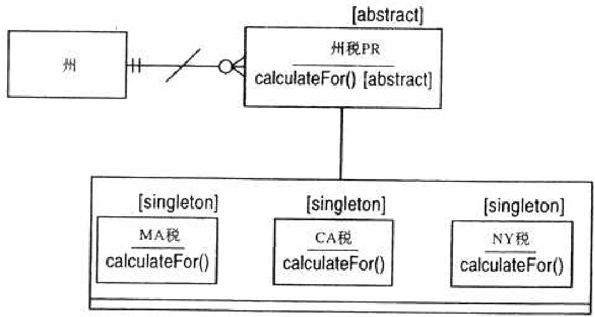  
图6-9使用singieton类实现个体实例方法  

6.6.1使用Singleton类实现  

变化行为的一种自然方式就是使用基于子类的多态性操作。这样做的最简单方式就是对于记人规则的每个实例都分成子类，这样就创建了很多个Singleton类。这里所有的记人规则的标准方法和属性都在记人规则中，子类仅仅实现不同的calculateFor方法。  

这样做的主要问题就是子类有点太人工化。它们的存在仅仅是因为我们不能用实例改变calculateValue。这种人工性使这种方式并不完美。另三个问题是这种方式产生很多的类，这也会使一些人感到很不舒服。因为这些类很小并被加以限制，所以类不会表现出特别大的问题。计算方法的共享可以通过调整类的继承来实现。但是，记人规则的过程操作也可能受害于多态性，而且两个多态性也不一定能匹配。  

6.6.2使用策略模式实现  

咋一看，图6-10所示的策略模式[1]实现和使用Singleton类实现很相似。主要的不同点就是，图6-10是在一个独立的方法对象（或称策略对象）上进行子类型化。记人规则变简单了，因为整个方法选择问题不存在了。记人规则仅知道它能用一个方法对象来进行计算。  

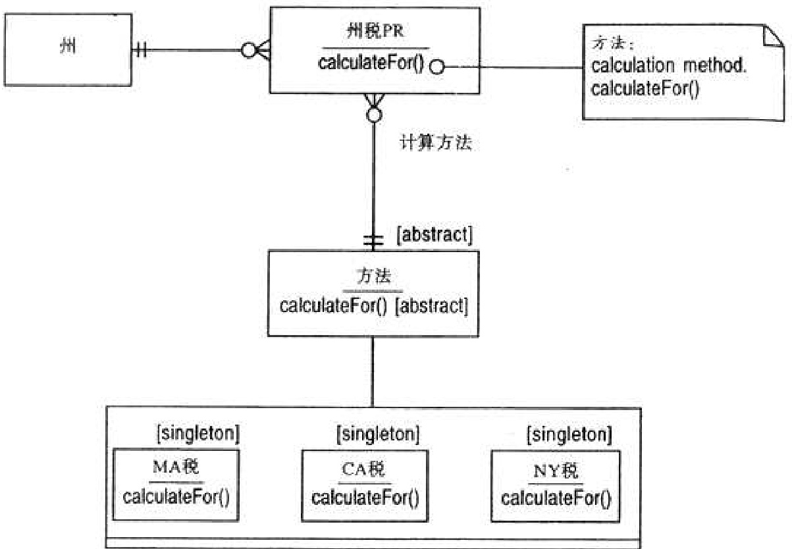  
图6-10使用策略模式1]实现个体实例方法  

图6-11显示发生在示例中的相互作用。一个账目请求一个处理规则来处理它。处理规则得到所有没被这个规则处理过的条目（参见6.7.2节）对每个这样的条目，它都将调用自己的方法来计算新条目的值。方法可能要确定一些问题：例如，税率常常依照结婚与否而有浮动。把结果传回记人规则，记人规则就会构造新的条目。  

应该强调的是：从函数设计（或从面向对象方法）的角度说，方法对象不是一个“自由子程序”。方法被封装在记人规则中，只有记人规则能够引用这个方法。  

记人规则的方法可以在两个对象间共享。这个方法的一个实例就是统一税率方法，统一税率方法应用某种标准折扣税率。如果几个类有同样的方法、仅仅是税率不同的话，可以设计一个方法，它向记人规则询问统一税率，否则的话，就允许过程重用。这可以看成是方法对象和参数化方法（参见6.6.4节）实现的折衷。  

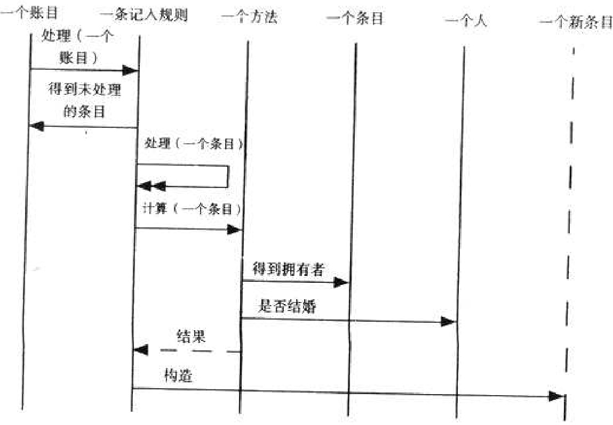  
图6-11使用策略模式的交互图  

方法通过请求的条目来得到它所需要的所有信息。  

这种方式在Smalltalk中的一个变体就是使用块作为方法。这样，我们不再需要新的方法类，也不需要方法类的子类。块易于使用但难于调试：如果在块内代码中出现错误将很难跟踪出现的情况。如果块还算简单，这种方式能起到很好的作用。  

6.6.3使用内部case语句实现  

面对生成子类仅仅是为了处理一个多态方法这样一个情况，我们可能会疑惑，我们为什么应该如此大费周张。我们可以为记人规则定义一些私有操作：compute Federal Tax、computeMassTax、compute Sales Com misi on 等。如图6-12所示，记人规则中只要一个包含简单case语句的computeFor函数，依照接受实例来决定使用哪个私有方法。  

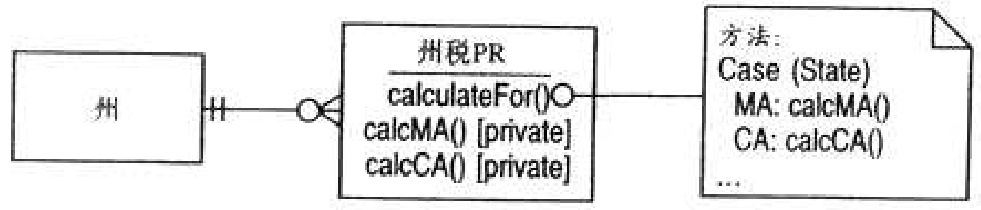  
图6-12使用内部case语句实现个体实例模型  

只要把case语句封装在记入规则中，就不算是违反面向对象的原理，  

对象的设计者们一想到像这样使用case语句就被吓跑了，但在这种情况中有很多东西值得一提。改动这个实现就意味着要加一个私有操作和一个case分支。这与使用策略模式或singleton类实现方式的新子类相比，区别还不是很大。如果类中方法数量太多，那么我们将有一个很大但还算简单的case语句，或是一大堆子类。要么就是管理一堆singleton类，要么就是每加一条记人规则就要改写case语句，这只是一个权衡问题。  

6.6.4使用参数化方法实现  

参数化方法策略在记人规则中使用一个方法，根据记人规则或相关类的属性的不同来处理不同的行为。例如，如果所有的条目都是统一税率的，那么记人规则就可以包含这个税率，只要再有一个方法按这个税率扣除就行了，如图6-13。如果一些记人规则对于单身的人和结婚的人有不同的百分比，那么记人规则里再加入单身率和结婚率，然后可以询问婚姻状况并在该方法中选择合适的百分率。  

如果计算方式的所有变化都可以通过简单修改几个参数来实现，则这个策略很起作用。这种情况下，我们就这么建模。如果情况更加复杂，就需要个体实例方法。这是一个很有潜力的实现手段，因为在有些情况下，我们可以把参数化方法和其它技术结合使用。  

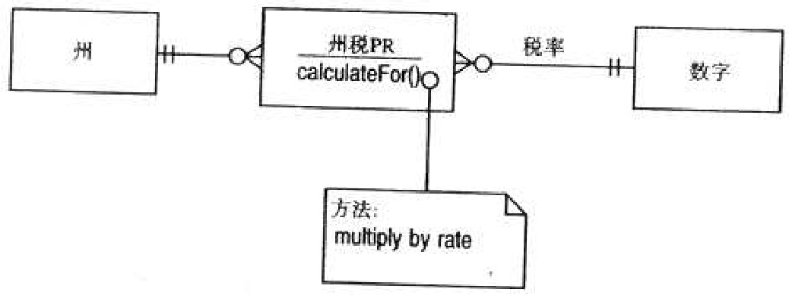  
图6-13使用参数化的记入规则  

6.6.5使用解释器实现  

如果类的方法很简单，我们就可以把方法看作简单语言中的字符串，再为之建立一个解释器。每个方法实例都有一个字符串，方法类能够解释这个字符串（或者使用解释器模式[1]）  

这种实现可以很好地适用于来用简单公式的方法，这些方法使用数学运算符、括号和几个简单过程。如果语言简单，建立解释器并不难。惟一的限制就是语义能表述些什么。所有的实现方式都能够很好工作，并能够很好隐藏在操作中。如果可能，  

我会使用参数化方法。我的下一个选择是使用参数化方法和一种其它模式的结合，看能否发现一个混合方式，这个方式仅使用几个变化的方法处理大的变化，并使用较多的参数处理小的变化。如果仅有几个变化的方法，那么singleton方式和内部case语句都能工作得很好。如果有很多变化，那么使用策略模式最好。总之，策略模式永远不会比用singleton方式和内部case语句差太多，但可能咋一看觉得稍稍有点难理解。如果类的方法能用简单语言（比如数学公式）来表述，那么使用解释器是个很好的想法。随着“四人帮模式的广泛使用，策略模式和参数化方法的结合将成为主要的选择。  

以上四种策略显示处理个体实例方法问题的途径。我们说图6-8中画的模型是特定的分析声明，而设计者可以根据实现条件选择使用哪个策略。对于每个策略，只要有一个公共接口存在，就可以采用上面的方案。一个分析模型定义一个可以有多种方式实现的接口，这个原理是使用设计模板的开发方式的基础。  

很多建模者乐意使用问题建模的别的方法，而不使用图 $6.8_{\mathrm{\O}}$ 他们可能乐意使用接近于其它策略的表述。如果在同一个接口下把实现替换掉，他们仍可以把分析和实现分开。其他的建模者使用与实现相同的模式。这种情况下，他们牺牲实现的独立性以换取分析模型和实现的更好吻合。  

对分析和设计进行精确划分是很困难的。正如各种类的组合就可以满足特定的软件接口一样，我们对同一情况进行概念建模时也可以使用多种类型的结合。类型的选择会影响到类的选择。主要影响是，类型的选择就 定义类的接口，但是接口下面的实现不必与概念模型一致。  

# 记入规则的执行  

至此，我们已经讨论如何构造记人规则和记人规则在被触发或告知执行后如何反应。我们在这里可以回顾一些记人规则的触发策略。记人规则应该被设计为有多种触发方式，这是我要强调的第一点。尽可能把记人规则和其触发策略分开，以减少这些机制的结合。  

# 急切触发  

在这种方式中，触发账目中一旦生成合适的条目就立即触发记人规则。我们可以有两种方式这样做。第一种方式是：将职责放人事务或条目的创建方法中，如图6-14所示。创建事务可以导致几个条目被记人账日。条目的每次记人都会搜索记人规则，记人规则使用账目作为触发器。这时每条记人规则都被触发。  

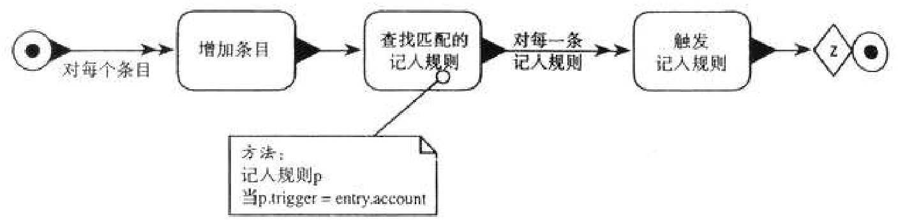  
图6-14显示构造事务能触发记人规则的事件图  

记入规则的查找和触发可以在事务构造时也可以在单个条目构造时进行，如图 $645_{\mathrm{0}}$ 后者更好一些。  

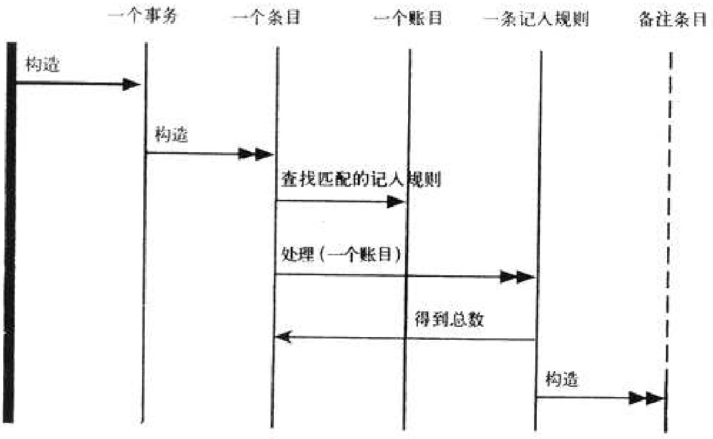  
图6-15在条目构造中触发记人规则的交互图  

第二种方法是：使记人规则成为触发器账目的观察者[1]。当生成记人规则时，记人规则在触发器账目中登记。当一个条目被放人账目中时，账目对所有的观察者广播这个事件。记人规则便检查账目：发现新的条目。然后就在备注账目中生成合适的新条目。这个方案的优点是事务不必再激活记人规则。观察者是一个很有用的机制，但只有当能从观察者看到被观察者的时候我才使用这个机制，尤其是观察者与被观察者处于不同的包中。在不是必要的时候，我并不乐意使用观察者，因为许多这样的程序难于调试。我也不想把记人规则放人独立的包中，因此也就不需要使用观察者  

基于账目的触发把触发的职责从事务移到了账目。条目可以被添加到账目上，而不触发任何记入规则。在有些时候，如图6-16，账目被告知处理自己并接着触发其上次处理自身以来新加人的所有条目的向外的记人规则。  

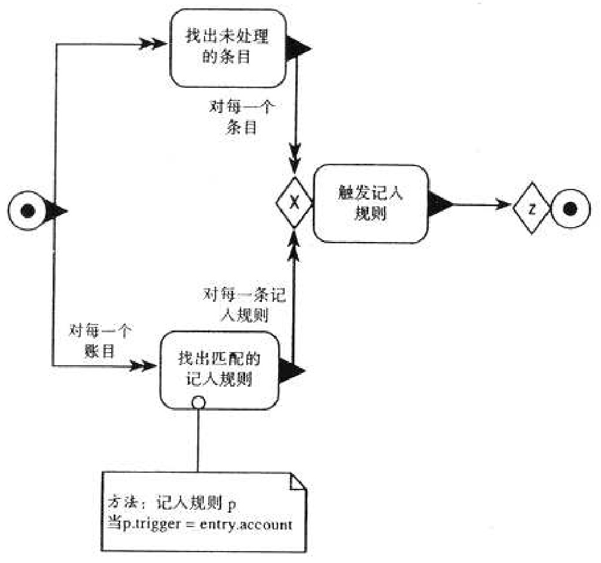  
图6-16账目的循环触发  

图中X记号表示对于每条记入规则和未处理条目的组合执行触发记入规则的操作。  

基于账目的触发需要账目跟踪未处理的条目。它可以通过维护一个独立的未处理条目集合（保存条目列表并跟踪最后一个要处理的条目）来达到自的，或者通过记录上次处理的时间点以便能返回这个时间点之后登记的条目（使用登记时间属性）来达到目的。  

基于账目的触发可被用于循环的账务系统，这种账务系统中，账每天处理一次。这种情况要注意的是账目要以正确的顺序处理。在可能受到向外的处理规则影响之前，账目必须被处理。通过查看处理规则可以自动地决定这些依赖关系。  

6.7.3基于记入规则的触发  

在基于记人规则的触发中，利用外部代理明确告知记人规则开始执行。这个代理将查看输人并找出新条目。这样，基于记人规则的触发和基于账目的触发很相似，有很多一样的优点和缺点。主要的不同是：既然账目可以有很多记人规则，那决定哪些条目未被处理的责任就由账目转到了条日。这通常会使得问题更复杂，所以我愿意使用基于账目的触发。  

6.7.4向后链式触发  

向后链式触发是基于账目触发的另一种形式：账目自己并不处理，而是让它们依赖的账目来处理。这样我们就能查出任何账目的最新状态。  

我们可以从账目检查自己的条目开始处理，如图6-17所示。这个账目先自我更新，然后使用记人规则来决定哪些账目是以自己为输出的记人规则的触发器。这些账目要自我更新，这是一个选代过程，如图6-18和图 $6\!-\!19_{v}$ 这样，请求最后一个账日进行处理就可以完成整个账目图的更新。  

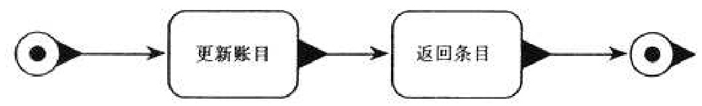  
图6-17用向后链式触发向细目账目请求它的条目  

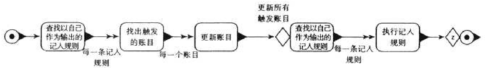  
图6-18使账目更新的方法对于处理账目中的每一个输入账目都要递归地调用账目更新操作。  

6.7.5触发手段的比较  

选择触发方法的核心因素是何时要执行记人规则（实现决策），以及何时要捕获错误。急切触发使我们可以尽早发现错误。这就意味我们可以有更多的时间查出出错的原因。这也要求我们在生成条目的时候要做全部计算。在何时进行计算上，基于账目的触发和向后链式触发给我们更多的灵活性。如果我们成批处理账目，可以把条目从文件中全部读人，然后在休闲时间（比如夜晚）触发记人规则。触发得越早，就越早发现错误。  

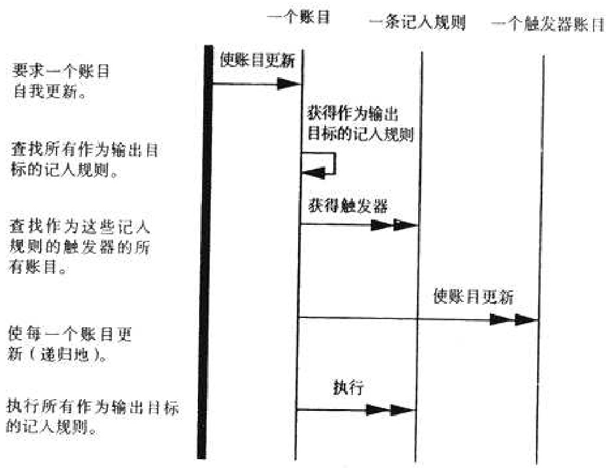  
图6-19基于账目的触发中进行账目更新的交互图  

在基于账目的触发和向后链式触发中做出选择，实质就是选择我们是否乐意处理建立向后链式触发时产生的额外复杂问题。向后链式触发比基于账目的触发更难于建立，但是一旦建立就很容易使用。所以，在简单的账目结构中，我使用基于账目的触发：而在复杂的账日中，我使用向后链式触发。总之，我不愿意使用急切触发，因为它没有什么灵活性。通过确保在加人条目时（不是在生成条目时）发记人规则，一样可以得到急切触发带来的所有好处。尽管这是额外的，但的确让我在不希望这样做的时候可以不这样做。急切触发没有提供这样的选择。但如果我能有足够的处理能力，而让记人规则不会引人任何代价，这就没什么区别了。  

你可以混和使用触发方式。收人账目在进人两层财产账目中可能使用急切触发，而在其余部分可能使用向后链式触发。但是，使用多种触发方案将会使系统更加复杂，所以我一般不会无缘无故地混和使用这些触发方式。  

这类方式还算是新的，而且人们还在探索各种触发方案中固有的折衷方式。这是一个多变化的领域，重要的是要保留一点灵活性，以便在观察系统运行时改变触发方案。  

至此，我介绍了自己的示例和我自己的账目表。我们需要进行一些扩展以便能适合更多人。我们要记人规则是一致的，这样就可以使用一个联邦税记人规则来为所有人确定联邦税债务。  

经过这个扩展，不再需要操作单个账目的记人规则。每个雇员都有惟一的账目，而联邦税债务记人规则应该实现为所有雇员服务。我们不希望必须为每个雇员实现一个独立的记人规则。  

有两种方式可以这样做。第一种是使用知识级和操作级（参见2.5节）的概念。我们在知识级设置记人规则并连接到账目类型上，如图6-20所示这样我们就有费用收人账目、税前收人账目、净收人账目等。账目里的条目检查自己账目类型上的记人规则，在上面讨论的各表示中加人间接级。  

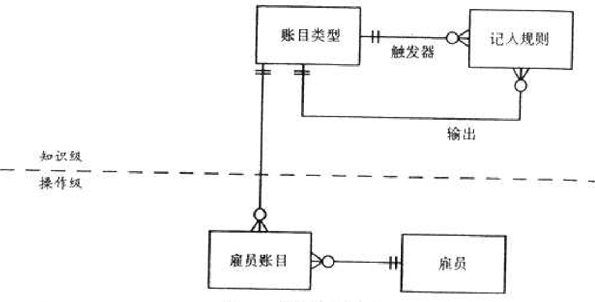  
图6-20使用账目类型  

这里介绍可以在其上定义记入规则的知识级。  

例：所有的雇员每工作18天就增加-一天假期。这可以表示为 $-$ 条记入规则，它的触发器是账目类型“工作天数”，它的输出是账目类型“附加的假期”。这个方法保证假期的账目结算是工作账目结算的1/18，雇员账目每次被触发的时候，它就依照触发类型，查找定义在账目类型中的记入规则。  

知识级和操作级的划分，虽然很吸引人，但不是处理这种状况的惟一办法。另一种方式就是使用汇总账目。在条目加人汇总账目的子账目（或是汇总账目本身，如果汇总账目记人是允许的）时，定义在汇总账目里的记人规则被触发。输出账目可以类似地被定义在汇总账目中，这可能导致在合适的子账目中生成条目。  

例：这个示例包含工作天数汇总账目和附加的假期账目。记入规则和上例一样。要检查的是汇总账目，而不是为记入规则检查账目类型。  

这两个方式的选择取决于账目和账目类型的区分程度。如果所有的记人规则都被定义在账目类型上，而条目在账目上产生，那么知识级和操作级的划分就是合理的。但有时情况也并非如此。条目可能在更一般的级上生成，用来表明公司的一般费用（图6-6的模型）。类似地，记人规则也可能依照每个付款而不同：比如支持购车贷款的减少就需要这样。这种情况还是不要做区分的好。  

这里没有通用的正确方案。在任何给定的情况中都有必要看看哪种模型更好。关键因素就是供选择的模型中账目和账目类型的区分程度。  

无论哪种方式，记人规则都需要决定怎样输出正确的条目。在上面讨论的很多例子中，记人规则仅查找同 $\longrightarrow$ 雇员的账目作为触发条目。也可能有更复杂的情况。想像这样一种情况，给初级顾问的费用条目将引发费用的一部分被记人顾问经理的备注账目。这里需要通知记人规则如何才能找到那位幸运的经理。  

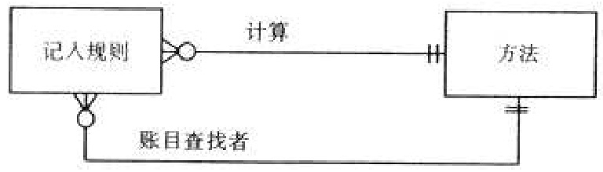  
图6-21使用账日查找方法  

使用分开的方法来查找输出账目和计算事务的值。  

一种处理方式就是提供第二个方法来查找合适的输出账目，如图6-21所示。这个方法向源条目请求其雇员，然后再通过雇员找到经理。这就提供了最大程度的灵活性，但需要第二个方法对象，而且要像66节介绍的那样实现这个方法对象。  

这就暗示另一个问题。在通常的记人规则中，并非所有的雇员都有资格触发记人规则。例如，记人规则可被设置为处理州税。那么伊利诺伊州税收的记人规则就只有在雇员是伊利诺伊州的居民时才能被触发。这就引 出第三个方法，它用于表述资格条件，如图6-22和图6-23所示。  

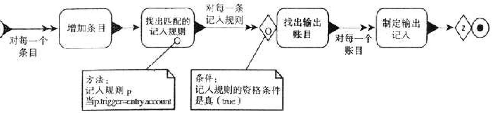  
图6-22在图6-14中加人账目查找者和资格条件的事件图  

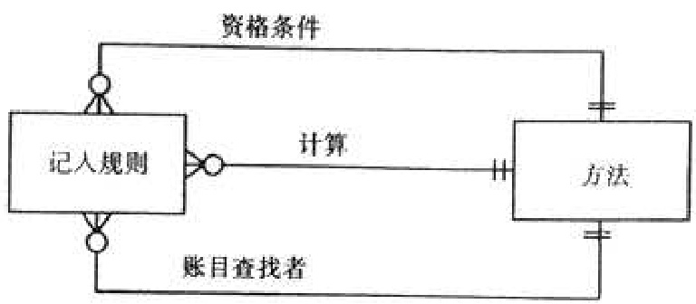  
图6-23在上面的规则中加人资格条件  

6.9选择条目  

在很多情况下，记人规则需要在触发器账目的条目中选择一个子集。比如，可能要查看从某个归档日期后的所有条目（如7月所有条目的结算）或是危险货品的条目（用条目的一个子类型表示）有三种方式实现这类选择：把所有的条目取出并选择，提供针对具体选择的方法，使用过滤器。  

第一个技术是最简单的：账目返回所有的条目，客户处理这个集合以选择需要的条目。这种方式在账目上不需要额外的行为，而是把所有的事情交给客户。如果有很多客户都需要进行类似的选择，就会有很多重复。如果存在很多个条目，把集合输出也是很大的开销，尤其在需要复制集合的时候。记住，账目永远也不要把自己存储条目的方式未加保护的输出（参见14.1节）使用这种带条目的方式也意味着由客户负责条目的统计和结算。  

如果很多客户都在请求类似的集合，比如某段时间的条目，那么可以在账目上加上一个额外的行为来满足这个需要（比如entriesChargedDuring（TimePeriod））这样有个好处就是客户省去了重复遍历同一个集合的麻烦。如果加人一个处理某段时间上的结算的方法（比如balanceChargedDuring（TimePeriod）），那么客户就可以更省力。这种解决方案带来的问题是：如果有很多集合，那么账目的接口会变得很大。  

过滤器（参见9.2节）是封装了查询的对象。使用这个模式将导致账目过滤器。账目过滤器包含多种用来设置查询条件的操作。一旦设置了过 滤器，就可以应用在账目上实施过滤，如图6-24所示。账目使用过滤器来选择条目的子集，方法是概念性地采用过滤器的islncluded方法逐个地检查条目并进行测试。它还可以使用有关条目存储的私有知识来优化这个过程。通过这个方式，账目可以使用entriesUsing（AccountFilter）方法来支持大多数的条目选择，使用balanceUsing（anAccountFilter）方法来提供相应的结算。注意：如果条目的子类型有额外的特性作为选择的依据，那么每个条目类型就需要过滤器的子类型。  

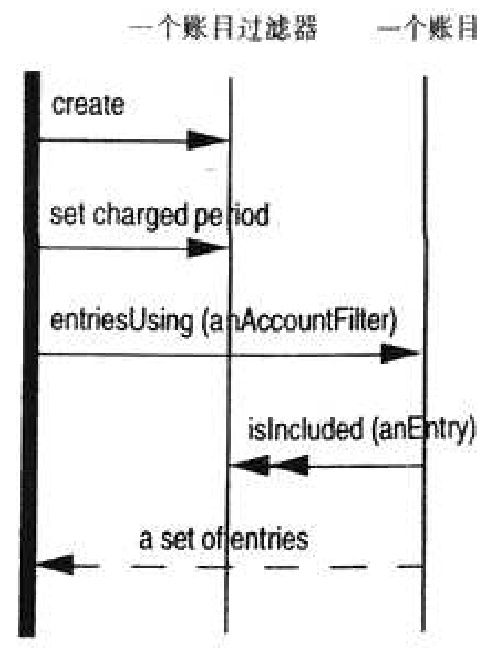  
图6-24使用账目过滤器的交互图  

使用多值关联时，我返回所有的对象，并留给客户自己选择。如果有几个常用的选择方式，我愿意使用附加行为，但也仅限于有少数几个行为。如果某个选择方式导致太多的重复以返回所有对象，还要附加太多的行为的话，我就使用过滤器。设置和维护过滤器的确需要额外的工作，所以我只在真正需要的时候使用过滤器。这种需要经常在账目和条目中出现。  

在我们遇到有很多记人规则的较大的账目网络时，网络可能很大并难于应付。在这种情况里，我们需要用某种方式把网络分成一个个的部分。考虑一个使用账目清单的例子。我们对各类客户使用不同的记账程序。这可以表示为一个账目网络。每种客户类型有不同的规则，可以使用稍微不同的账目网络来处理。  

一种特殊的账日网络是一个账务实践。从概念上讲，一个账务实践只是一个记人规则的集合，如图6-25所示。基本思想就是，为每个客户分配一个账务实践来处理账目清单。  

  
图6-25账务实践  

这些账务实践被用于对记入规则进行逻辑分组。  

例：电力部门把居民用户分为常规类和生命线类。生命线类指的是该州认为需要最低收费等级的用户。常规用户依照居住区域不同被分为3个等级。这可由4个账务实践处理：一个给生命线用户，其余3个分别给那3个等级的常规用户。  

例：ACM有很多工会工人，每个工会都协商不同的待遇。ACM对每个工会都有一个“薪水实践。  

同一个记人规则可以存在于不只一个实践中。在实践间需要类似行为的时候经常出现这类情况。我们需要区分以下这两种情况：从一个实践中拷贝规则（导致两条同样的规则），在多个实践中使用同一条规则。在多个实践中使用同一条规则就意味着：当规则改变的时候，所有使用它的实践也跟着改变。拷贝规则意味着一个拷贝的改变不会导致其它拷贝的改变。  

账务实践被分配给用户对象，这样每个用户都有一个账务实践。因此，每个电力部门的用户或是公司雇员都有一个特定的账务实践。这种分配可以手工完成，或是由规则来决定。  

例：在ACM，薪水实践依照工人所属工会的不同分配给工人。  

如果不使用账务实践，你还可以使用能够依照雇员某个属性把条目分类的记人规则。如果不为每个工会都分配实践，你也可以仅使用一个实践。第一条记人规则查看条目所在工会，并在相应的工会账目里生成条目（参见7.6节这类分离记人规则的示例）  

如果问题复杂，我会使用分离的实践，只要我们能在某段时间内把实践分配给用户。任何在条目到条目的基础上进行改变的划分（比如在7.6节里面夜晚/白天的划分），都必须有记人规则来处理。如果一个用户改变了账务实践，我们可以使用历史映射来跟踪这些改变（参见15.3节）。  

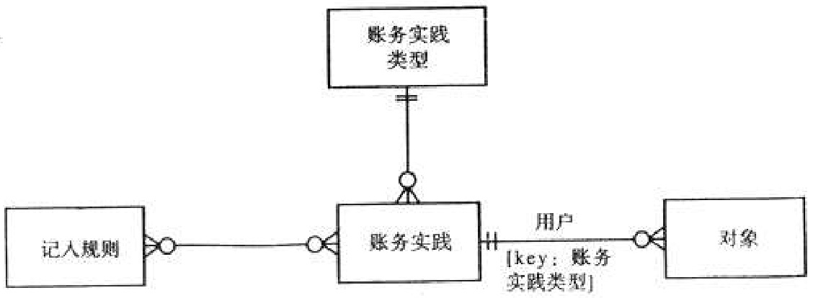  
图6-26账务实践类型  

在比较大的账目网络里，我们定义一个账务实践的配置文件，配置依照每个使用它的对象而不同。  

当处理过程的不同阶段具有在逻辑上分离的多组记人规则的时候，我们可以把规则划分为不同的实践类型，依照每个类型给用户分配一个实践。在图6-26中，账务实践的用户通常可以是任何对象。当然，在特定的模型中，用户可以是客户、雇员等。每个用户有相应的一类账务实践，这个约束条件可以用带键值的映射来实现（参见15.2节）  

例：一个应用有几个为居民用户记费的实践，但所有的居民用户都按同样的方式交税。处理这个情况时，我们可以使用分开的收费实践和税收实践。所有的居民用户有一样的税收实践，即便他们有不同的收费实践。  

最后，我们可以得到一个合理的结论，就是把账务实践和记人规则作为同一组成模式[1]的部分来处理。这也允许有很多级别的实践组合。到目前为止，我也没发现这很有必要，所以我也没进一步研究。  

6.11条目来源  

有时，知道为什么一个条目以某个形态存在是很重要的。例如：如果一个用户查询一个特定的条目，当前的模型能给我们很多关于这个条日生成的信息。我们通过查看其它条目的日期就可以决定当时账目所处的状态。我们还能确定哪条记人规则计算了该条目。  

图6-27所示的模型可以处理这样的客户需求，它可以得到每个事务以便记住是由哪条记录产生的这个事务，还能记住哪些条目作为事务的输人（如果你没有使用事务，那么关联就是条目到条目的）  

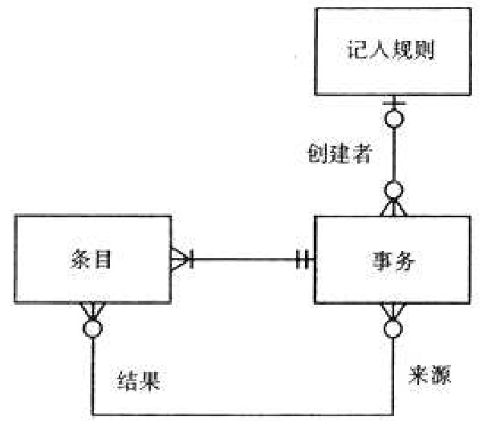  
图6-27事务的来源  

这里记录了每个条目双方向的计算。  

例：我给ACM做些工作并得到2000美元的报酬，我把它记为一个从费用收入账目到经常性账户的事务。我的记入规则在我的税款债务账目里产生一个单独的事务。这个事务的创建者是45%的记入规则，这个事务的来源包括从费用收入账目里取款。  

使用这个模式，我们可以在账目结构中形成条目和事务链。每个条目可以递归地使用来源和结果间的映射来确认原因和效果。  

建模原则：为了确认计算是如何进行的，把计算的结果表示成对象，由它来记住是由哪个计算产生的结果以及计算所使用的输入值是什么。  

# 6.12结算单和所得计算书  

在使用账目来描述一个系统时，区分结算单和所得计算书账目是很有用的，如图6-28所示。我的经常性账目是资产账目，我的信用卡账目是债务账目。这样，它们反映了某段时间内我有多少钱（或在信用卡里表示我没有）这些都在我的结算单上。收人和花费账目反映了我的钱从哪里来以及花到哪里去。我有一个收人账目记录老板给我的工资，另一个收人账目记录存款利息，一个花费账目记录旅游花费，还有为购买食品所设立的花费账目等。我的收人与花费的结算账目并不能反映我目前有多少钱，仅仅反应我的收人的来源与花费。  

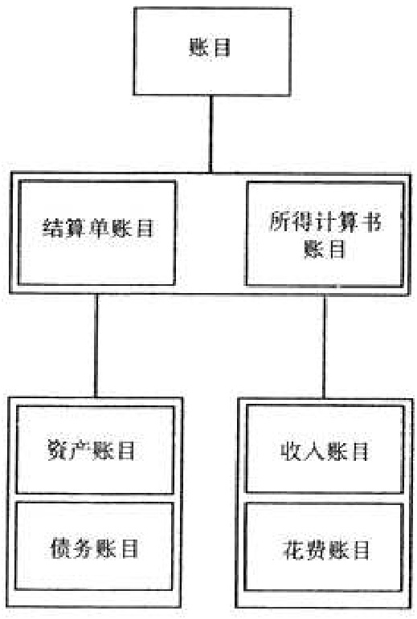  
图6-28资产、收人、花费账目  

这些是在财务账目中常见的账目。即便在别处，这些概念也是有用的，用来区分它们持有的东西和它们来源去处的分类。  

账目通常用在这样的模式里，在收入账目里产生各个条目，条目被传  

递到几个资产账目，然后消失在花费账目里。系统保存的资金被存放在特定的资产账目里，但很多资产账目仅仅用于定期结算。债务账目儿乎总是被用来在今后某个时间进行结算（它也可能在今后用于长期债务，比如抵押）。  

例：我用信用卡从波士顿航空公司订购了一张机票。我的信用卡账目就是一个债务账目，波士顿航空公司账目是一个花费账目。这是我来划分的，我是信用卡账目的拥有者（这是我的债务账目）  

例：ACM从印度尼西亚咖啡进口商那里购买了3吨爪哇咖啡。ACM有一个印度尼西亚咖啡进口商的收入账目，记录从印度尼西亚咖啡进口商转移3吨爪哇咖啡到ACM的纽约账目。纽约账自是一个资产账目，由ACM拥有。  

在此，我可以简要解释一下我为什么不用术语“借方”和“贷方”。这些是众所周知的账目术语，但是我没用它们，而是使用“从哪”“到哪”“取款”和“存款”。原因是术语“借方”和“贷方”不能表达同“取款”和“存款”一致的含义。对于所得计算书账目，贷方增加账目，面借方减少账目，这样对于外行是容易理解的。对于结算单账目，借方增加资产（就是他们存人资产），而贷方减少资产。对于没有会计知识的人来说可能有些奇怪，但这的确是通常的账目习惯。所以我不用术语“借方”和“贷方”，部分是因为它们可能会把没有会计知识的人搞糊涂，部分是因为我们在讨论一个更抽象的模型，而非一般的金融财务问题。  

收人和花费账目是外在的一钱还不是我的一一只是我用来分类的账目。银行对账目的观点表明了这点。在我的个人账目系统中，我有一个资产的经常性账目。在银行的账目系统中也有一个非常类似的账目。银行是银行账目的归类者，但我在里面有资产。我们可以把银行系统中的这个账目想成和我的账目系统中的那个账目一样，但这不能起作用。在3月1日（这是我取款的那天）ATM可能为我登记一个取款条目。银行在3月2日进行同样的取款登记，因为这是银行的第二个工作日。这两个账目指向同一个资产，但是它们不同，因为它们的条目不同。最好试着把它们看作对应账目。对应账目在某种程度要匹配，并且通常可以在某个时间点相互消解。比如在我的账本（即我的账目）和银行的账本（即银行的账目）进行匹配的时候。这个消解过程要精确，但也可能留有不严密之处，比如日期上可能稍有不同。  

图6-29表示这种情况。只有结算账目才有拥有者：所得计算书账目没有资产，所以就没有拥有者的问题。所有的账目都有分类器来指示谁生成  

属性：对称性和传递性[3]。首先是对称性，如果账目x是账目y的对应者，明：如果账目y是账目x的一个对应者，而账目z又是账目y的一个对应者，那么账目是账目 $x$ 的一个对应者。  

  
图6-29对应账目  

6.14专门化的账目模型  

我已经给出多个示例来表明：这个模型既可以被用作财务账目的基础，也可以被用作库存跟踪的基础。使用账目模型，通常通过子类型化来提供特定域的信息。例如，考虑库存管理一一个很适用账目的问题。我们对每个货物和地点的组合都形成一个账目（给它一个非财务名称，比如财产）。这样，如果我们在伦敦、巴黎和阿姆斯特丹之间跟踪Macallans、Talisker和Laphroig威士忌的销售情况，我们就需要9个财产（资产账目，比如伦敦-Macallans、伦敦-Talisker、巴黎-Talisker等）。无论什么时候，我们把货物从一个位置移动到另一个位置，我们就创建一个传输（事务）来处理这个移动。因为涉及钱的问题，所以事务要进行结算。另外，这类对象必须在整个过程中保持不变。图6-30表示这个领域对账目模型的扩展。  

用这种方式跟踪订单（包括收人和支出）也很有作用。每个供应商有一个收人账目，如果供应商的位置重要的话，可能还不只一个。类似地，每个客户有一个支出账目。我们可以在两个方向上跟踪订单：我们充许传输的子类型，或是预定的或是实际的，或者我们为订单提供另一个财产的集合，这样我们会有如伦敦-Talisker-Ordered和伦敦-Taliskcr-Actual这样的财产。当生成订单的时候，我们生成一个从供应商的预定财产到交付目的地的预定财产的传输。订单被提交后，我们就在我们的地点上生成从预定财产到实际财产的传输。这和金融书上使用的接收账目是--样的。  

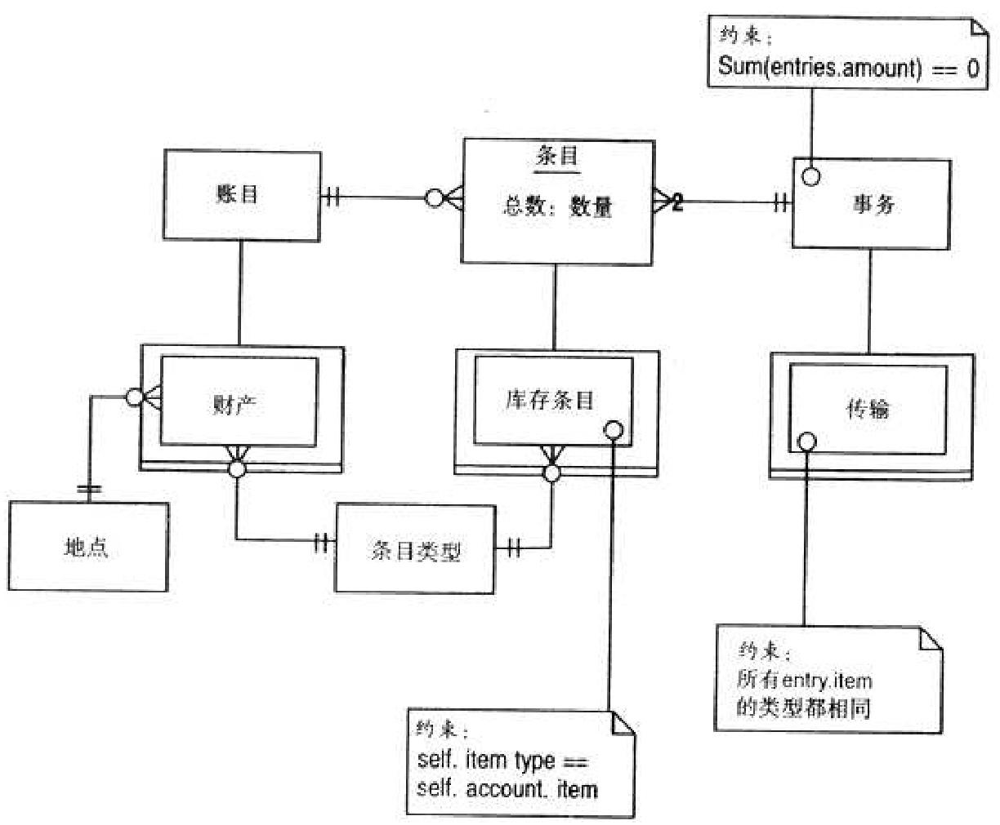  
图6-30专门化账目模型以支持库存管理  

在特定领域使用账目模型需要进行这类的专门化。  

我们可以使用汇总财产来得到全面的情况。所有预定财产的一个汇总财产能给出所有预定位置，一个Talisker的汇总财产能给出所有地点的Talisker的总数。  

处理账目时一个常见问题就是：有时有多个地方可以登记条目。例如，假定我支付500美元购买机票参加OOPSLA的招待会。我是把它记在OOPSLA账目上呢（以便我能算出我花了多少钱参加OOPSLA）还是把它 记在旅行账目上呢（以便我能算出我花了多少钱在航空旅行上）？有几种  

也引出比前面介绍的账目结构更加复杂的账目结构。  

些账目呢，或是更准确地说，如果我有一个像样的账目系统的话，我该如何记录这些账目呢？很明显，我需要一个专给ACM的账目，以便我能寄给他们这个账目清单。然而，一个账目是不够的。我感兴趣的是我从不同的客户那里都挣了多少钱。当我做这个分析的时候，我也不想看到这些花费，因为那不算是真的收人。类似地，我的税款债务估计也需要忽略花费。这表明，对于ACM的账目，我可以使用分开的收人账目和支出账目。我的ACM的账目由这两个账目的汇总账目形成，如图6-31所示。这样做所产生的向题是我要给每一项收人都建立独立的账目。这些费用账目将包含ACM报酬：Megabank报甜和其它客户的报酬。作为汇总账目也能起作用但它打破了图6-5和图6-6的结构限制。因此，我就需要改变模型以便使用细自账目，并以多个汇总账目作为父节点，如图6-32所示。  

图6-32所示的模型，这里形成了一个有向非循环图（DAG）。一个账目可能有多个父节点，但要避免出现循环（一个账目不能是自己的父节点的父节点）这种结构就允许多重汇总账目。  

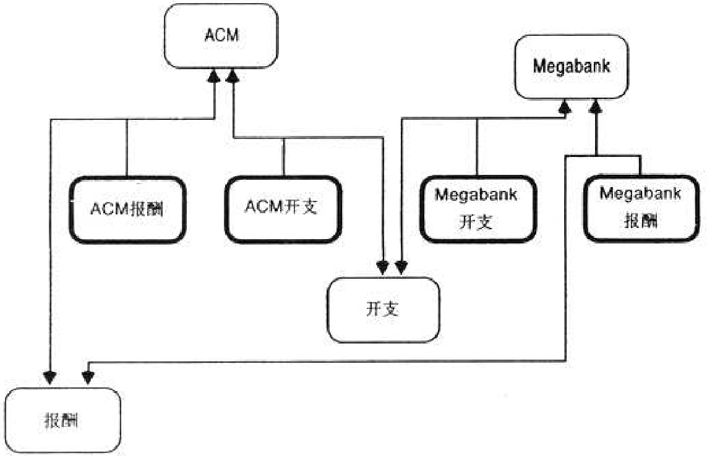  
图6-31一个典型的报酬/开支账目结构  

租边图表示细目账目，由箭头表示汇总。  

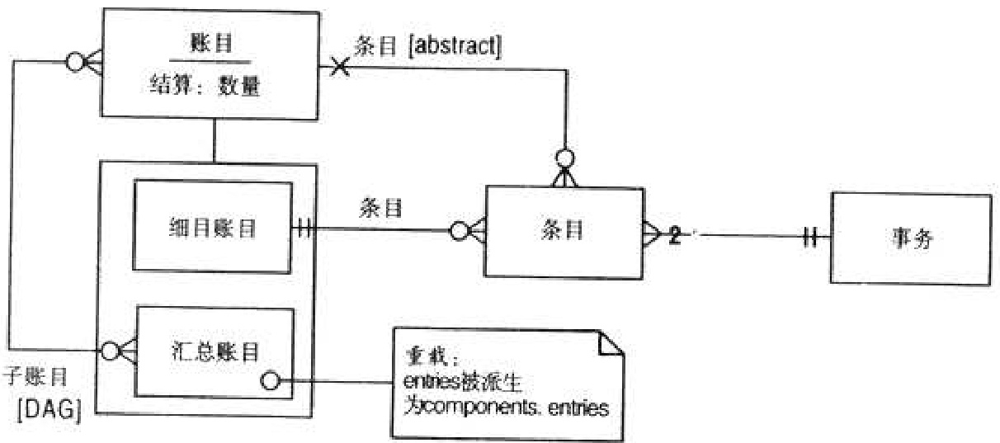  
图6-32允许多重汇总账目  

这里把图65里面的层次结构换成一个有向非循环图。  

然而，有一个必须考虑的小问题。我用图6-33所示的账目结构会怎么样呢？账目X合计ACM以及所有的报酬，所以ACM费用就被算了两次。  

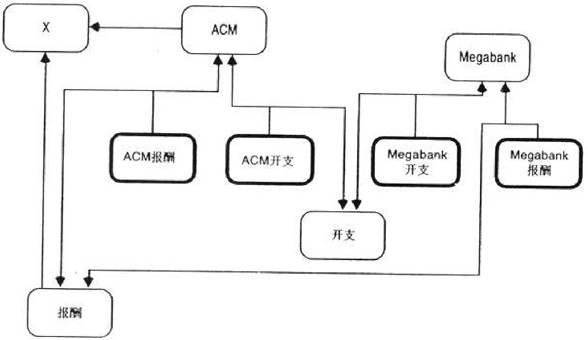  
图6-33显示一个问题的账目结构  

如果使用多重汇总账目，有可能会定义一个具有重叠细目账目的汇总账目。  

依照图6-32的模型，我们仍然能得到X的正确结算。结算是在派生的条日集合里定义的。集合元素不充许重复，所以在ACM报酬里的条目都只能在X中出现一次，这样就能给出正确的结算。然而，这个结算和ACM  

题，我们就要在组合关系上加以限制，这个限制不允许我们选择带有重复的子账目。这应该是一个很合理的限制，因为很难举出一个例子使得这样的X有意义。这样看来，出现上图中的账目很可能是因为偶然失误，而非有意设计出来的。这个限制就可以避免这种失误。  

6.15.1使用备注账目  

在这一级别上，模型工作得很好，但要考虑得更详细，就可能需要把花费分解得更为详细。税收规定要求我们把旅行、住宿和用餐的花费分开（如ACM-航空、ACM-住宿、Megabank-航空等）。这可以把每个花费账目分解为多个细目账目，但这可能会使花费账目因为这些复杂的账目组合而变得难于管理。有必要探索其它的可选方案。  

一种选择是使用备注账目里的条目。这样访问ACM总部的500美元的飞机票就既要出现在ACM花费账目上，也要出现在飞机费用账目上。这种方式消除了对ACM-航空账目的需要，但是需要额外的条目。记人规则可以在某种程度上进行处理，但我们仍需要声明哪些花费账目是必需的。可以通过生成特殊的花费事务来实现，特殊的花费事务以来源账目、目标账目和花费类型备注账目为参数。  

选择是要ACM花费账目作为备注账目还是要飞机费用账目作为备注 账目，这取决于账目后面要如何使用。如果ACM花费账目被用于跟踪发货单的付款，面飞机费用账目仅被用于报税的话，那么最好是将飞机费用账目作为备注账目。相比使用备注账目的时候，选择哪个账目保留主要的资金流的时候就有相当大的随意度。  

6.15.2派生账目  

另外一个方式是使用派生账目，如图6-34所示。在这个示例里，条目专门提供带有选择匹配条目的过滤器的派生账目（参见6.9节）。在实际中，派生账目需要有实际的东西作为派生的基础。支持花费分类的条目子类型能很好地工作，成员关系测试是“花费分类 $\fallingdotseq$ 飞行费用的账目将生成需要的信息。  

我们可能考虑更深一层地使用这个方式。为什么不完全放弃账目而使用像图6-35的样子呢？我可以通过查询花费搞清楚一切。  

这个问题帮助定义为什么账目是有用的以及为什么派生账目是有价值的。账目在需要跟踪资产流向的相对静态的结构里面能很好地起作用。如果这个流向简单，比如分配机票花费，那么还不至于需要账目。然而，考 忠我一趟就去Megabank和ACM两个地方而把费用分为2/3和1/3两个部分的情况。这就是账目能很好处理的多腿事务。但图6-35的模型在这方面还有个问题。我如何以这种方式把简单的支付费用分开呢？注意，图6-35的模型有个问题：它没有说明钱是哪里来的。我还可以加一个相关联的信用卡：但那样的话，花费就像一个双腿事务。  

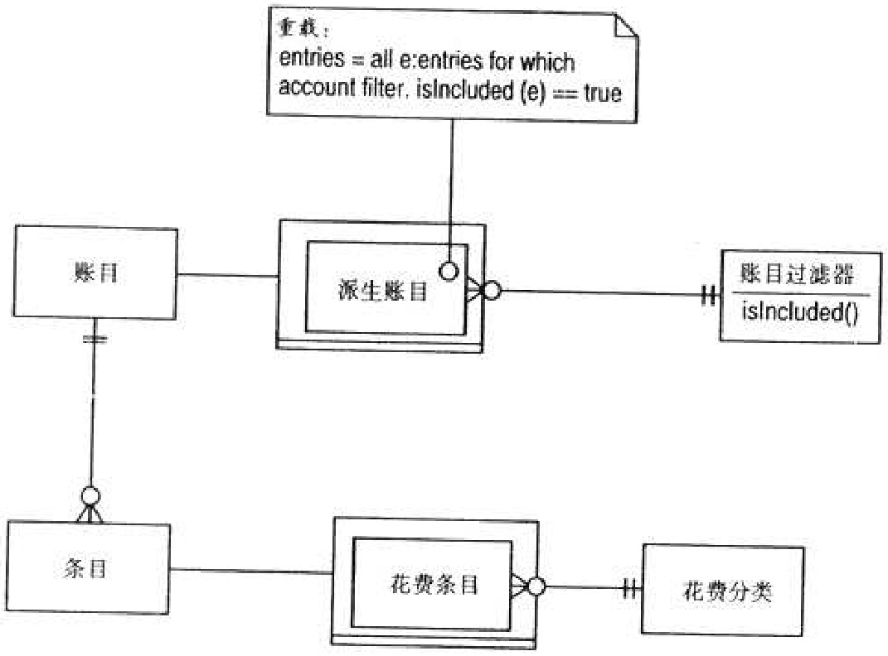  
图6-34派生账目介绍  

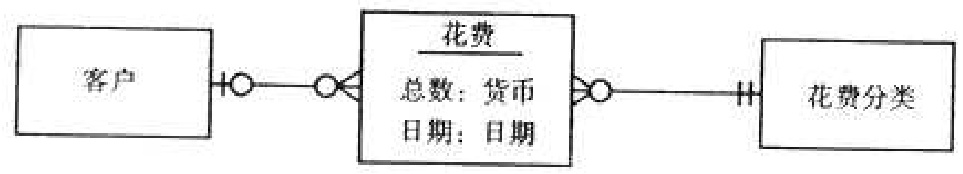  
图6-35为放弃账目模型而定义的花费  

派生账目仍可以允许我们使用所有的报表行为，但我们不能使用跟踪行为。  

在账目结构不是很静态的时候，给派生账目加上属性很有效。如果有很多信息片，那么使用账目所拥有的同一个报表功能，可以很容易地计算派生账目。然而，派生账自只有报表功能，不能在其中进行登记，所以不能用于跟踪资产的消长。  

所以，无论何时我们要表现条目的某一方面，我们就要在条目属性和新一级账目之间进行选择。这个选择是基于你要什么样的账目行为。如果我们仅仅需要报表，我们可以使用属性，必要时也可以使用派生账目。否  

则，我们就需要新一级的账目。  

# 进一步阅读  

这里我可以推荐两个和账目相关的信息资源，它们给出和本章观点不同的看法。Hay[2]就有关于账目的一章。他关于账目和事务的基本概念和我的观点是一样的，虽然他没有给出记人规则的任何东西。他对企业中的账目类型分析得更为详细。他还讨论了企业中的公共事务和它们如何适用于账务模型。他还给出这些账目和事务类型的知识级。  

伊利诺伊大学厄巴纳-尚佩恩分校的研究人员已经在开发账务框架方面做了大量工作[41。伊利诺伊大学的研究小组所采取的方法与我和Hay的方法都不一样。他们以处理发票信息作为开头，把它作为到高级别账目的高级别“事务”。这个“事务”能被分解为到低级别账目的低级别“事务”。他们以和我不同的方式来使用事务这个词：他们不使用守恒原理。一个高级别“事务”可能是一个带有一行行子项的发票。框架致力于把它分解为低级别“事务”，比如那些子项本身。这样，框架被设计用于分解一条目，把它们变为子条目，而不是来用我这种方式，即把它们作为账目网络并来回转移。  

# 参考文献  

1. Gamma,E.,R.Helm,R.Johnson,and J.Vlissides.Design Patterns:Elements of Reusable Object-Oriented Sofftware.Reading.MA:Addison-Wesley.1995.

 2. Hay.D.DataModel Patterns:Conventions ofThought NewYork,NY:Dorset House 1996.

 3. Langer,S.K.An Introduction to Symbolic Logic,Third Edition.New York,NY: Dover,1967.

 4. Keefer,P.D.An Object-Oriented Framework for Accounting Systems.University of Illinois atUrbana-Champaign<ftp://st.cs.uiuc.edu/pub/Smalltalk/st80_vw/ accounts/thesis.ps>,1994.

 5. Meyer,B.“Applying‘Design by Contract,In IEEE Computer,25,10 (1992) Pp.40-51.  

要全面理解本章，你需要先阅读第6章。这是本书中不寻常的一章。本章给出我们如何使用第6章的模式，而非继续描述一组模式。因为第6章的账务模式非常抽象，所以这是一个很艰巨的任务。要理解模式如何真正工作，我们需要一个完整的能工作的示例。  

本章以一个TotalTelecommunications集团（TT）的电话应用系统为例，讲述模型所使用的账目和记人规则。按照教材的惯例，需要把给出的示例简单化，但这些示例至少要让读者明白模型是如何工作的。我的目的就是说明账目模型的使用而非为电话公司建模。  

既然在本章中我的日的就是举例，我在示例里面也就用了很多程序代码。我选用DigitalkSmalltalk语言而不是  $\widehat{\mathbf{C}}\ddag+$  ，因为对我来说Smalltalk更 容易传递我的想法。这些概念可以很容易转换到 $\left(\stackrel{\rightarrow}{C}\!+\!+\right.$ 语言里面。我用了一些在第14章中才详细说明的模型转换模式。我还使用KentBeck的编码模式（可能略有变化）[1]。我要强调，我没有试图优化我的代码，也没有提供完整的代码，而只是给出重点部分。  

TT公司的基本收费方案很简单。所有的电话被分为白天电话和晚上电话。白天电话的时间从早晨7：00到晚上7：00。这种区分以电话的开始时间为基础。白天的电话费用是这样计算的：第1分钟98美分，接下来的每分钟30美分。晚上电话的计费方式是：第1分钟70美分，接下来的20分钟每分钟20美分，其余的每分钟12美分。政府对于日历月中第1个50美元的电话收取 $6\%$ 的税，其余的收取 $4\%$ 的税。  

本章以结构模型（参见7.1节）的讨论开始，结构模型当然是基于第6章中给出的模式。然后我们看看这些结构在实现方面的一些有趣问题（参见7.2节）。为了设置对象，我们先要设置新的电话服务（参见7.3节），然后要建立通话（参见7.4节）。随后我们看看记入规则，同时检查用于实现基于账目的触发的代码（参见7.5节）。我们给出3个记人规则的示例：把  

来处理白天和夜晚电话的分开收费。虽然我们需要不同的策略来区分白天和夜晚通话，但既然基本处理过程一样，我们就可以使用费率表作为参数化的策略对象。这允许我们处理任何依照通话时间长短而收费的记人规则。率表也被用于下面的计算税的规则。不像前一条规则，这条规则一定是按月计算的，但我们不能假定每月只运行它一次。  

三个记人规则类应该能给我们带来好的启示，启示我们如何使用账目库存模式来既表示货币的事务也表示非货币的事务。  

在开发代码时，我喜欢一开始就建立结构模型的大体框架。然后使用原型，但对于结构模型的更新，我一向都很谨慎（要不然我自己都不知道进展到哪一步）。伴随着难于处理的行为的出现，在开始的时候或是在编程的时候可以使用事件图或交互图。如果我认为有必要写文档来记录我用这些行为做了什么（就像在本书里面），我会在完成代码后就画图。图形不是代码的替代品，它们帮助说明代码的作用。（使用合适的工具，事件图可以作为代码使用。）  

7.1结构模型  

最好开始的时候就使用结构模型，因为它们给出最终的各种模型的概貌。图7-1显示模型内的包。我把模型分为两个包：电话服务和账目。使用账目框架的一个好处就是它可以被用于不同的行业，所以我们需要确保将账目模型从任何行业相关的概念中分离（就是账目模型独立于任何行业相关的概念）。  

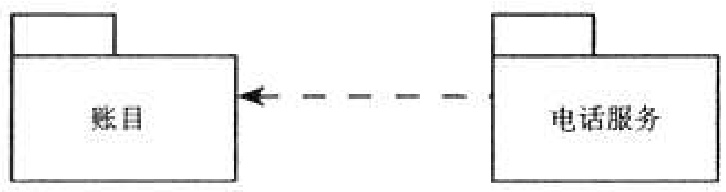  
图7-1TT模型的包  

账目包持有抽象账务类型，在这个特定领域里，账务类型由电话服务包来扩展。  

图7-2表示TT的账务模型，这是基于第6章的模式。模型中从记人规则到账目有3个关联。触发器和输出都与第6章相似，但带键值的输出是新的。这可以给那些有需要的记人规则 $\xleftarrow{}$ 些多重输出账目。这种需要在本章稍后的示例中会很明显。  

  
图7-2TT的账目模型  

图7-3展示电话服务的模型。客户被允许有多条电话线。电话服务是指每个客户被分配一条电话线。每个电话服务被绑定到描述如何付账的账务实践。此图说明为什么目标映射被加到图7-2中的细目账目。我们需要一种方式来找出细目账目到底做什么，但是我们不需要从账目包看到电话服务包，因为它会破坏重用。这样，我们形成细目账目的子类型。使用子类型化，只能从子类型看到父类型。服务账自了解电话服务是绝对充许的，因为它们都在电话服务包中。然而，我们在不知道某个细目账目是服务账目的情况下就可以对其进行引用。细目账目上的抽象映射告诉我们细目账目可以作为主题被连接到一个对象（类型不定）。这些可以由细目账目的子类型实现一这是多态现象的一个经典示例。  

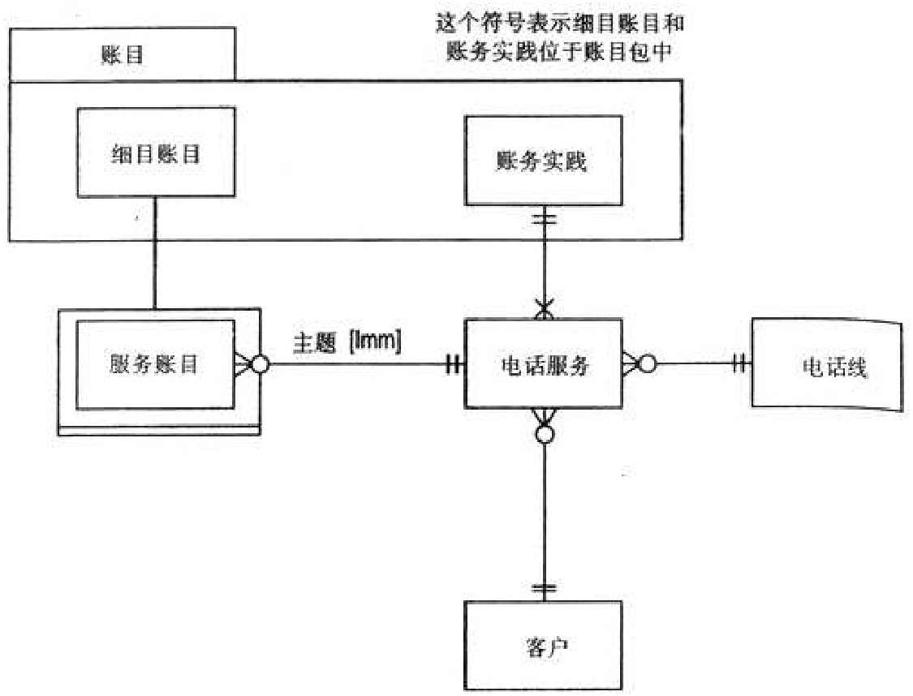  
图7-3电话服务的结构模型  

7.2结构的实现  

我们可以使用基于第14章中描述的模式的设计模板来实现模型。所有的关联由访问和修改操作来表示。单值映射遵循通常的Smalltak习惯。这样，记人规则中名为触发器的映射就可以由访问器trigger和修改器trigger：anAccount来实现。多值映射一比如说是账务实践的记入规则一就有访问器postingRules和修改器addPostingRule：aPostingRule和remove Posting Rule:aPostingRulea  

账目上的条目操作是多态操作一当汇总账目统计子节点的时候，细目账目返回一个变量实例（如程序清单7-1所示）  

这个模型没有账目类型。记人规则由汇总账目定义。在本章的例子中，我们可以使用汇总账目或是账目类型来定义记人规则。使用汇总账目有一点儿复杂，但作为示例更合适。依照14.5.1节的风格，已定义的高级别汇总账目被保存在账目类里面的某个类变量中，并可由类方法findWithName：aString来访问。  

有时需要小段代码来为特定汇总账目的特定电话服务找出服务账目。不难想出很多种实现方式：请求电话服务在给定的汇总账目中查找账目：  

或是请求汇总账目查找它连到电话服务的子节点。这两种方式都很合理，但很难决定哪种更好。另外，每种方式都应用某种导航路径，这样其中一种可能就比另一种好。而在此处的示例中，我们采用完全不同的技术，依照14.5.1节建立类方法。然后我们可以使用任一个路径来实现方法，而且在改变方法时也无需改变声明的接口。这可以使我更容易记住在哪里实现这些“查找”方法，如程序清单7-2所示。  

Accounts sentries Aself subclass Responsibility SurmaryAccounts>entries lanswerl answer:=Sorted Collection sortBlock:[:a:b|a whenBooked  $\ngtr$  b whenBooked]. self detailAccounts inject:answer into: [:tota]:each] total addAll:each entries: yourself]. Aanswer DetailAccount>>entries Aentries copy  

# 程序清单7-2查找特定账目  

ServiceAccount classx>find with Phone Service:aPhoneService topParent:a Top Summary Account AaPhoneService serviceAccounts detect:I:iliparentTop  $\pm$  a Top Summary Account] PhoneService>>accountNaned:aString AServiceAccount findwithPhoneService:self topParent:(Account findwithName:aString)  

实际上，在电话服务中编写的 $\rightharpoonup$ 个方法（比如accountNamed:aString）经常很方便使用。这个方法调用findWithPhoneService：topParent并能提供全部两种方式的长处。  

虽然模型支持多腿事务，但这里的示例还是全部使用双腿事务。程厅清单7-3表示一个事务的特殊构造方法，使用该方法，我们可以生成双腿事务。一个方法传送所有的信息，包括源条目和生成它的记人规则。另一个方法被用于一开始就读进来的初始化的属性。  

列表给出很多编码技术。一个构造器参数方法[1]（以set为前缀）用参数初始化新对象。在构造参数方法的内部，用require消息进行预处理检查。为了提高性能，可以重新定义require方法来去掉这个检查。按“契约式设计”的观点[3]，另一个设计因素就是使用不变式的检查。  

# 程序清单7-3构造双腿事务  

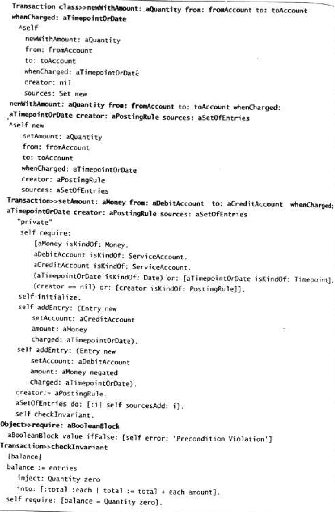  

# 7.3设置新的电话服务  

构建一个新的电话服务不仅仅是一个实例化电话服务对象的问题。要使账务系统运行，也必须构造服务账目。如图7-4、图7-5和程序清单7-4所示，尽管这个示例没有包含多个账务实践，但也有足够的弹性来为任何账  

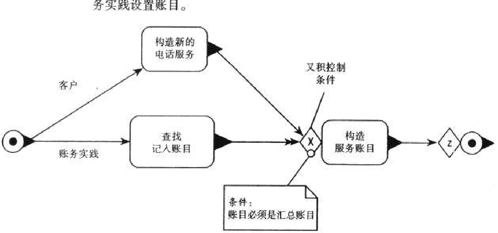  
图7-4构造新电话服务的事件图  

本图里使用叉积控制条件（对通常事件图的一个扩展）控制条件要对输入能发器和各种组合进行估计：本例中就是每个新电话服务和记入账目的组合。它为账务实践中的每个电话服务和汇总记入账目调用构造服务账目的探作。  

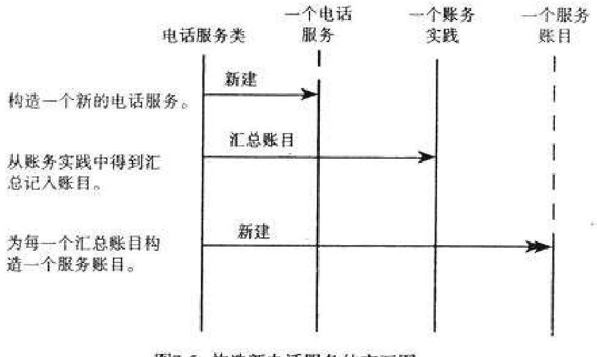  
图7-5构造新电话服务的交互图  

程序清单7-4设置新的电话线  

PhoneService class>>new with Accounting Practice: an Accounting Practice customer: aCustoeer phoneLine:aPhoneLine Aself.new set Accounting Practice:an Accounting Practice customer: aCustomer phoneLine:aPhoneLine PhoneService>>set Accounting Practice: an Accounting Practice customer:aCustomer phoneLine:aString InewObj summaryAccounts] selfrequire: [(an Accounting Practice iskindof:Accounting Practice)&  

(aCustomer isKindof:Customer)]. accounting Practice:=an Accounting Practice. self setCustomer:aCustomer. Tine:=aString. self create Service Accounts Aself PhoneService>>create Service Accounts "private-initializing" (self accounting Practice summaryAccounts) do: [:each |ServiceAccount new with Phone Service: self parent:each]  

里不是直接引用）。因此，记人账目一定要被过滤以确保只剩下汇总账目。  

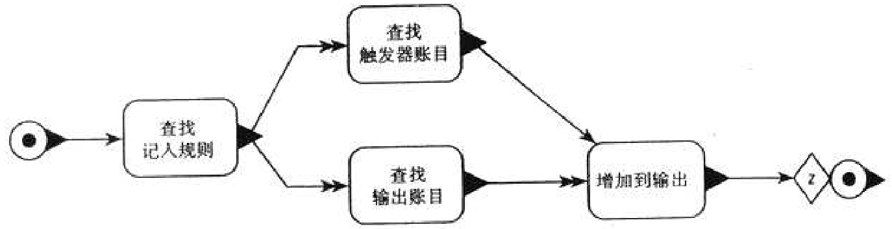  
图7-6查找记人账目  

我们要得到每条记入规则的触发器账目和所有的输出账日。程序清单7-5一个账务实践可以提供它的汇总账目  

Accounting Practice>>summaryAccounts Aself postingAccounts select:[:each |eachisSummary] Accounting Practice>>postingAccounts lanswer! answer:=Setnew. postingRules do: [:each1 answer add: each trigger. answeraddAll:eachoutputs]. Aanswer.  

7.4建立通话  

电话通话可以被建模成从网络账目到基本时间账目的事务。电话通话条目的单位是分钟。  

下面的方法表示如何建立电话服务和设置一些示例通话。如程序清单7-6所示，注意：这个方法定义在一个名为Scenario1的类中。测试方法可能很复杂：这样把它们放在场景对象里面是很好的办法（这里使用“场景（scenario）是“用例”（use-case）的意思，而不是9.4节里面定义的含义）这样即使在没有合适的测试框架的时候还能够控制它们。变量basicAccoun和theService是这个测试类的类变量。  

# 程序清单7-6建立测试通话  

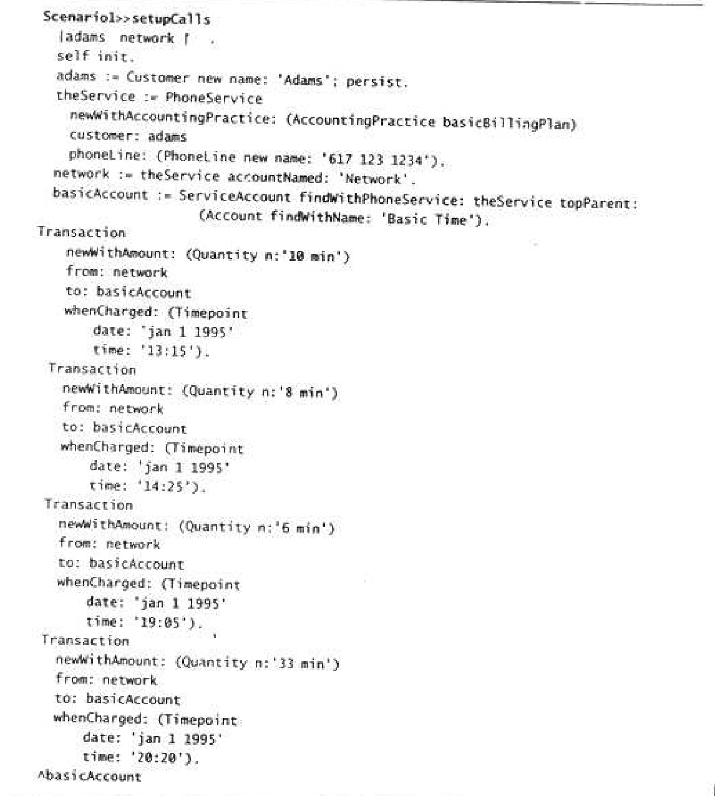  

使用用户自定义的基础类（比如数量），可能使构造新对象变得困难。因此，数量有一个方法n：aString，用它可以从字符串生成数量。这是我使用的个人习惯，因为fromString：aString不太易于使用。  

我们这里使用基于账目的触发方案（参见6.7.3节）。每个账目有一个方法来处理自己，该方法引发所有以这个账目作为触发器的记人规则，如程序清单7-7所示。  

# 程序清单7-7一个账目引发以它为触发器的记入规则  

DetailAccount>>process self all outbound Rules do:[:jl j processAccount:self]: lastProcessed:=entrieslast al 10 ut bound Rules "private" [answer] answer:= self triggerFor. self allParents do:[:ilanswer addAll:itriggerFor] Aanswer  

条目被放在orderedCollection中，新加进来的都加在末尾。lastProcessed实例交量跟踪处理状态。  

# 7.6把电话分成白天和夜晚两类  

为把电话通话分为白天和夜晚两类，我们检查每个条目，考虑条目上的时间，然后生成从基本时间账目到白天账目或到夜晚账目的事务。  

按条目进行操作的记人规则是很常见的。我们可以构造名为“每条目记人规则”的记人规则的抽象子类型（EachEntryPR类）。如图7-7和程序清单7-8所示，这个子类型对触发账目中的每条未处理条目调用processEntry:anEntry操作。  

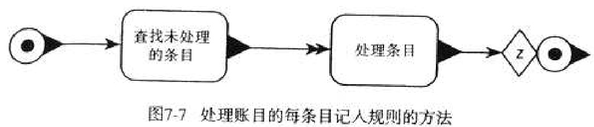  

在每条未处理条日上调用处理条目的操作。  

# 程序清单7-8EachEntryPR是如何处理触发器账目的  

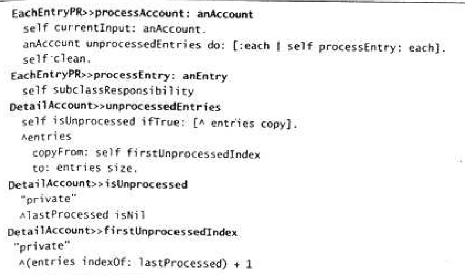  

消息currentlnput：读入实例变量来保存记人规则正在处理的服务账目，  

如程序清单7-9所示。它由私有方法访问，井只能定义在processAccount的执行过程中。一个临时的私有实例变量经常被用于这种情况，因为通常的记人规则也作为实例变量来定义（虽然在本例中并非如此）。这样，我们不能用实例化的方法来激活这个规则。一个替代方法是把记人规则实例作为原型[2]来定义并通过克隆它来执行。  

程序清单7-9设置当前的输入和输出  

PostingRule>scurrentInput:anAccount "private" self require:[currentInput isNil]. currentInput:= anAccount. self set Current Outputs PostingRule>>set Current Outputs "private" currentoutputs  $:=$  Dictionary new. outputs associationsDo: [:each1 currentoutputs at:each key put:(ServiceAccount find with Phone Service:(currentInput phoneService) topParent:each value)] PostingRule>>clean "private" currentInput :=nil. currentOutputs:= nil.  

curentlnput：消息也为与输人相同的电话服务设置了服务账目的当前输出。  

这个方法并不真正进行计算和记人。而是由processEntry：来完成，这个方法是抽象的，应该由子类来定义。在这里我们看到三层的类结构。PostingRule定义记人规则的基本接口和服务。EachEntryPR的处理账目方法是一个模板方法，列出逐条处理条目的步骤，但如何具体地处理条目要在子类中实现  

对于这条记人规则，我们可以定义EachEntryPR的名为EveningDaySplitPR的新子类。这是singleton类实现的一个实例（参见6.6.1节）。如程序清单7-10所示，类中包含一些账目代码，在初始化时进行设置。  

程序清单7-10初始化区分白天/夜晚的处理规则  

Evening Day Split PR>>initialize super initialize. outputs:=Dictionary new: outputs at:fevening put:(Account findwithName:\*Evening Tiee'). outputs at:fday put:(Account findwithName:'Day Time')  

通过重载processEntry：方法来完成这个区分，如图7-8和程序清单所示。  

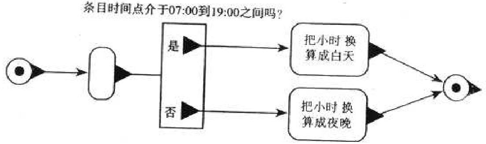  
图7-8白天/夜晚区分处理规则的方法（用于处理条目操作）  

Evening Day Split PR>processEntry:anEntry Transaction newwithAmount:(anEntry amount) from:（anEntry account) to:(self outputFor:anEntry) whenCharged:(anEntry timepoint) creator:self sources:(Set with: anEntry) EveningDaySp1  $\tt t P R z>$  outputFor:anEntry ACanEntry timepoint time $\nsupseteq$ （TimefromString:19:0e）CanEntry timepoint tine  $\nless$  (Time fromString:a7:e0) ifTrue:[self currentOutputs at:#evening] ifFalse:[self currentoutputs at:#day].  

7.7按时间收费  

对白天和夜晚通话的收费可以使用同一个模式，如图7-9所示。收费是在一个条目接一个条目的基础上计算的，所以要使用EachEntryPR的一个子类。要使用两条记人规则：一条用于白天，一条用于夜晚。而同一个TransformPR类可用于两者。  

这条记人规则的一个特性就是它由分钟的条目触发，但产生美元的条目。因此使用术语转换。实际的结果是产生两个事务。一个把分钟的账目再转换回账目网络，这样就完成了一个分钟的循环。第二个在财务方面产生一个事务：从网络收人账目到活动账目，如图7-10和程序清单7-12所示  

方法transformedAmount由方法对象计算（参见6.6.2节），明确地说是由费率表计算，比如像表7-1和表7-2所示的那样。方法类定义抽象的calculateFor方法。费率表是一个子类，存储一个两列的数量表以产生问题需要的阶梯状收费。这个可以使用字典来实现。字典里面的键值表示一些临界点，对应的值表示应用到临界点的费率。程序清单7-13表示了如何设置夜晚收费的费率。最高费率表明一旦超过最高门限值，我们该使用哪个费率。  

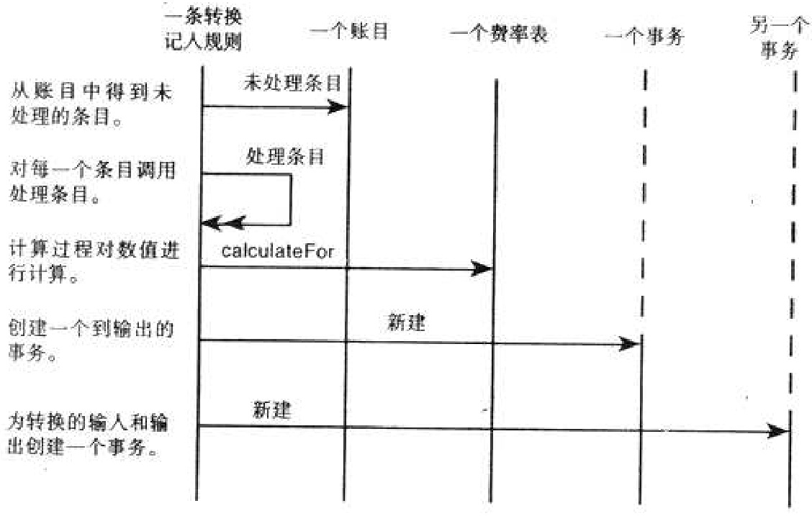  
图7-9使用转换记入规则处理账日的交互图  

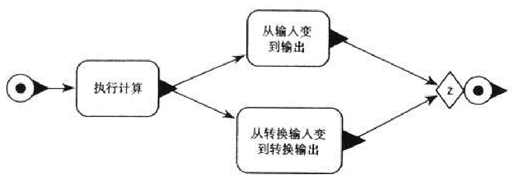  
图7-10针对转换记人规则方法（用于处理条目操作）的事件图  

程序清单7-12转换记入规则是如何处理条目的  

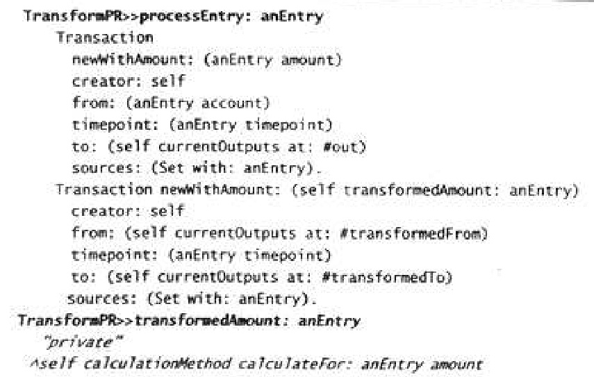  

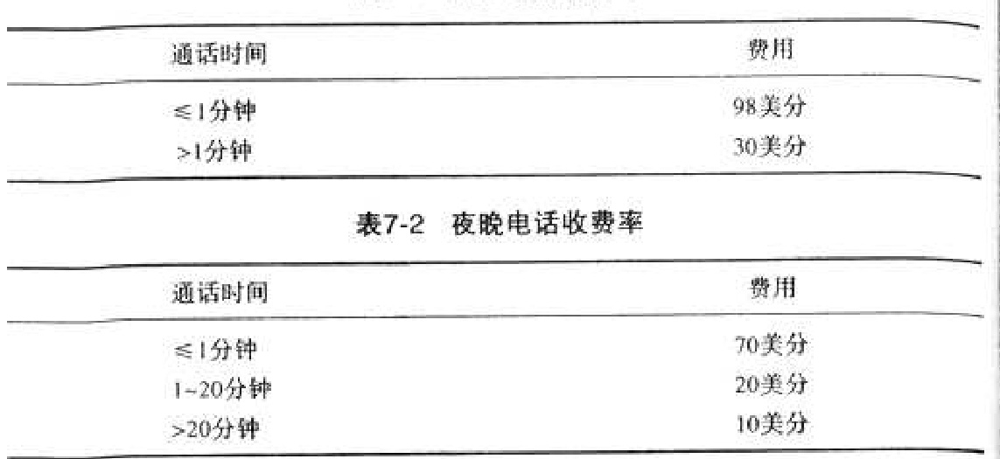  

程序清单7-13在费率表对象里面设置夜晚费率  

RateTable>>evening Rate Table ianswer1 answer= RateTable new. answer rateAt:(Quantity n:1min') put:(Quantityn:.7uSD'） answer rateAt:(Quantityn:'2lmin') put:（Quantityn:.2uSD'）. answer topRate:(Quantityn:.12 USD) Aanswer  

程序清单7-14表示费率表是如何计算收费的。这分两个步骤进行：在费率表里面扫描和把超出最高门限值的数值相加。我没有在此画出图示。表格表明在概念上我们需要什么。通过使用绝对值，它们可以一样地处理正数和负数：这是观察这些系统时比较特殊的事情。  

程序清单7-14费率表是如何依照输入数值进行计算的  

RateTable>pcalculateFor:aQuantity Ianswer inputl 2aifraauira:a0uantitv.unit=seittnresrolounlj- input:=aQuantityabs.  $^+$   $\doteq$ C colE r sh leh nn unt:1noutlLseiTtopkateauaHtTputAaQuantity positive ifTrue:[answer] ifFalse:[answer negated] RateTabley>tableAount:aQuantity "private" iinniifcnrtedkevsastkev.thisRomAeypuntansner cortedkevs.:=table keys as sorte ou oi 1 ect lon. lastKey :=Quantity zero. answer  $;=$  Quantity zero. sortedKeys do: [:thisKey TastKey :=thiskey]  

Aanswer RateTable>>topRateAmount: aQuantity I amount Over Top Rate Thresh o lo amount Over Top Rate Thresh o?d:=aQuantity-self top Rate Threshold amount Over Top Rate Threshold positive ifTrue:[Aself topRate \*amount Over Top Rate Threshold amount] ifFalse:[Quantity zero]. RateTable>>topRateThreshold Atable keys asSorted Collect ian last  

最后的记人规则显示税款的计算。这个规则与前面规则的不同之处在于它不是逐条处理条目。这条记人规则不得不查看一个月以来的所有收费来计算税款。  

另一个复杂的因素是：我们不能（或者不希望）确保记人规则在月末仅运行一次。因此，记人规则就要考虑到这个月因前一次触发而已经进行收费的税。这就引出如下的定理，即记人规则的定义应当独立于它们被触发的方式。这就增加了灵活性并减少了模型中的耦合。  

MonthlyChargePR类是记人规则的子类，并因而实现processAccount方法，如图7-11和程序清单7-15所示。  

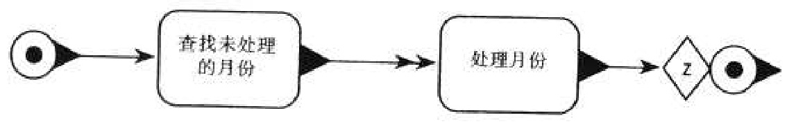  
图7-11处理账目的按月收费的记人规则的方法  

这个处理是基于一段时间的结算，而非基于每个条目。  

# 程序清单7-15按月收费的记入规则的方法是如何处理账目的  

MonthlyChargePR>>processAccount:anAccount selfcurrentInput:anAccount. (self months To Process:anAccount) do:[:each|self process for Month: each] Monthly Charge PR x>BonthsToProcess:anAccount ACanAccount un processed Entries collect: [:each|each whenCharged date firstDayOfMonth]) asSet.  

每个月份都由pr0cessForMonth：来处理，如图7-12和程序清单7-16所示。  

最后的事务是从输出账目到输人账目的，由于税款债务的原因，活动账目的生命周期将会增加  

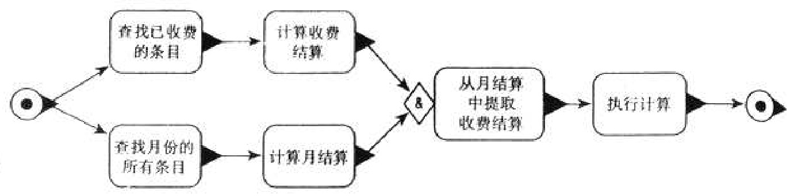  
图7-12处理月份的事件图  

HonthlyChargePR>processforHonth:aDate IinputToProcess-totalToChargeI inputToProcess :=(self inputBalance:aDate)-(self output Already Charged:aDate). totalToCharge :(self calculation Method calculateFor:inputToProcess)- (self output Already Charged:aDate). Transaction newwithAmount:totalToCharge creator!self from:Self currentOutput timepoint:aDate lastDayOfMonth to:self currentInput sources:(self currentInput entries Charged In Month:aDate) MonthlyChargePR>>inputBalance:aDate Aself currentInput balance Charged In Month: aDate. HonthlyChargePR>>output Already Charged:aDate A（self current Output balance Charged In Month:aDate)negated  

7.9结论  

这是一个非常简单的例子，所以很难从中总结出太多的结论。读者可能会很有说服力地提出异议，认为这个问题可以由相对简单的形式来解决而不用我提出的这个框架。这个框架对于系统的可扩展性很有价值。实际的业务中可能有很多个实践，每一个实践又有很多个处理规则。使用这个结构，我们可以由账务实践给出新的收费计划。当我们建立新实践时，我们生成记人规则的新实例网络。我们这么做完全不必再编译或是重构系统而它们还是好好地可以运行。当我们需要一个新的记人规则的子类型时，重构就不可避免，但这种情况很少见  

7.9.1记入规则的结构  

图7-13表示本章讨论的记人规则的泛化结构。抽象的记人规则类有一process Account。process Account。每个 条目记人规则通过对条目调用另一个抽象方法processEntry来实现这个方法。如需要，以后的子类型可以实现processEntry。对于白天/夜晚通话的区分记人规则的方法是硬编码的，而转换记人规则委托给费率表。示例表示：在一个有组织的结构中，抽象方法、多态性和委托的结合是如何提供能支持多种记人规则的结构。  

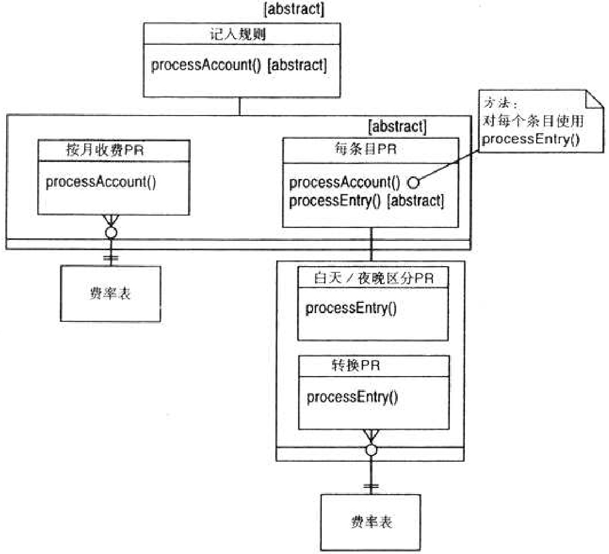  
图7-13记人规则的泛化结构  

这也不是惟一一个我们能够使用的记人规则的结构。另一个可用方案是把计算费用的两个步骤合并为一个步骤。这样一条记人规则有两个费率表，一个是为白天通话的，一个是为夜晚通话的，这条记人规则既负责白天和夜晚的区分又负责费用的计算。  

是否分解记人规则并没有一定之规。我们的基本目标就是在不必增加记人规则的子类型时能够建立新的实践。我们想要有尽可能小的记人规则的子集，因为这样可以容易理解和维护记人规则的类型。然而，我们也需要子类型来提供需要的所有功能，这样就可以用它们组成新的实践。当我们需要建立新的记人规则的子类型时，我们希望能尽快做出来。  

更简单的记人规则将导致更复杂的实践，并且通常用途也更广泛。我乐意让记人规则在初始的时候有很少的行为。如果我看见有经常使用的记人规则的组合，我可能会给出一个功能更强的记人规则来替代这个组合。  

7.9.2什么时候不能使用框架  

另一个使用这个框架的方案是对每个收费方案仅有一个类来处理所有的行为（白天/夜晚的区分、收费、收税），如图7-14所示。这个类将一个月内的所有条目都读人并生成账目清单。对每个收费方案都有一个这样的对象。  

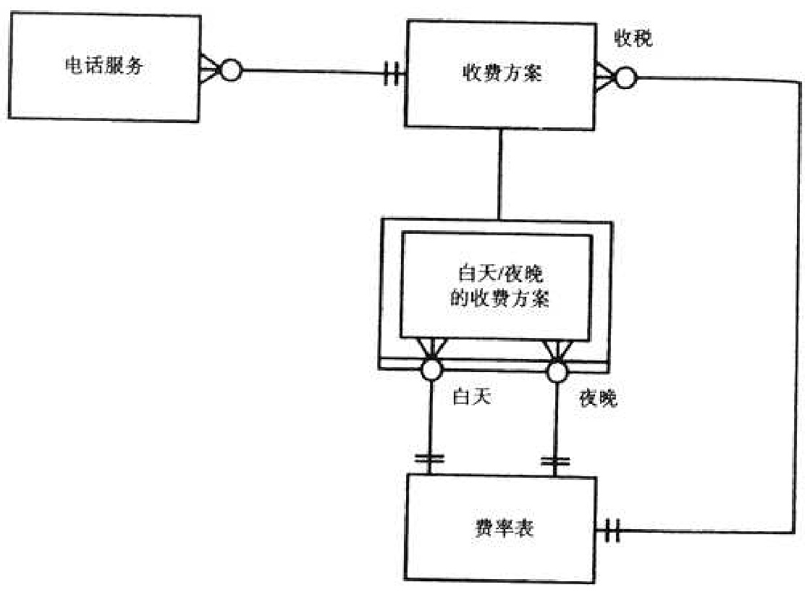  
图7-14使用收费方案  

收费方案筒单但是没什么灵活性。  

对这个方式很有争议。虽然可能有很多收费方案，但是通常只会有几个简单的基本收费方法，它们可以实现参数化，就像转换记人规则因为很多不同的费率表而参数化一样。本问题中的这种类型可以由一个白天费率表、夜晚费率表和税率表来实现参数化。  

关键的问题是收费方案中有多少个子类型。如果我们用十几个收费方案的子类型来表示所有的记账结构（即便可能有成百上千的实例），那么使用收费方案类型就是有争议的。账目模型的长处在于：通过把记人规则和账目对象组合在一起，便能建立起收费方案的新的子类型的等价物。如果有一个大而经常改变的收费方案的子类型的集合，这就是一个很大的优点。  

另一种思考的方式是把收费方案看作记人规则，它只需要一步就从基本时间账目到活动账目进行记账。使用账目仍是有价值的，可用于给出通话历更记录、输人时的收费以及收费方案的结果。我们将失去中间的汇总信息。  

7.9.3账务实践图  

图形经常有助于将一个向题可视化。图7-15和图7-16是这方面的建议（当然多数是尝试性的）。这些图对于复杂的实践很有帮助。我们可以设想通过画图来建造系统，并可以减少需要的编程量，提高这类应用软件的生产率。  

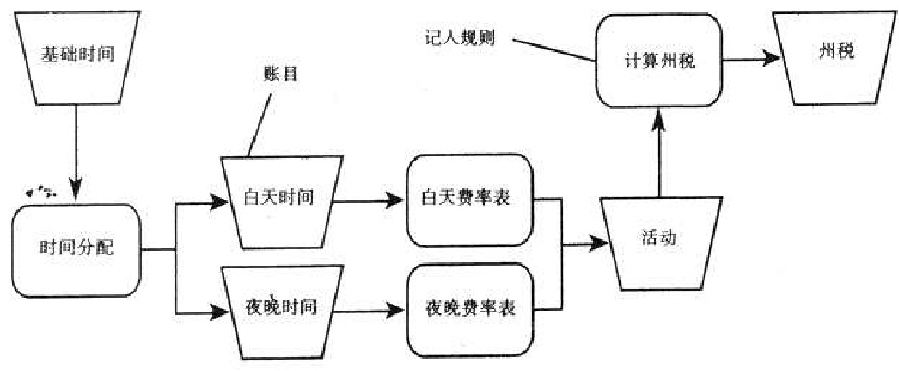  
图7-15处理规则和账目的简单图形化表示  

对于每条记入规则，图中显示发器和主要的输出账目，但隐藏全部事务流。  

实践应该有一个图形形式的东西，简单但能表述关键信息。图7-15的长处就是很简单但表述了主要的触发和输出关系。但它不像图7-16那样表示全部统计条目的流向。如果你使用这些模式，我强烈建议你使用图形。从这里介绍的那些图开始，让图形标准进化成为最有用的标准（也让我知道它会变成什么）  

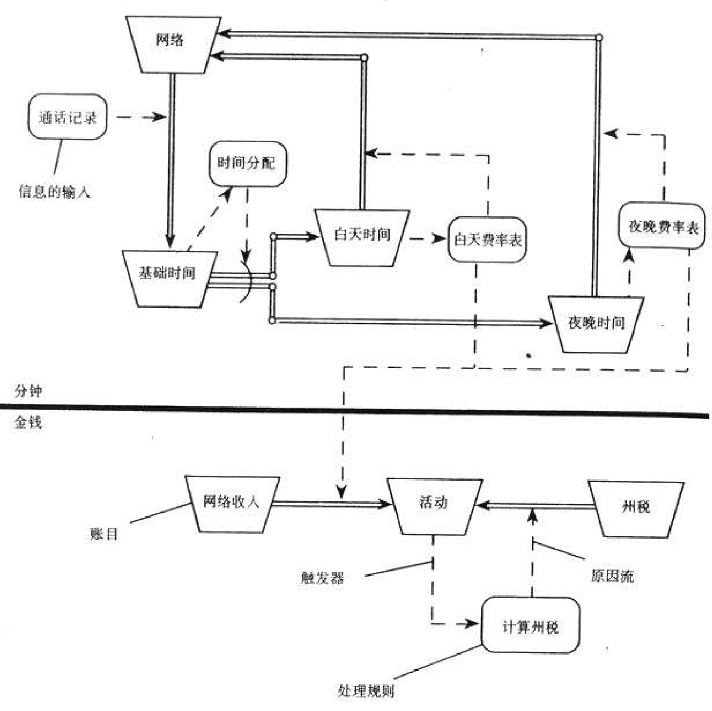  
图7-16账目和记人规则的更深刻的图形  

本图显式地表达事务流。每条记入规则由单个的账目触发，并引发一系列流。流的方向表明条目被存取的方向。图形表示更多的信息，因而更为复杂。  

# 参考文献  

1.Beck,K.SmalltalkBest Practice Patterns.Volume 1:Coding.Englewood Cliffs,NJ PrenticeHall,inpress

 2. Gamma,E.,R.Helm,R.Johnson,and J.Vlissides.Design Patterns:Elements of ReusableObject-Oriented Software.Reading,MA:Addison-Wesley.1995.

 3.Meyer,B."Applying'Design by Contract,"IEEE Computer,25,10(1992).pp.40-51 计划是任何巨大尝试中至关重要的部分。许多管理者花费大部分时  

间来制定和跟踪各种计划。本章提供有关计划的一些基本模式。这些模式既描述单独的计划，又描述可以像标准过程 $\rightharpoonup$ 样被反复使用的方案。  

可以记录一个领域内任何动作的实施。提议和执行的动作模式（参见8.1节）把一个动作的可能状态分为两个关键的子类型，这些子类型描述动作的意图和实际发生的情况。动作的结束同样被分为完成和放弃的动作（参见8.2节）。一个放弃的动作代表最终被取消的动作，动作的暂时保留由挂起（参见8.3节）来表示。  

计划（参见8.4节）被用于支持一组被提议的动作。我们讨论计划的结构，这些计划应该能够记录动作之间的依赖关系和先后顺序，而且一个单独的动作可以出现在若干个计划中。后一个特性是安排一次性多重计划所必需的。方案（参见8.5节）就是被反复执行多次的标准计划。  

动作的实施需要资源。资源分配模式（参见8.6节）描述适合于提议和执行的动作的方案。我们认为有两种不同的资源：消耗品（在动作中消耗）和资产（可反复使用）  

迄今为止，我们关于计划的讨论集中在计划和监控动作上，而忽现了动作的效果。我们最后讨论的模式处理输出和启动函数（参见8.7节），这个模式把本章的模式和第3章的观察和测量模式联系起来。这些函数允许我们表达：我们认为动作的成果（输出）是什么，方案可以完成的（输出函数）是什么，什么情况下我们需要开始一个方案（启动函数）。  

计划是一个复杂的领域，本章的模式显然不能穷尽所有的计划模式。当然，其它章的模式也有类似情况。本章的模式产生于Cosmos临床过程模型[1]，这个模型的结构明显是针对医疗保健计划的。资源方面主要来源于Cosmos的开发者和使用者的一些私下讨论，以及NHS公共基本规约[2]的影响。  

关键概念：提议的动作、执行的动作、计划、挂起、资源分配、资产消耗品、临时资源、启动函数、输出函数  

# 8.1提议和执行的动作  

任何计划的基础都是由人们所采取的基本动作组成。这里我们只能给出一个动作组成的概要描述。一个计划可以是粗粒度的，由大的动作组成，也可以是细粒度的，由小的动作组成。动作可以有一些基于什么人、什么时候和什么地方的属性。通过这些粗粒度的属性，一般只能提供最普遍的团体、时间参考和位置等方面的的术语，如图8-1所示。  

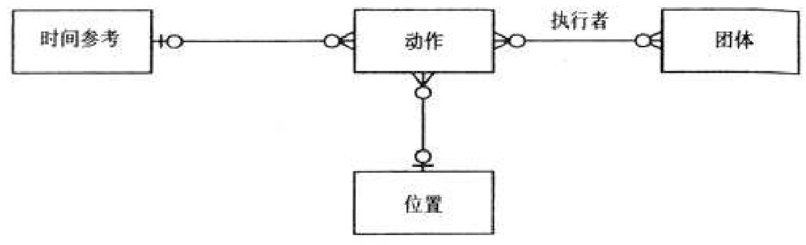  
图8-1动作属性  

当制订和监控计划时，我们必须考虑一个动作可能会经历的许多状态。它可以被调度、分配资源、分配人力、启动和结束。一个状态转移图可以记录这些状态以及转移是如何发生的。很难制定有关状态转移的规则。调度一个动作并且给它分配资源可以清楚地按任何顺序进行。浅显的分析就可以推断出：一个计划不能在分配资源和调度之前开始。可有些动作在任何正式的决定来规定其时间之前就启动了，我们如何处理它们？我们可能会争论这样的动作是否会在启动之前的一刻调度，可这听起来更像是一个管理学原理的讨论而不是一个真正业务过程的反映。另一个可能出现的问题是部分资源分配。任何项目经理会告诉你，在现实世界中，任务经常会在所有需要的资源分配结束之前开始。在动作状态的描述中，我们如何来处理这种情况？  

动作的两个重要状态是提议和执行，如图8-2所示。一个被提议的动作在某些计划中纯粹是一个建议。同样地，它可以通过增加一个时间参考来调度，增加团体来分配资源，寻找合适的位置来定位。这些变化可以在任何时间、以任何顺序发生。当计划开始，它就执行了。不但状态变化了，而且要创建一个单独的处于执行状态的动作对象。通过保留原始的提议动作，我们可以观察计划和现实的差异。举例来说，一个共同的差异是时间参考：然而，当计划文档最终变为动作的时候，任何属性都可能会改变。  

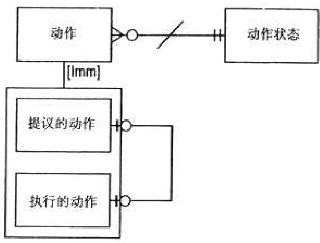  
图8-2计划和动作的基本结构  

用独立的对象记录提议和执行，使得差异可以被跟踪。  

例：在1997年7月1日，我决定为0OPSLA准备一个报告，可是我在3日之前不能着手做这件事。这些动作可以被描述为一个日期为7月1日的提议动作和一个日期为7月3日的执行动作。这个提议的所有其它属性都是一样的。  

我们可以提供一个派生的动作状态属性，使我们更容易分辨一个动作正处于什么状态，而不需要历用来记录动作状态的各种结构。在这个阶段，也许并不一定需要这样。但是，当我们考虑以后附加的结构时，这就变得很有价值了  

在每日动作记录中，为了保持最大程度的灵活性，如图8-2所示，提议动作和执行动作之间的连接是可选择的。通常，如果没有执行，最好的计划也会逐渐变坏，而许多动作发生却没有预先的计划。我们应该抵制将最后一分钟计划变为合理化的诱惑。  

例：Thursz医生为JohnSmith定制了一个全面的血液检查，可是没有找到患者不能完成这个检测。这就描述了一个被提议但没有执行的动作。如果这个患者在以后的日子重新启动这个检查，这就构造了一个新的动作提议。  

例：Cairns医生被命令护理一个在火车上犯了急性病的妇女。这是一个执行的动作但是没有被提议。  

迄今为止，我们考虑了动作如何被提议和开始，但没有考虑它们可以如何结束。很明显，动作要么成功，要么失败。问题是通常我们并不能很确定地判断动作是成功还是失败，尤其是在医疗保健方面。因而在本节里，  

何关于成功或失败的考虑留到将来去分析（参见8.7节）。对于医疗保健以外的领域（这时往往更容易判断成功或失败），这个定义可能过于严格。但区别对待按照预期贯彻一个动作和动作达到其目的这两者，依然是很有价值的。  

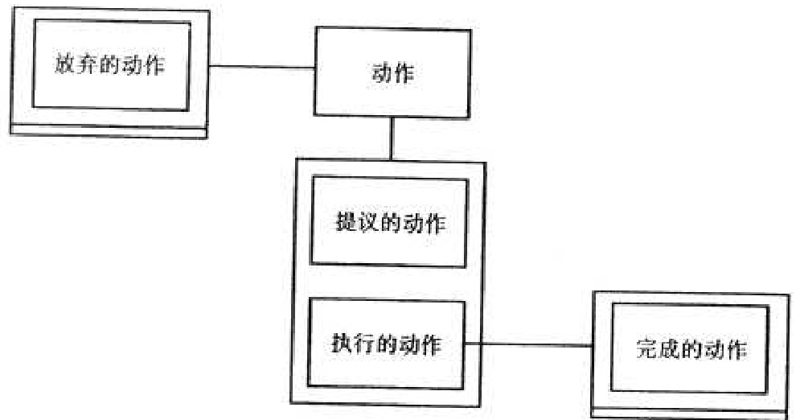  
图8-3完成的和放弃的动作  

放弃是一个动作的完全的和最终的停止。它或者在动作开始执行之前，或者在动作开始执行之后。放弃一个提议的动作就是决定不执行它，  

例：肾脏移植术通过使用一个捐赠的健康的肾来替换受到损害的肾，提供正常的肾脏功能。如果肾被安全地移植到患者体内，肾脏移植动作就可以被判断是成功的。如果以后这个肾脏出现排斥反应，并不能使移植过程的成功变为无效。这个移植过程依然完成了：只有在手术过程中发生了问题，才可能导致动作被放弃。  

例：我决定从伦敦坐飞机到波士顿，期望下午2：00可以到达。飞机晚点了，所以直到晚上7：00我才抵达。这个动作仍然是完成了，因为我在那天到了波士顿。我所遭受的飞机晚点意味着这个动作没有成功。另一个提议的动作是在那个晚上吃晚餐，然而，却放弃了。  

例：我的汽车不能启动，我确定问题是启动电机坏了。因而我提议并开始更换这个启动电机。就在刚开始，我却发现出问题的竟然是一段坏掉的线路，启动电机是好的。因而我放弃了更换启动电机的动作，尽管我对这样的结果并没有不满！  

8.3挂起  

我们也可能推迟动作，以后再继续完成这个动作。当这种情况发生时，挂起就连接到某个动作，如图8-4所示。这个挂起在它的时间段里是正确的（这个时间段也许没有截正）。如果一个动作在挂起的结束之后继续这个挂起依然存在，但是却不再起阻塞作用，动作继续。  

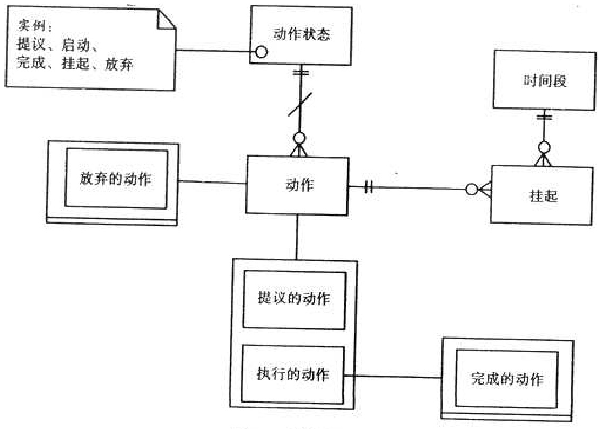  
图8-4动作挂起  

挂起是一个动作的暂时停止。  

因而一个动作如果与一个正在起作用的挂起连接，那么这个动作就被挂起。提议动作和执行动作都可以被挂起：挂起一个提议的动作和推迟一个动作的开始是等价的。  

例：一个惠者的名字在等候肾脏移植手术的名单上。这描述一个关于肾脏移植手术的提议动作。这个患者必须等到一个可用的肾脏。如果等候手术名单上的病人感冒了，医生就必须把这个惠者挂起。但是移植手术并没有放弃，因为当感冒减轻时，患者还会回到等候手术的名单上来。挂起记录实质上是解释为什么在那段时间里，医生不能给那个患者更换一个合适的肾脏。  

例：我有一个提议动作是洗盘子。这个动作经常被挂起很长一段时间，可是我从没有彻底放弃它！  

在最简单的意义下，计划是按某种顺序连接的提议动作的聚合。一个序列可以有许多种表达方式，可是一般大多数都表现为一种依赖，它表示一个动作在另一个动作结束之前不能开始。计划经常用依赖图来描述，比如在关键路径分析中。  

定护理计划是很常见的。而且，这样制定计划是很重要的。图8-6显示的结构支持动作间的相互作用，方法是允许一个动作被多个计划引用，并且依赖关系可以建立在引用之间，而不是仅在动作之间。  

  
图8-5提议动作之间的依赖关系  

本图只充许在一个计划内的提议动作，调整计划是很困难的。  

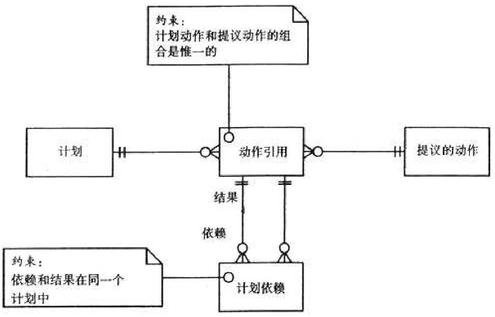  
图8-6一个由提议动作的引用组成的计划  

这个结构充许动作被若干个计划引用。  

例：一个医生为患者进行完整的血液检查。她核对了提议动作的清单，并且发现另一个医生已经提议了一个完整的血液检查作为他计划的一部分。这描述另一个医生的计划中有一个动作引用了完整血液检查的提议动作。可以创立一个新的计划，其中有一个新的动作引用这同一个提议动作。  

例：我要去一个买酒的商店为周六的晚餐买一些St.Emillion，为周日的聚会买一些OldPeculiar。去卖酒商店的动作在准备晚餐和准备聚会的计划中都被引用。准备晚餐的引用有一个依赖关系，其中出席晚餐是结果，去卖酒商店是依赖。聚会计划的引用有一个依赖关系，其中开始聚会是结果，去卖酒商店是依赖。  

这个在行为描述里使用动作和动作引用的概念是行为建模中一个普通的模式。这和子程序的定义以及在另一个子程序中调用它是类似的。子程序的定义部分并不包含如何在调用程序中使用它的信息。调用程序也并不知道子程序的具体内容。  

图8-6中的模型是一个简单的行为元模型。一个计划是描述打算完成的行为，因此行为建模技术是适当的。我们可以使用任何行为建模技术。首先，我们通过元模型图来描述这种技术。其次，我们把元模型的动作联系到计划对象和提议动作上。我们会选择一个精细而不过度复杂的行为模型。  

计划常受变化的影响，并且被其它计划所代替，如图8-7所示。这种关联在两个方向上是多值的一一当计划改变时，一个单独的计划可以被分裂并由多个独立的计划所代替，或者若干个计划可以被合并成一个计划。  

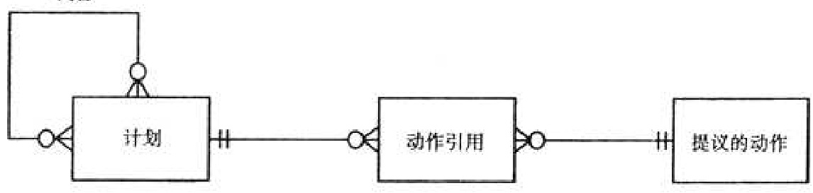  
代替  

例：我有一个计划：在GardenofEden买面包，在BreadandCircus买干酪。我用从Jae的快餐店买外卖的计划来代替这个计划。  

我们可以认为计划是一个动作的子类型，如图8-8所示。因此我们可以提议一个计划（就是说，我们可以为计划做一个计划）并且监视一个计划，观察它是否完成。既然计划通常十分复杂，那么能调度并追踪一个计划是很有价值的。  

我们可以认为一个计划是聚集动作的一种方法。例如，一个完全的面液检查可以被描述成一个计划，组成它的每一个测量都可以作为里面的提议动作。然而，这是一种非常笨手笨脚的表示法。图8-8所示的结构允许将一个动作分解为几个组成动作，但是它充许采用两种方法来描述动作成为一个更大动作的部分：使用组成关系适合于简单的情况，面使用一个计划适合于更复杂的情况。我们可以对由组成关系构成的层次结构进行约束使得组成关系只用于简单的情况。  

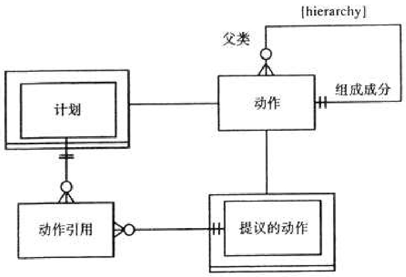  
图8-8计划作为动作和组成动作  

我们给计划做计划，并且可以有复杂的动作而没有一个清楚的计划  

# 8.5方案  

一个组织的标准运转过程是普遍的动作，它要运行许多次，每次都采用同样的方式。我们可以用方案来描述这些普追的动作，而方案的构造与我们为计划所使用的构造相似，如图8-9所示。计划模式，就像本书中其它的模式一样，可以被划分为知识级和操作级。操作级描述日常计划和动作。在知识级是方案，它描述支配操作级的标准过程。  

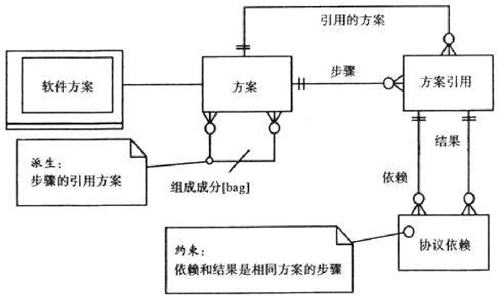  
图8-9方案的结构  

本图的结构类似于前面描述计划所使用的结构一一一个简单的行为元模型。在这个结构中，知识级和操作级之间有一些很有意思的差别。在知识级上使用层次结构是很少有用的。方案可以被许多其它的方案引用：很难想像对这种引用进行限制会起作用。在需要把动作按某种有规则的方式聚集的时候，我们经常能有效地把一个动作描述为另一个动作的一部分，例如测量可以作为一个完全血液检查的一部分。  

在知识级上，提议动作和执行动作之间是没有差别的，在一个计划和另一组动作之间也没有有价值的差别。方案的成分总是一个bag（因为一个方案可以在另一个方案中被执行不止一次），但是一个计划的提议动作总是形成一个集合（因为你不能两次执行同一个动作，但是两个动作可能符合同一个方案）  

一个方案的描述不需要详细到其组成成分。一个方案可以仅仅是一个名字、一段描述文字、教科书中的章节、网页、甚至是某人进行的一次独特的复杂的外科手术过程的录像。方案引用可以只描述其组成成分，而不描述组成成分间的任何依赖关系。一些方案可以被完全编写为计算机代码，在这种情况下，方案变成了一个软件。（软件方案是一个以软件方式编码的方案：而不是通信协议中的协议。）  

从一个复杂的方案中，我们可以按两种方式形成动作。最简单的方法是使用组成关系。当子动作都在一个适当限定的时期内发生，并且没有人需要共享这些成分动作时，这种技术的效果很好。我们首先为整个方案产生一个提议动作，如果我们不得不指出那些特殊的性质（例如定时和资源），我们就要简要地说明其中的子动作。（如果有许多这样特殊的性质，那么我们应该使用一个计划。）如果所有的动作在大约同一个时间被相同的团体完成，父动作就足够了。为每一个子方案的引用创立一个子动作：也就是，一个方案在父方案中执行三次将会产生三个子动作：动作间的任何依赖都会与方案中的表示吻合。  

当我们想监控什么时候和怎样执行单独的方案步骤时，计划能够提供更灵活和精确的跟踪，因此此时我们更倾向于使用计划。这些关系如图8-10所示。另外，一个计划允许它的子提议动作可见并被其它计划所共享。计划的一个重要特征是：当它们可以复制方案的依赖时，它们也可以定义新的依赖，从面忽略方案中的某些依赖。这种能力在技能性的职业（如医疗保健）中是很重要的，比如，我们经常不得不为考虑具体患者的需要而修改标准方案。我们经常需要一次性的计划，这些计划是基于方案的但不是简单的复制。  

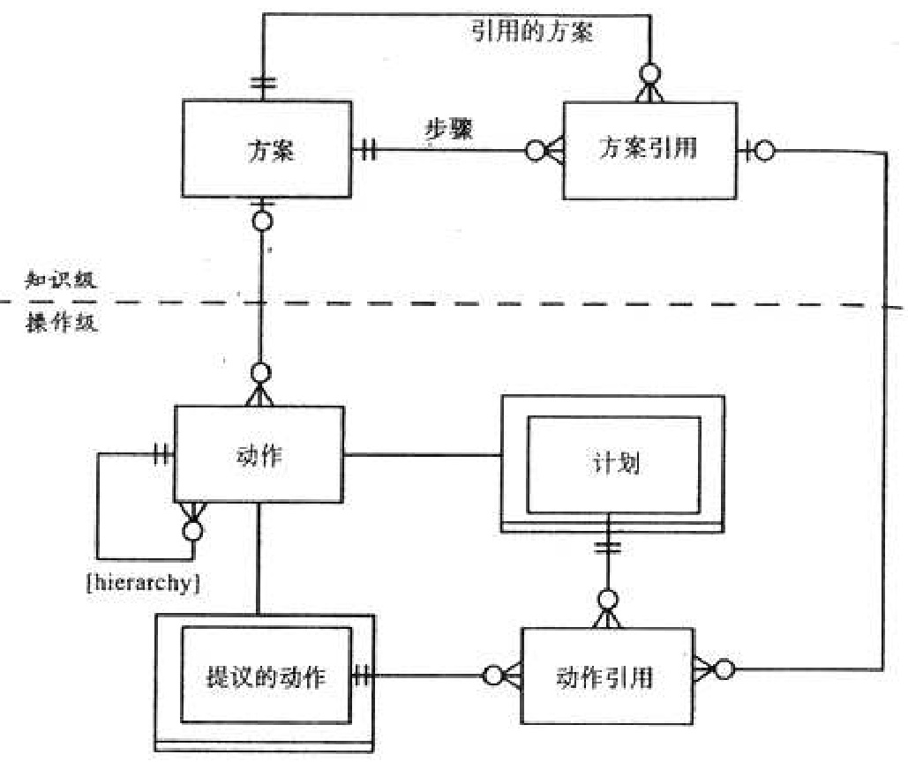  
图8-10动作、计划和方案间的关系  

计划和方案图  

我们也可以把一个计划描述为提议动作的有向非循环图（DAG）。图中的弧对应动作引用的依赖关系。每个计划有自已单独的图结构。我们可以如图8-11所示那样简洁表示。在本质上，这是另一种关联模式，属于第15章描述的风格。  

  
图8-11计划由提议动作的有向非循环图表达  

然而，要将这个概念应用到方案，我们不能为子方案形成DAG图，而要为方案引用形成DAG图，如图8-12所示，因为一个方案在另一个父方案中可以出现不止一次。对于图8-6所示的惟一的约束，与这里考虑的不是同一个问题。因此，DAG关联模式的基本形式包括依赖类型（以及约束）和DAG图中的元素在图中只能作为一个节点出现的要求。  

如果我们为计划结构使用一个图，那么我们就失去在计划引用和方案引用之间建造关联的能力，如图8-10所示。自然地，我们可能还要有DAG  

的版本作为一个派生的映射：派生将会包括如何派生图的弧。  

  
图8-12使用DAG的方案  

8.6资源分配  

计划的第二个主要部分就是分配资源。提议动作和执行动作的一个主要差别在于它们如何使用资源。一个执行的动作实际上将会使用分配给它的资源。一个提议的动作将会预定一些资源。图8-13显示作为一定数量某种资源的资源分配。资源只能被一个动作预定和使用。  

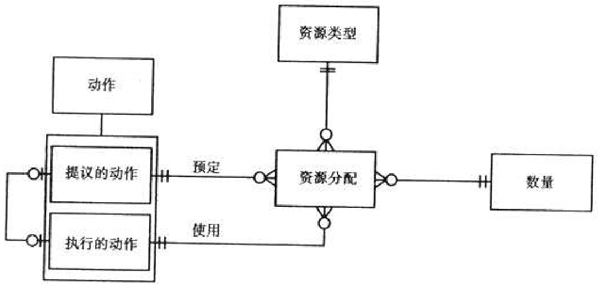  
图8-13使用资源的动作  

提议的动作预定资源，执行的动作使用资源。  

资源是多种多样的。最开始、也是最明显的资源是消耗品。消耗品是如药品、针和原材料这样的一类东西。消耗品只能被使用一次并且由动作来使用它们。通常消耗品要按数量来请求。  

例：10加仑的橙汁的分配是10加仑的数量和橙汁这种资源类型。  

例：有一个特殊的髋骨替换手术，要预定4个单位的袋装红血球（血液），可是只会使用两个单位的袋装红血球（血液）。这样替换会表现出两次关于袋装红血球类型的资源分配。一个是关联到提议髋骨替换的4个单位数量的资源分配；另一个是关联到执行骨替换的两个单位数量的资源分配。  

一些资源是不能消费的，如装备、房间和人。人是不能被一个动作所消费的（虽然我在写完本书之后仍对这种说法感到疑惑）。然而，我可以说一个人的时间被用完了。在这种情况下，资源类型是人，并且数量是时间。因而在这个动作上，我花了5个小时是一次我的5个小时的资源分配  

这个资源类型的观点可能有点太具体化。存在于知识级的资源类型，更典型的是指一类事物而不是某个事物本身。具体举个例子，我进行的工程需要一个有经验的面向对象建模员5个小时，而不是具体我这个人5个小时的工作。尽管有些人单独凭本身的头衔作为资源类型就足够了，但是我们这些大多数的凡人只是许多人中的一个。  

因此，在计划编制中，需求的描述形如“我们需要面向对象建模员的5个工作小时”。在编制计划的某些阶段，实际的结果是预定了我的5个小时，这是一个特定的资源类型的实例。这意味着资源分配的两种级别：一种是通用的指定类型，而另一种是具体指定的资源分配。  

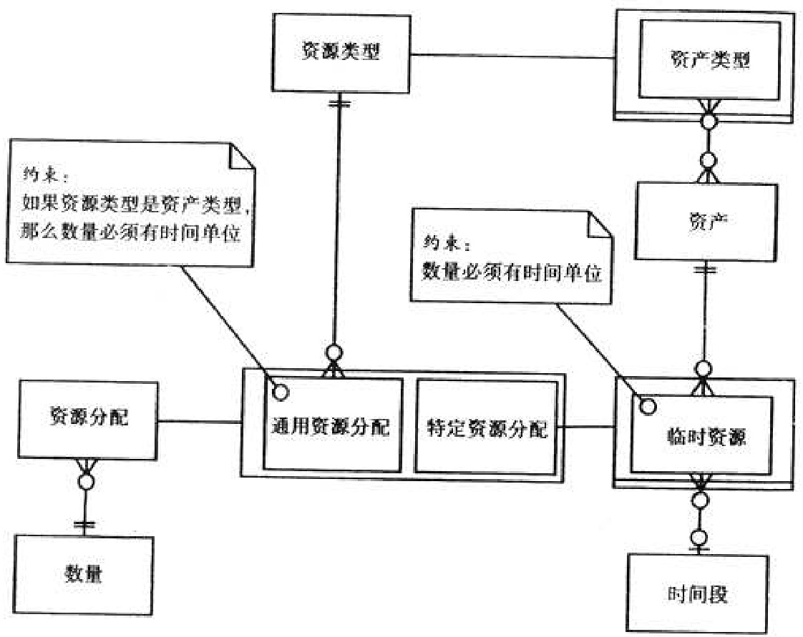  
图8-14资产的资源分配  

特定分配要指定具体使用或预定的个人资产。通用分配只是指定资产的类型。  

在图8-14中，具体的资源称为资产，资产又分为多种资产类型，这也是一种资源类型。特殊资源类型和普通资源类型之间的差别是前者分配的  

是资产而后者分配的是资源类型，而资产的资源类型就是指资产的类型。临时资源是资产的特定的资源分配。此时不仅要分配时间的数量，而且要分配一个特定的时间段。这个时间段可以从使用或预定临时资源的动作派生，也可以与动作相对分离。  

例：一个建模会议被安排在一间小会议室中进行，用时两个小时。最初，这描述一个预定通用资源分配的动作。这个通用资源分配的资源类型是小会议室这种资产类型。通用资源分配的数量是两个小时。后来，实际的会议室是预定了Q9。这重新分配（或者说替换）了通用资源分配到一个临时资源是两个小时的资产 ${\bf Q9_{\mathrm{\O}}}$ 如果这个提议动作是会议预定在星期四下午2:00到5:00之间进行，那么时间段就是从Q9的分配中派生的。如果会议的最后一个小时要在酒店中举行，那么星期四下午2:00到4:00的时间段就被连接到了临时资源。  

一个资产充许有几个资产类型。这种资产的多重分类在描述那些可以做几件事情的资产中是很重要的，尽管那时不一定需要同时做这几件事。  

例：如果会议室Q9有一个投影设备，它的分类既可以是一间小会议室又可以是一个报告厅。它不能被不同的动作在相同的时间预定。  

特定资源分配对消耗品不是很重要。例如，通常说“预定10加仑的橙汁并且被一个动作使用”就足够了，而不用更明确地说明是哪个10加仑。我们通常需要明确资产，因为在使用资产时，团体之间出现竞争的可能性很大。  

在这点上，如图8-13所示的动作子类型之间的关系是否应该特殊化是值得考虑的。例如：说执行动作只能使用资产的特定资源分配也许是合理的。假设这儿需要某种东西（但我不能确定它是否真的需要），有好几种方法可以来描述这种情况。这是展示一个业务规则可以用不同方法建模的好例子。  

首先，最显而易见的办法就是引进结构性的约束。既然这样，我们可以使用一个像“执行动作不能使用通用资源分配，这种方法分配的资源类型是资产类型”这样的规则。这种急切检查是一种强迫实施业务规则的强制性方法。也就是说，你不能记录一个破坏政策的情况。  

然而，这是一个太强硬的方法，以至于不能适应很多情况。有时候，允许记录一个破坏政策的情况是有意义的，面稍后还有一个独立的检查阶段。这种消极检查可能由一些执行动作（例如isConsistent（））上的操作来完成，并且如果遵循了业务规则，操作返回“真”。在一个充分的约束可能不会从头开始有效时，这就在控制状态方面提供了更大的灵活性。这个不完善的信息被记录下来，并且提供一个检测的手段。  

消极检查的巨大优势在于它分离了问题的解决和信息的记录。记录这个信息的人们可以在那个时候尽力记录，然后或者由他们或者由一个有资格的人在日后整理这些信息。如果在捕获信息时就可以容易地解决问题那么急切检查就更好。  

是否允许资产的通用资源分配来进行执行动作取决于具体的问题。如果领域的要求满意于知道要花费面向对象建模员的两个工作小时，而不需要知道具体是哪一个建模员，那么就允许资产类型的普通分配。这个问题依赖于资产类型。例如，医院的政策可能规定必须明确指明顾问的具体分配，但护理员可能只需要进行一般分配。  

如果我们关注从需要跟踪的有限储备中移走消耗品的情况，就可以对消耗品使用具体的资源分配。在这种情况下，我们需要说消耗品从一个特定的可消费的财产中减少了，如图8-15所示。依靠资源追踪过程，财产可以按照多种方法来组织，这些方法不是我要在这儿考忠的。然而，值得一提的是可以将财产看作一个账目，可以将资源看作其中一个条目，这样就可以用6.14节的方法描述。  

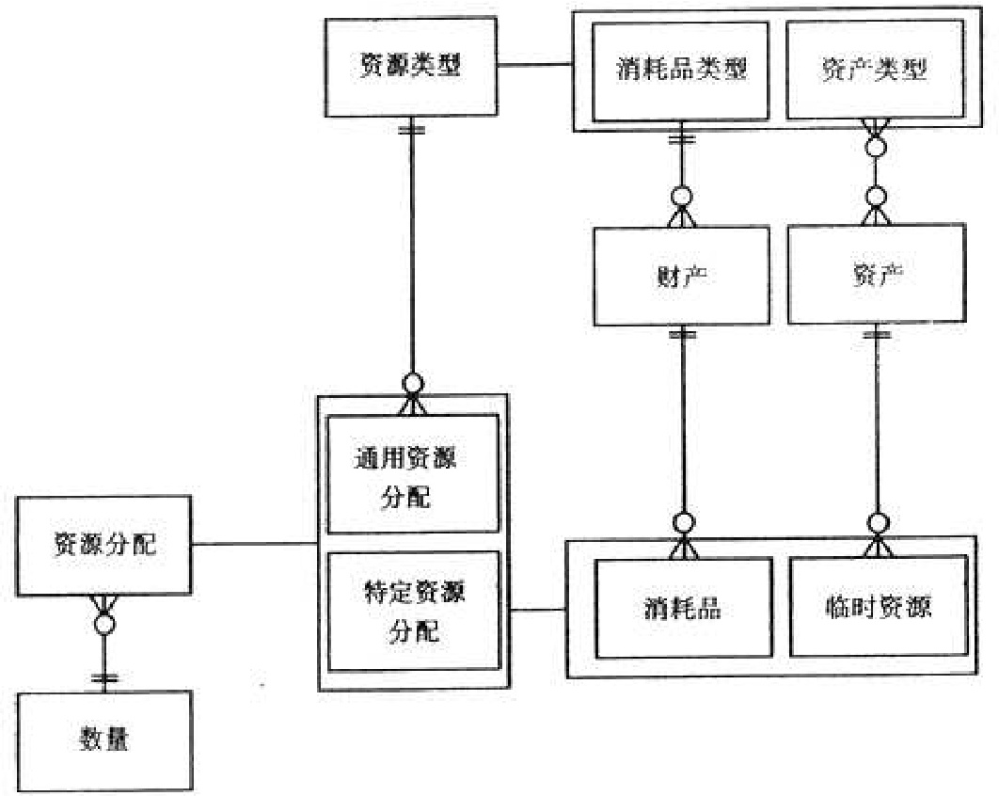  
图8-15允许特定的消耗品分配  

我们也可以使用资源分配来描述一个方案执行所需要的资源。此时我们使用通用资源分配。  

例：为了制作薄煎饼（印度面包），你需要1/4杯的面粉，1/8杯的水1/4大汤勺的油和一小握盐。这可以描述为4个通用资源分配。  

在本节里，我们使用第3章中发展出的概念来考虑我们形成一个计划的原因和如何判定计划的成功。  

计划由观察开始，当然，观察可以是假设或者推理。类似地，它们的输出是连接到计划中动作的观察，如图8-16所示。如同观察的许多其它方面，不同的执行者看到的输出连接是不同的。因而一些团体可能看不到作为一个动作输出的观察，而另外的团体却可以。我们将通过不同的执行者的不止一个的观察来记录这种情况。  

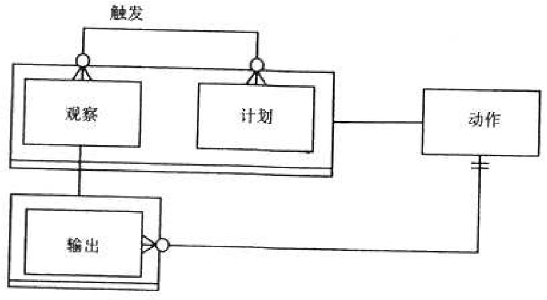  
图8-16观察、计划和动作之间的连接  

例：JohnSmith因为有了典型的糖尿病症状：体重减轻、口渴、尿频，所以来到他的医生这里看病。由于这些观察的触发，医生制定了一个计划。这个计划包括一个提议动作，来进行患者的血糖测量。  

例：在经历了不好的销售状况之后，一个公司决定通过加强代理和降低价格来提高销售额。一些分析专家认为销售额的增长是销售代理增加的结果，另一些分析专家则认为主要是降低价格的结果。每一个团体将进行分离的观察，每个观察都连接到不同的动作。  

注意：观察是动作的子类型。它们可以被调度、定时，它们可以指定执行者并且成为计划的一部分。它们的额外行为是确定一个观察的概念或者测量一个现象的类型。  

一个类似的连接集合出现在知识级，使用启动函数和输出函数，如图8-17所示。一个启动函数包含信息，这些信息应该可能触发一个方案的使用。在下面这个联合功能的例子中，这个模型记录观察的概念和方案，它们用作启动函数的参数，但是却不指明它们是如何结合的。这样做的意图是说明不同类的启动函数有不同的方法来结合两者。  

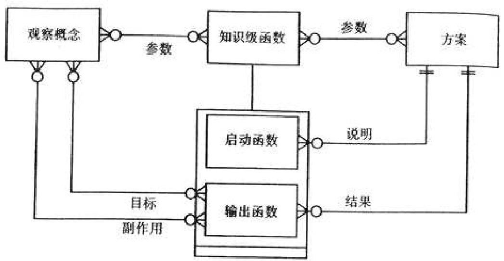  
图8-17启动函数和输出函数在知识级的使用  

启动函数指明开始一个动作的条件，输出西数指明目标和副作用。  

例：一个带着“油箱少油”作为参数的启动函数指明了这个加油的方案。  

例：beta-blockers是一种针对高血压和心绞痛的治疗方法，但是如果患者有哮喘，这种治疗方法就不应该使用。这将导致三个启动函数，所有的启动函数都指明beta-blocker治疗方法。（beta-blocker疗法是关于资源类型beta-blocker进行资源分配的方案。】两个启动函数，一个的参数是高血压，另一个的参数是心绞痛，并且没有其它症状需要处理。第三个的参数是哮喘并且是一个逻辑上的否定。（我们可以有一个与指明相反的启动函数的子类型，但是它实际上是完全依赖于处理参数的方法。】  

输出函数的操作类似。同样，输人是方案和观察概念的组合。结果是 两个观察概念的集合。一些观察概念描述使用方案的目标，就是描述方案的意图的输出。另一些观察概念是副作用。一个方案可能有许多结果。这可能会反映出在那个时候惠者在其它方案或者观察概念中的情况。这些作为参数从知识函数继承面来。  

例：降价是一个以增加市场占有率为目标的输出函数，它的副作用是减少了每一单位商品的销售收入。  

例：肝脏移植的方案有一个以得到健康的肝脏为目标的输出函数，副作用是器官排斥和输送胆汁的困难（因为胆管变窄了）启动函数也可能包括这些产生条件的可能性的信息。独立的输出函数可能有相同的目标和副作用作为参数，但是影响程序的还有描述疾病的参数。由于疾病参数的存在，这些独立的输出函数指明目标和副作用的不同可能性。  

Cairns,T,A.Casey,M.Fowler,M.Thursz,and H.Timimi.The Cosmos Clinica ProcessModel.National Health Service,Information Management Centre,15 FrederickRd,Birmingham,B151JD,England.Report ECBS20A&ECBS20B <http://www.sm.ic.ac.uk/medicine/cpm>,1992. 2. IMC.Common Basic Specification Generic Model National HealthService Information Management Centre,1992.  

本章着眼于货物的购买和销售，这些货物的价值与变化中的市场条件有关。根据为一个银行构建交易系统的经验，本章从银行买和卖相同货物这两个角度来看购买和销售。银行必须了解这些交易方式在不同情况下实际效果的价值。  

每一次交易都用一个合同（参见9.1节）来描述。合同能购买或者销售货物，并且它对于需要约束交易双方的商业活动来说是很有用的。我们可以通过使用一个合同夹（参见9.2节）来表示多个合同的实际效果。我们以这样一种方式来设计合同夹：使之易于汇集，并且以不同的方法选择合同我们给合同夹一个独立的对象一一合同夹过滤器一来定义选择标准。合同夹过滤器定义一个可以被不同的子类型实现的接口。这个结构提供更灵活的简单和复杂的选择标雅。这是一种用灵活方式确定汇集的有用技术。  

为了了解合同的价值，我们需要了解被交易的货物的价格。货物经常依据它们是要被买还是被卖来定不同的价格。这两种不同的定价行为可以由一个报价（参见9.3节）来捕捉。  

在易变的市场中，价格可能会迅速变化。交易人员需要依据可能的改变范围来给货物确定价格。场景（参见9.4节）把表现市场状态的相关条 件组合起来构成市场的估价环境。以便场景可能很复杂，并且需要一种方法来定义它们的结构，以便可以在不同的时间，按照一致的方式，使用相同的场景结构。场景在价格变化复杂的任何领域中都是很有用的。  

本章基于这样一个项目：为一家主要银行开发外汇派生交易系统。  

关键概念：合同、合同夹、报价、场景  

9.1合同  

最简单的金融交易种类就是从另一个团体购买一些交易物。交易物可以是股票、日用品、外汇或者其它普通的交易项目。一个基本的起点是如图9-1所示的模型。这个模型有一个合同的交易与另一个团体有关，该团体我们称之为对方团体，合同涉及一些交易物的数量。只显示一个简单的交易物，尽管严格地说所有的交易都包括两种交易物一一一种是为了和另一种交易。对于大多数的市场，一种交易物总是在当前的一个市场中使用的货币。价格因而被描述成一个货币对象。货币是一种单位为币种的数量（参见3.1节）的子类型。  

在外汇市场中，交易物是汇率。这看起来可能有点奇怪，可是所有交易物确实都是汇率。一个以道指出售股票的合同事实上是一个用股票兑换美元的合同。在大多数情况下，通过说这个交易物被兑换成一定数量的货币，更容易描述，可是对于汇率来说，更好的做法是使两个货币都依附于交易物上并让价格成为一个简单的数字。  

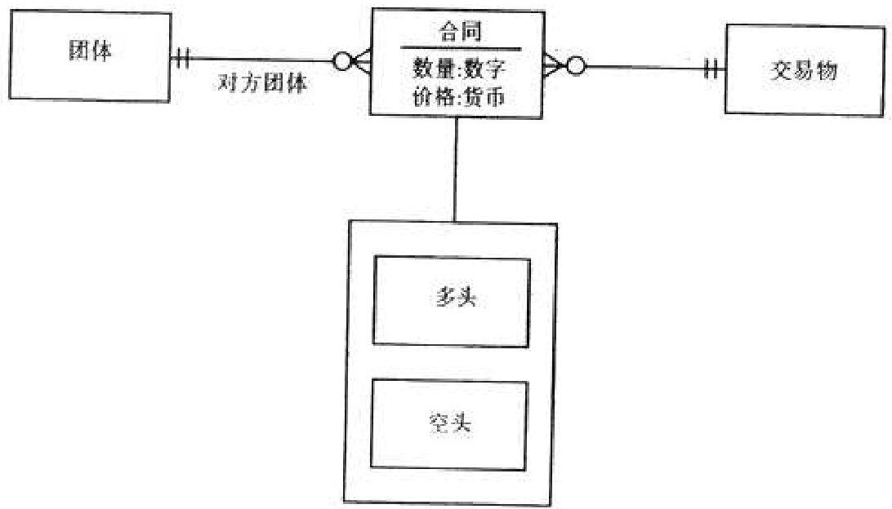  
图9-1合同的简单模型  

交易物的总数是和对方团体进行交易的具体内容。多头和空头是分别表示买入和卖出含义的术语。惟一的对方团体限制了可以被描述的合同。  

术语“多头”（long）和“空头”（short）是供交易人使用分别表达“买人”和“卖出”含义的术语，图9-1用子类型符号显示“多头”和“空 头”的区别。另一个替代方法是采用布尔属性isLong。两种方法都是可以接受的，可是我更喜欢图9-1在概念建模方面具有的明确性。子类型化和布尔属性在概念模型上是等价的：子类型化（Subtyping）并不意味着子类化（Subclassing）。但是，在可执行建模技术中（当子类型化确实意味着子类化时）除非多头和空头的行为确实不一致（有可能仍然没有区别）否则图9-1就是不合适的。一个接口模型可以以任一种方法实现。14.2节描述无论是使用子类还是标记，如何进行这种变换才能够保持相同的接口。  

例：Megabank以每股30美元的价格出售了1000股AromaCoffeeMarkers的股票给MartinFowler。这是一个空头合同，它的对方团体是  

MartinFowler，Aroma Coffee Makers，数量是1000，价 格是30美元。  

例：Megabank用200万美元（USD）从BritishRailways买了100万英榜（GBP），这是一个多头合同，对方团体是BritishRailwayS。数量是100万，价格是2，交易物是GBP/USD。此外，它也可以是一个空头合同，数量是200万，价格是0.5，井且交易物是USD/GBP。  

例：Northeast Steel 10000 Chrysler。对于Chrysler 这是一个多头合同，对方团体是NortheastSteel。交易物是钢材，在这种情况下，合同额10000吨用数量表示。（替代方法是：允许交易物是单位为吨的钢材，可是对其它的数量，这就少了灵活性。）  

这种风格的模型对于获取主体组织和其它团体之间的交易是有好处的。然而，通常交易是在主体组织内部进行的，例如在期权柜台和商品柜台之间进行。这些内部的交易常常控制经营上的风险。一个普通例子是一个交易抵消了期权的风险（叫做套利）。这些内部的交易带来了谁是内部团体的疑问。图9-2所示的模型提出一个更灵活的方法来回答这个问题。一个合同显示两个团体：多头（买方）和空头（卖方）在这种描述方法中，期权柜台和商品柜台被描述成单独的团体。如果期权柜台和一个外部的团体做了一个期权的交易，并且和一个商品柜台做了一个套利的交易，那么期权柜台对两个合同都是团体。如果期权柜台在期权交易中是多头团体，那么它在套利合同中就将是一个空头团体。  

  
图9-2通过分离的关系来显示买方和卖方  

有两个团体支持内部交易，完全的外部交易，以及在主体组织内部进行的不同团体的交易。  

图9-3用稍有不同的方法描述一个类似情况。此外，充许使用两种关系描述内部交易。然而，这儿有一个主要团体和对方团体的概念，这比多头和空头要好。当主银行团体和一个外部组织做交易时，主银行团体一直是主要团体。在内部交易中，主要团体和对方团体之间的选择是随意的，虽然按惯例通常是主要团体发起交易。多头和空头的子类型是主要团体所看到的交易的本质。  

依照最初的分析，图9-3所示的模型看起来不比图9-2所示的模型更有价值，因为它增加了一对子类型却没有任何大的优势。当然，如果数据结构变得更复杂，数据建模时就会拒绝这种做法。在00建模术语中，重要的问题是接口。是提供一些操作请求主要团体、对方团体、多头或空头合同的业务更有用呢，还是拥有一个多头和空头的团体更有用？可能图9-4所示的模型是最好的，它从本质上来说提供所有两个接口。决定因素是从用户的观念来看，什么是最有用的。对于我们的实例系统，图9-3的模型对于交易人比图9-2的模型更有意义，它在构造软件方面更有用，尽管图9-4的接口是最后提供的。  

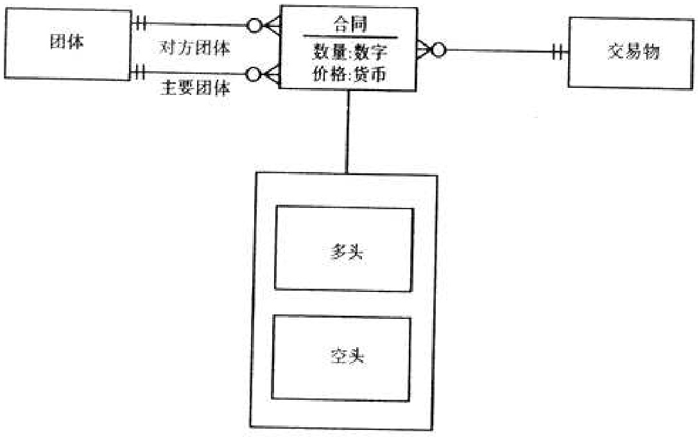  
图9-3对方团体和主要团体  

这是一个比图9-2更简洁的图，但是它能更好地支持交易人的观点。  

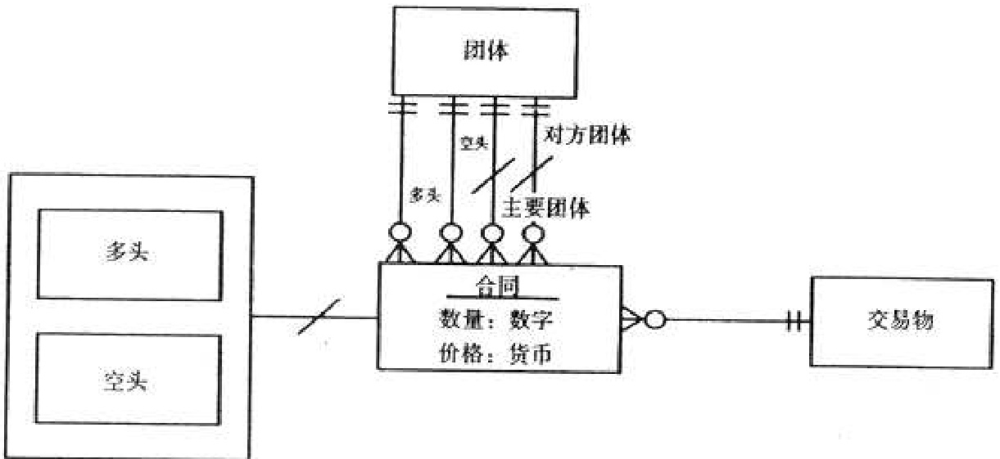  
图9-4使用四个团体的映射  

最满意的一种方法。如果领域专家感到两种方法都有价值，那么就两种都显示并且把其中一个标记为派生的。  

头和空头的派生映射。这个模型不能限制实现者使用任一种实现方式。可以讨论的是你可以不派生任何东西，而只使用简单的规则（例如，如果合同是空头，那么空头团体和主要团体是相同的对象）。我更喜欢表示出派生来使交互关系更加清楚，可最终这只是对建模方法的个人喜好问题。  

建模原则：把一个特征标记为派生是对接口的一种约束，但不会影基础的数据结构。  

图9-2\~图9-4所示模型的一个结果是可以记录一个跟主银行无关的合同。我们可以通过强制主团体至少成为一个主银行的团体来避免这样的情况出现。或者，我们可以询问领域专家支持这些交易是否有价值。销售商通常喜欢记录他们的客户和其它银行的交易，因为这提供给他们关于他们的客户可能冒的风险的侧面信息并且可以使他们的销售合同得到改善。在这里，模型的灵活性就支持了新的交易能力。  

一个未解决的问题是交易模式中的合同和第6章某个账自模式中的事务的关系。一个交易也可以看作是一个事务，例如，从Megabank的账目上收回100o股AromaCoffeeMakers的股票并且把它们存人MartinFowler的账目上（同时，在相反的方向进行合适数量的货币转账）。交易和事务都是有用的，可是目的不同。建模时，需要更多的需求才能进一步探究这两者之间的关系。  

9.2合同夹  

我们很少单独考虑合同，尤其当我们需要控制风险时。通常，银行会考虑一组相关的合同并且评估它们的联合风险。这可能是与某个交易人有关的合同，或与某种特殊的交易物有关的合同，或与某个特殊的对方团体有关的合同，或是其它某种组合方式。  

本质上，合同夹是合同的聚合，如图9-5所示。通常，可以通过场景给合同夹和合同进行定价，从而达到评价它们的目的。一个场景就是某种市场情况的描述，或是现实的，或是假设的（我们将在94节更加详细地讨论场景）。一个合同夹的价值在本质上是其包含的合同价值的总和。  

关键的问题在于合同到合同夹的映射的基数。一个合同存在于多个合同夹中是否有意义，依赖于我们怎样产生和使用合同夹。如果合同夹是一个交易人的工作簿，那么合同存在于管理此交易的交易人的合同夹中。然而，这并不允许将和一个特定对方团体进行的所有交易都放在一起考虑因而允许一个合同存在于许多合同夹中看起来是有优势的。因此，可以按照不同的观点构建合同夹来控制风险  

  
图9-5合同夹介绍  

一个合同夹是若干合同的聚合，可以作为一个整体来评估。  

然而，这样使用合同夹会产生另一个问题。假设我们需要一个包含所有与特定对方团体有关的合同的合同夹。我们将搜索所有合同并将搜索到的合同指定到合同夹。然而，一个较好的方法是让合同夹指定合同。我们可以给合同夹一个布尔方法，它把合同看作一个参数，如图9-6所示。合同夹由布尔方法求值为真的所有合同组成。这充许我们依据任意合同性质组合选择合同，构成合同夹，面合同夹的所有管理功能都能在这个集合上执行。  

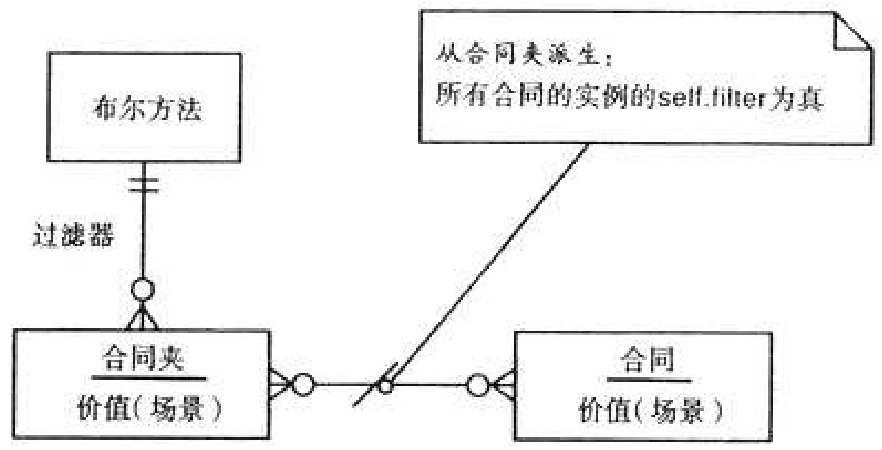  
图9-6带过滤器的动态合同夹  

这允许通过合同的性质来隐含地描述合同夹。建模原则：如果一组对象可以用不同的标准来组织，就应当使用合同夹。  

充许合同夹有多种方法，以便它们可以用合同组织自己，这是一个很有力的见解。这意味着不需要选择单独的结构来考虑成组的合同。各种结构都可以用一种特定的方式使用。一日定义了结构，它就可以在将来被想起并被使用，它的内容也可以被定期更新。可以在任何时候定义结构，甚至在将合同放在一起很久以后再定义这个结构。事实上，我们是在进行一个查询，并且对象聚合的结果本身又是一个对象。  

这个布尔方法怎样实现？一般来说，当合同作为一个参数给出时，方法可以是任何一块返回真或假的代码。Smalltalk程序员可以认为把一个单独的参数块赋值给合同夹的一个实例变量就会得到想要的能力。 $\mathrm{C++}$ 程序员也可以使用相同的原则，尽管这更加难以掌握，因为 $\mathbf{C++}$ 需要一个编译好的函数。这和6.6节讨论的个体实例方法是相同的问题。  

理论上，布尔方法可能是最好的方法，可是实际上有一个更简单的方法也可以完成以上功能。合同夹一般由许多合同组成，这些合同具有某些属性，包括对方团体、交易人（主要团体）交易物和交易的日期等方面。我们可以合并这些属性到一个特殊的合同选择器对象，如图9-7所示。合同选择器不像布尔方法那样通用，它只能处理限定范围的过滤条件。然而，它却很容易建立；使用者可以通过一个合适的使用者界面轻松地配置它。如果我们使用合同选择器来处理用户需要的大多数合同夹，我们就能减少相当数量的编程工作量。  

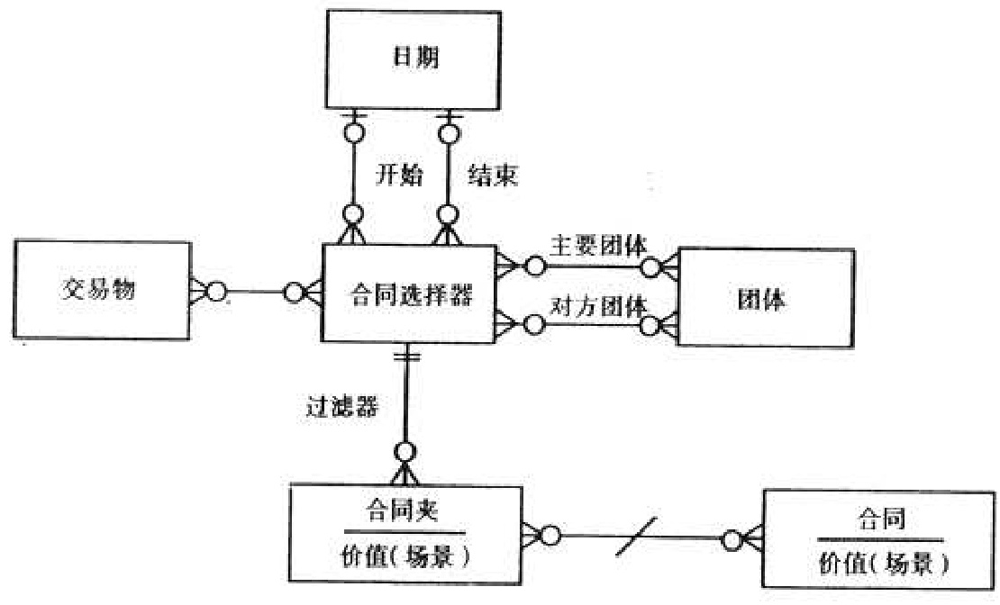  
图9-7合同选择器  

注意：这是一个参数化方法的例子（参见6.6.4节）它不能实现所有可能的合同夹，但是与更通用的实现方法相比，它可以更容易地实现实际中使用的大多数合同夹。  

例：一个合同夹由所有的交易组成，包括出售给JohnSmith的AromaCoffeeMakers股票。这个合同夹有一个过滤器，AromaCoffeeMakers股票作为交易物，而JohnSmith作为对方团体。  

我们不必一定要在合同选择器和布尔方法之间为我们的过滤器做出选择。我们可以有通过使用如图9-8所示的模型来表示的最好方法。这个模型把布尔方法和合同选择器都抽象成一个单独的、抽象的类型一合同夹  

过滤器。这允许我们对简单情况使用合同选择器，而对更复杂情况使用一定范围的硬编码得到的过滤器。我们可以轻松增加其它的合同夹过滤器。这是一个策略模式[1]的例子。  

建模原则：当把一个过程看作类型的一个特征时，应该给这个过程提供一个抽象的接口，使得实现能轻松地通过子类化而改变。一个通过硬编码得到的实现是一个子类，不同的参数驱动方法是其它的子类。  

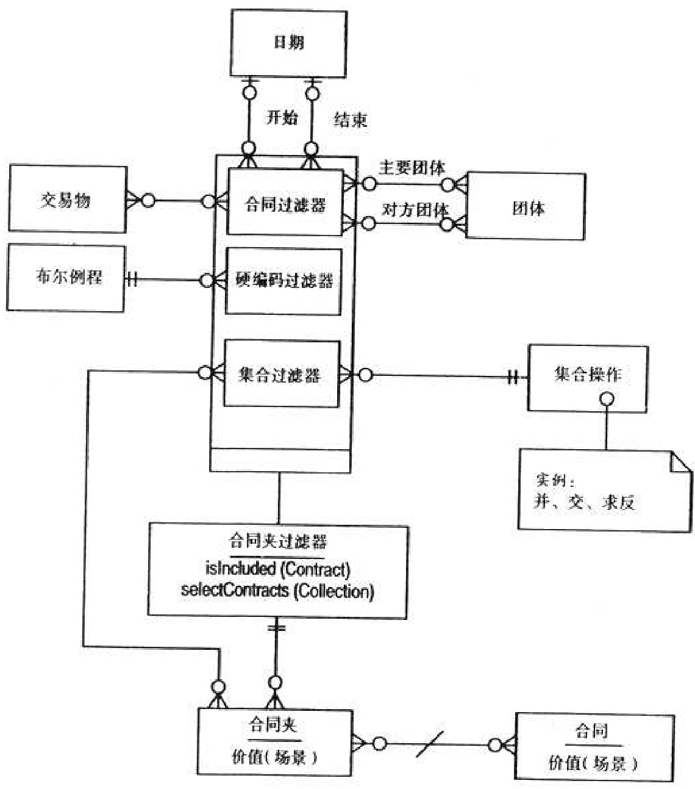  
图9-8提供多种合同夹过滤器  

这个模型提供灵活性来处理复杂情况并提供简单的参数化方法来处理简单情况。这是一个策略和参数化实现的组合（参见6.6节）。  

合同夹过滤器上的选择操作处理一个合同的聚合并且返回另一个合同的聚合。对于每一个输人聚合中的合同，选择操作求出islncluded的值  

提供特殊的行为。一个合同夹可能使用islncluded函数来检查单个的合同  

还有一点要说明的是：关于“合同夹过滤器”和合同选择器”的命名。和我一起工作的同事发现这两个术语之间的区别在实践中十分有价值。一个选择器选择的应该是其前面出现的事物；因而一个合同选择器是用来选择合同的，它返回一个合同的聚合。一个过滤器选择的是一些其它类型的事物，而其前面出现的事物是其服务的对象；因此合同夹过滤器是为一个合同夹选择合同的。通过采用一致的命名，很容易记起这两种对象的职责：过滤器只 是一个选择机制，而由合同夹增加其它的行为，如产生总价值。另外，合同夹在本系统的其它部分引用，而过滤器只是为达到选择的目的而使用。  

合同夹可以是短暂的，也可以是持久的。短暂的合同夹按要求被填充。过滤器是指定的，并且要检查所有合同的实例来看它们是否和过滤器匹配。一旦一个客户完成了合同夹，它就会被抛弃。持久的合同夹按相同的方法产生，但是它并不会被抛弃。当新的合同产生时，要核对存在的持久合同夹。如果它们匹配了过滤器，它们就被增加到合同夹中。任何基于合同夹的处理必须在那时更新，最好是增量式的。持久合同夹提供更快的查询性能但是减缓了合同的产生性能并且耗尽了存储空间。一个基本的建模原则是用户不应该知道合同夹是短暂的还是持久的。合同夹应该可以从一个状态自动切换到另一个状态，而不需要用户的干预。这就要求创建新的合同夹过滤器时要核对任何已存在的持久合同夹过滤器。如果有一个已存在的过滤器匹配，那么就应该引用这个已存在的合同夹过滤器而不是产生一个新的合同夹过滤器。  

合同夹在许多领域都很有用。合同夹的基本特征与对象的基本特征相同，即把为一组某种类型的对象而进行的选择机制封装起来。合同夹可以作为处理某种更进一步的汇总的基础。这个处理可以是一个客户对象（比如在本章），也可以被构造成合同夹本身。  

例：一个汽车生产商能开发生产汽车的合同夹来汇总产品和错误数据。过滤器可以按照汽车的生产厂家、型号、生产手段或者某些日期范围来选择汽车。  

例：公共卫生是医疗保健的一个重要分支，它研究患者群体的健康问题。我们可以按照一种特征域来选择人群：年龄、居住地、适用的观察概念等。这些人群可以被过滤器定义，并且可以对他们进行观察，例如一天吸烟超过20支的人的平均峰值流量率。（人群是这样一个人的合同夹，其过滤器是一天吸烟超过20支的人。）  

任何在金融市场上交易的东西都有一个价格。然而，那个价格并不是通常单一的数字。被报价的有两个数字：购买的价格（出价）和销售的价格（索价）。我们可以通过给这对数字的使用进行建模来描述价格，如图9-9所示。  

  
图9 $^{9}$ 通过两个数字的属性来描述价格  

一个交易物可以使用数字或者货币对象来估价。通常，股票使用货币来估价，而汇率使用数字来估价。报价行为在任一种情况下都是一样的。（我们可以把报价看作一个参数化的类型。）  

尽管两个数字是通用的，但是它们并不总是被使用。有时，报价是一个单独的价格，它描述价格的中间值。一个单独的价格用差价一出价和索价之间的差值一来报价。有时，我们可能只看到出价，或者只看到索价。这影响报价显示的方法。在外汇市场，汇率（如USD/GBP）可能报价为0.6712/5，这说明出价是0.6712而索价是 $0.6715_{\mathrm{\circ}}$ 如果只有出价，显示的报价就是0.6712/；只有索价，显示的报价就是 $/0.6715$  

任何可能有双向价格的对象——如汇率、日用品等—都需要一个如图9-10所示的行为的数字。可以把这些行为组织成一个单独的报价对象，如图9-11所示，这个对象提供双向价格所需的所有行为。任何用报价来表示价格的事物都需要一个报价属性。  

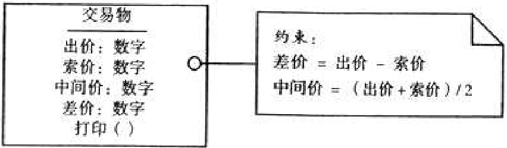  
图9-10支持双向价格所需的行为  

报价已经成为一个基本类型，并且最好能被描述成那些区别属性和对象类型的建模方法中的一个属性。注意：属性不能描述数据结构这一点是很重要的，仅仅是表示存在适当的操作。  

例：汇率USD/GBP是0.6712/6。交易物是USD/GBP。这个交易物有一个报价，它的出价0.6712，索价是0.6716，中间价是0.6714，而差价 是0.0004。  

例：一个CD交易出售已使用过的全价CD12美元，而购买它们花了8美元。出价是12美元，索价是8美元，中间价是10美元，而差价是4美元。交易物是全价的古典CD（正好是肖邦的夜曲）  

  
图9-11使用独立的报价对象  

这是一个好方法，因为它把特殊的职责放到一起成为一个简单的可重用概念。  

建模原则：当多重属性和一个可能在几个类型中使用的行为进行交互时，属性应该被结合成一个新的基本类型。  

双向价格是普遍的，可是有时单向价格也被使用。单向价格的建模有点难以常握。一个替代办法是允许价格是一个报价或是一个数子。这在强类型语言氧如 $\left|\mathbf{C}\!+\!+\right|$ ）中儿平是不可能的。甚至在Smallialk中：股票的客户在用它做任向事情之前，就被强制检查价格返回什么类型的对象。  

二个替代办法是让报价成为数字的一个子类型。这个方法可行是因为报价可以响应算术操作，可是它还是要求客户在处理股票价格时（打印版外）要知道两者的差别：在 $\mathbf{C}\!+\!+$ 中，数字不是一个内置类型，但实型和整型是内置类型，除非提供一个数字类，否则不应该使用这种方法。  

另一个替代办法是让数字成为报价的一个子类型。在概念上，这方法有一个明确的要求。数字只是简单的报价，并且不难考虑，每一个数字的实例都是一个报价的实例一一出价和索价相同。（类似地，我们可以说数字是复数的一个子类型。）尽管这种考虑有概念上的优点，但是它在一个接口模型中却是失败的。为了使数字可以成为报价的子类型，它必须完全维承报价的接口。报价只是在很少的领域使用，而数字却几乎在每一个领域中使用。从报价子类型化意味着报价可以在所有的领域使用，包括许多报价行为没有用的领域。报价必须被设计为对数字可见，而不是反过来。  

建模原则：如果超类的适用领域狭窄而子类的适用领域广泛，就不应该使用泛化。  

现在，我们应该考虑报价的双向形式和单向形式之间存在着怎样的共性。存在两种替代方案：或者将单向报价作为一种报价，出价等于索价：或者向单向报价请求出价或索价是错误的。第一种方案有一个抽象  

报价的存在，如图9-12所示，而第二种方案避免了任何这样的泛化。第一种替代方案，客户可以把单向和双向报价作为相同的行为而不涉及它们的差异。然而，这可能导致不准确，因为客户不能肯定是在处理双向报价的出价需要一个类型测试操作（isTwoway或者hasType（TwoWayQuote”）），以便客户可以进行类型测试。如果没有抽象的报价，则这些不准确就不会发生，可是客户每一次必须使用类型测试来了解调用的操作其使用是否安全。  

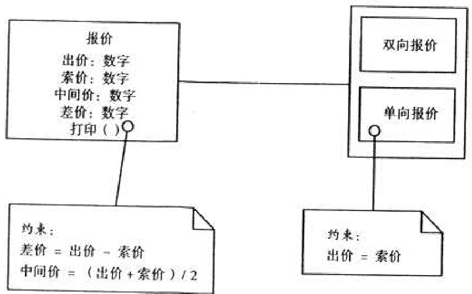  
图9-12带子类型的抽象报价  

单向价格被看作是双向价格的一种特殊情况。  

决定的关键在于是否可以接受经常忽略双向报价和单向报价之间的差异。如果这几乎不能被接受，那么最好不要有抽象的报价类型。然而，如果它经常可以被接受（这要看具体情况），那么我将强烈鼓励使用抽象的报价类型。记住，对于客户来讲，使用抽象的报价决不比不使用需要更多的努力。当不需要考虑两者的差异时，使用抽象的报价还能节省工作量  

建模原则：如果两个相似类型的差异经常被忽略，那么一个抽象超类型就可以被使用。如果它们之间的差异通常是很重要的，那么一个抽象的超类型就不应该被使用。  

建模原则：如果一个抽象类型从不需要客户花费更多的努力来使用，那么它就应该被提供。  

这个抽象的报价类型包含子类型的所有行为，因为在子类型上没有附加的操作或者关联。通常，我们不使用子类来实现一个抽象报价的子类型化，尤其是因为这样一个基本的对象经常使用 $\mathbf{C++}$ 中的容器。更好的实现方式是报价类中的一个内部标志，尤其是因为我们经常需要折合一个双向报价（也  

就是，把它转化成一个单向报价），或者反过来，这时需要动态的分类。  

一个隐含的报价可以是购买或者销售，在每种情况下都不需要双向价格。只有当购买和销售两者都需要时，才需要双向报价。  

有时，我们需要描述作为报价的合同的价格。通常，当对方团体询问合同的价格时，它们并没有指定方向；在那种情况下，交易人用报价来答复。通过保存报价，当合同被报价时，交易人记起差价是多少。实际费用的数量就可以轻易地从合同的方向和报价中得到。  

9.4场景  

交易物的价格绝不是一成不变的：否则，世界股票市场将是一个很少能引起人们兴趣的地方。我们需要能显示价格如何随着时间而改变并且保持那些改变的历史记录。我们通过在报价上设置一个时间点来完成它，如图9-13所示，或者通过在交易物和报价的关系上设置一个时间点，如图9-14所示。两种方法之间的差异很小，可是却很重要。前一种方法，报价为它的双向特性和时间依赖行为负责。后一种方法，那些职责分离了。因为我把报价当作一个应该尽可能保持简单的基本类型来了解，所以我宁可使用如图9-14所示的方法。  

  
图9-13给报价增加一个时间点  

时间点指明在什么时间报价对于某种交易物来说是相符的。  

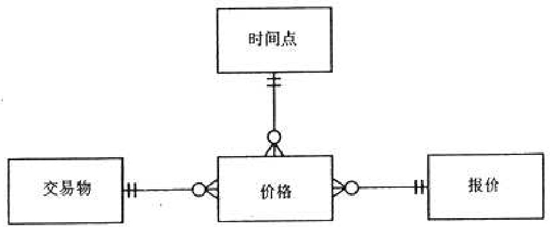  
图9-14在-个特别时间点上的股票价格  

这从在某个时间点适于一种交易物价值的概念（价格）中分离了双向行为（报价）。  

在这些模型中，查找市场的收盘价时，需要收集那个市场的所有股票，并寻找每支股票的最后报价。另一种替代方法是把这些报价的聚合本身看作一个对象一即一个场景，如图9-15所示。这个场景描述在特定的时间点上的市场状态，而场景中的元素描述在那个时间点的价格。  

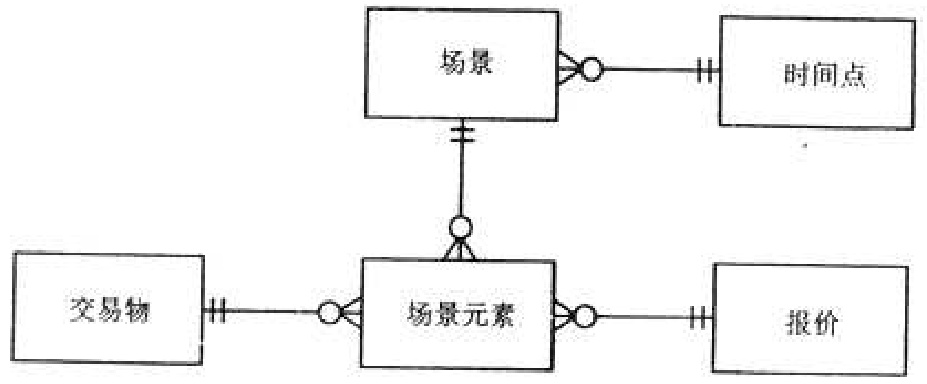  
图9-15场景  

这充许在一个单独时间点上的一组价格被看作是一个单独的对象  

如果我们仅仅是想获取一个股票市场的公布价格，那么场景看起来并没有增加太多的新东西。在无场景模型中，很容易通过查找某个时间点来得到。这里的重要问题是交易人从哪里得到价格。一个来源是交易的公共报价。对于那些股票基金的管理者们来说，另一个考虑就是可能的将来价格。当市场情况改变时，基金管理者和交易人要投人大量努力到管理他们的合同夹的风险中。这种风险管理包括查找可选择的情况和考虑它们在资产价格方面的影响。  

例：一个基金管理者正在管理股票的一个合同夹。她要考虑可能的油价下跌，这将促进许多股票价格的上升但是会降低其它一些股票（例如石油公司股票）的价格。这个管理者想看看几种不同程度的下跌并且考虑它们如何影响一个合同夹。这些下跌股票中的每一个股票都导致一个不同的场景。  

例：一位生产管理人员正在评定汽车可能的生产成本。原材料成本和人工成本是和价格有关的交易物。对于这些交易物不同的可能价格，可以构建多个场景。  

以上的几个例子是假想的情况，显示了采用场景的好处。在假想情况中，场景对象提供把所有因素综合在一起的基础，这样不同的情况能很容易相互比较。  

我们也需要考虑市场：市场中的价格没有一个单一的发布者，例如外汇市场。在这种情况下，我们需要增加发布价格的团体到模型中。图9-16和图9-17显示在初期的模型上增加了发布团体。有场景和无场景的方法都是有效的。显然，风险管理是是否需要场景的决定因素。  

例：一个进/出口商人考虑在许多欧洲国家的货物的价格。我们可以通过形成一个场景来描述价格，在场景中，交易物是他有兴趣交易的货物。  

通过着眼于这些市场之间的差异，使用双向价格，他可以寻找价格差别比运输这些货物的成本大的地方（这个过程我们通常称之为套利 $\lambda_{o}$  

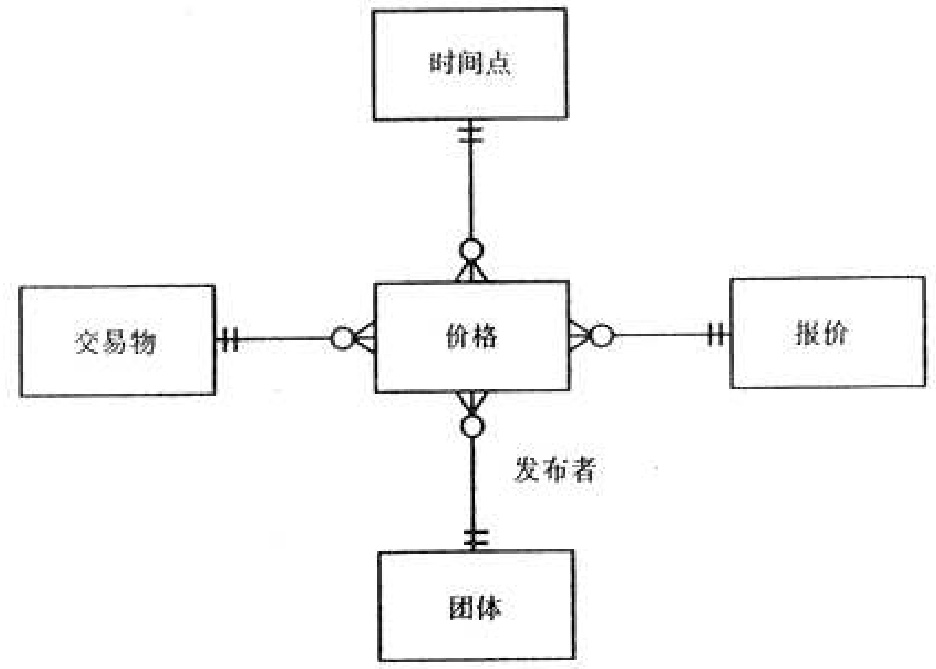  
图9-16带发布团体的图9-14中的模型  

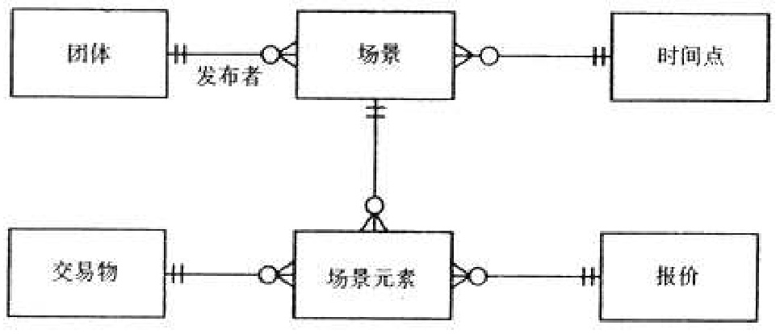  
图9-17带发布团体的图9-15中的模型  

使用发布者是使用场景的另一个原因。  

建模原则：场景应该在价格或者汇率的组合需要被看作一个整体的时候使用。  

定义如何构造场景  

价格到底从哪里来？在有些情况下，这可能是一个简单的问题，例如，当价格由一个交易所发布时。在其它的情况下，特别是当假想的场景存在时，就可能要使用更复杂的方案。  

在宽泛的条件下，我们可以看到价格的三个起源：由某些机关发布的市场中的普遍报价，从其它的价格或者市场特征计算，或者是某个单独的交易者或者分析家们的意见。第一种情况，如图9-18所示，是最直接的，通过特定的操作得到相关信息。通常，这些信息来自一个信息源。例如路透社，它告诉我们在哪里寻找信息（例如，“第3页，以IBM开始的行的第2列）  

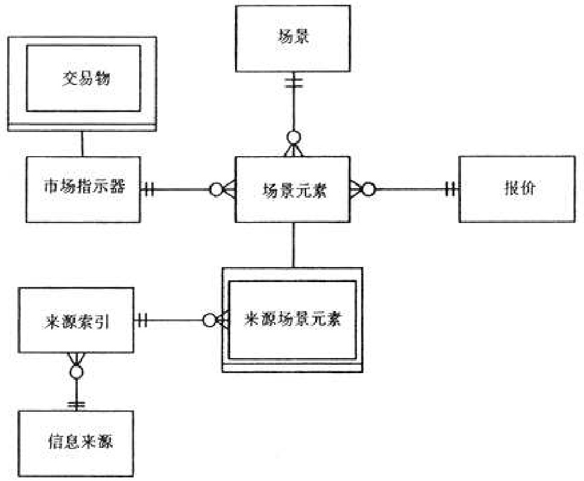  
图9-18场景元素的来源  

这个模型描迷一个特定的元素是从哪里来的。  

实际上，使用一个发布的价格，需要派生一个来源场景元素报价。我们从来源索引派生得到这个报价，而不是断言这个报价是针对一个来源场景元素。因此，可以考虑将这个到报价的连接做成一个派生连接。如果连接从没有被断言，这就可以安全地实现（比如记录交易人的一个推测）。对报价进行断言可能会导致问题，因为有时报价是断言的，有时报价是派生的。排除这个问题的一种方法是为混合的和随意的派生关系使用一个表示法（符号）（参见0dell[21）。这看起来把这个派生的问题带得太远了。我倾向于做上标记，按照大多数普遍情况并且在支持的文档中精确地描述发生了什么。  

例：一个分析家在观察邮购货物的价格时，可以把每个公司看作一个信息来源。来源索引可以是目录里的一个页码。这对每一个零售商来说，都可以设立一个场景，或者把所有零售商联合起来：建立全局的场景。这样，不仅能支持寻找交易物的价格，还可以支持某个交易物的最低价格和平均价格。  

图9-18提出市场指示器作为一种交易物的超类型。这反映出场景可以包含交易物以外的事物。对于派生的事物来说，定价方法的一个重要部分就是交易物的变更率一一个数字指明某种交易物价值改变的多少。变更率不是可以交易的交易物，可是在一个场景中，它和一个交易物以相同的方法来记录。因此，一个市场指示器包括变更率，也包括所有的交易物。  

例：外币市场有许多并不是交易物的市场指示器，包括各种货币的利率和汇率的变更率一指出汇率改变的多少。  

例：一个分析家在观察邮购货物的价格时，对牛仔裤价格的上涨很有兴趣。牛仔裤价格的增长变成了一个市场指示器，可是并不是交易物。而牛仔裤既是市场指示器又是交易物。  

计算场景元素也很简单。关键是计算价格的算法本身可以成为一个对象。关于这个的简单例子是外币中使用的交叉汇率。如果我们知道USD/DEM和USD/GBP的汇率，我们就可以通过（USD/DEM）/（USD/GBP）来计算GBP/DEM的汇率。我们可以通过拥有一个交叉汇率场景元素来描述它我们可以通过拥有 $\dot{-}$ 个场景元素的子类型来建模，这个场景元素引用作为分子和分母的其它两个场景元素，如图9-19所示。适合于交叉汇率场景元素的报价要从适合于分子和分母场景元素的报价派生而来。  

  
图9-19通过交叉汇率来计算场景元素  

这可以用来从两个已知元素的比率来测定第三个元素。  

注意：分子和分母被表示为场景元素而不是市场指示器。如果我们仅仅通过上述的描述来表达交叉汇率，那么引用市场指示器看起来是最切合实际的（USD/GBP是一个市场指示器）然面，提供场景的根本目的在于：对于相同的市场指示器，应该允许我们在不同的假设下公布几种不同的价格。引用市场场景元素充许我们把注意力集中在这些我们将要使用的价格上。这些可能是两个USD/DEM数字：一个来自路透社，一个来自LIBOR。通过引用这些场景元素，我们能指明我们需要的是哪一个。  

例：有一个交易人是法国法郎的专家。她通过使用德国马克（DEM）作为交叉汇率，测定了荷兰盾（NLG）和法国法郎（FFR）之间的汇率。她通过产生一个交叉汇率场景元素来完成这件事情。适合于场景元素的市场指示器是NLG/FFR。关于分子，她使用的NLG/DEM汇率来自路透社；也就是说，关于交易物NLG/DEM的场景元素在路透社场景中。然而，她没有从路透社得到关于分母的DEM/FFR汇率：取而代之的是，她使用了她自己的场景（建立在她自已专业知识的基础上）。因而，她从不同场景的场景元素中形成了交叉汇率。  

这种为交叉汇率使用的方法可以为许多普通计算使用，新的计算的种类通过派生新的场景元素的子类型被支持。图9-20显示这种结构的泛化。在这种情况下，计算的场景元素有一个作为参数的场景元素的列表和一个公式。这个公式描述计算的运算法则，这种方法使用计算场景元素。关于交叉汇率，公式是参数[1]/参数[2]。实际的参数由计算出来的场景元素提供。这允许一个单独的公式被若干计算出来的场景元素重用。关于GBP/DEM的交叉汇率元素使用参数<USD/DEM，USD/GBP>来计算公式，而GBP/JPY的交叉汇率使用参数<USD/JPY,USD/GBP>。注意：提供的参数应该作为一个列表，而不是通常的多值映射的集合。参数在列表中的位置对于正确书写公式是很重要的。  

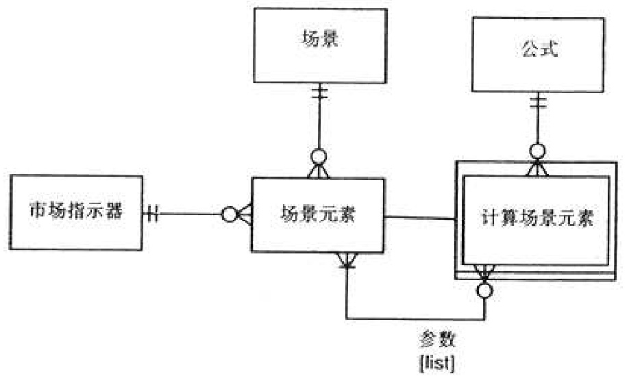  
图9-20计算场景元素的更一般方法  

例：牛仔裤的价格改变通过采纳了今年的场景和去年的场景之间的牛  

# 仔裤价格的差价场景元素来计算  

我们可以用多种方法来实现这个公式。一种方法是用实现语言对公式进行硬编码。因为普通公式（例如交叉汇率）可以被很广泛地重用，所以在这种情况下硬编码不是一个缺点。如果公式的数量很小并且不能太频繁改变，那么这就是一个最好的方法。即使每个月增加一个公式这种方法也能够相当简单地进行控制，甚至对一个复杂的系统也是如此。如果我们想给使用者增加公式的能力，那么我们可以使用一个更成熟的方法。我们可以构造一个解释器[1]，它认可一个简单范围的公式表达式。这种技术对于使用电子数据表的用户是很熟悉的。我们可以提供一个交互式的公式生成器，可是任何生成公式的人大概都可以打出一个类似电子数据表的公式。这个解释器[1]因而没有必要识别所有的公式。最完美的方案可能是一些公式用解释器而另一些公式用硬编码。使用场景元素的软件并不关心如何生成一个公式，可是它却需要关注提供参数给产生计算报价的公式。这遵循了最好的面向对象的原则一接口和实现分离。（更深的讨论请参见6.6节。）  

建模原则：为了把一个过程看作类型的一个特征，这个过程应该采用一个抽象的接口，以便实现能轻松地通过子类化而改变。一个通过硬编码得到的实现是一个子类，不同的参数驱动方法是其它的子类。  

如图9-21所示的交互图揭示关于这个行为可能如何工作的一些有用要点。第一个要点是如何给出公式作为输人的一个报价列表，而不是一个场景元系列表。虽然这是适度的随意，但通常有一个策略：输入的事件和返回的输出最好用同一个对象。如果没有这个策略，程序员会很快搞混它们处理的事物的类型。当然，这假定有关的算术操作都已经在报价中定义，这样报价就是一个处理双向价格算法的自然地方。在这种情况下，我们可以建立公式，使得它们可以适用于任何定义了算术操作的对象，而不仅仅是针对报价。  

getQuote操作在访问getQuote的所有参数这一点上，其行为自然是递归的，潜在的结果是长长的计算链。像许多递归结构一样，这是很优雅的（但是很难由交互图来表达）。然而，实际上它会导致大量允余的计算一个关于计算报价求值的缓存策略需要阻止通过多次对相同对象调用getQuote而导致的不必要的重复计算。当然，和所有的缓存一样，我们必须确保当一个源值改变时，缓存要适时更新。我们可以在相反的方向使用参数映射来重置所有依赖于它的场景元素。  

建模原则：当信息可以从一个信息源检索或者可以从其它可用的数据计算时，应当提供一个抽象的接口，而源和计算各为一个子类。  

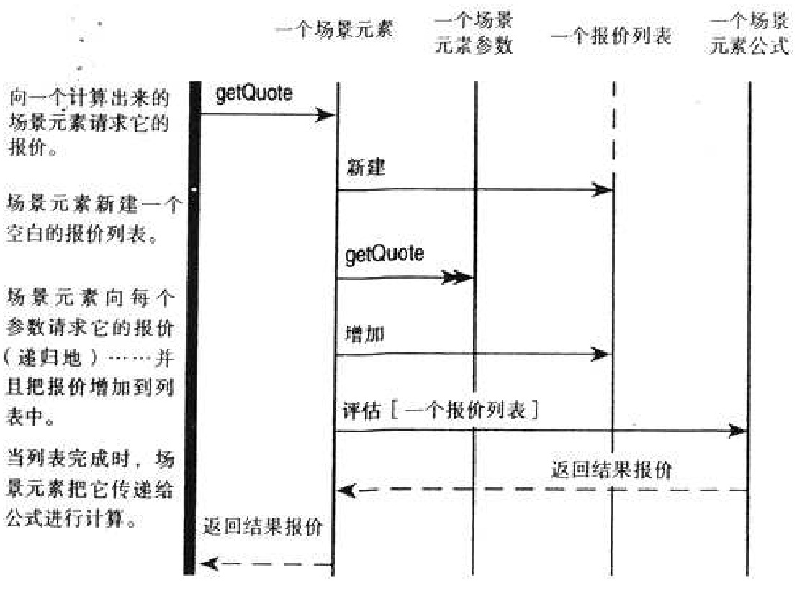  
图9-21计算场景元素的交互图  

1. Gamma,E.R.Helm,RJohnson,and J.Vlissides.Design Patterns:Elements of Reusable Object-Oriented Software.Reading.MA:Addison-Wesley.1995

 2.Martin,J.,and J. Odell.Object-Oriented Methods:A Foundation,Englewood Cliffs NJ:Prentice-Hall.1995  

# 第10章派生合同  

为了完全理解本章，你必须先阅读9.1节和9.2节。派生金融交易[3]在交易中承担的角色日益显著。派生交易的价值依赖于另一个债券的价值。更简单的派生形式已经出现了相当长的时间：例如，股票期权于1973年第一次在有组织的交易所交易。从那时起，越来越多奇异的不同的派生出现。因为它们可以减少来自价格变化的风险，所以对投资者是很有价值的。然而，当它们不能完全被控制时，派生可能是危险的：最近，在儿个著名的案例中，许多机构由于管理不良的派生而损失惨重。  

对派生进行建模体现了建模的许多有用特征，因为派生体现了一个自然的泛化层次结构一这比一般的动植物的例子更有意思。因此，本章的目的是探索在这种以派生作为代表的泛化层次结构中存在的一些问题。  

我们从介绍简单的派生开始：期货合同（参见10.1节）和期权（参见102节）期货合同介绍期限的概念：这导致一个为什么日期计算比合计天数更复杂的讨论。期权提出了两个难于对付的建模领域：掌握交易人对于股票看涨和看跌的定义，以及期权和潜在合同之间的关系。  

一个更复杂的派生类型一组合期权一可以被看作是一个更简单的期权的聚合。以组成模式从期权子类型化并不是总有效：这导致产品模式（参见10.3节）的产生。这种模式基于卖主和交易人对交易的观点的不同并且也适用于定期交易。这也可以作为一个例子，说明泛化虽然总是我们首先想起使用的方法，但不一定是最好的方法。  

随着子类型化，我们必须确保子类型的行为和超类型的行为一致。使 用关卡期权作为一个例子，我们将研究子类型化和状态图如何同子类型状态机（参见10.4节）交互  

如果我们有一个期权的合同夹，就能够依据合同夹中期权的类型，选择一个相关细节的浏览器。这导致并行的应用和领域层次结构（参见10.5节）的出现。这两个层次很难结合。这个模式引起的问题有儿种解决办法，但没有一种解决办法是全能的。  

关键概念：期货合同、期限、期权、产品  

10.1 期货合同  

9.1节讨论的是简单的和直接交易有关的合同。大多数市场包括一个更复杂范围的交易。它们中最简单的就是期货合同。对于一个标准的合同（通常称为现货合同），交货发生在尽可能和合同交易的日期接近的时候。交货通常发生在几天之内。期货合同是对在将来某个时间达成交易的协议。例如，一个公司应该在两个月内接收到一油轮的石油。这个公司将不得不为这些石油支付数百万美元。然而，如果这个公司在德国，它的正常的资金筹措应该以马克来完成。如果美元/马克的汇率在未来两个月内显著改变，则这个公司就会不得不支付比预期更多的马克，这将是一个重大的问题。当然，这个公司也可能从汇率的有利改变中获利：可是不确定性对这个公司来说是不利的。为了减少不确定性，这个公司可以选择以一个期货合同汇率的交易来购买几百万美元，方法是现在为两个月后的美元交货支付约定数量的马克。这个价格由执行这个交易的银行提供，这个交易基于下两个月市场上美元/马克汇率变动的预测。这个交易的期限是两个月（与现货期限相反）  

通过持有分离的交易和合同的交付日期，就很容易描述一个期货合同，如图10-1所示。一个现货交易将会有适当紧密的交易日期和交付日期，面一个期货合同交易将会使这些日期之间相隔两个月。虽然我们可以增加一个子类型来清楚地显示，但是我们不需要一个子类型来显示它。  

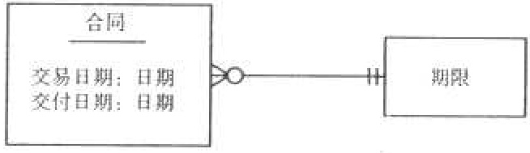  
图10-1一个能支持期货合同的合同  

期限是基于交易日期和交付日期之间的不同。  

例：AromaCoffeeMakers公司在1997年1月1日同意从巴西咖啡出口公司购买5000吨的巴西咖啡。交货定在1997年10月20日，并且价格定为当日的价格  

例：我为旅游购买了三个月内定期航线的机票，按当前的旅行报价支付票价。  

当讨论期货合同时，一个重要的考虑因素是合同的期限。在我们的这个例子中，期限是交易日期和交付日期之间的时期。期货的报价一般都是要考虑到期货的具体期限，期限因而是期货合同中一个重要的组成部分。  

仅因为7月4日是美国的独立日。在这些日期计算时，节假日有很大的影响。假定7月4日不是周末，一个在5月4日交易的两个月合同将会在7月5日交付。注意：如果由于某种原因德国在7月5日有一个节日，交付日期还会向后再推移一天。即使这个合同的交付日期和一个带有两个月零一天的期限的合同一样，它还是有两个月的期限。注意：这个行为对于现货合同也是需要的：即使现货是两天，一个在星期四完成的交易也将在下星期一交付（前提是星期一不是假期）。因此，图10-1包括：交易日期交付日期和期限。  

在这种结构中，交付日期的计算并不是单单通过交易日期和期限就可以完成。如果没有考虑假日，我们可以通过一个简单的日期和期限之间的计算来确定交付日期。然而，市场假日必须考思在内。这就意味着市场有一个日期计算的常规，它充许日期随着假日而调整，如图10-2所示。这种对于假日的考虑在很多领域都是重要的特征，这些领域中工作日的概念变得很重要。因为国家之间的假日是不同的，或者可能具有更大的粒度，所以通常不可能确定全球性的工作日。每个地方可能有本地习惯的假日，这会影响日期的计算。  

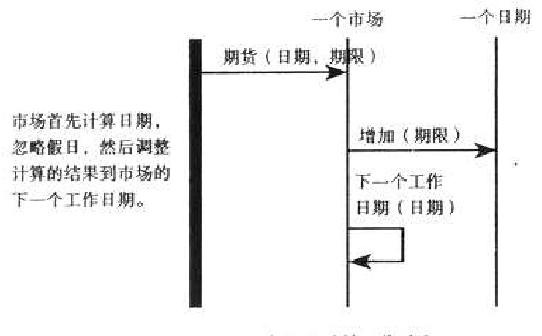  
图10-2市场的计算日期常规  

当需要计算工作日时，需要将日期计算委托给另一个对象。  

例：一个公司需要在从1997年6月30日开始的五个工作日内给一个雇员支付薪水。如果这是一家美国公司，就是到7月8日为止（跳过周末和月4日）：对于一家英国公司，就是7月7日。  

建模原则：日期计算经常受到需要跳过的假日的影响。不同国家之间的假日通常是不同的，甚至不同商业机构也有自己的假日。  

# ）.2期权  

对于我们在德国的石油公司，期货合同是一个很有价值的工具，可以用来降低汇率改变的风险，而汇率改变也许会导致他们必须为石油支付更多的钱。但是汇率可能按他们的希望改变，这样这家公司还是冒了损失的风险。财务主管本质上不得不在汇率浮动上打一个赌。如果他们认为马克将会升值，他们会在现货市场购买：如果他们认为马克会贬值，他们会购买期货合同。期权降低了风险。如果持有者愿意，期权给予购买者以预先安排的汇率购买美元的权利。因而，如果马克贬值，石油公司可以行使它的期权并且以预先安排的汇率购买美元：如果美元升值，他们可以忽略他们的期权（让它终止）并且在现货市场购买。银行向石油公司索要保险费而卖给他们期权，所以银行现在承担了风险。由于银行操作了许多这样的交易，因此他们可以依靠不同的交易相互抵消这种风险。图10-3和图10-4描述一个期权的行为。  

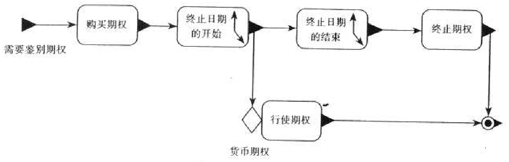  
图10-3期权使用过程的事件图  

期权只有在终止日期开始之后才能行使，并且将只能在“货币”期权时才能行使，也就是说，如果行使期权比以当前的价格进行现货交易更好的话才能行使。  

期权的许多特征和普通合同很相似。像一个普通合同，期权有对方团体和交易日期。期权的其它特征包括终止日期、保险费的数量以及交付保险费的日期。  

因而我们可以认为期权是合同的子类型，如图10-5所示。期权结构的关键特征是多态操作“价值（场景）。一个现货合同的估价很容易理解，因为把指定场景中的现汇交换率应用到这个合同的金额得到的结果就是现货合同的价值。说得婉转些，就是期权的估价更复杂。最普通的技术是Black-Scholes分析[3l。这个回题的解释超过了本书讨论的范围，但对于与这个操作有关的调用者来说，它也只是一个简单的操作。数学上的复杂性可以被安全地隐藏在这个操作中。  

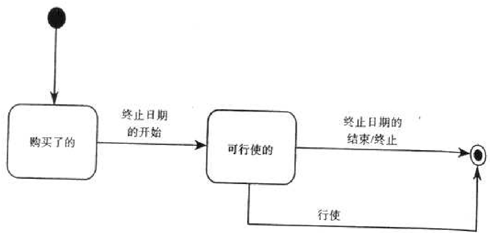  
图10-4说明期权如何运作的Harel状态图  

期权只能在它的终止日期之前行使（“欧洲式的”期权）。  

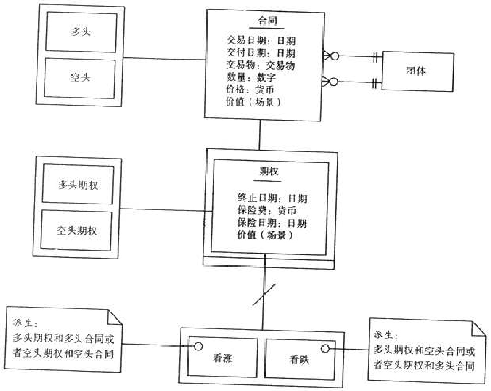  
图10-5期权的结构  

看流和看跌是从“多头”和“空头”派生的术语。  

.2.1多头、空头、看涨和看跌：体现一种谋略的词汇  

多头和空头的问题不需要再进行讨论。在9.1节中，我们解释了一个合同可以是多头合同（购买）也可以是空头合同（出售）然而，对于期权，我们发现有四种可能的选择。我们可以出售一个期权来售出货币，出售一个期权来买进货币，购买一个期权来售出货币，或者购买一个期权来买进货币。多头/空头选择仍然存在于合同中，但是它通过期权中一个更进一步的多头/空头选择来补充。交易人的词汇表包括术语“看涨”和“看跌”。看涨期权是购买一个期权（也就是，一个多头合同），而看跌期权是出售一个期权（也就是，一个空头合同）。自然地，我们可以购买或者出售一个看涨期权，也可以购买或者出售一个看跌期权。描述这种语言有点难以掌握，也容易混淆。  

如果我们出售一个期权来购买日元，那么对方团体可以从我这里在终正日期购买日元。这个和期货之间的区别是对方团体能选择不买。如果我购买一个期权来出售日元，那么情况是一样的，但是行使期权的控制却是在我的手中。以任何一种方式，我（潜在地）卖出日元，因此合同是空头合同。前面的期权也是空头的，而后面的期权是多头的。在第一种情况，交易人将会说他们出售（空头）了一个看涨期权，并且在第二种情况.他们会说他们购买（多头）了一个看跌期权。  

考虑这个问题的一种方法是可以说我们将用看涨/看跌来代替一个合同的多头/空头说明。但是这个方法不能真正工作，因为我们在非期权的合同中不使用术语“看涨”和“看跌”  

另一个可能性是对期权使用术语“多头和“空头”来指出期权而不是合同的状态。因而上面第一个例子将是一个空头的看涨期权，而第二个例子将是一个多头的看跌期权。这对一个交易人可能很有意义，但是将会搞乱所有的软件。当评估风险时，合同的金额额度是很重要的，并且上面的例子都是空头的。因此我们需要能询向合同的方向（这决定了额度）期权的方向和看涨/看跌。所以这两个例子是（空头合同，空头期权，看涨）和（空头合同，多头期权，看跌。很清楚，它们中的任一个可以从另外两个派生得到。图表暗示看涨/看跌是派生的。这只是暗示一种派生，面不是向实现者表明实际实现中的存储或者计算的任何方向。  

描述像这样的语言总是带有一点挑战性，尤其当看起来毫无必要地不合逻辑的时候。重要的事情是以一个合理的风格描述基本术语。这些基本术语可能是领域专家的术语的一部分或者是在建模过程中的发明（但是如果它们被发明出来，领域专家就必须适应它们）。术语中其余内容可以从这些基本术语派生。  

术语。  

建模原则：标记一个特征为派生是接口上的约束。它并不影响基础的数据结构。  

例：1997年6月1日，我得到一个期权，内容是在1999年1月1日以5美元每股的价格来购买200股AromaCoffeeMakers的股票。这是一个带有交易日期是1997年6月1日的期权，交易物是AromaCoffeeMakers的股票，额度是200，交付和终止日期是1999年1月1日，保险费是0美元，价格是5美元。我想得到股票，所以合同是多头合同（对于我来说），期权也是多头期权（因为我持有期权）：因而它是一个看涨期权。  

例：当我预订了机票时，我开始被给子关于机票的买入期权。期权的终止日期是预订的必须拿票的日期。  

另一个有关的问题是交付日期和终止日期之间的相互关系。对于一个期权，如果知道终止日期，是可以计算交付日期的（交付日期 $\equiv$ 终止日期 $^+$ 现货期限）。然而（由于假日的关系）反过来却不成立。这意味看，对于期权，交付日期是一个可计算映射。这里重要的一点是接口不能改变：这里还有交付日期的一个访问者：然而，信息存储了。有两个可选择的方法来描述这种情况：我们可以注意（通常在术语表中）对于期权，交付日期属性依照公式被覆盖并从终止日期进行计算。另一个选择是描述一个公式作为期权类型上的约束。两个方法都是完全合理的并且如何选择只是爱好问题。这完全取决于实现者使用什么样的代码和数据结构。  

# 10.2.2子类型化或者非子类型化  

图10-5所示的结构不是处理期权的惟一方法：另一个选择如图10-6显示。两种结构之间的区别是如何把选择权加到合同中。在图10-5中，我们通过子类型化来加人它。在这个方案中，期权是一种带有附加属性和一要不同行为的合同。在图10-6中，我们可以说期权有一个基础合同：交易人通常把它称为期权基础。这里至少有一些包含的概念，尤其如果合同实际上是一个期权的基础，则我们不可能要求合同给出自己的价值。类似地，交付日期将依赖期权的终止日期。  

在两种结构之间做出选择并不容易。每一种都有优雅的品质。图10-6的模型用一个明确的基础概念分离了期权和合同的概念。这种方案的一个缺点是一个单独的合同由两个对象来描述。更容易改变图10-6来处理复合期权（期权的基础成分又是 $\rightharpoonup$ 个期权）。由于在它们之间很少有选择的余地，因此我们可能很容易最终陷人泥沼。原型法有时可以阐明这种情形，但也并不总是如此。当像这样的多种方法需要选择时，先使用更简单的方法，并且如果需要以后再改变为更复杂的方法是一个好主意。然而，在这种情况下，哪一种方法更简单仍然需要讨论。当这种情况来临时，我相信领域专家的直觉，所以询问他们感觉那一个最好。我们将使用图10-5作为基础，进行更进一步的讨论。  

建模原则：当面对可选择的方法时，首先要选择最简单的，并且当需要时改为更复杂的方法。  

建模原则：当可选择模型之间的选择余地很小时，听从领域专家的直觉。  

  
图10-6对期权和合同的分离对象方法  

本图和图10-5都是合理的可选择的方法，但是本章是基于图 $10.5_{\mathrm{\odot}}$  

10.3产品  

杂数学。作为求值过程基础的Black-Scholes方程[3]是一个二阶偏微分方程。即使我有工程背景，这些东西仍然让我焦虑不安。  

最引人注目的派生交易陷阱的例子是英国古老的巴林银行的倒闭。依照现在的报导，倒闭的主要原因是一种特殊的派生交易叫做约期套购一一个组合期权的例子。组合期权可以看作是其它期权的合成物。看起来本节以约期套购作为例子讨论是很合适的。  

约期套购的概念实际上非常简单。你持有大约7000万美元的财产，依靠价格，你关心未来三个月内，它的价值的任何大的改变。或者增值或者贬值都会导致一个问题。为了避免这个问题，你可以购买一个看涨期权和看跌期权，都带有7000万美元的价格并且终止日期是三个月后。让我们假定关于它们每一个的保险费都是250万美元。如果价格增值，你行使看涨期权并获得按新价格的持有物价值。这个价值减去原有的7000万美元和500万美元的总保险费，就是你的获利。因而如果财产升值到7500万美元以上，你会非常高兴。类似地，如果价值跌落到6500万美元以下，你也很高兴。发生的最糟糕的事情是价格保持稳定，在这种情况下，你损失了500万美元保险费。约期套购的吸引性来自一个固定的风险，它补偿了相反情况下范围非常宽的价格变动。很自然，一个非常不稳定的交易物会导致为约期套购支付更高的保险费，但如果你试图减少在一个易变环境中的风险：这会是一个非常有用的产品  

如果你是销售者，你当然会面临一个更复杂的情况：如果价格移动一个很大的数量，你可能损失无限额度的钱。这就是真正导致一家银行损失惨重的原因。此外，银行应该使用其它的交易来防止这种风险。  

在建模中，这个约期套购是我们应该直接注意的，它由两个期权组成，而期权受到它们的价格、日期、方向和交易物的约束。图10-7显示一个作为期权的子类型的约期套购模型。作为一个组合期权，它会有成分，对约期套购的约束定义了精确的特征。其它合并的子类型可用于其它常见的情况：差价、抑制等。  

子类型的使用确认了约期套购是一种期权并像它的超类型一样有相同的行为。然而，这带来一个向题：一些行为可以被安全地继承，例如自我估价的能力和交易日期。我们可以认为保险费是其成分期权的保险费的总和。可是价格是怎样的呢？对于一个约期套购，它的成分的定价都是一样的，所以我们可以认为它是约期套购的价格。然而，另一种普通的合并是差价。像我 们以前提到的，一个差价是两个期权，但是两个期权都是以不同价格的相同方向（也就是说，两个看涨期权或者两个看跌期权）这种情况下的价格是什么？回到约期套购，它是一个看涨期权还是一个看跌期权？  

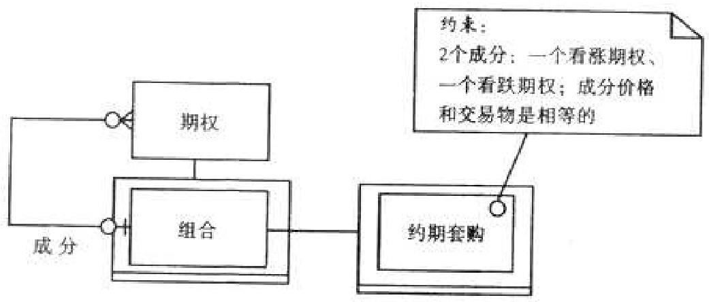  
图10-7作为期权子类型的约期套购建模  

约期套购是一个看涨期权和看跌期权的合并。  

图10-8显示解决这个问题的一个方法。那些在所有级别上都有意义的属性可以放在期权上，而难处理的属性被放到常规的期权上。这虽然在一定程度上有所帮助，但是如果我们考忠下面的情况，就会发现我们失败了：价格是在合同中而不是期权中确定的，而且有的组合期权（例如覆盖了看涨期权和保护了看跌期权）是期权和定期合同组成的。再次表明，泛化结构是可以处理的，但问题是什么可以被安全地放在超类型中。  

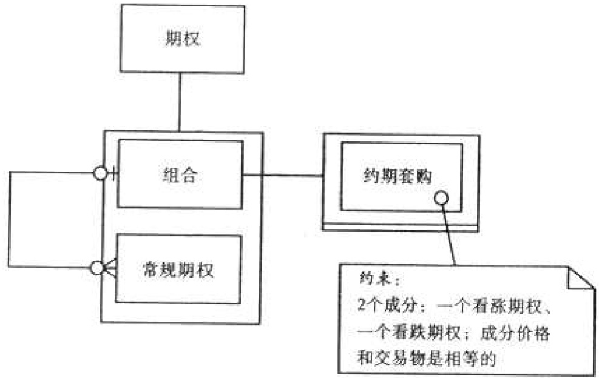  
图10-8子类型分为组合的和常规的  

这些考虑足以对将组合和子类型化一起使用提出一个严重的向题。最  

组合，并且将合同看作是一个组合期权。一旦处理了组合，它的行为就和其它的合同没有什么区别。  

这引导我们得到如图10-9所示的模型。在这里，销售人员的观点和风险经理的观点是截然分离的。风险经理看到的是一些合同，是销售人员把这些合同组成一个产品。约期套购现在是一种特殊的产品。这允许我们重新考虑合同的行为，把与销售相关的行为放到产品上，而把与风险相关的行为留在合同中。这包括参与产品销售的与风险管理不相关的团体（除非一个特殊的团体被认为承受了风险）。既然合同必须附带一个产品（由于是一种强制关系），那么合同仍然可以通过和它的产品的合作发现它的团体（但是请参见10.3.1节的讨论）  

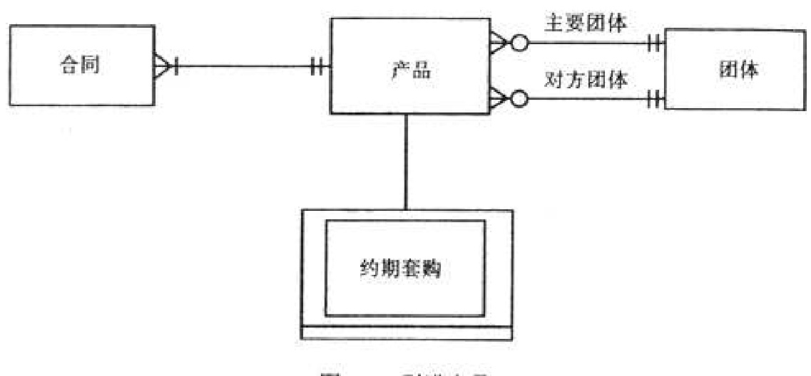  
图10-9引进产品  

产品反映销售的展望。在风险分析中，要忽略合同如何被组合为产品。  

在考虑是否使用子类型时，我们需要询问两个问题。第一个问题是超类型的所有特征是否真的被子类型继承。一个直接子类型化（例如图10-7所示）应该依靠所有超类型的特征来检查，包括超类型的超类型的特征。这很容易被忘记并且导致进人一个危险的路径。这种分析将会导致泛化层次结构的重构，并且这个重构可能并不筒单。我们需要询问的第二个问题是：领域专家真的认为需要保持子类型化吗？在我们的例子中，领域专家抵制子类型化，推荐图10-9所示的模型。稍后，图10-8的风格再次出现，但是没有足够的说服力来改变这个模型（以及实现这个模型的框架）  

建模原则：只有当所有超类型的特征适合于超类型并且从概念上讲每一个子类型的实例是一个超类型的实例有意义时才应该使用子类型化。  

这留下了一个关于是否值得在产品上赋予一些明显的泛化结构来描述不同种类组合的问题，如图10-10所示。很清楚，这不是用于风险计算的目的。然而，用于产生这种形式的新产品是很有用的。实际上，这种类型的泛化的最深刻的例子最可能存在于应用层和表示层（参见12.3节），此时需要特定的表示来描述定价和处理组合。在这种情况下，领域模型中一个共享的定义是很有价值的。即使这种定义当前只用于销售工作。更复杂的交易分析可能需要理解这些组合是如何定义的。  

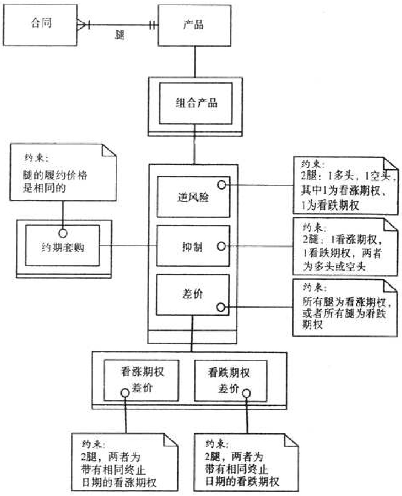  
图10-10普通组合产品  

这是一个基于约束层次的好例子。连接到一个产品的合同称为产品的腿。  

例：一个客户持有AromaCoffeeMakers的大量股票，他关心未来6个月在他可以出售这些股票之前的股票价格的浮动。他可能以现在大约5美元的  

价格购买一个约期套购。对于交易人，这个产品被分解为两个分离的期权  

能找到一个单独的希望出售相等数量股票的其他团体。他能找到一个出售2000股的团体和另一个出售5000股的团体。我有一个与这个交易人相关的产品：购买7000股。这个产品由两个合同组成：每个交易一个合同。  

建模原则：当客户眼中的一个交易在交易人眼中是多个交易时，都可以使用产品/合同这种划分。  

产品和合同之间的关键区别是产品描述客户的目的而合同涉及对方团体和主要团体之间的交易实际上得到了什么  

总需要有一个产品吗  

图10-9模型中的一个结果是通过一个单独合同和一个单独产品来描述非组合的情况。产品的使用并没有带来多少好处（除了将销售和风险管理两种职责分离）  

另一种办法是合同不和产品相连接。此时，只有一个组合有一个产品。更简单的合同没有产品连接。虽然一个合同有到团体的连接，但是当存在产品时，可以通过派生而不让这些连接起作用。这个方案的缺点是它以不一致的方式来处理职责。一个合同如果没有和某个产品有代理关系，它就需要自已处理和一个团体的关系。这种不一致会导致大量的混乱。由于这个原因，我宁可使用图10-9所示的模型。  

传统的数据建模人员从一个不同的途径将会得到相同的结论。标准化使他们不希望复制到团体的连接，并且因而选择一个如图10-9的模型（尽管它可能在一个实际模型中因为性能原因而改变）面向对象方面的论据是不同的，因为它集中于分清责任，但是两种论据具有一个共同的主题：概念上的简单导致我们有最小化的基础关联。在面向对象开发中，这个原则使我们清楚地分离责任：而在关系数据建模中，它使我们进人到第14范式（或者无论现在发展到了多少种）  

建模原则：不要复制有相同内涵的基础关联。遵循这个原则导致责任分明的类型。  

建模原则：在责任分配中保持一致。提防一种类型有时对某事负责而有时又将这个责任委托给别的类型。（这种行为可能是正确的，但是它总是值得怀疑。）  

# 10.4子类型状态机  

尽管许多普通的派生都可以被刻画为期权的组合，但是并不一律是这  

种情况。当在某个达成一致的市场定价（例如路透社的一个专栏）中被报价的交易物的价格达到一个特殊的极限时，一个关卡期权可以出现或者消 失。因而：一个期权可以被买来以90JIPY/USD的价格来购买（看涨期权）1000万日元：这个期权在汇率突破85JPY/USD时才可能被行使这个期权的行为与一个标准的期权不同。实际上，这个期权不能被行使，除非汇率在终止日期之前降到85JIPY/USD。如果价格确实降到这个关卡，那么这个期权就被插人并且将会保留可行使的权利，不论在那个日期和终止日期之间价格发生任何改变。如果价格从没有降到关卡之下，那么购买者就不能行使这个期权。（关卡也可以是别除型的，在这种情况下，只有汇率不越过关卡时它们才能被行使。）  

这个不同的行为可以通过对关卡状态图进行修改来表达，使用图10-11所示的图可以有效地替代它。使用它的事件图如10-12所示。  

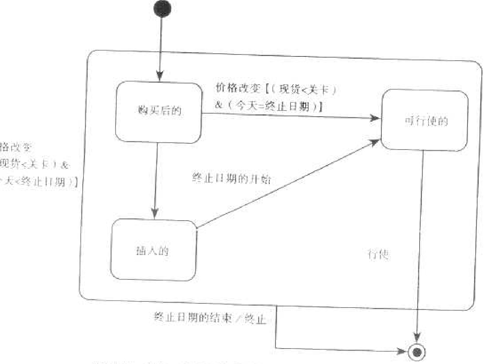  

图01关十一个插人型看涨期权的Harel状态图  

如果业种交易物的价格从没有越过关主，则期权不能技行使两价报一旦越理关牛以后，刷发祥基它什么改交都是无所谓的。  

椎一的结构改变是增加于这个期权的关卡标准，这作为一个期权的子类型确实工作良好，因为它在行为上提供了改变并且增加于一个新的特征美卡标准馬  

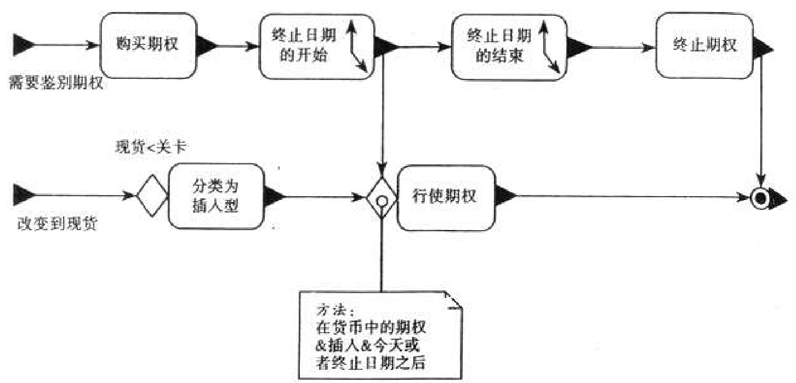  
图10-12使用一个插入型期权的过程的事件图  

# 10.4.1确保状态图的一致  

这种状态图本身引出一个有趣的向题。若关卡子类型有不同的行为，我们可以用图10-11所示的状态图来替代图10-4的状态图。然而，这带来一个向题：充许我们那样做吗？大多数方法强调支持用子类型替代超类型的重要性：这在对象图中通过只充许我们增加关联来反映，而不充许移动它们。许多教科书中没有提到可以用什么规则来管理带有子类型的状态图。Shlaer和Mellor[6]指出状态图只能出现子类型或者超类型。然而，如果所有的子类型共享一个共有的部分，那么把这个共有部分放在超类型中可能提高可维护性。Rumbaugh5指出子类型（通常）只可以增加正交的状态图。  

关于子类型化与状态图之间的关系，Cook和Daniels[l]给出了最好的探讨，他们在子类型和状态图上花费了整整一章。他们强调“契约式设计的原则[4]：这可以总结为一个超类型的状态图可以以两种方式来进行护展：或者通过增加一个正交的状态图，或者通过把超类型状态图的一个状态分割成子状态。超类型的变迁只能通过把它们重定向到它们超类型状态的子状态来更改。  

应用这些方针到期权状态模型，我们会看到许多向题。第一个向题存在于对终止日期开始的事件的处理。在图10-4（期权图）中，这引起从购买到行使的变迁，但是在图10-11（关卡图）中，变迁起自新的插人状态。终止日期结束的事件有一个类似的问题：图10-4显示仅仅从可行使状态的变迁，面图10-11显示从任何状态的变迁。  

第一个问题来自于要考虑一个对象如果处于的状态不能对收到的事件做出反应时应该做什么。这个对象或者可以默默地忽略这个事件，或者可以提示一个错误。应该提出一些普追的策略解释如何处理这种情况：例如，Cook和Daniels[ll建议显式地列出与一个对象有关的事件。如果没有已定义的转移作为允许的事件列出，任何事件一般都应该被默默地忽略。这解决了当购买开始之后，图10-11（关卡图）中图表收到终止日期开始事件时会发生什么的事情。如果终止日期开始是一个被允许的事件，它就正好可以被忽略。  

然而，这还没有完全和超类型一致。图10-11显示当收到终止日期开始事件之后，一个购买了的期权变成可行使的期权。用合同中的术语来考虑，购买后的改变是终止日期开始的后置条件的一部分。在子类型中，我们不能削弱这个后置条件，只能加强它。对于一个插人型看涨期权作为一个期权的子类型，我们必须用图10-13和图10-14所示的那些模型替换这两者的状态图。  

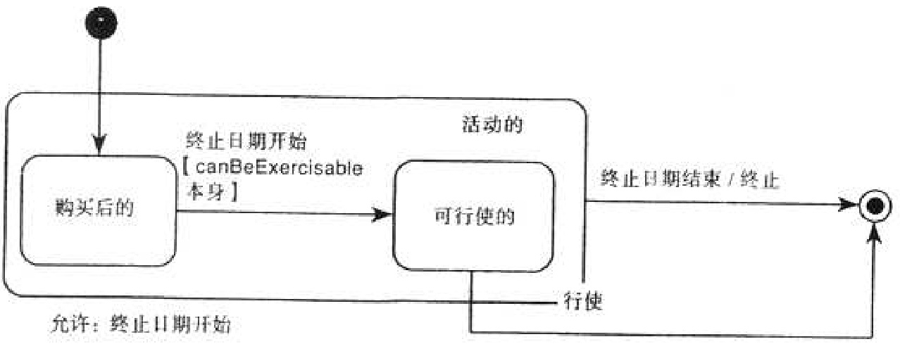  
图10-13为期权而更改状态图以便Cook和Daniels的一致性条件适用于插人型看涨期权  

为了提供一致性，这两幅图反映两个改变。第一个改变是把购买后的和可执行的归纳到一个活动状态中。我们可以从这里重定向终止日期结束事件。第二个改变是增加canBeExercisable作为终止日期开始事件的守护操作。这个操作是表示终止日期的开始不能总是导致可行使状态的一个方法。对于定期期权，canBeExercisable总为真。期权的子类型可以由其它行为来覆盖它。  

图10-14显示对于插人型关卡，这个覆盖如何发生。我们引人购买后的状态的子状态来指明关卡是否被插入。接下来我们分离终止日期开始变迁的来源，并且减弱守护条件以显示无守护的变迁。既然我们在超类型中允许终止日期的开始，那么当未插人时，关卡可以忽略终止日期的开始。  

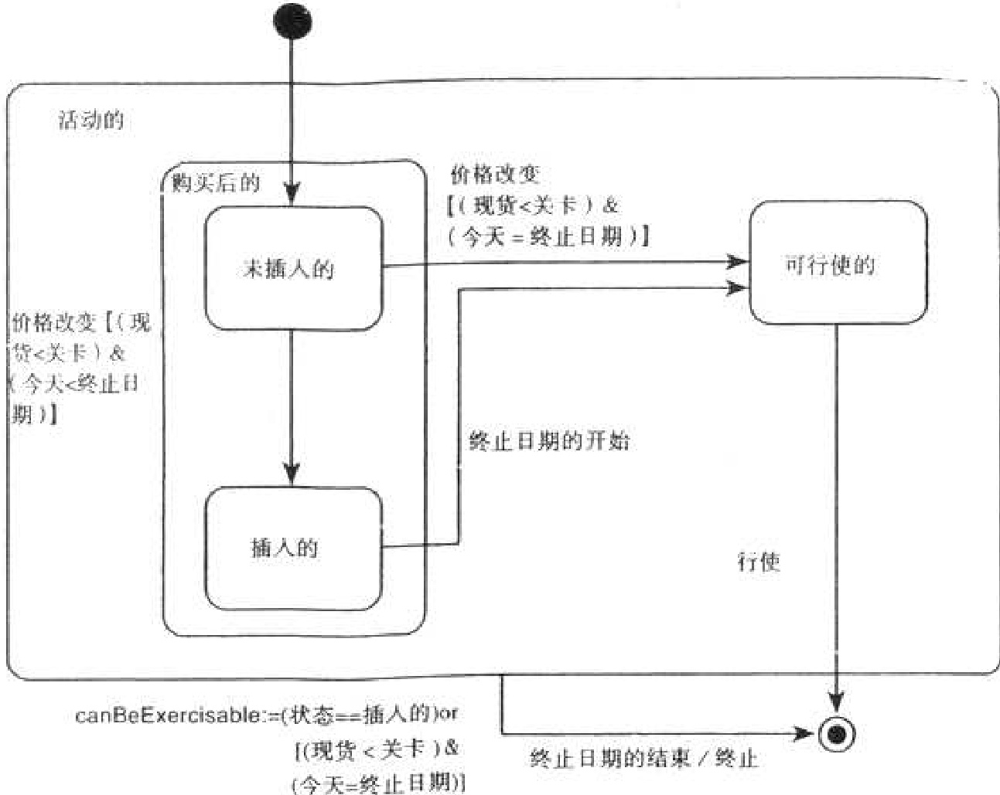  
图1014修改后的与图10-13一致的针对袖入型有期权的状态图  

10.4.2一致性的使用问题  

上面我们为了一致性做了一系列的修改，现在应该停下来问自己关于这个过程的一些问题。根据我的判断，图10-4和图10-11比图10-13和图1014描述了更简单和更清楚的行为表达。因而，尽管我们得到了一致性（至少根据Cook和Daniels的定义），但是我们失去了易理解性。另外，对插人型看涨期权的建模导致我们改变超类型图表。这已经是我们所能达到的最好结果一因为我们需要一个不同的状态图来强制我们构造一个一致的子类型状态图，所以我们仅仅为此而改变了它。这意味着一个新的子类型可以强制我们来改变超类型状态图，否则我们必须足够聪明来产生一个非常灵活的超类型状态图。不幸的是，我不认为我足够聪明，所以子类型化将充满困雅。  

这些困难的一个解决办法是重做泛化层次结构来避免需要对一致性产生的担心。我们假定一个插人型看涨期权将是一个期权的子类型，每一个都有它们自己的状态图，如图10-15所示。另一个方法是在没有自己的状态图的情况下将一个期权作为一个抽象类型来对待，并且产生一个常规的期权子类型来支持图10-4的状态图，如10-16所示。这避免了对状态图一致性的担忧，允许更自然的状态图，但是的确引人了一个新的类型。这也和Rumbaugh和Shlaer以及Mellor的原则更一致，但他们没有讨论状态模型之间的一致性。  

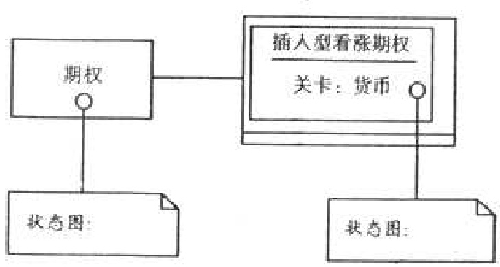  
图10-15插人型看涨期权作为一个期权的子类型  

这是一个自然的方法，但是状态模型之间如有联系呢？  

“契约式设计”约定子类型必须满足它们超类型的后置条件。然而，这开不需要意味着终正日期开始的后置条件应该包括到可行使状态的变迁。如果我们不选择包括它作为后置条件的一部分，那么原始的图表就是可以接受的。重要的是，终止日期的开始应该在所有的情况下都被允许：至于是否导致一个变迁是不确定的。  

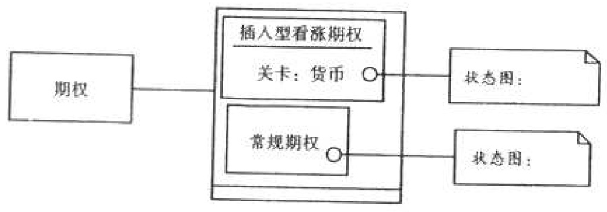  
图10-16产生一个常规期权类型  

这可以更简单地处理状态模型，但是它并不自然，  

实际上，这是一个关于“契约式设计”的更广问题的例子。通常，人们说一个操作的后置条件应该定义到一个对象的所有可观察到的状态的改变。形式化方法的研究团体通常很推崇这个原则，但是对“契约式设计却兴趣不大。后置条件仅仅指定在操作结束时必须支持的状态。我们能经常声明除了指定的东西之外没有东西必须被改变，但是在这个方法中并没有假设必须是这样。  

事实上，子类型化使这样一个限制性的后置条件很危险。子类型化的  

一个总的特点是超类型不能预知子类型可能进行的所有扩展。使用一个过度限制性的后置条件会削弱子类型化提供的灵活性。后置条件定义了这个对象的可观察到的状态的各方面都必须为真。因而，如果它们不违犯后置条件的直接条款，则任何其它的改变都可以发生。  

建模原则：关于状态图的泛化结果不能被很好地理解。确保关于超类型的所有事件可以由子类型来操作是很重要的。任何可被子类型化的状态图必须充许未知的事件。  

建模原则：后置条件定义对象在操作之后必须为真的条件。后置条件没有提到的其它改变都可以发生。  

# 10.5并行的应用和领域层次结构  

面对包含不同合同的一个合同夹，一个交易人往往喜欢看到把合同和有关合同的重要信息放在一起的列表。这样的一个列表应当把每个合同显示在一行上。并且这行上的信息应当随合同的种类而变化。列可能是多头空头、交易日期、履约价格、看涨/看跌（只针对期权）、终止日期（只针对期权）、关卡层次（只限于关卡）插人型还是剔除型（只限于关卡）  

在这个方案中，表格中的一些列只是和某些期权的子类型相关。这增加了这个问题的一定复杂性。我们不能做的是假定某个代表浏览器行的类向每一个合同请求每一种相关的属性。这样一个方法将不会工作，因为这个浏览器行类不能请求一个非期权的终止日期，根据定义，非期权没有这样的属性。  

布局设计的第一个阶段是使用第12章讨论的层次结构。在这个结构中合同夹浏览器类型和浏览器行类型是如图10-17所示的应用外观模式。合同夹浏览器的主题是一个合同夹，浏览器行的主题是一个合同。合同夹和合同是不能看到合同夹浏览器或者浏览器行的，原因是合同夹和合同位于应用层次，并且领域类型应该对应用类型没有可见性（参见图12-6）  

这个结构允许一个浏览器行有接口需要的所有列的属性。根据一个表示层的程序员的考虑，每一列都有那些可能会为空的属性。如果一个属性为空，那么意味着在浏览器表中的一个空白的空间。问题存在于浏览器行和领域模型之间的连接中。  

浏览器行知道它处理的是合同的聚合。但是，它需要请求只在某种合同的子类型上定义的信息。如果一个浏览器行请求一个非期权的终止日期，它将会得到一个错误。有几个策略可以用来解决这种交互：应用外观的类型检查，给超类型一个包装性的接口，使用一个运行时属性，使应用外观对领域模型可见，以及使用异常处理。  

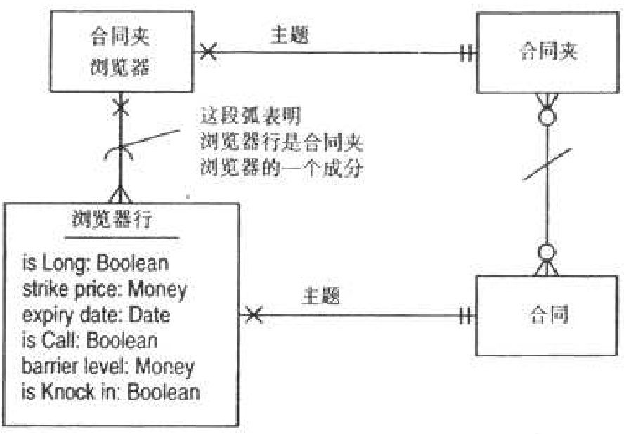  
图10-17一个合同夹浏览器及其与领域模型的关系  

一个合同夹浏览器和浏览器行是应用外观。  

# 1应用外观的类型检查  

在这个策略中，由浏览器行负责处理这个问题。在每一个对合同的请求之前，都要做对合同的类型检查来确保这个请求可以被安全地发送，如图10-18所示。在 $\mathbb{C++}$ 中，这采取某种形式的类型检查，接着转向子类型的强制类型转换，接着发请求。  

一个览器行请求一个合同的履约价格。如果它什么也没有做。则检查它是否是一个期权。对另一个合同，请求它的展约价格并且检查它是否是一个期权 这次它是个期权，所以它可以请求它的终止日期。  

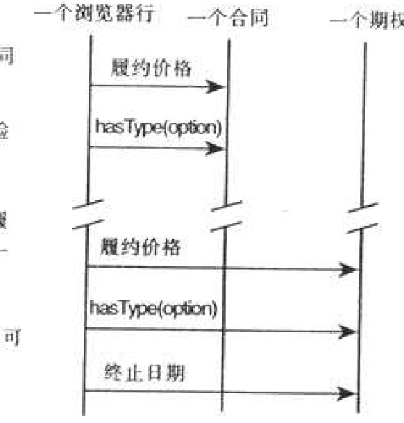  
图10-18在浏览器行中类型检查的交互图  

在调用一个只在子类型中定义的操作之前进行类型检查。  

这个策略有许多缺点。浏览器类在有多种合同的子类型的情况下会变得十分复杂。此外，合同层次结构的任何改变都会引起浏览器类的改变。  

是由表示层的改变驱动的。  

这种方案所暗示的类型检查的程度可以通过两种方法来简化。我们可用访问者模式[2]。尽管这些方法可能更好，但是如果类型检查的次数过多，则它们仍要求浏览器行知道合同的层次结构。  

10.5.2给超类型一个包装性接口  

本质的问题是请求一个合同的终止日期会出现错误。一个解决办法是在合同中增加对合同的所有子类型操作。合同将会自然地用空值来回复所有这些操作，但是相关的子类型可以覆盖这些操作以便提供它们的数值。  

这个方法有许多问题。几乎不可能分辨出对合同的一个真正合法的操作和什么是一个真正的错误。编译时的类型检查也不能用了，因为它不能分辨出合同的子类型是什么。每一次一个子类型被引人，合同的接口就必须被改变。因而我不是这种方法的支持者。  

10.5.3使用一个运行时属性  

运行时属性提供一个为类型增加属性而不改变概念模型的非常灵活的系统。当执行完成后，它们在这个系统的执行中允许属性改变而不重新编译。  

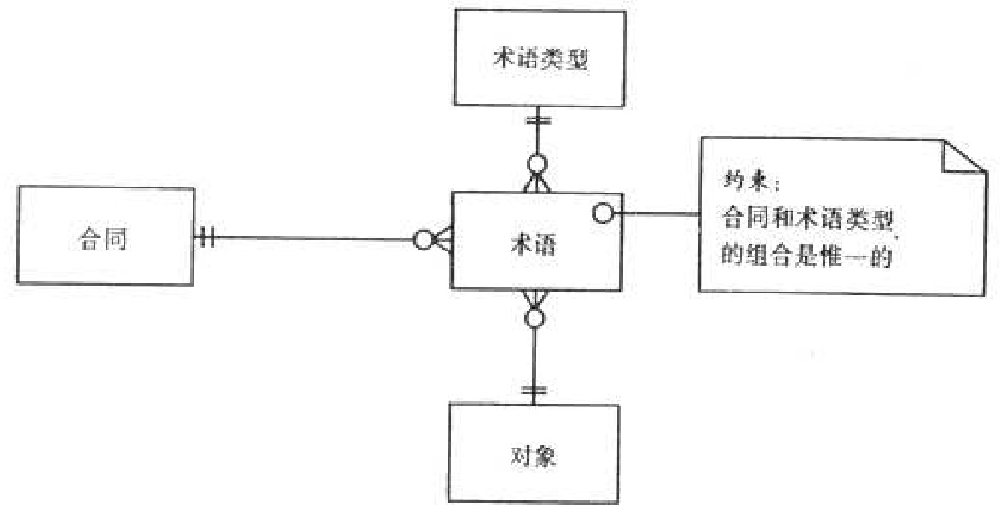  
图10-19合同的一个运行时属性  

在使用这种方法的情况下，向一个非期权请求一个只在期权上定义的属性将不会导致错误合同的基本模型如图10-19所示，或者更合适的模型如图10-20所示，  

它使用带键值的映射（参见15.2节）。所有的合同都有一些术语，并且每一个都对应一个术语类型。在这个例子中，每一个合同的属性和它的子类型（履约价格，是否是看涨期权，关卡层次等）将会成为术语类型。如果向合同请求一个术语，那么若存在一个术语，它就用一个数值对象来回复。在这种方法中，请求一个非期权的终止日期不是错误。  

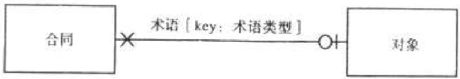  
图10-20图10-19使用一个带键值的映射  

当然，这个模型充许一个非期权偶然被给予一个终止日期。这可以由两种方法来防止。第一种方法是使用一个知识级（参见2.5节），如图10-21所示。另一种方法是产生这个术语类型作为一个派生接口。模型属性（那些关于合同和其子类型的属性）和术语类型接口都被提供。更新只能通过模型属性来提供。  

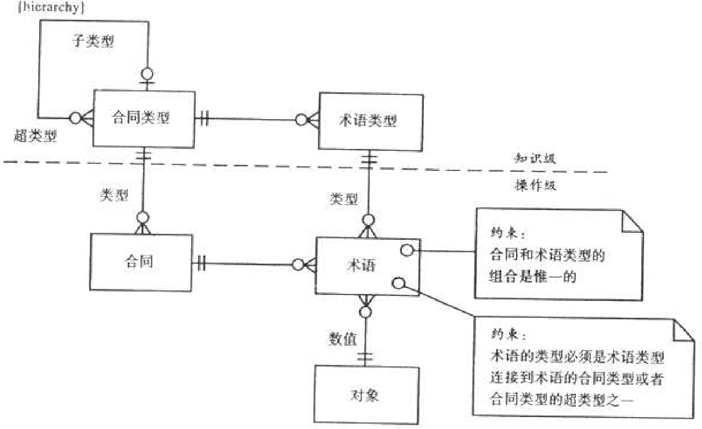  

图10-21使用一个知识级来控制将术语放置到合同上这将会阻止术语被不正确地放置到合同上：但是只能在运行时被检查。使用运行时属性确实提供了灵活性但是它也带来了重大的缺点。第一  

实际上该术语类型的实例是有效的。第二，属性类型不能在编译时进行类型检查，失去了编译检查的这样一个重要的优点。这对于浏览器行无关紧要，因为根本的目的就是放松任何的编译时检查，但是对系统其它部分，它的影响却很大。第三个缺点是搅乱了基本的语言机制。编译器不清楚将继续进行的是什么，并且语言特征（例如多态）必须由程序员进行硬编码同样，运行时属性的性能也比不上模型属性。  

许多这样的缺点可以通过区分两种接口来减轻。那些在编译时间知道属性的软件部分可以使用模型属性，并且浏览器可以使用运行时属性。  

10.5.4使应用外观对领域模型可见  

在这种方法中，加载一个浏览器行的责任被委托给需要这个浏览器行显示的合同，如图10-22所示。因为控制目前在合同中或者在它的子类型中，所以它可以用子类型的正确值来加载浏览器行。浏览器行支持所有必需的应用信息，并且合同或者它的子类型知道对于那个子类型什么是可应用的。  

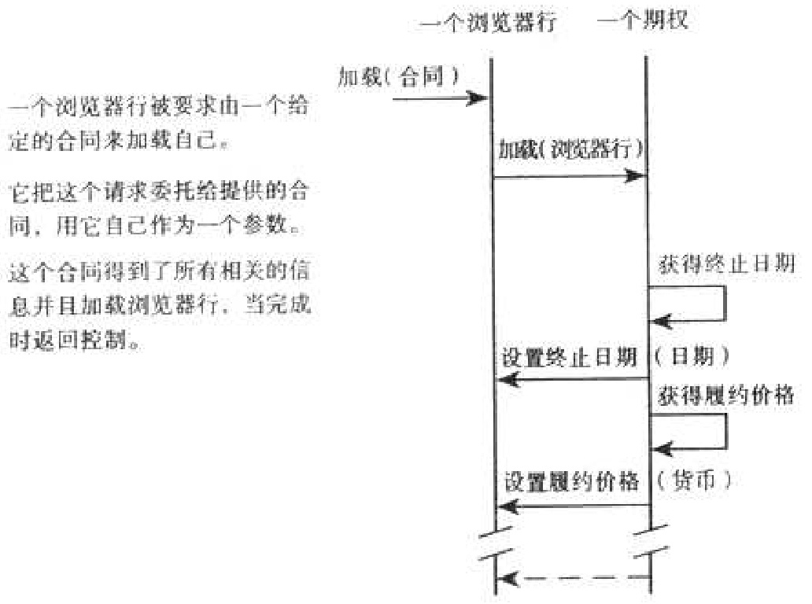  
图10-22为合同加载浏览器行的交互图  

浏览器行必须对合同是可见的，这违反领域层和应用层之问通常的可见性规则  

这个方法的优点包括更简单的交互，因为不需要类型检查，并且合同不需要一个更复杂的接口。另外，增加一个新的合同不需要浏览器行的改变，除非在表达中有一个相应的改变。全部所需只是一个加载浏览器行的覆盖操作。  

最大的缺点是破坏了在第12章讨论的应用层和领域层之间的可见性。通过放置浏览器行在它自已的包中可以避免这个缺点，如图10-23所示。在这种方法中，来自领域模型对显示的依赖只被限制在浏览器行类型上通过将浏览器行类型一分为二，可见性可以进一步减少。浏览器表示和合同使用浏览器行的不同接口。可以在浏览器外观包中为浏览器行提供它自已的浏览器行外观，它与浏览器行接口的交互很简单。在这种情况下，从浏览器表示到浏览器行包的可见性就可以被去掉。  

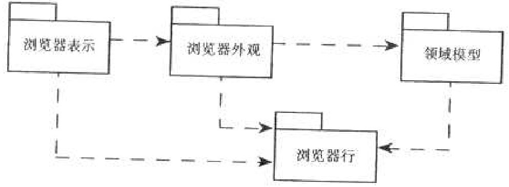  
图10-23对浏览器行包的可见性（基于图12-6）  

浏览器行包是应用层和领域层之间的特殊情况。  

另一个缺点源于几个浏览器应用的可能性，这些应用可能有稍微不同的需求。每一个应用将需要自己的浏览器行，这些都需要被合同知道。浏览器行的分割在这儿可能有帮助。这样需要为每一个应用产生一个浏览器行外观，所有的应用将使用单一的浏览器行包。增加新的浏览器种类，从而将不能改变合同的责任，除非要将一个新的特征增加到浏览器行中。  

事实仍然是：浏览器行需要的任何新特征都需要对整个合同和所有它的子类型进行修改。这是一个在浏览器行中安置控制的方案以及相对的在合同中安置控制的方案之间的基本折衷方案。如果增加新的合同比浏览器行增加新的特征更频繁，那么我们就应该在合同中安置控制。然而，标准模式的可见性不能随意地进行改变。除非新的合同类型的出现比浏览器行中的变化更容易发生：否则我将不在合同中安置控制，因为在合同中许多新的子类型本身将意味着浏览器行的新特征。  

当然，上面的所有想法都是基于这样一个想法：即向一个非关卡请求它的关卡级别是一件不好的事情。然而，如果有合适的环境，这就不是一个问题。如果进行一个对象的请求导致一个运行时错误并且错误通过一个  

的，而不是其它的更令人担忧的错误。这还假定了编程语言允许发送一条左组空新站实那教支持过种功能）租结合：缺之类理的安全社文业习金代占：击工具讲有半型的：调此而a诚ak造自就盟以送仟医用大型 $\mathbb{C++}$ 中中电通市便用一个向尖型转快术统迎  

参考文献  

Cook,S.and J.Daniels.Designing Object Systems:Object-Oriented Modelling with 1. Syntropy.Hemel Hempstead,UK:Prentice-Hall International,1994. Gamma,E.R.Helm.R.Johnson and J.Vlissides.Design Patterns:Elements of 2. Reusable Object-Oriented Software.Reading,MA:Addison-Wesley,1995 Hull,J.C.Options,Futures,and Other Derivative Securities(Second Edition]. 3. London:Prentice-Hall International,1993. 4. Meyer,B."Applying‘Design by Contract,IEEE Computer,25,10 [1992). PP.40-51. Rumbaugh.J..M.Blaha,W.Premerlani,F.Eddy.and W.Lorensen.Object-Oriented 5. Modeling and Design.Englewood Cliffs,Nj:Prentice-Hall.1991. Shlaer,S.and S.J.Mellor.Object Life Cycles:Modeling theWorld inStates 6 Englewood Cliffs,NJ:Prentice-Hall,1991.  

为了充分理解本章，你需要先阅读第9章和第12章。开发大型信息系统提出了特殊的挑战。处理一个大规模系统的基本方法是把它分解为若干个更小的系统。这需要某种形式的构架（软件体系结构）建模，如A5节中所述。  

任何信息系统首先的组织工具是第12章中讨论的分层构架。这种构架确定系统的许多包分割。然而，在一个较大的系统中，领域模型对一个单独的包太大了。本章着眼于如何能分割一个巨大的领域模型。包和可见性的概念（参见A5节）再一次作为分割的基本工具而被米纳。第9章的交易概念提供了例子。  

第一个模式着眼于如何组织场景和合同夹的模型。主要问题是关于对一个包的多重访问级别（参见11.1节）。一个风险管理应用使用场景来得到评价合同夹所需要的信息。另一个应用需要建立并管理场景。两个应用都需要访问场景类型，但是需要非常不同的访问级别。不同的客户需要不同的接口是一个很普遍的问题。解决办法包括允许一个包有多重协议以及使用不同的包。  

合同和团体之间的关系提出了相至可见性（参见12节）的向题。显然有三种解决办法：合同和团体之间单向可见，把它们放置到一个相同的包中，或者把它们放置到不同但相互可见的包中。所有三种解决办法都有严重的缺点。  

最后的模式是通过考虑如何把第10章讨论的派生安置到包结构中来探究包的子类型化（参见11.3节）这个模式闸明可以将子类型放置到一个和它们的超类型分离的包中，这个包具有从子类型到超类型的可见性。  

# 对一个包的多重访问级别  

从合同构造合同夹要使用市场指示器作为描述。独立地使用场景，以使为市场指示器开发价格。合同夹和合同需要使用场景来进行自我评估，但是场景不需要任何有关合同夹和合同的知识，如图11-1所示。  

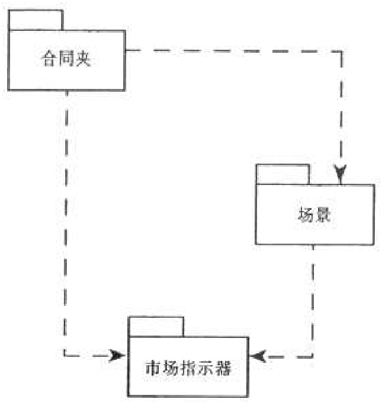  
图11-1包可见性的初始图  

为了展开评估，一个合同夹只需要市场指示器的价格。合同夹包不需要知道如何建立场景。因而，虽然要使getQuote消息可以被发送，场景元素类型需要对合同夹可见，但是不需要看到带有有关报价如何形成的定义的子类型。当然，我们可以更深一步并且说甚至场景元素对合同夹也是没有用的。一个更好的方法是让合同夹看到如图11-2所示的接口。这个接口有一个在场景上的带键值的映射（参见15.2节），它把市场指示器作为一个参数。既然场景元素的其它属性都是不重要的，那么合同夹包的接口就简单了  

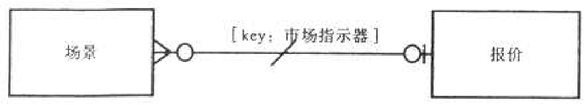  
图11-2隐藏了场景元素的场景包的一个接口  

这是不需要知道场景元素的合同夹包的最好接口。  

这个方法需要两个不同类型的场景包：一个用于合同夹的接口，另一个用于建立场景。因此，除了把类型简单地分配到包中还需要其它的东西。直接和明显的方法是把场景包中的类型划分为包中的公有类型和私有类型。公有类型是那些对其它包（这些包可看见场景包（如合同夹））可见的类型。私有类型只是对场景包内的类型可见。在这种情况下，场景是公有类型而场景元素是私有类型。这个逻辑可以扩展到操作。公有操作在一个包内是公有的并且对其它包也是公有的。虽然这说明了一个精细等级的  

控制，但是它还是太难维护。要设计出良好的可见性的诀窍是选择一个足够精细被使用的可见性等级，但是不要精细到使管理合同夹成为一个恶梦。（很难管理的事物往往不被管理，这会导致过时的、不可用的模型。）  

用这种方法的一个问题是使用者需要软件来建立并且使用场景。这需要在应用逻辑层和表示层上的构件，如第12章所述。因而，这个模型必须包括一个从场景包分离的场景管理应用包。图11-3显示新增一个场景管理应用包和一个风险管理应用包的情况。然而，这种方法用上面描述的公有/私有方法将不能工作，因为场景管理应用需要场景包的私有类型。虽然合同夹和场景管理都需要场景包的可见性，但是它们需要不同的可见性类型。  

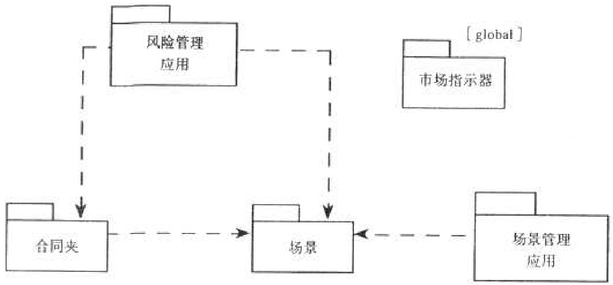  
图11-3在图11-1中增加应用包  

这里的问题在于：风险管理应用需要的场景包接口比合同夹包要的场景包接口大得多  

根据Wirfs-Brock[1]建议，这个问题的一个解决办法是一个包拥有-个以上的协议。在我们原始的模式中，我们把一组操作作为协议；然而，完全有理由只把一组能够对可见性进行更好控制的类型作为协议。使用分离的协议导致如图11-4所示的图，图中的场景有两个协议：一个是只允许合同夹使用的小协议，而场景管理应用使用更深层次的协议。协议通过包的外框中的半圆端口显示。（我只在具有不止一个协议的包中显示端口。）  

使用分离的协议是处理多重可见性问题的一种方法。另一种方法是引人一个附加的包，如图11-5所示。场景元素和它的类型从场景包中移动到具有额外可见性的新场景。  

  
图11-4带多协议的图11-3的包  

每个协议意味着一个独立的接口。  

  
图11-5使用一个针对场景结构的附加包  

细心的读者可能会发现一个问题：场景是否需要对场景结构的可见性。回答一个报价的请求需要使用内部结构。这些可见性体现继承和多态引人人胜的方面。场景包可以包含一个场景类，这个类定义场景可见的所有包需要的接口。然而，这个场景类不需要所有接口的实现（因而是抽象的）。我们可以在执行接口的场景结构包中放置第二场景类。这个第二场景类对场景结构中的所有内容有完全的可见性。另一个包使用的任何场景对象都是场景结构中的场景类的一个实例，但是这个类的那些客户并不认识这一点。所有他们看到的都是和场景包中场景类的接口一致的对象。为了显示这种子类化出现在越过包边界的什么地方，可能值得提供一个符号，尽管我并不使用这个符号。  

所以，当合同夹包中的一个对象发送一条消息到场景，它实际上是发送一条消息到位于场景管理包中的具体的场景类的实例。然而，调用者认为这是调用了一个存在于场景包中的抽象的场景类的实例。倘若被调用的对象是调用对象可以看见的包中的一个类的子类，那么对象可以发送一个消息给不能看见的包中的一个对象。  

这个原理的一个推论是：可见性并不反映编译或者加载依赖关系。虽然场景结构对场景不可见，但是场景却需要场景结构才能工作（严格地讲，它依赖于某些实现接口的包）。场景结构包含场景的具体的子类，没有这些场景，场景包就不能工作。  

虽然在这个方案中需要两种不同的场景类，但是它们可能符合一种场景类型。在本例中，需要提供一个新的类型，使得像场景管理这样的应用可以访问场景的内部结构。然而，当其它的类型不需要调用特殊的只在子类型中出现的特征时，就有可能只拥有一个类型。  

为合同和团体增加包会出现更复杂的问题。把场景和合同夹分别放在独立的包中有两个原因。第一，场景和合同夹看起来是构成模型的单独小块。它们本身是一些复杂的部分（看起来构成一个操作单元）。第二，我们不需要任何合同夹的知识来构造一个场景的模型。第二个原因是主要的，因为它导致图11-1所示的可见性关系。  

完全有理由断言：合同可以被放置在一起，而且无需合同夹的知识就可以对合同建模。可以用独立于合同夹的动态结构来记录合同，虽然合同夹是为了风险评估目的而用来组织合同的，如图11-6所示。  

团体和合同之间的关系是一个更大的问题。我们有理由为团体设立一个单独的包。许多应用可能寻找关于团体的信息而不想知道任何被他们执行的交易的事情。一个通用的团体包可能保存关于被许多交易系统使用的团体的通用信息，这比使用一个合同数据库要好。因而我们可以推断一个团体包是有价值的。  

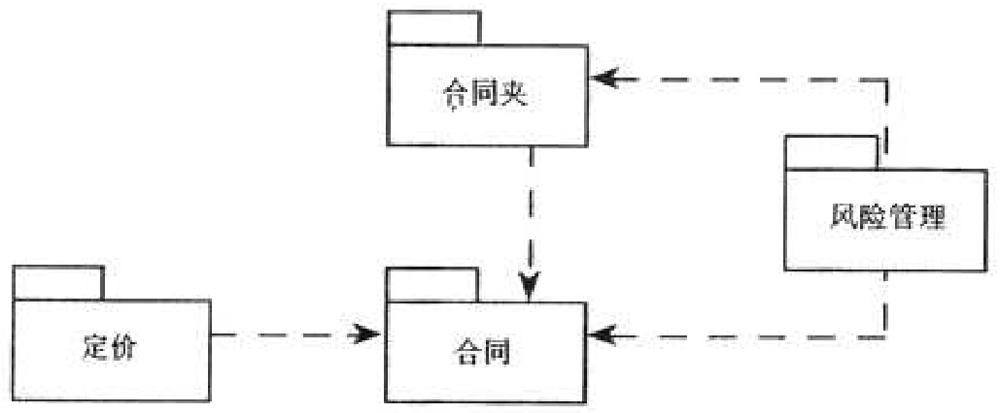  
图11-6合同夹和合同的包  

风险管理应用需要所有两个包：但是定价应用只醫要了解合同。  

团体和合同包之间将会是什么关系？对于一个团体，分辨哪一个合同来处理它，对于一个合同，分辨谁是合同适合的团体，都将是有价值的。这意味着团体和合同之间的相互可见性，如图11-7所示。但是相互可见性在一个包模型中可能会导致问题。从整体来看，我们设法用一个分层的构架和单纯的可见性线段来设计包模型。许多人相信这样一个构架在可见性关系中绝不应该有回路，因为回路打破了清楚的层次规则。相互可见性是回路的一种最简单的情况。  

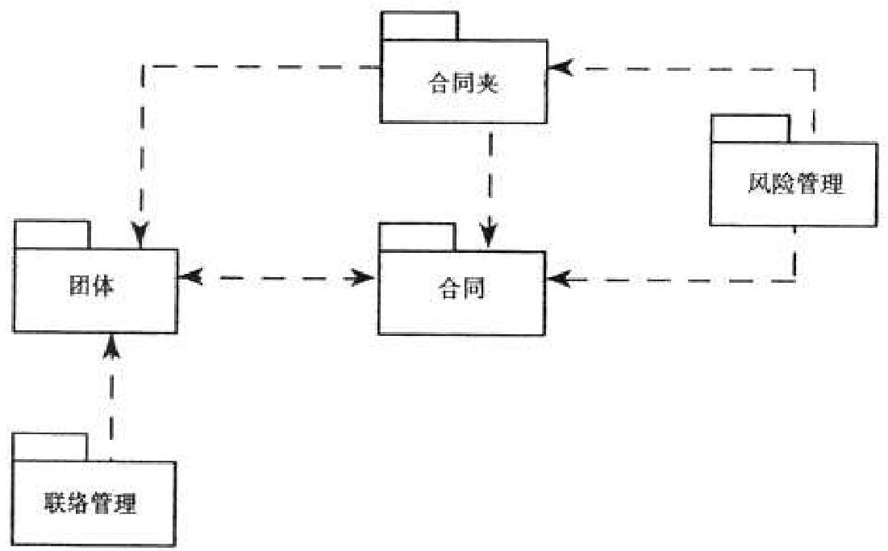  
图11-7独立的团体和合同包  

一些应用只需要团体包或者合同包，但是这两种包是互相需要的。这就意味着相互可见性。如果相互可见性是不可接受的，我们可以选择一个方向或者合并这些包。  

为了消除相互可见性，我们必须改变团体的属性或者合同的属性，使得只有 $\rightharpoonup$ 方知道另一方，或者合并它们到一个单独的包。每一种替代方法都要做出一些权衡。  

限制团体和合同类型之间的可见性为单向的，其好处是减少了两种类型（和它们各自的包）之间的鹅合。如果我们消除了从团体到它的合同的映射了使关联是单向的）我们就可以在团体包上工作而不需要知道任何关于合同的事情。这就减少了耦合（团体不再和合同耦合），这是一个优点。然而，一个想知道某个团体是哪些合同的对方团体的用户必须查看每二个合同，并且使用到团体的映射来形成集合。因而，我们虽然减少了团体包开发者的复杂性，但是却增加了对需要使用两种类型的任何应用的开发者的复杂性。这里没有绝对正确的答案：我们不得不考虑在每一个方向上的权衡并决定哪一个选择有较少的负担。  

建模原则：单向关联和双向关联之间的决定是减少相关类型的开发者的工作（通过减少类型间的耦合）和为类型的使用者提供方便之间的折衷。  

假定我们决定赞同双向关联，我们消除相互可见性的惟一办法是合开团体和合同包。然而，这个方案并非没有缺点。在图11-7中，我们可以看到联络管理包只需要知道团体，而不是合同。合并这两个包将会消除这个信息。联络管理将被强加比它需要的可见性更大的可见性。  

这种情形使我不能禁正相互可见性或者其它回路。当然，回路数目应该被减少到最小。然而，完全消除它们会导致：或者强加单向关联和双向关联之间的折衷方案，或者客户不需要的包含所有可见性的大包。  

建模原则：如果一个包只需要对另一个包的一部分的可见性，那么考虑将后面的包分成两个相互可见的包。  

图11-8所示的是这种情形的另一个例子。将产品（参见10.3节）加到它自己的包中。前面的论述导致产品、团体和合同之间的相互可见性。这导致领域模型包的完全耦合。然而，应用包只需要了解整个模型的一部分，并且每一个应用包都有稍微不同的需求。这三个相互可见的包使我们清楚地了解这些需求。  

另一个办法是在包上提供多个协议。这样，团体包、产品包和合同包合并在一起，并为原来的三个包提供三个独立的协议。应用然后选择协议选择方式与其在图11-8中选择包的方式相同。  

总而言之，当类型自然地紧密耦合时，我们有三种选择。我们可以通过采取单向关联来降低耦合（但是这种方法给类型的用户造成更多的困难）。我们可以把它们放置到一个单独的大包中（但是这意味着包的任何互可见的包（但是这在包结构中引人了回路）。如果你有多个包的多个协议，你可以拥有一个使用独立协议的大包。  

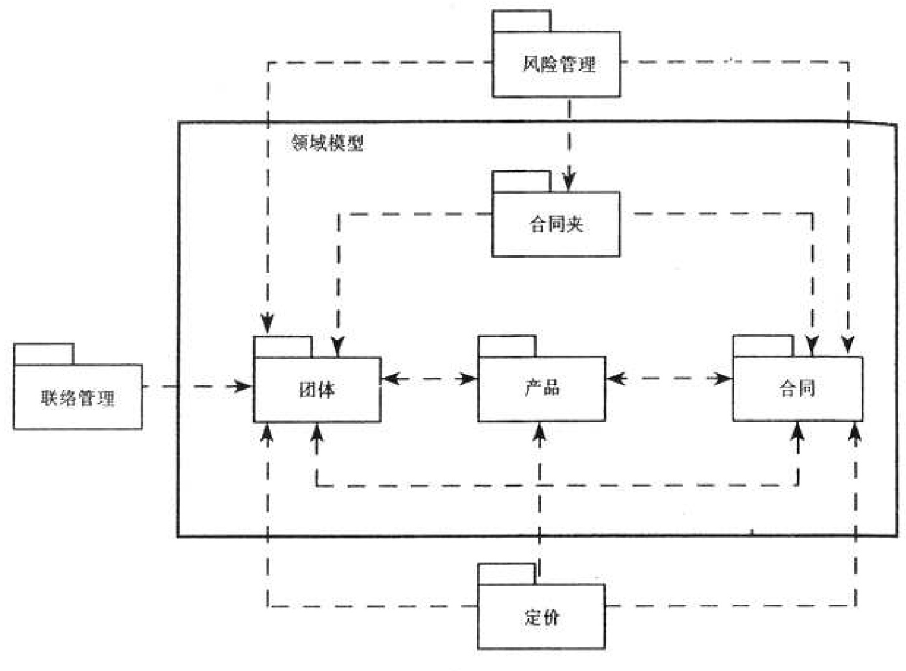  
图11-8在包中增加产品  

再次看到，相互可见的包可以为不同的应用需求提供服务。  

# 11.3包的子类型化  

在进行子类型化时，可见性是最容易考虑的。子类型永远需要看到超类型，但是我们应该避免相反的情况。因此，我们增加了组合、期权和关卡（在第10章描述），如图11-9所示。  

我们还应该避免子类型和它的超类型之间的相互可见性。子类型化的全部要点是充许扩展一个类型而不让超类型知道它。如果我们设计类型时让超类型知道它们的子类型，那么将来的特殊化可能变得更困难，因为我们要把关于子类型化的假设构造到超类型中。任何消除这种依赖的努力在 以后的增加中将得到加倍的补偿。正确地设计超类型通常需要在首先设计少许子类型时积累的经验，所以最好不要专注于超类型，直到把少许子类型组合在一起后再转向超类型。  

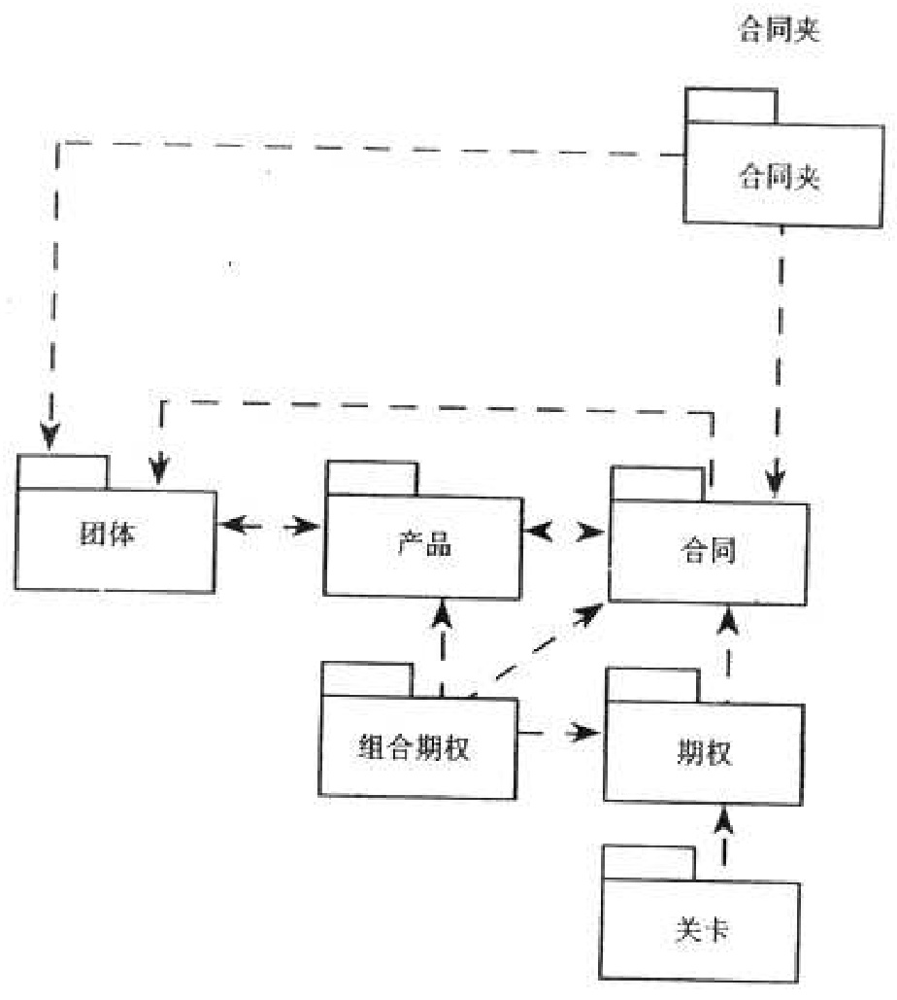  
图11-9增加不同种类的期权  

子类型需要对它们的超类型可见，但是不能反过来。  

可见性总是意味着折衷方案。对可见性的限制减少了模型浏览的方便性。如果有很多单向的可见性，浏览整个模型就像是在一个有很多单行线街道的城市里游览。双向可见性使浏览更加容易，这意味着可以维护更少的代码。然而，这样的可见性也有代价。系统的越多部分互相可见，在模型中控制变化的后果就越困难。限制可见性削减了这种相互依赖性。  

不同的面向对象建模人员采取不同的折衷方案。一些折衷方案在很大程度上限制可见性，使用如单向关联和类型可见性图表的技术。我发现这种限制性太大。我考虑的是包的可见性而不是类型级别的可见性。第12章描述的构架把一个系统分割为基本的层次。在领域层次中，可以使用更进一步的可见性限制，但是这常常不简单。然而，因为我的信息系统经验，我更喜欢这种方法。开发的其它种类会有不同的折衷方案。  

大多数项目不会很仔细地考虑包构架。通常只有构架的基本层次，甚至什么也没有。这导致项目相关的缺点，并且使评估一个适当实施的构架  

模型的价值变得困难。只有更多的实践才能允许我们更进一步理解这个讨论的折衷方案。  

如果开发一个包构架对于一个项目是复杂的，那么当我们试图为一个巨大的组织集成信息系统时，复杂性会增加十倍。大型组织会被多个不能相互通信的系统弄得焦头烂额。即使硬件和软件已经成形，系统的基础念的不同还是会导致集成的失败。一种普追公认的解决办法是进行企业范围内的建模。然而，用这种方法的问题是它需要太长的时间。到它完成的时候（如果它能完成的话），其工作通常是值得怀疑的和延期的。我认为能够被一次性处理的建模块的大小是有上限的，并且这与提交有用的系统有关，而交付有用系统这一事实证明了在一个正常的期限内建模的花费是合理的。这样，需要一个更适宜的方法来集成它们。对于这个任务，我相信包和可见性都是必需的工具。但对于这个任务光有它们是不够的，而我也不会假装知道还需要什么。这样的企业范围的集成我们仍然知之甚少和其他人一样，我也仅仅知道什么是不该做的！  

1 Wirfs-Brock,R.B.Wilkerson,and L.Wiener.Designing Object-Oriented Software Englewood Cliffs,NJ:Prentice-Hall,1990  

# 二部分  

# 支持模式  

分析模式讨论分析过程中遇到的问题以及一些可以处理这些问题的模型。支持模式处理那些围绕分析模式建立计算机系统的过程中出现的问题。在第12章和第13章中考虑一个客户/服务器信息系统的构架以及这样一个系统能够被如何分层以改善它的可维护性。第14章考虑如何能够实现一个概念模型，提出一些把分析模式转换成软件的通用模式。  

最后，第15章更加抽象，考察建模技术本身和如何能够把先进的建模结构看作模式。这给我们提供一个更好的基础，以便扩展建模方法来支持特殊的需求。  

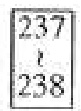  

# 第12章  

# 信息系统的分层构架  

本书中的分析模式将对企业信息系统的开发者其有极大的价值。然面，信息系统（IS）开发所包括的不止是对一个领域的理解。我们必须要适应一个由大量用户、数据库和遗留系统组成的世界。本章讨论信息系统的构架模式。构架模式描述的是把一个系统分成主要子系统的高层次分割和子系统之间的依赖性。信息系统构架模式把系统分成儿个层次。构架模式本身是有用的，但是它们也显示分析模式如何适合个更广泛的范围。第13章描述使用本章中模式的一种技术  

对象技术的早期并不太关注IS开发。主要回题是大量的通常复条的信息必须被很多人共享。即使这个信息被共享，不同的用户还会有不同的需求。提供能够被局部裁剪的公共信息是大型信息系统的一个主要口标此外：需要大量的适应性来满足不断变化的信息需求，大多数信息系统的上要任务是维护、维护主要包括处理变化的信息需求、在这些环境中对象技术的主要优点不是在于建立新系统的速度而是在于减轻了维护的负担[3]  

在开发一个现代信息系统中，最基础的问题是理解潜在的软件构架。对适合信息系统的软件构架的一个明朗的描绘必须在关于使用哪种技术或者考虑什么过程的任何讨论之前。  

大多数的IS开发都默许地采取个两层构架（参见12.1节），它源自大型机交 $l_{l,}$ 系统并且现在通用于客户服务器的开发。尽管两层构架应用广泛、但是它还是有很多缺点，这是因为用户界面紧密地耦合于物理数据设计。三层构架（参见122节），也称为三模式构架，通过在用户界面和物理数据之间放置个中间层来处理这个问题。这个领域层精确地对问题领成的概念结构进行建模，对象技术特别适合于三层方法，而且领域层既可以放置在客户端的机器上，速可以放置在服务器端的机器上  

接下来我们把注意力转移到应用上，它操纵领域层的对象并且在用户界面上显示信息。这两个责任能够被用来把应用分成表示层和应用逻辑层（参见123节应用逻辑能够被组织成领域层上的一系列外现，每种表示  

有一个外观。这个分割具有很多优点，并且应用外观能够被用来简化客户/服务器交互。  

数据库交互（参见12.4节）能够用两种方法来处理。领域层能够负费访问数据库，数据库处理它本身的连续性。这对于面向对象系统或者简单关系系统来说工作得很好。当存在复杂的数据格式或者多个数据源时，可能需要一个额外的数据接口层。  

本章是基于不同的实践，尤其是英国国家健康服务部门的Cosmos项目和伦敦一家银行的派生交易系统。  

12.1两层构架  

大多数的IS开发都是（至少是租略地）依据两层原则进行组织，如图12-1所示。一个两层构架把系统分成一个共享数据库和几个应用。共享数据库位于服务器上，这个服务器具有硬盘空间和应付繁重命令所需要的处理。数据库包含的数据是企业的一个重要部分所需要的，并且这些数据的组织结构是为了支持这个部分的所有需求。（一个单独的企业范围的数据库对大型公司来说是不可行的，因此一个数据库只能负贵一个部分。数据库由一个数据库组进行设计和维护。虽然这里使用术语数据库，但是应当记住的是：数据经常被存储在平面文件中（最商业化的数据仍然位于平面文件（例如VSAM）上）像这样的数据库可以指任何数据源。  

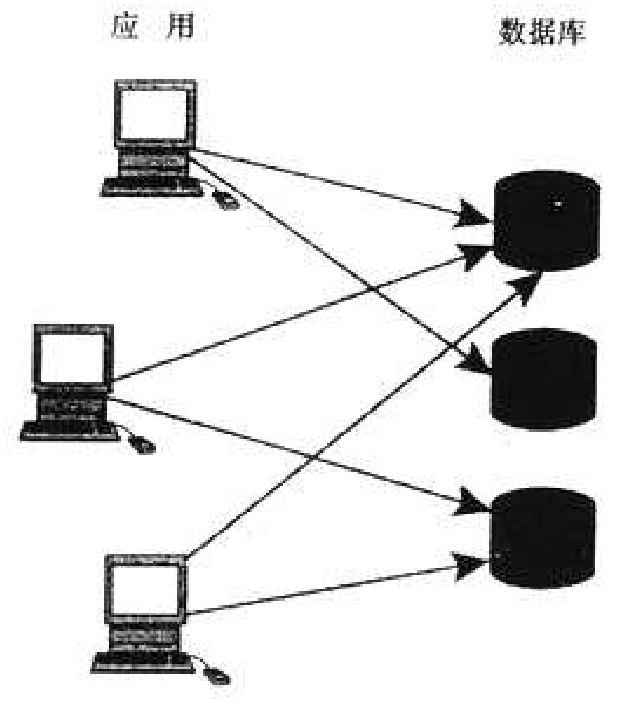  
图12-1两层构架  

应用直接访问数据库。  

应用是为专门的本地使用开发的。传统上使用CICS/COBOL，但是最  

近的工作已经使用4GL和流行的应用开发工具Powerbuilder和VisualBasic这些工具为开发GUI系统提供完善的特征，并且一个好的Windcws界面也是PC用户通常所要求的，他们已经习惯于电子表格和文字处理器上的这种功能。应用通常是针对逐个的用况逐渐建立起来的。任何需要的新数据能力都由数据库组进行请求。  

两层构架具有一些优点。大部分组织具有的数据需要集中控制和一致维护。解释这些数据的应用不需要太多的集中控制。很多IS需要把一些存在的数据以一种新的且有意义的方式显示。  

两层构架也存在许多缺点，其中大多数都是现存的技术所固有的。所有数据是共享的而所有处理是本地的，这种思想大致上是正确的但却是一种租糙的简化。一个企业的很多处理方面的问题是共享的。数据库（不管是SQL还是以前的那些数据库）都不能提供一种计算上完整的语言。数据仍是未封装的，因此大量完整性控制需要应用程序员来做。这使我们难以改变一个已经有大量应用在其上运行的数据库结构。存储过程减少了这些问题，它们能够为处理和封装数据提供支持。  

数据库通常不能提供对企业的一个真实描述。这是由于缺乏建模结构，这些建模结构在建模技术中很普通，但是要在日常数据库中支持它们还有很长一段路。平面文件和层次数据库在数据结构上具有众所周知的限制新的开发工作的现存标准、关系数据库还承受着高额的连接费用。适用于隐含业务语义的数据模型通常被高度地标准化并且为了达到合理的性能需要重新组织。  

一个应用的数据不太可能都在个数据库中。数据库即使在创建时进行了马妙的组织，经过一些年的业务改变和企业重组之后通常也不连贯广。两层构架要求应用知道哪个数据库保存哪些数据，以及每个数据库中的数据结构，这个数据结构可能与这些数据的语义有很大的不同。  

# 三层构架  

一个更好的构架实际上已经出现了很长一段时间。早在20世纪70年代三模式构架就被提出[4]。它提供一种三层方法，如图12-2所小：外部模式、概念模式、存储（内部）模式。存储模式是数据库设计、外部模式是应用：新的层次是概念模式，我喜欢称其为领域层。这描述了企业的真实语义。它应当忽略数据存储结构和数据位置的限制。  

三层方法的主要优点是它充许完全在领域的语义上描述应用。数据管理员不必关心数据的物理位置和结构，而是能够看到一个消除了这些依赖性的逻辑图像。这也使数据管理员能够自由地改变物理的结构和位置而不  

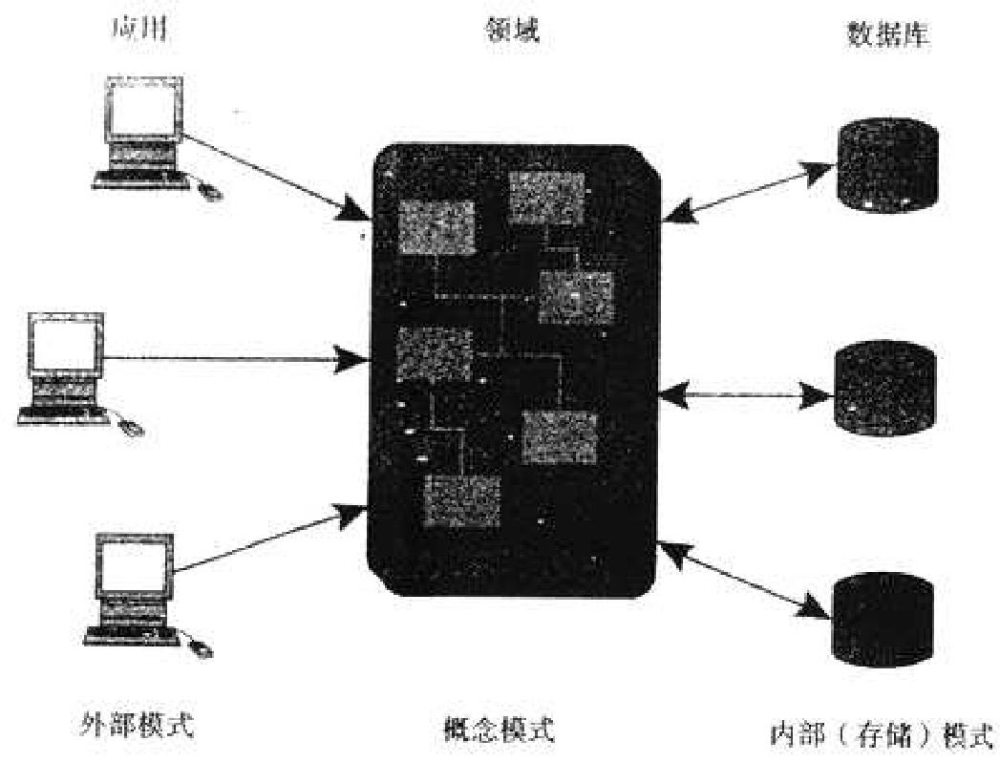  
会破坏现存的应用  

三层构架得到广泛的赞同但是却很少被实现。这种情况的主要原因是很难用现有的技术来应用它。现在有适合于数据存储和应用开发的工具但是没有实现一个领域层的工具。最有用的开发是逻辑数据模型，它通常被看作数据库设计中一个必需的开始步骤。这允许设计者在提交一个物理设计之前考虑企业语义。这样一来，对物理设计的修改就可以作为企业语义修改的自然映射。  

对数据的强调是很重要的。大部分专业人员认为领域层是一个逻辑数据模型。他们可能进行过程建模，但是应用开发者通常单独考虑它。然而，这种观点不是所有数据建模者所共有的。一个语义数据建模者的强大学派认为数据建模完全可以与面向对象建模相比，因为它包含子类型化和派生数据、把过程连接到对象、把过程看作数据并且把过程嵌入到语义模型中  

随着面向对象技术的发展，领域层开始能够走到前面来。对象描述一个很好的方法来实现领域层。它们支持封装、复杂的结构关系、规则、过程以及由高级语义建模者考虑的所有东西。可重用的类库（或者仍然很好的框架）也处于领域层的核心。一个企业的关键重用对象是那些描述领域的对象一一那些实现领域层的框架（因此用术语领域框架）。因而，对象建模和领域层开发非常有效地一致。  

实现问题多少复杂一些，但是基本的原则仍然工作得很好：如果领域  

层被表达成一个面向对象模型并且被作为一个领域框架来实现，那么就能够针对这个领域框架来编写应用。这提供了我们非常需要的应用和数据库之间的分离。  

领域层的位置  

在一个客户/服务器世界中，一个重要问题是这个领域层应当位于什么位置。一个两层方法把应用软件放在客户端（台式机器）而把数据放在不同的数据服务器上。若存在领域层，我们就有两个基本的选择：我们能够把领域层放在客户端，或者我们能够引人一个新的处理器层次，它作为领域服务器并且由一个或者多个联网的机器组成。  

基于客户的领域框架使我们把开发集中于客户机器，简化了我们的系统支持。引人机器的一个新层次很可能成为许多用户的一个新的头痛问题，而且它还带来新的需要维护的机器和系统。领域层被作为一个库的集合提供给客户系统的应用开发者，然后由他们编写必需的代码。  

一个基于客户的领域层的问题是：我们可能需要在客户端进行大量的数据选择和处理。这强迫我们使用强大的客户机器。随着台式机器变得越来越强大，这不再成为一个大问题，但是我们不能把这种强大作为前提。技术把我们推向比以前更加小型的机器；一些用户想要使用掌上电脑和PDA，这会对处理造成限制。当需要更多的处理能力时，更新服务器通常相对简单。  

可用的软件非常适合于基于客户的方法。作为通常的对IS应用最有用的语言，Smalltalk需要一个连接到领域层内部的用户界面，虽然运行在服务器上的没有用户界面的“无头”Smalltalik已经开始出现。  

在一个基于服务器的领域层中，领域层更加容易控制和更新。如果领域层位于客户端，那么任何修改都需要被发送到每个客户。一个服务器上的软件更新能够以一种更加简单明了的方式进行处理。这种控制也扩展到对固定数据（尤其是那些包含数据如何被访问的数据项）的支持。  

我们需要考虑并发问题。有意思的是，IS应用很可能比任何其它风格的软件都使用更多的并发但是却对此考虑得最少。这是因为强大的事务模型通常由一个数据库很好地操纵，它将应用程序员从大部分令人头痛的并发问题中解放出来。随着领域层被引人，我们不得不问自己事务的边界在哪里。我们可以把它放在数据服务器中或者放在领域层本身中。逻辑的位置是领域层，但是这需要我们在领域层提供事务控制特征一一一个错综复杂的业务。这样的放置也鼓励基于服务器的领域层，因为一个跨越大量客户的提交实际上超越了现有的技术。我从来不鼓励客户建立他们自已的事务控制系统：这个任务处在大多数IS开发的范围之外。  

应是已经提供了到传统数据库产品的接口。用这种方法，一个00数据库能够充当事务控制机制而不需自已存储任何数据。随着时间的过去，一些数据，尤其是（一个00数据库能够很好管理的）复杂并相互关联的数据，就能够被转移到OO数据库中。然而，只要开发者喜欢，关键的企业数据总是能够被放在一个更传统的地方。这里有一个重要的警告是：很少有关于00数据库的多用户性能的信息。对O0数据库而言，很多被引用的引人注目的性能改进都是基于小型的单用户的数据库。任何使用00数据库的人，即使只是为了事务控制，也应当在决定使用OO数据库之前进行基准测试。  

如果只使用一个单独的00数据库，那么数据存储层就被有效地压缩到领域层中。这是可容许的，只要这是一种有效的构架并且为了支持其它数据库面对系统进行的扩展用以下的方式提供，即那些其它的数据库被隐含在领域层之后以便使它们从应用是不可见的。  

# 12.3表示层和应用逻辑层  

三层构架提供一些非常重要的好处。目前，太多的注意力被放在如何能够构造领域层上，而且00建模的很大一个部分被直接应用到这个关键的层次上。然而，很少谈到关于应用的内容。应用是通过在领域层内装配可重用的构件来建立的，并且还存在针对这个任务的指导方针，虽然通常没有对它们的细节描述。  

在今天的环境中，典型的情况是一个程序员在一个（建立在领域层上的）GUI环境中开发一个应用。这就需要关于GUI环境和领域层的知识面一个复杂的领域层能够使学习的曲线非常陡峭。在很多图形环境（例如Visual $\mathbf{C++}$ ）中，编程也是使人畏惧的。  

考虑关于金融机构的一个相对简单的例子，这个机构有一份合同夹包含多个美元（USD）和日元（JPY）之间的派生合同。这样的一个组织关心的是管理与这份合同夹有关的风险。有几个因素能够影响这个风险，包括即期汇率、汇率的易变性和这两种货币的利率。为了考虑这个风险，分析员想要看到在这几种不同因素的各种组合的情况下合同夹的价钱。实现的一个方法是使用图12-3中显示的表格。分析员挑选两个要分析的变量，为它们设置不同的值，然后观察矩阵中显示的合同夹在数值的不同组合情况下的价值。  

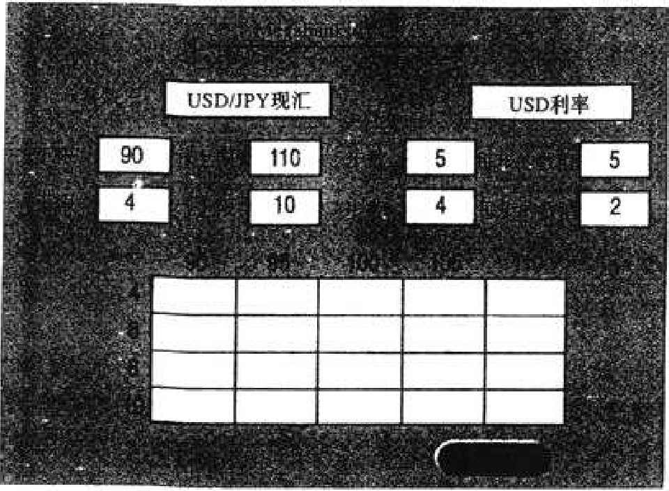  
图12-3一个管理派生风险的应用示例  

处理任务是什么，我们应当如何在应用和领域层之间划分它们？一个基本的任务是确定派生合同的价值，典型的情况下这是由Black-Scholes分析[2]处理的一个复杂过程。这个过程会被一个派生交易环境中的任何系统广泛使用，因此它应当被放置在领域层。另 $\rightharpoonup$ 个通用的任务是对一个合同夹中的大量合同进行评价，它通常被放置在领域层。下一个任务是从表格中的参数（上限，下限，步距，步数）建立整个表格中的数值。这个任务是这个风险报告屏幕所特有的，因此在逻辑上应当是应用层的一部分，与建立和控制GUI的代码一起。  

建立矩阵的任务也应当包括在内并且该任务需要更详细的观察。它包括设置不同的参数，使它们保持一致，然后用参数建立数值的表格。这个过程能够并且应当从一个GUI屏幕的显示中分离出来。因此我建议把应用层分成两个层次：一个表示层和一个应用逻辑层，如图12-4所示。  

这两个层次的职责非常容易区分。表示层只负责用户界面。它处理窗口 $\searrow$ 菜单、字体、颜色和在屏幕或者页面上的所有定位。典型的情况下，它使用一个用户界面框架，例如MFC或者MacApP。它不执行任何计算、查询或者到领域层的更新。实际上它不需要具有到领域层的任何可见性。应用逻辑层不执行任何用户界面处理。它负责所有到领域层的访问和除了用户界面处理外的任何处理。它从隐藏的领域层中选取信息并且把它简化成表示层需要的确切形式。领域层的复杂的相互关系因而对表示层是不可见的。除此之外，应用逻辑层还执行类型转换。表示层一般只处理公共类型的一个小集合（整型，实型，字符串，日期，加上软件中使用的聚合类）。应用逻辑层提供这些类型，而且负责把隐藏的领域类型转换成这些类型并解释由表示层请求的任何更新。  

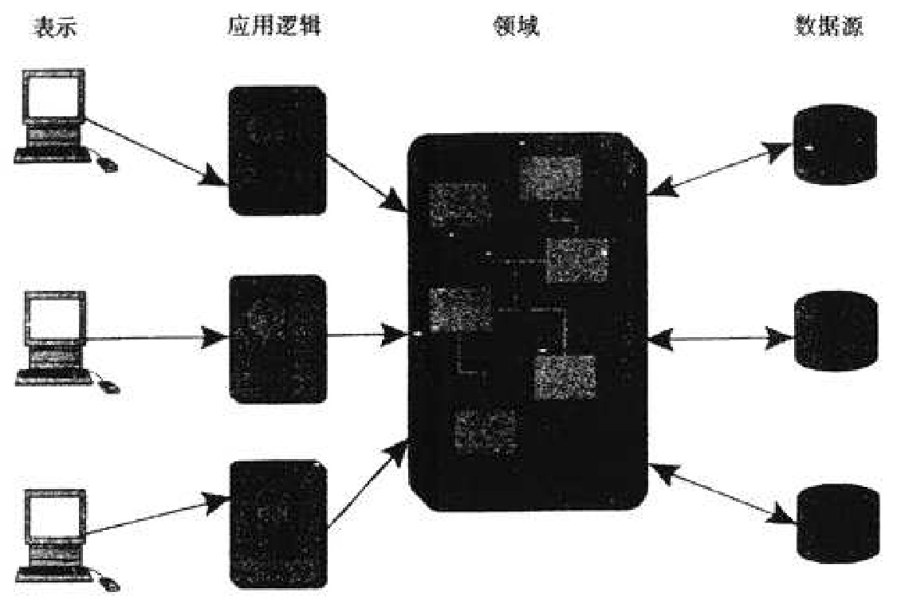  
图12-4把应用层分成表示层和应用逻辑层  

组织应用逻辑层的一个有用方法是开发一系列的外观。外观口是为复杂模型提供简化接口的一种类型。我们能够为每种表示准备一个外观。在外观中，相应用户界面上的每个元素都有一个特征。因此每种表示都有一个到领域模型的简单接口，这个接口把对表示而不是对用户界面的所有处理进行最小化（第13章讨论设计这些外观的一种技术）。  

图12-5显示这种组织是如何处理上面提到的风险报告屏幕。我们需要两个类：一个风险报告表示类和一个风险报告外观类。表示类创建屏幕的布局并且管理用户和它的交互。外观类提供一个模拟表示类的隐藏结构。它有操作来得到和设置参数、上限、下限、步数、表格的x和v坐标的步距。外观类还包含在这些数值之间确保正确的一致性所必需的规则（例如不变式xUpper-xLower $==$ xNumberOfSteps\*xStepSize）它也提供-个方法来返回结果表格。理想的情况下，这使用一个通用的矩阵类返回一个单独的矩形。（如果因为某种原因这既不是可行的也不是所期望的，那么外观类提供操作来得到特殊的单元，但是一个可重用的矩阵类（本质上是一种新的聚合）通常是最好的解决方案。）  

外观上的getResultMatrix方法查看：表示对象是否提供了足够的信息（如果没有，它能够增加默认值）并且接下来请求领域层用参数的不同组合来评价合同夹对象。领域层把结果填人矩阵然后把它返回给表示对象。  

设置参数是一个使用类型转换的例子。不同的对象可以作为参数被放置在这个列表中，包括USD/JPY现汇、USD/JPY的易变性、USD的利率和JIPY的利率。（这个列表依赖于合同夹中合同的货币。）外观对象向表示对象提供从领域层（参见13.5节）中的类型转换得到的字符串。外观对象一般提供这种字符串的一个列表给表示对象，后者把它放置在弹出式菜单中。表示对象因此可以选择一个字符串。外观对象把选中的字符串关联到下层的领域对象（一个字典能够很好地对此进行处理）这样一来，用户界面就完全和领域模型隔离开来。  

用户改变x参数方框的数值。表示对象改变外观中的数值，方法是用菜单中的字符串进行更新。  

用户改变 $x$ 的下限的域。表示对象改变 $\mathfrak{X}$ 的下限的值  

用户点击计算表示对象向外观对象请求结果矩阵。外观对象查看：不同的表格参数是否设置正确。如果都正确，外观对象请求合同夹对象用表格中设置的数值的不同组合来评价它自已。它把结果矩阵返回给表示对象。  

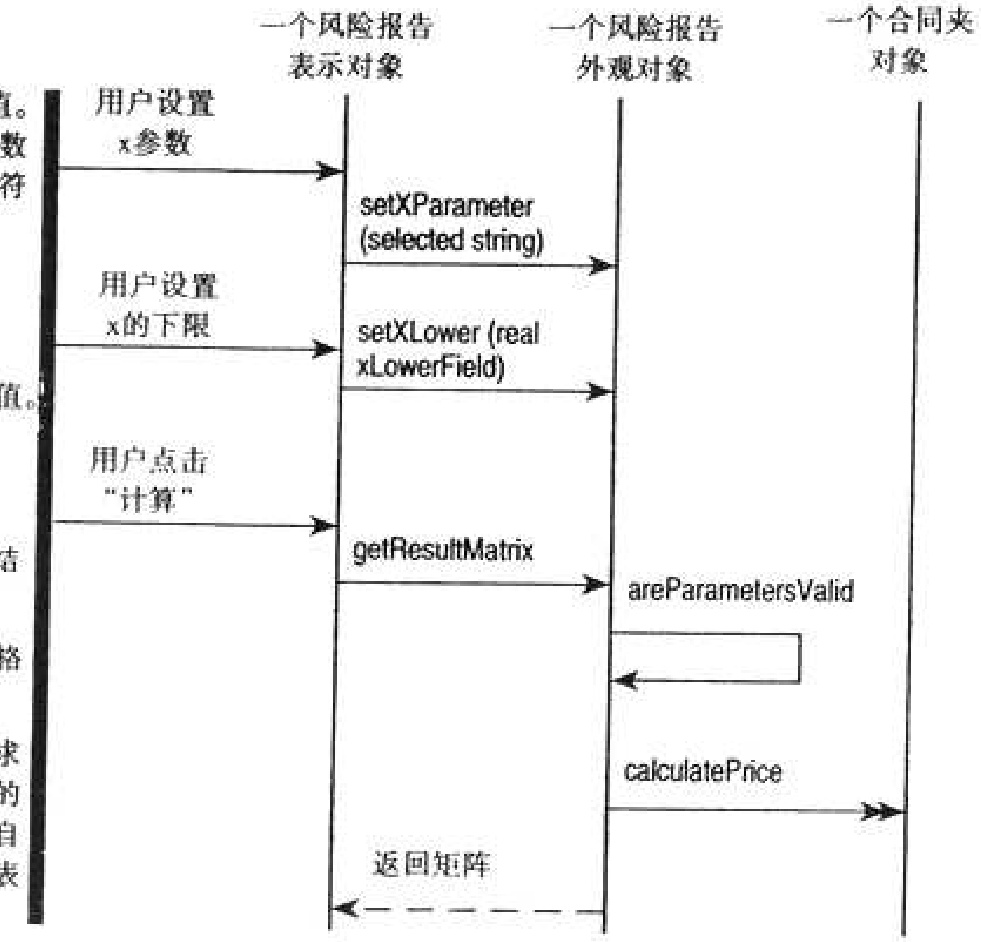  
图12-5总结表示、外观和领域层之间协作的交互图  

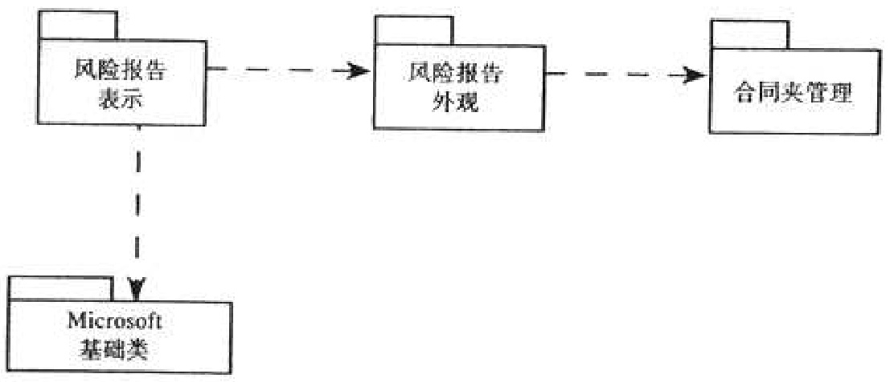  

模型中发生一个变化时表示层需要被自动地更新，就会发生问题。一个选择是让表示层定期进行更新，但是这可能会变得非常凌乱。一个更好的选则的情况下被自动地更新。  

12.3.1表示层/应用逻辑层分离的优点  

分层基本上是一个好主意，但是它确实有一些缺点：建立层次需要额外的工作，并且使用它时会发生性能损失。重要的问题是它的优点值得它的花费吗？  

一个优点来自于两个层次中包含的不同编程风格。GUI编程非常复杂，需要关于GUI框架和如何才能很好使用它们的知识。如果还需要新的GUI控件，那么编程可能变得更加复杂。另一方面，GUI开发能够变得非常简单明了，如果我们拥有一个好的GUI屏幕创建器，它允许我们在屏幕上描绘控件和制作事件处理器，这些事件处理器通常最终要对应用外观进行调用。在这两种情况下，开发组织都能够使用那些几乎不需要知道领域模型的GUI专家。与此相同，外观程序员根本不需要了解GUI系统如何工作，他们关心的是得到与领域类型之间的正确交互。因此，我们看到会存在这样的情况：GUI开发者理解用户界面环境但是根本不需要了解领域模型，而外观开发者理解领域模型但是不需要知道GUI开发。表示层/应用逻辑层的分离把需要的不同技术分割开来，从而使开发者为了做出责献只需要学习较少的东西。  

这个分离允许从一个单独的外观开发出多种表示：当我们需要包含相同信息的由用户定制的屏幕和页面布局时，这尤其有用。当工具用来进行屏幕和报表的建立时，这使我们可以迅速地转变到新的表示风格。  

外观为测试提供一个很好的平台。当外观和表示层被合并时，基础的计算只能够通过GUI进行测试，这需要手工测试（或者针对回归测试的GU1测试软件）。当这些被分隔开时，就能够为外观的接口编写一个测试程序。这样一来，只有表示层代码需要使用比较笨拙的工具来测试。测试的分割进一步支持两个层次的分离，虽然表示层必须在外观能够被建立之前进行定义。  

# 12.3.2在客户/服务器环境中伸展外观  

如果领域层是基于服务器的，那么外观对客户/服务器交互的价值相当于一个焦点。在这种情况下，一种有用的技术是把外观“伸展”到客户和服务器，即把一个外观类既放在客户端上又放在服务器端上。当用户打开一个表示对象时就在客户端打开相应的外观。客户外观把请求传递到服务器外观上。服务器外观检查创建过程，从领域类中找出信息。当客户外观需要的所有信息都完成时，服务器外观把客户外观需要的所有信息都发送到客户端。由于服务器外观和客户外观可以是不同的对象空间，因此在两个外观类之间就会发生一系列的私有通信。因而，用户能够和表示对象进行交互，表示对象将根据每一个修改来更新客户外观。这些修改一直到用户提交才会被传递到服务器外观上。那时修改过的外观对象被传递回服务器，然后服务器外观更新领域层，如图12-7所示。  

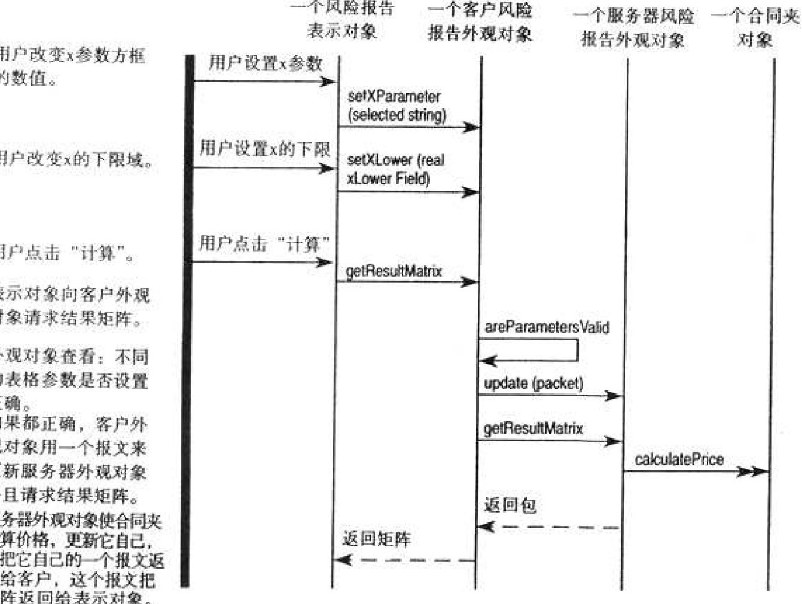  
图12-7图12-3使用伸展外观的交互图  

伸展一个外观的要点是：对于客户/服务器交互，它允许引用的一个单独的点。如果一个客户外观（或者一个表示）直接访问服务器领域类，将会看到大量需要的调用通过网络转移到客户端。这些网络调用会成为性能上的一个重要开销。外观可以有一些方法来建立一个单独的转移报文并且把这样的一个报文解释成外观的数据。然后就能够在一个单独的网络调用中传递所有的信息。  

外观需要具有与领域模型交互的职责。两种类都需要能够向其它类发送信息和从其它类接受信息。理想上，只有客户外观需要支持表示层的操作。然而在实践中，我发现：为了使测试更加简单，给这两个类提供相同的接口是值得的（也就是说，它们是相同的类型）。两个方面都需要加载和保存操作。客户外观通过与服务器外观的通信来实现这些操作，而服务器则通过与领域模型的通信来实现它们。  

# 2.4数据库交互  

我们需要仔细地考虑如何把数据库和遗留应用结合到这个结构中。最简单的情况是使用一个对象数据库。在这种情况下，直截了当的方法是把数据库简单地结合到领域层中。然后对象数据库就会提供相应的功能来支持对象持久性、事务管理和企业程序员不必担心的其它特征。  

然面，在-一个IS体系中几乎没有如此简单的应用。很多IS组织不信任对象数据库并且不愿意把重要的数据放置其中。造成这种情况的部分原因是它们是新的，并且还要考虑它们的复杂性。如果某个事物发生错误，对关系表进行仔细分析要相对容易。而具有繁茂的硬盘指针的对象数据库就要困难得多。  

即使对象数据库对新的开发是一个值得信任的选择，仍然还有现存数据的问题。甚至，尽管关系数据库现在的地位是作为已经被证明了的数据库开发技术，它也仍然没有达到管理大多数企业数据的地位。企业数据的极大多数都位于层次数据库、平面文件和类似的系统中。对象系统必须和这些系统交互，从中得到输人，并且要面对不得不访问大量系统以获得一个完整的数据视图的事实。有两个主要的方法能够供我们使用：让领域模型和数据源交互或者使用一个数据库接口层。  

# 2.4.1把领域层连接到数据源  

让我们考虑一种简单的情况：一个需要使用关系数据库进行数据存储的独立系统。我们应当为了专门支持这个领域模型而设计关系数据库。我们应当首先设计领域层并且把数据库模式建立在这个基础之上。除了最简单的系统以外，不可能简单地获得领域模型中的每个对象类型并且把它变成一个关系表。不管它们的名称，关系数据库还有一个关联数据的问题，因为计算连接是耗费时间的。因此，一个好的关系化的设计应当非常标准化，以便获得好的性能。领域模型为数据库设计提供一个起点，但是数据库设计要做得好需要时间。最后得出的数据库模式可能者起来与原始的对象图区别很大。  

把领域层连接到数据库的显而易见的方法是使领域类知道如何从数据库建立它们自己。类能够具有从数据库中获得数据的装载程序并使用它来创建和组装框架。重要的是：应用不被包含在这个行为中。当一个应用请求一个对象时，领域层应当查看它是否在内存中。如果没有，它应当使该对象脱离数据库创建它自己。应用应该不需要知道这个交互是如何发生的。  

这个过程会发生一个例外，就是应用需要一个特殊的数据配置发生作用，并且在开始时只用一个步骤就能够从数据库中获得该数据，以便改善性能。在这种情况下，一个有用的做法是领域层提供针对具体应用的装载请求，这种请求给应用一个机会让领域层知道它想要请求什么。在某种程度上，这损害了领域层不应当知道什么应用使用它的原则，但是在一些环境中性能的改善是强制的。  

领域层和数据库之间的直接连接确实存在一些重要的问题。它能够使领域类变得过分复杂，原因是赋子它们两个独立的职责：提供业务的一个可执行的模型和从一个数据库中找出数据。与数据库交互所需要的代码将是非常重要的，并且这些代码使类过分膨胀。如果数据不得不从多个数据库和供给中获得，那么这个问题就会变得关键。  

当然，一个解决方法是增加另一个层次一数据库接口层，它负责从数据库中为领域层装载数据和当领域改变时更新数据库。这个层也负责处理输人以及其它遗留交互。  

在许多方面，数据库接口层和应用逻辑层非常相似。在这两种情况下都向一个复杂的领域层提供 $\rightharpoonup$ 个外观来应付一个不够强大的表示。这个外观选择和简化对象结构并且执行到更加简单的外部类型系统的类型转换。此外，领域层应当不知道能够从它得到的不同视图。通常，数据库接口类是基于和它们一起工作的数据源。能够为一个关系数据库中的每个表或者一个供给中的每个记录类型构造一个数据库接口类。支持数据库交互的类库通常都支持这种通信  

这一层和应用逻辑层之间最大的区别在于活动的启动。通过用户界面，用户的动作导致表示层对活动进行初始化。由于表示层具有到应用逻辑层的可见性，因此它调用应用逻辑层是很简单明了的。活动的初始化遵循可见性的线路。然而这不是数据库接口的情况。领域层通过想要保存它自己来启动过程，但是我们不想让领域模型看到数据库。因此活动的初始化与期望的可见性是对立的。一个解决方法是再次使用观察者模式[1]，但是那很可能会导致很大的消息通信量。  

一种替代方案是用一个对领域层可见的接口代理来扩展构架。这个代理提供一个非常小的接口，它只允许初始化数据库接口的消息。通常，这些可能是像loadMe（anObject）和saveMe（anObject）一样通用的调用，它们所有的职责就是处理到数据库接口层的请求。因此接口代理的职责是把这个请求传递到数据库接口中能够最好地处理这个请求的一个类上。所以，如果我们拥有保存在一个数据库表中的现汇合同和保存在另一个表中的常规期权，那么接口代理首先询问这个对象以便找出它是哪一个，然后把请求传递到适当的数据库接口类上，如图12-8和图12-9所示。  

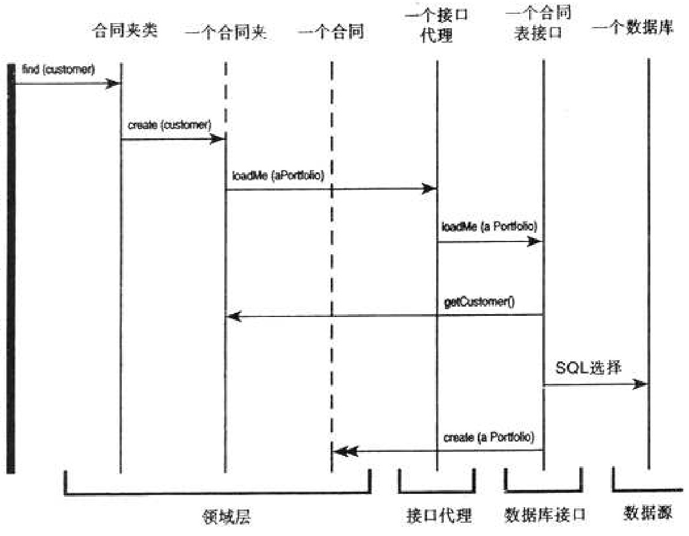  
请求针对某个客户的一个合同夹。合同夹类查看：它是否已经在内存中，如果没有，它就创建一个空白的合同夹。  

这个分层的优点和在其它地方分层的优点是 $\rightharpoonup$ 样的：职责再次被以一种有用的方式进行分割：数抵接口从企业模型甲被分岛出米。表格式押人的改变不用改变领域模型就能够进行。当表格式不在项目小组的控制之中时或者当教据结构很可能为工促进性能面改变时：这是无其重要的。：这些数据来源的易变性越大，使用一个中间层就越重要。  

访问不同数据库需要不同的工具和技术。为了连接到数据库产品的接  

口，有专门的类库。还可能需要关于SQL和特殊数据库格式的知识。其它的数据库（多维的，层次的）有它们自己的接口和结构要学习。把这种交互分离出来就能够允许小组成员集中精力于他们技术最强的领域，尤其当存在很多不同的数据源时：这是非常有效的。  

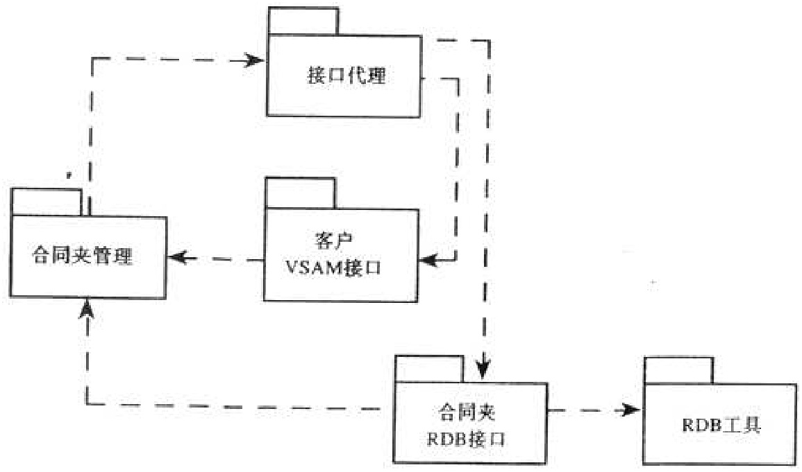  
图12-9数据库接口层的分类  

在一个客户/服务器环境中建立大型IS系统仍然是一个有着很多缺陷的困难的活动。这些缺陷的大部分都存在于一个两层构架中，两层构架对小型系统工作得很好但是不能很好地扩展到大型系统。一个三层构架大大改善了这些问题并且被对象技术很好地支持。表12-1提供对三层构架的主要描述。  

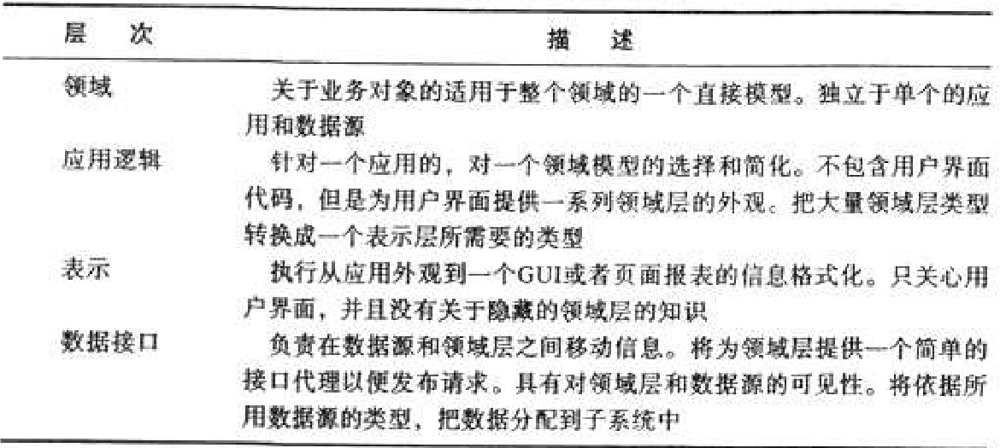  

分割应用层以便把应用逻辑从用户界面中分离出来是一种有价值的技器进行性能管理和支持更加专业的开发人员。一个中间层对数据访问也是有用的，尤其是当存在很多复杂的数据源时。  

有些类一定会被所有的层使用。这包括公共基础类型（整型，日期数量）聚合和一些领域的特殊基础类型。  

# 参考文献  

1 Gamma,E.,R.Hielm,R.Johnson,and J.Vlissides.Design Patterns:Elements of Reusable Object-Oriented Software.Reading.MA:Addison-Wesley,1995.

 2. Hull,J.C.Options,Futures,and OtherDerivative Securities(Second Edition) London:Prentice-Hall International,1993.

 3.Kain,J.B."Measuring the return on investment of reuse."Object Magozine,4,3 (1994].Pp.49-54.

 4. Tsichiritzis,D.C.,and A.Klug.TheANSI/X3/SPARCDBMS framework:report of the studygroupon database management systems.Information Systems,3(1978).  

# 应用外观  

要完全理解本章，必须首先阅读第12章的12.3节。在12.3节中解释如何将应用分割成表示层和应用逻辑层。表示层包含所有用户界面逻辑，而应用逻辑层为表示层提供一系列自定义外观。这些应用外观负责为一个表示层选择和安排所有信息。  

我们可以使用本章中描述的一个相当标准的技术来定义和建立应用外观。（因为不够典型，所以本章不包含模式。）这种技术可以被认为是对面向对象方法的一个补充。  

一个应用外观看起来非常像任何其它的类型：它有属性和操作。然面，所有的属性都是从领域模型派生得来的。给出的模型是基于一个医疗保健的示例（参见131节）。一个外观的内容（参见13.2节）用一些连接到每个属性的方法来定义。这些方法描述如何检索属性、如何更新属性、如何得到一组合法数值、如何对属性进行验证、如何得到一个默认值。  

一些公共方法（参见13.3节）可以在很多应用外观中使用，所以它们可以被转移到领域模型中。应用外观也包含一些局部于这个外观或者授权给领域模型的操作（参见134节）。用户界面框架一般不会涉及到领域模型中很多的相关类型，所以应用能够执行类型转换（参见13.5节）、创建用户界面能够理解的更简单的类型。一个应用经常包含多重外观（参 见13.6节），它们能够用一个结构化模型来描述。  

我己经在几个项目中使用了这种技术，包括英国国家健康服务系统和伦敦一家银行的交易系统。它是专门为应用逻辑层的外观设计的。它也适用于其它环境的外观，包括数据库交互。  

13.1一个医疗保健示例  

从一个比较复杂和抽象的领域模型中最容易理解应用外观。图13-1显示了这样一个模型，它的基础结构是基于为医疗保健而设计的Cosmos模型[1]。在第3章中可以找到对大量这种思想的更多解释，在继续本章内容之前阅读那一章是值得的。考虑从一个医院信息系统中得到的一个例子，该系统需要记录每一个  

保存一个完整的医疗记录。关于每个患者所能记录的信息的范围是巨大的。为了缩小模型的体积，使用一个抽象的方法，如图13-1所示。  

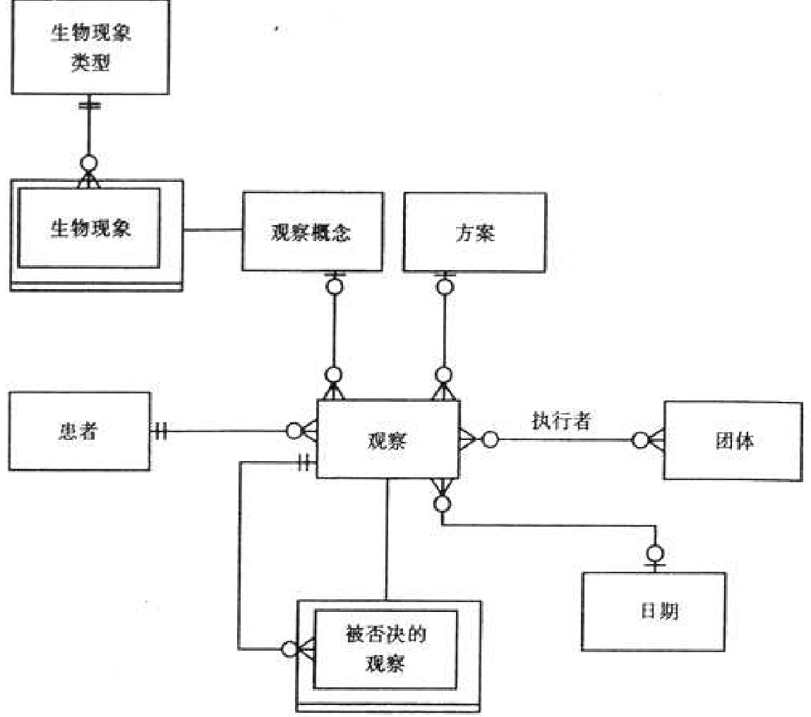  
图13-1从医疗保键面来的一个领域模型示例。领域层是建立在这个模型上  

模型按照生物现象和生物现象类型的形式描述关于一个思者能够记录的所有信息。例如，一个性别的生物现象类型具有“男”和“女”两个生物现象，一个血型的生物现象类型具有的生物现象是A、 $\mathbf{B}_{\mathrm{x}}$ A/B和O。为了说明一个患者的血型是0型，我们使用一个把患者连接到适当的生物现象的观察。我们也能够说明关于观察的其它适当信息，例如谁执行它（执行者），什么时候执行它（日期），如何执行它（方案）。如果后来发现这个观察是错误的并且正确的血型是A型，则我们丢弃原来的观察并且用一个新的观察替换它。这是维持一个患者的完整记录所必需的。  

这样的模型适用于很多种情况。然而，输血部门的需求更简单、更集中。它只希望记录患者的一组属性。例如，考虑一个献血者的登记。一个献血者的属性包括：姓名、血型和最近一次献血日期。姓名很简单，因为它直接连接到患者类型。可是血型和最近一次献血日期却需要比较复杂的处理，下面我们就会看到这一点。  

# 外观的内容  

每个应用外观都由一个指向领域模型的引用（作为外观的主题）和一些为外观的用户描述信息的属性组成，如图13-2所示。  

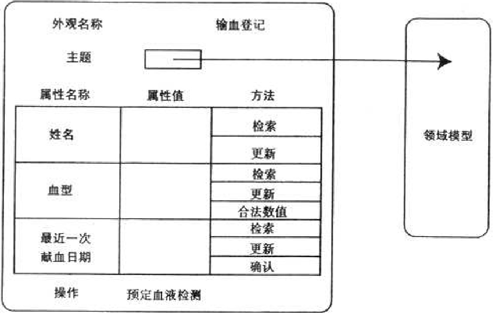  
图13-2一个应用外观的组成部分  

一个应用外观的对外是领域模型中的一个特殊对象，它作为外观的主题。这个主题担当外观进行的所有处理的起始点。当我们定义外观时，我们就定义主题的类型。对于输血登记这个例子，主题就是“患者。外观的用户从不直接访问主题，但是把外观作为主题的一个逻辑窗口来处理。  

因此，外观中的每个属性都作为主题的一个逻辑属性。每个属性的类型应当已经被定义好，并且这个类型应当与领域模型上的一个类型相符。同样地，我们也能够在外观上定义操作。在献血者登记的例子中，我们有一个献血者外观如下所述：  

应用外观：献血者主题：患者属性：姓名：字符串血型：生物现象最近一次输血日期：日期操作：预定血液检测  

在各种形式的结构化英语。  

13.2.1方法的类型  

个方法看作在主题中开始、对模型进行的一个查询。一个检索方法可能很简单：例如，登记名称会与患者的姓名相同。但是检索方法也可能变得相当复杂。患者的血型需要找出这个患者的所有没有被去弃的观察，这些观察的生物现象类型是血型。同样地，要找出最近一次献血日期需要执行所有这样的过程：它们的方案是献血并且返回最近一次的日期。只读属性将不会拥有任何其它的方法。  

合法数值方法提供一个能够用来进行确认检查的合法数值的集合。常常（就像姓名）不存在合法数值的有穷集合：但类型对于确认足够了。然而，对于而型却要求一些更复杂的东西：属性的类型是生物现象，但是只允许那些生物现象类型是血型的生物现象。因此，合法的数值是由一个返回生物现象A $\mathbf{B}_{\mathcal{N}}$ AB：0的集合的查询提供的：这些数值本仅对确认位查有用，而且能晚用来填与用户界面上的一个菜单或者列表。  

更新方法是一个需要最强大技术的方法。虽然检索方法是简单的，但一个更新的意义却可能变化巨大。姓名对象又提供对一个患者的属性进行更新的一种简单情况。改变血型要复杂得多，所以我们需要创建一个连接到该属性支持的生物现象的新观察。丢弃旧的观察，并且把它连接到新的对象以便显示哪一个对象丢弃了它。另外我们还能够提供一些隐藏信息。例如，血型中的改变通常由输血单元提供，并且该单元通常使用相同的方案，因此我们能够把这个信息自动地加人到记录中，方法是把登录的医生作为该过程的执行者并且使用标准的方案。显然，我们必须注意有多少信息是隐藏起来的，并且这些信息应当反馈给用户。  

如果合法数值和属性类型对合法性检查都不够，那么就需要一个确认方法。需要提供的确认规则是一个专门针对某个外观的上下文。例如，最近一次献血日期可能需要比今天早并且比当前显示的献血日期晚。  

默认方法在创建一条新记录时使用，与之相对的是一条现存记录的更新。为了减少复杂性，我们通常假定创建一条新记录与更新一条空记录相同。然后用户会填写属性，并且使用的确认方法与更新记录时使用的确认方法完全相同。默认方法表明：如果用户从 $\rightharpoonup$ 条空记录开始应当提供什么信息。它的组织形式与一个检索方法非常相似。  

一些属性拥有的数值不是一个而是 $\overbrace{\cdot\cdot\cdot}^{\ast}$ 列。在这种情况下，有两个更新方法：一个是增加一个项目，另一个是删除一个项目。检索方法返回一个聚合，它可能是一个集合或者一个列表。如果聚合是一个集合，则排序标准是专门表示数值显示顺序的。通常这是基于数字或者字符串的标准排序准则。表13-1总结这里讨论的不同方法。  

  

表13-2显示一个关于这些方法应当如何书写的例子，这个例子是从上面给出的献而者例子中提取的。这些规则没有用一种形式化的符号来表达（因此是含糊的），但是我们使用了一种伪SQL的风格来书写，已经证明这是介于严格和易于理解之间的一个合理的折衷。  

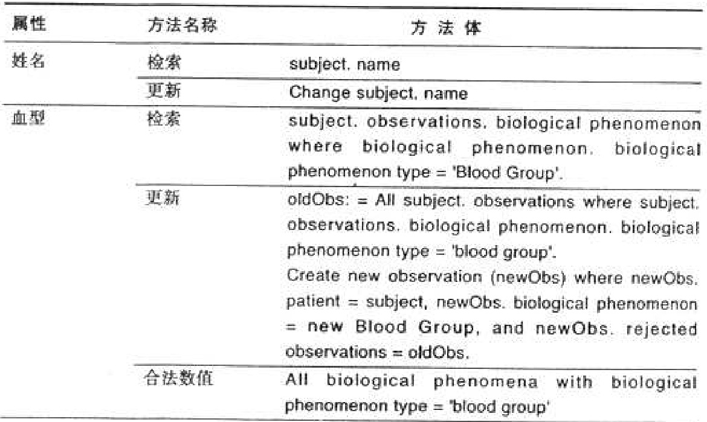  

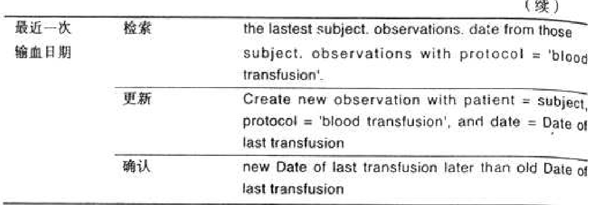  

13.3公共方法  

在使用外观的应用中，我们看到很多方法具有一个类似的结构。在医疗记录模型中，血型属性就是通用情况的一个例子。血型方法检索一个患者的特定生物现象类型的一个特定生物现象，假设一个患者只有一个那种类型的生物现象。在请求血型时我们提问“这个患者的观察是针对类型血型的哪些生物现象？”这种方法存在于很多种情况下（例如一个患者的性别）。因此，如果有一个通用的服务不仅处理公共访问和更新的情况，而且负责所有特殊情况（例如一个惠者存在不一致的观察）的处理，那将是很有意义的。  

我们可以把这样一些服务合并到领域模型中作为针对患者的操作或者计算映射。在我们的献血者例子中，这导致一个操作：  

valueOf(a Biological Phenomenon Type):a Biological Phenomenon 注意：针对患者，可能有一个相应的更新操作也包含应用外观的更新方法。  

把应用外观方法转移到领域模型中有两个方面的用处。首先，它们提供一个到外观的更高层接口，简化应用外观的开发。特别是，这意味着处理这些种类属性的公共代码可以在领域模型中只保存一次，而不用复制到很多应用外观中。这种方法的第二个价值是，它提供一种好的最优化的方法。这些代码非常通用，因而可以被保存在一个共享方法中，这个事实说明这些代码将会被频繁地执行。因此，这就是最优化的一个很好目标。当00系统提供相对说明性查询来说更具有导航性的查询时这会变得尤其重要。  

很明显，不是每个应用外观方法都应当被转移到领域模型中。应用外观的价值是它们把局部于某个上下文的内容和必须共享的内容分离开。每个转移到领域模型中的外观方法都会增加领域模型的复杂性。因而设计者必须质疑把外观方法转移到领域模型中的可行性，只有当这样做的好处超过将会增加的复杂性时才可以进行。  

# 13.4操作  

和其它任何对象类型一样，应用外观既包含数据又包含过程。13.2.1节中讨论的方法是外观的私有方法，它们管理应用外观和领域模型之间的映射。还有公有方法负责访问和更新外观的属性。  

应用外观中的其它操作不仅仅是对属性的处理。这些操作应当单独进行声明，并且通常都包含一些复杂的处理。需要考虑这些操作是局部的还是共享的，如图13-3所示。一个共享操作在整个组织中使用，而一个局部操作只被某个应用使用。如果操作是共享的，那么它应当在领域模型中实现并且属于最适当的共享类。共享操作应当忽略任何外观并且只操作共享对象。因而对外观的操作应当只把调用传递到共享操作上，同时提供必要的参数并且为了外观内部的使用而解释返回值。  

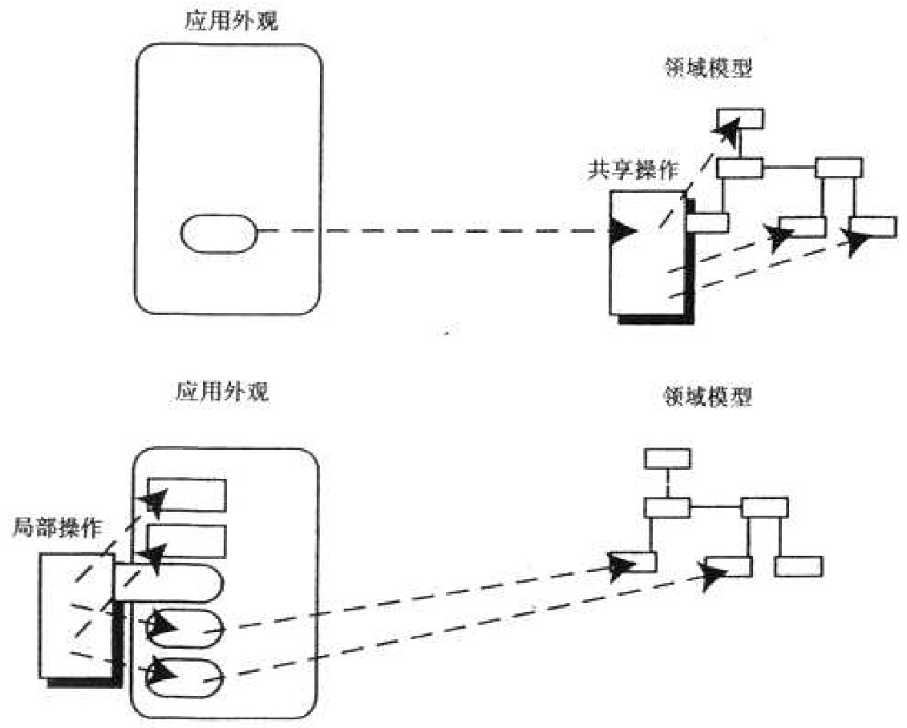  
图13-3应用外观中的操作  

一个共享操作在领域模型中实现并且访问领域模型的结构和服务。外观提供对这个操作的一个引用，而一个局部操作在外观中实现并且只访问这个外观的属性和操作  

然而，一个局部操作不应当放在领域模型中，而应当在局部模型中实现。它不应当使用领域模型的结构和操作，而应当依赖于应用外观的属性和操作。由此，局部和共享代码就被明显地分隔开。  

要注意的是：局部和共享操作之间的区别完全是一个对代码的概念共享的问题。它不影响环境（例如一个客户/服务器环境）的实现时所关心的事情。根据环境，局部操作能够运行在一个服务器上，或者共享操作能够在一个客户端运行。这个区别只是基于这些操作在概念上是否是共享的。共享操作被大量重用并且必须更加仔细地维护，就和领域模型的其它部分一样。局部操作可以只在外观内部进行处理。只有在它们所在的外观被重用时它们才会被重用。  

13.5类型转换  

使用00系统的一个困难就是在一个网络中移动对象的复杂性，尤其是在从一个对象空间移动到另一个对象空间时。这个问题发生在信息需要从一个00系统移动另 $\longleftrightarrow$ 个具有不同对象ID的OO系统时，或者从一个00系统移动一个非00系统时。在这些情况下，我们可以只移动关于对象的信息，而不是真正的对象。一个解决方法是使用一个Proxy（代理），把这个代理设计成：把对自己的调用翻译成对原始对象的调用。这个系统在客户端和服务器端都是一个分布式数据库的组成部分时工作得很好，但很多系统都有连接到数据库服务器的PC客户，这时任何对一个对象的调用都会变成昂贵的网络调用。  

当有关的非O0系统没有关于对象和消息的理解时这是尤其重要的。信息必须通过使用一个较低层次的描述（例如ASC1I字符串）来传递。这时必须把对象信息转变成一个字符串，发送到网络上，然后反译码为对象。  

我们能够使用外观来帮助简化网络访问、控制到字符串的转变、允许应用一次传递一大段信息。我们这样做是通过把属性值作为字符串来处理，如图13-4所示。到对象的连接能够通过在外观的类部分保持一个查找表来维护。这个查找表从字符串映射到数据库对象，使确认和更新更加容易。这个表能够用一个字典来实现，其中关键字是字符中，值是数据库对象。关键字集合能够用来装载菜单或者确认的目的。当一个属性被改变时，这个表能够把它转变成一个对象以便进行数据库中的替换。因为这个表保存在外观的类部分中，所以它只被保存一次。如果对适当的选项进行了一个改变，那么它也只需要被刷新：这种改变通常很少发生。  

因此，血型属性在类部分中有一个对应的字典，BloodGroupValues。这个字典有关键字字符串A、B’等，它们有数据库中的对象作为值。检索时血型转变成一个字符串（使用一个名字函数或者通过字典）并且存储在属性中。当被更新时，新的字符串被用作一个到字典的查询，并且相应的值被用来进行数据库中的更新。  

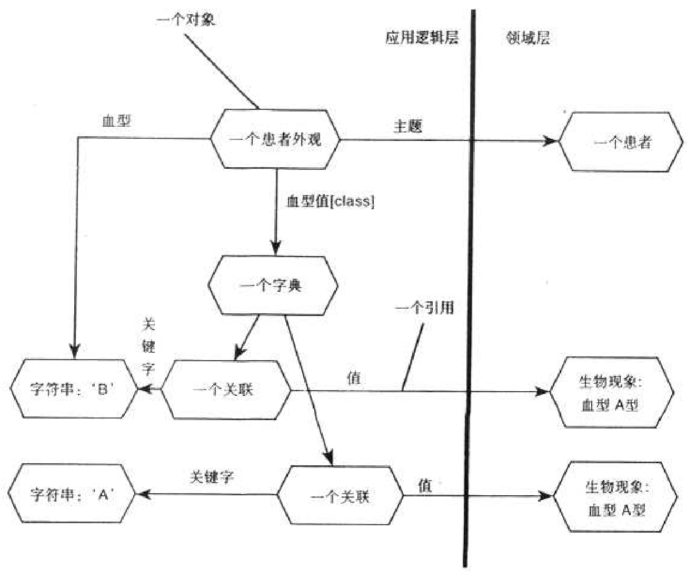  
图13-4类型变换的对象示例x  

应用外观有一个到领域模型中的主题的引用。对于它的属性，它保存字符串并且发送字符串到对应的表示对象。它还有一个到字典的连接（静态的或者通过它的类），这个字典把字符串和隐藏的领域对象联系起来。（为了清楚，这里只显示两个血型。）对每个需要这种类型变换的属性，它都有一个字典。  

当使用这种方法时，应当把外观属性描述成具有内部和外部的类型。内部类型是在领域模型中的类型，而外部类型是提供给表示对象的类型。在血型的例子中，内部类型是“生物现象”，而外部类型是“字符串”  

13.6多重外观  

应用外观通常不单独出现，而是成组出现。一个应用由一些表示和相应的外观组成。这些构件能够用两种方法连接起来。第一种方法是使外观包含构件，如放在一个表中。例如，一个输血历史，每条都有地点和日期，可以显示为在一个全部献血者表示内的一个表。第二种方法是允许用户从一个表示对象遍历另一个表示对象。例如，一个正在观看验血信息屏幕的用户能够打开另一个单独的屏幕观看验血所使用的血液样本的细节。  

图13-5中的结构模型说明这些外观是如何发生关系的。我使用聚集来展示需要在同一表示对象（例如一个表）中显示的信息，而使用规则关联来显示需要通过打开一个不同的表示对象而获得的信息。同样地，我使用单向关联表示用户从一个表示对象中打开另一个表示对象时能够采取的路径。  

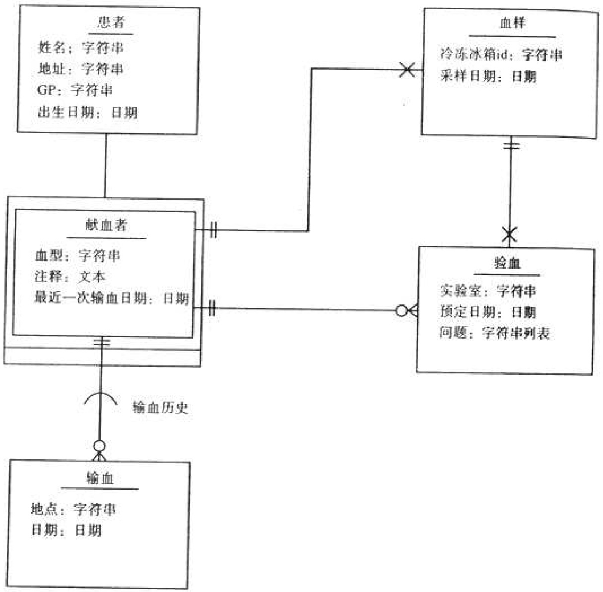  
图13-5应用外观的一个示例图  

显示的类型是外部类型（参见13.5节）。这个模型表明我们有一个血者的表示对象，它在患者的表示对象上增加了所有显示的信息。它还显示一个输血的表。用户能够追历到一个显示验血列表的单独表示对象。从这个验血的表示对象，用户可以遍历到适当的血样的表示对象，从后者用户又可以追历到献血者的表示对象。  

使用一个结构模型是非常有用的，但是有一点很重要，即记住建模的  

风格是不同的。在领域模型中应当避免复制职责，尤其在保持信息时。因为这个原因，我们可以用一个不同的符号强调不同的策略。然而，大体上我认为额外的符号会增加太多的复杂性。  

外观之间另一种可能很重要的关系是子类型关系。一个患者外观可能已经覆盖很多患者需要的一股信息。献血者需要的信息可能包含这个信息并有所增加。因此，献血者外观是患者外观的一个真正子类：患者外观的所有属性在献血者外观中都存在，并且献血者外观能够响应所有患者外观的消息。  

在许多方面，外观的结构是由外观支持的表示的结构驱动的。在外观的集合支持不止一个表示时，两种结构不可能完全对应。一个新的表示可以从相同表示的互相关联的外观中合并信息。这是完全合理的。虽然把外观结构建立在表示结构的基础上是有益的，但是使一个外观集合支持多个相似的表示也是明智的。在这种情况下，截断表示和外观结构之间的连接是一个合理的牺牲。  

1.Cairns,T.,A.Casey,M.Fowler,M.Thursz,and H.Timimi.The Cosmos Clinical Process Model.National Health Service,Information Management Centre,15 FrederickRd,Birmingham,B151JD,England.,ReportECBS20A&ECBS20B <http://www.sm.ic.ac.uk/medicine/cpm>,1992.  

# 第14章  

# 类型模型的模式一设计模板  

本书使用了非常概念化的模型，因此解释这些模型如何转化成软件对我来说是很重要的。本章提供能够用来为类型模型构造设计模板的转换模式。转换模式描述把一个人工制品从一种形式转换成另一种形式的原则。设计模板描述如何把一个隐式规约模型转变成一个显式规约模型和一个实现。因为隐式接口模型和概念模型基本相同，所以它们对于理解概念模型如何与实现相关联是很有价值的工具。  

本竞并不试图提供针对任何特殊实现环境的设计想极的一个完全集合。实现环境之间差别很大，每一个都需要不同的权衡。这不只是一个Smalltalk或者 $^{(\mathrm{++}}$ 的回题。很多因素一一硬件、数据车、网络、类库一都影响在：一个项目上实际使用的模板。因此：我集中天注那些在设计模板中发现的模式一一即通用的原则和执行转换时应当考虑的问题。  

设计模板的不同是基于所使用的建模方法、实际实现环境、企业标准和最终系统的性能需求。对它们的使用能够以规定的方式或者以他人建议的方式进行。它们可以由一个代码生成器实现自动化（至少在理论上实现自动化），或者以手工方式使用（例如，作为编码标准）。  

不是所有的方法都需要设计模板。如果所有的建模都使用一个深深植根于实现环境的方法，则转换即使需要也很少。这是使用一个基于实现的技术的主要优势。这样一个方法的问题是：人们对世界的看法和一个基于实现的模型之间存在很大的差距。而且把这样一个模型移植到另一个实现环境时通常也有问题。  

设计模板有以下几个日标：  

只要实际上可能，确保软件的构造方式与概念模型相同。提供软件内部的一致性。·提供构造软件的指导方针，以便知识在组织中能够得到有效传播。这些目标把我们引向一个重要的原则：设计模板应当定义软件构件的接口并且提出实现这些构件的建议。这个过程的一个目标应当是：一个不熟悉领域但熟悉模板的程序员通过观察分析模型就可以很容易地知道所有构件的接口是什么。在实际中要完全达到这个目标或许是不可能的，但是我们应当尽可能地实现它。  

建模原则：设计模板定义软件构件的接口并且提出实现这些构件的建议。  

因此，设计模板应当提供对所需要的接口的声明并能够提供一定数量建议的实现。程序员必须接受强制的接口，但是他们能够采取任何实现，或者从建议的列表中选取，或者提出他们自己的选择。类的用户不需要知道或者关心选择了什么实现。尤其是类的实现者应当能够在不改变接口的情况下改变实现。  

保持一个纯粹的概念模型是很困难的。为了确保接口能够被完全定义，模型必须是一个规约模型。它不需要是一个非常显式的规约模型，因为模板把这个模型转变成一个真正的显式规约模型。在一些情况下，接口因素会从一个纯粹概念化的角度导致模型的改变。这些改变并不重要，而且容忍它们通常比创建一些独立的模型并试图使它们同步更好。这些问题将在本章的后面进行讨论。  

本章的每一节都讨论一些转换概念模型的模式。我们从讨论一个实现关联的模式（参见14.1节）开始。有三个实现：在两个方向上的指针，在一个方向上的指针，关联对象。根据基本的原则，它们都具有相同的接口。基础类型有一些特殊的考虑。关联是几乎所有技术共有的，所以这个模式可被广泛应用。  

第二个模式讨论实现泛化（参见14.2节）。很多方法把泛化和实现的继承同样对待。本书使用多重和动态分类（参见A.1.3节），它使转换不太直接。我们考虑五个实现：继承、多重继承组合类、标志、委托给一个隐藏类、创建一个替换。我们再次定义一个公共接口，该接口包括一个测试对象类型的操作一使用时要多加小心。  

剩下的模式更短并且包括对象创建的模式（参见14.3节）、对象析构的模式（参见14.4节）使用一个入口点寻找对象的模式（参见14.5节）实现约来的模式（参见14.6节）。我们会简要提到其它技术的设计模板（参见14.7节）但没有进行详细讨论  

如果你不使用设计模板，那么你可以把本章作为对程序员应当如何解释概念模型的范例。本章的技术对于把本书中的模型转换成更加基于实现的方法（也包括转换成OO语言）是非常有价值的。任何想要借助Booch方法（举个例子）来使用本书中分析模式的人都将需要使用这些模式，尤其  

在处理泛化时更是如此。  

不同的语言对不同的元素有不同名称。我使用术语域（field）来表达类的一个数据值（一个Smalltalk实例变量或者一个 $\mathbf{C++}$ 数据成员）。我使用术语操作（operation）来指一个类能够识别的一个消息（一个Smaltalk方法或选择器，或者一个 $\mathbf{C++}$ 成员函数）。我区分操作（声明）和方法（体）：因此一个多态的操作有很多方法。我使用术语特征（feature）来表示一个域或者操作。  

本章假定你可以使用聚合类的一个类库。聚合（collection），也称容器（container），是一些拥有一组对象的类。传统的编程语言中所提供的最普通的、通常也是惟一的聚合是数组。对象环境能够提供大量聚合。Lewis[5]给出最普通的Smalltalk聚合的一个非常优秀的综述。很多 $\mathrm{C++}$ 版本使用类似的方法，虽然这些将被标准模板库（STL）[7]所取代。这些聚合包括：集合（无序，无重复）、列表（Smalltalk中的orderedCollection，STL中的vector和deque）、bag（像集合但有重复，STL中的multiset）、字典（STL中的map）。一个字典是一个查找表或者一个关联数组，它允许你查找一个对象时使用另一个对象作为关键字。所以我们可以有一个用名字作为索引的关于人的字典。你可以通过发送一个形式为PeopleDictionaryat（“MartinFowler”）的消息找到我。  

这些聚合大大简化了编程，并且具有这些可用性是面向对象环境最大的好处之一。很多环境（包括所有的Smalltalk）都具有这样的一个类库。大多数 $\mathrm{C++}$ 环境没有提供聚合类，虽然从一些销售商那里可以很容易地买到它们。我强烈建议你熟悉并使用聚合类。在一个面向对象环境中工作而不使用聚合类就像编程时把一只手放在身后。  

14.1实现关联  

本章以关联开始是因为它们提供了关于模板如何工作的一个简单而重要的例子。为了这一目的，我们将假设所有对象类型用类实现：这个假设以后将被改变。  

一些面向对象的专业人员不习惯在00分析中使用关联。他们认为关联违反了封装的0O编程原则。使用封装可以把一个类的数据结构隐藏在操作的接口后面。一些专业人员认为关联使数据结构公开化。摆脱这种困境的方法是要理解如何在0O语言的上下文中解释关联。提出关联是因为它们在概念建模中有用。如果它们被看作是用于描述某个对象类型有责任记住和改变它与另一个对象类型的联系的一种方法，那么它们就不会与封装冲突。因此图14-1中的例子显示雇员有责任知道他的雇主并且能够改变他的雇主。相反，组织有责任知道它的雇员并且能够改变它的雇员。在大多数的OO语言中，这个责任是通过访问者和修改者（get和set）操作实现的。当然可以使用一个数据结构，并且在大多数情况下都可以，然而一个数据结构不是概念模型所指定的。  

  
图141三个关联的例子  

属性能够被表示成单值映射，通常映射到基础类型。因此对方法而言，关于单值映射的讨论也适用于它们所使用的属性。  

双向关联和单向关联  

首先需要考虑的问题之一是使用一个双向关联还是单向关联。关于这个问题有很多辩论。单向关联更容易实现并且在软件中造成的耦合性也较少。但是它们使我们更难找到解决问题的办法。本书中的模式使用双向关联。我们可以选择把所有的关联都实现为双向的，或者都实现为单向的，或者混合使用。混合使用的一致性较少，但确实有优势。如果我们全部使用双向关联，我们会陷人耦合性问题。如果我们全部使用单向关联，我们可能会发现一些关联真的需要是双向的并且采取一个例外是值得的。  

如果我们要使用一个单向关联，需要决定支持哪一个方向和放弃哪一个方向。应用将会对此提出建议。一个好的经验是观察关联的客户想要做什么并且顺应他们需要的方向。我不信任用很多方法学的方式对访问路径的细节进行分析。我们应当首先做最简单的事情，但是如果我们的需要后来发生变化也应当做好准备改变它。如果我们保持一个模型，我们应当更新它以显示我们正在使用的方向。  

如果我们使用双向关联，必须小心使用那些穿过包的关联。如果我们维护双向性，将导致分类之间的相互可见性，这在11.2节讨论过。当我使用双向关联时，我在一个分类内部自由使用它们但避免在分类之间使用它们，因为减少分类之间的可见性更重要。  

# 关联的接口  

在一个OO语言中，关联的接口是用来访问和更新关联的一系列操作。这些操作的确切的项和结构依赖于包含的映射的基数。  

一般来说，一个单值映射需要两个操作：一个访问者和一个修改者。  

访问者没有参数并且返回接收者所映射的对象。修改者带一个参数并且把接收者的映射变成那个参数。不同的命名约定是可能的。Smalltalk中的约定是把两个操作都命名为mappingName，而修改者与访问者的区别是其具有参数。因此，图14-1中的雇员类应当有两个操作：employer和employer:anOrganization. $\mathbb{G}\!+\!+$ 中没有标准的约定存在，但是像getEmployer（）和setEmployer（Organizationorg）这样的命名经常是很 通用的。使用getEmployer(）和setEmployer(）是最自然的，但是一些人更喜欢使用employerSet（）和employerGet(）（或者employerOf(）和employerls（））以便在一个按字母排序的浏览器中这两种操作可以一起出现。  

一个多值映射需要三个操作。也有一个访问者，但它返回一个对象的集合。所有的多值映射都被假定是集合，除非有其它的说明。非集合的接口是不同的，并且超出了本节的范围。需要两个修改者：一个负责增加一个对象，一个负责删除一个对象。访问者的命名方法通常和单值映射相同，除非我认为一个复数形式能够格外增强它多值的本质（例如，employees或者getEmployees（））。修改者的形式是addEmployee（Employeeemp）、removeEmployee（Employeeemp)或者employeesAdd:anEmployee employeesRemove:anEmployeee  

没有必要在一个双向关联的两边都提供修改者。修改者经常看起来好像只能用于一个方向，通常这个方向是受约束最多的（例如Employee：employer）。在一个双向关联的两个方向上都应当提供访问者；这就是它成为双向关联的原因。  

在一个双向关联中，修改者必须总是确保两个映射都被更新。因此改变一个雇员的雇主就不仅要改变从雇员到组织的连接而且要改变相反的连接。我们在14.1.5节到14.1.8节中讨论这个实现。  

修改者还应当确保对约束进行检查。实际上，如果上界大于等于1，那么它就会被接口自然覆盖，所以只需要为其它的数字进行检查。如果下界非零那么通常需要显式的检查。在单值映射中，下界表明是否能够把提供null（空）作为一个参数。对于多值映射，一个下界意味着删除操作中的一个检查。一个映射的基数能够影响实现其它映射的操作。例如，在修改者。  

如果类型检查没有被构建在语言中，那么可以在修改者中执行它。这  

种类型测试能力，这在14.2.6节中进行讨论。我喜欢把类型检查放在一个专门的前置条件块中。所有对象都有一个称为require：aBlock的操作。该操作估算这个块，如果它的结果出错就产生一个异常。然后我在这个子句内使用一个像selfrequire：[aCustomerhasType：#Customer]的语句来测试类型。这使我可以很容易地为性能的原因取出类型检查，就像Eiffel中的前置条件检查。（一般来说，我就是用这种结构进行前置条件检查的。）  

一个多值操作的访问者返回的集合能够用来进行进一步的处理，这种控制使用环境中现存的任何集合类提供的便利。然而，你必须确保：通过增加或者删除对象而对集合的成员关系进行修改这个行为不会改变用来生成这个集合的原始映射关系。对映射的修改只能来源于作为显式接口组成部分的修改者操作（参见6.9节）。  

有时候，一个多值访问者返回的集合可能是一个性能焦点。在这些时候可以把接口扩展成包括普通集合操作（例如选取、执行和收集）和一个选代器[4]。这些扩展应当遵循你所使用的集合类的命名约定。可是，这些接口扩展可能会使接口变得肿。  

在 $\mathrm{C++}$ 中经常存在一个关于访问者应当返回什么的问题：对象，还是指向对象的一个指针。不管返回什么都应当由设计模板说明清楚。一个通常的约定是：对所有内置数据类型返回数值，对所有基础类返回对象，对所有其它的类返回指针。在Smalltalk中这不适用，因为你总是使用对象，或者至少看起来是这样的！在下面的讨论中我一般喜欢返回引用：实际的模板应当确切地弄清楚对于 $\cdot\mathbb{C}\dag\cdot$ 和类似的显式指针语言返回什么。  

一些对象类型在一个模型的所有部分都相当简单和普遍。因此，它们与绝大多数对象类型相比需要的处理稍有不同，尤其在考虑到关联时。编程环境的典型的内置数据类型就是这种对象类型的例子：整型、实型、字符串、日期。然而，好的00分析通常会发现其它的例子：数量、金钱、时间段、货币是一些典型的例子。难以给出使一个类型基础化的规则一它主要是来源于类型在整个模型中的存在和某种内在的简单性。这意味着如果基础类型的关联用标准方法实现，那么将会有大量把该基础类型连接到模型中其他类型的操作。因此，对于基础类型就不应当实现其到非基础类型的映射：也就是说，不应当存在操作。另外，到其它基础类型的关联应当针对每一种情况进行处理。  

在一个模型中用某种方法显示出基础类型是有用的。一种方法是在汇表中把对象类型标记为基础类型。另一种方法是使用单向关联。使  

析员感到迷惑。  

都不可改变。货币能够作为一个基础类型，可是它也可能有可改变的属件，例如假期列表（为了交易的目的）。不可改变的属性得到合适的确保对于基础类型是尤其重要的。  

14.1.4实现一个单向关联  

实现一个单向关联是非常简单的。在作为单个映射的起源的类中有一个域，这个域包含到目的对象的一个引用。访问者返回这个引用，面修改者改变这个引用。  

14.1.5在两个方向上都使用指针的双向实现  

在这个实现中，关联是用从两个组成类引出的指针实现的。如果一个映射是单值的，那么就用从一个对象到另一个对象的简单指针，就像图I4-2中从Peter到NASA的指针。如果一个映射是多值的，那么对象将有个由指向其它对象的指针组成的集合（例如，在图14-2中NASA指向一个指针的集合，这个集合包括指向Peter、Jasper、Paul的指针）。对于支持包容的语言，更好的方法是包含这个指针的集合而不是指向它。然而，可能会存在空间的不明确，因为集合能够随意增长。与此类似，如果一个单值映射指向一个内置数据类型或者另一个基础类型，那么就能够用包含代替一个指针。  

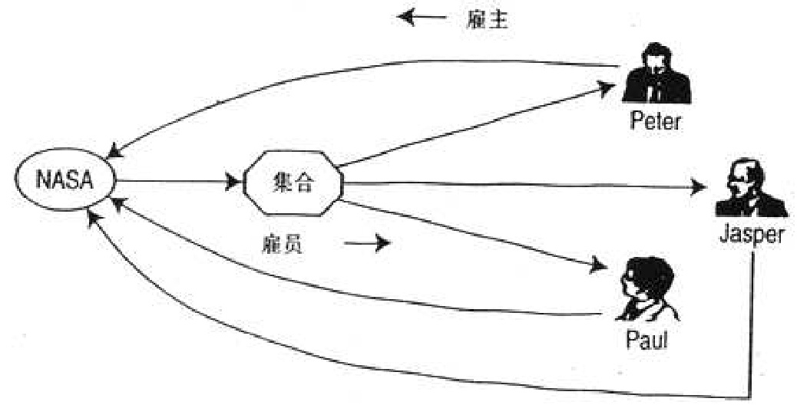  
图14-2在两个方向上都使用指针的实现  

访问者操作比较简单。对一个单值映射，访问者只返回引用。对一个多值映射，访问者返回一个引用的集合；然而，它绝对不能返回原来的那个引用集合，因为这样一来用户就能够改变集合的成员关系并且破坏了封装。封装的边界应当适用于所有实现多值映射的集合。一种解决方法是返回该集合的一个拷贝，这样即使进行了任何改变，它们也不会影响真正的映射。可是，对于大集合，这可能会导致巨大的时间开销。可选择的方法是返回一个保护代理或者一个外部迭代器[3]。保护代理是一个简单的类，它有一个简单的域包含那个集合。所有允许的操作都在保护代理上定义，实现的方法是把这些调用传递到内部包含的集合上。这种方法的更新能够被分块。一个外部迭代器更像是一个进人聚合内部的光标。迭代器能够返回当前指向的对象并且能够在聚合中前进。  

既然实现两个对象之间的每个连接都需要两个指针，那么修改者保持 它们同步就是很重要的。因此一个要把Peter的组织改为IBM的修改者不仅必须用--个指向IBM的指针替换那个从Peter发出的指针，而且必须删除在NASA的雇员集合中指向Peter的指针并且在IBM的雇员集合中创建一个新的指向Peter的指针。但是这样做会使我们陷人一个OO难题。雇员需要使用某个只操纵集合指针而不返回一个到Peter的调用的操作（否则我们会陷人一个无穷循环）。然面，这个操作不可以是组织的接口的组成部分。在 $\mathbb{C}\!+\!+$ 中，这是友元结构的一个典型应用。在Smalltalk中，我们必须创建一个这样的操作但是会把它标记为私有的（这样当然不会妨碍雇员使用它）。在这种情况下，一个有用的措施是只让一个修改者做实际的工作，它操纵数据和/或私有操作。其它的修改者应当只是调用这个修改者。这就确保更新的代码只有一个拷贝。  

这种实现工作得很好。两个方向的遍历都很快。虽然确保所有的指针一起被更新需要一些技巧，可是一旦这一点被解决，整个解决方法就很容易被重复。它的主要缺点是：多值映射所需集合的规模和较慢的更新速度。  

# 在一个方向上使用指针的双向实现  

这个实现只在一个方向上使用指针。为了在另一个方向上遍历，我们需要考察类的所有实例并且选择那些向后指向源对象的实例。在图14-3中，雇员映射需要得到雇员的所有实例并且选择那些雇主是NASA的雇员实例。修改者很简单。拥有指针的类的修改者只是改变指针，并且公共程序可以被其它类的一个修改者直接调用。走乱步伐的多重指针就不会产生危害了。这个方案节省空间，因为每个连接只存储一个指针，但是当向指针的反方向遍历时速度将会变慢。它的更新速度很快。  

  
图14-3在一个方向上使用指针的实现  

14.1.7使用关联对象的双向实现  

关联对象是带有两个指针的简单对象，它能够被用来连接两个其它的对象，如图14-4所示。通常，为每个关联提供一个关于这些对象的表。访问者的工作方法是：得到这个表中的所有对象，然后选择那些指向来源的对象，最后根据每一个指针找到被映射的对象。修改者很简单，只是创建或者删除关联对象。可以建立特殊的关联类；或者，可以使用具有散列表查找能力的字典类来实现它们。  

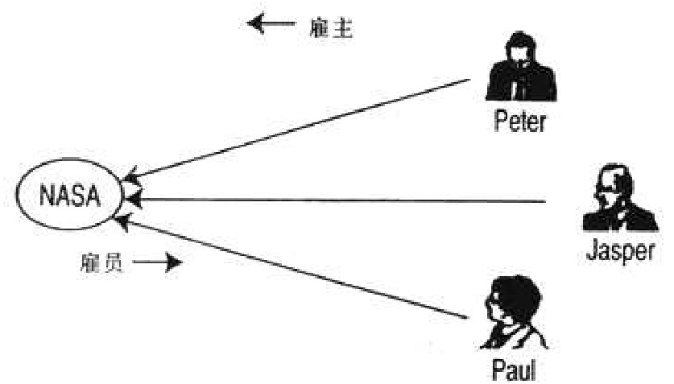  
图144使用关联对象的实现  

关联对象在两个方向上都不是很快，但是通常能够通过使用索引（使用一个字典）来提高速度。如果大多数对象在映射中都没有被关联，那么它们是节省空间的，在这种情况下空间只在需要时才被使用。如果不可能改变两个组成类的数据结构，则它们也是有用的。  

14.1.8双向实现的比较  

大多数情况下，我们都在两个方向上的指针和一个方向上的指针之间进行选择。前者提供在两个方向上访向的速度，而后者对空间的利用更有  

效并且更新更快。集合的基数和连接的实际数目影响着对它们的权衡。关联对象在特殊的情况下是有用的，但总体而言它们不是第一选择。  

3派生映射  

派生映射看起来基本上与其它种类的映射没有区别。它和基本映射一样提供访问者：它们应当是无法区别的。然而，通常不可能提供一个修改者。关于派生映射很重要的事情是：它们所隐含的位于派生映射和组成派生的其它映射组合之间的约束。  

0非集合映射  

虽然大多数多值映射都是集合，但是也有例外。在本书中它们用短语义声明来表示，例如[list]、[hierarchy]、[key：mappingName]。这种声明意味着一个不同的接口。用[list表示的映射将返回一个列表而不是一个集合，并且将会有像addFirst、addLast、addBefore（Object）、indexOf（anObject）这样的修改者。在这里，我并不想提供本书中这些情况的所有接口。但是，如果我门使用这些结构，我们将保证会给出它们的设计模板。通常我们应当使接口基于下层聚合的接口之上。我们也能够把这些构造看作是关联模式（参见15章）  

# 实现泛化  

00类型建模和大多数传统的数据建模实践之间最显著的区别之一就是泛化的大量应用。虽然泛化作为很多数据建模方法的组成部分已经很长时间了，但是它通常都被看作一个先进的或者特殊的技术。泛化和OO继承之间的紧密联系确保它在00分析中的核心地位。  

很多00方法把泛化作为一个等同于继承的分析来使用。然而，需要对使用动态和多重分类的方法进行更多的考虑，因为主流的00语言只支持单一静态的分类。实现多重动态分类的方法也能够用来在不支持继承的环境中重组继承的结构和实现泛化。  

对于泛化，我首先描述实现，然后是接口，因为这样可以使人更容易理解接口需要支持的变形。  

# 用继承实现  

在大多数方法中子类型和子类是同义的，从而提供最可能的实现形式。每个类型的接口被放置在相应的类上，面方法选择由语言进行恰当支持。  

态的分类。  

# 14.2.2用多重继承组合类实现  

和优先个人用户创建类。通过使用多重继承，类能够巧妙地捕捉所有需要的接口并且使编程环境用通常的方法来处理方法选择。  

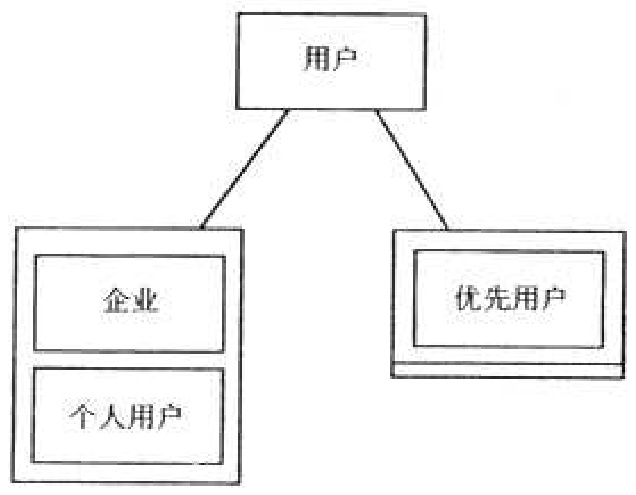  
图145一个多重分类的例子  

这种方法有两个缺点。第一个缺点是一个有大量分解的对象类型会形成一个难以处理的组合类的集合。4个完全分解，每个有两个类型，需要 ${\mathfrak{L}}^{\mathfrak{c}}$ 个组合类。另一个缺点是这个方法只支持静态分类。  

14.2.3用标志实现  

如果你询问一个从来没听说过继承的程序员如何实现记录一些用户是否是一个优先用户的需求，那么答案很可能是“用一个状态标志”。这种过时的方案仍然是有效的。它提供一种支持多重和动态分类的快速方法。标志很容易被随意修改，井且能够为每种划分定义一个标志域。实际上，这是为00程序中不基于动态分类的状态改变而使用的方案。  

使用这种方法的主要困难是我们不能使用语言内部的继承和方法选择。因此，子类型的接口中的所有操作都不得不放在超类型的类上。另外，支持子类型所需要的所有域都要被包括在超类型的类中。因而，用户类实现了用户和优先用户两个对象类型。  

如果接受对象不是子类型的一个实例，那么使用在子类型上定义的操作很显然是不恰当的，例如请求一个非优先用户的rep，如图14-6所示。如果我们使用继承，将导致一个错误（Smalltalk中是运行时错误， $\mathrm{C++}$ 中很可能是编译时错误）。在一个子类型上定义的所有操作必须由一个检查进行控制以确保接受者是属于这个子类型的。如果检查失败，则调用程序退出并产生这种问题的某种信号，通常是一个异常。这暴露出这种方案在 $\mathrm{C++}$ 中的另一个缺点一—直到编译的时候才可能发现这些错误。  

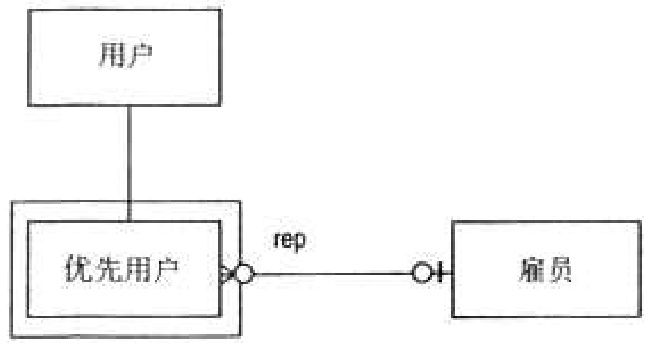  
图14-6优先用户的示例  

由于继承已经被抛弃，因此它的伙伴多态性就也只是一个记忆 $\vec{\infty}$ 因此，如果一个航运定价操作是多态的，那么方法选择就需要由程序员来实现。这在用户类的内部用一个case语句来实现。一个单独的航运定价操作成为用户接口的组成部分。在这个操作的方法中有一个基于用户类的子类型的逻辑测试，它可能调用内部的私有方法。如果case语句保存在类的内部并且只有一个操作被公布到外部世界，那么就保留了多态性的所有优点。由此，虽然多态性的实现机制完全变了但是其精髓得以保留。  

这个实现的最后一个缺点是：要为子类型使用的所有数据结构都定义空间。不是这种超类型实例的所有对象都浪费了这个空间。如果在子类型上有大量的关联，这就会导致问题。  

# 用委托给一个隐藏类来实现  

这种方法是用标志来实现子类型化的一个有用变体。这时，为子类型准备一个类，但这个类对除了超类型的类以外的所有类都隐藏。在超类型的类中，我们必须为指向子类型的引用（它可以又作为一个标志）提供一个域。同样，我们也必须把子类型的所有操作转移到超类型的接口上。然 而，数据结构仍保持在超类型上。超类型的类上所有来自子类型的类的操作都把调用委托给子类型的类，这个子类型的类拥有实际的方法。  

因此，对于图14-7中显示的概念模型，执行官的实例应当对应一个雇员实例加上一个执行官实例，如图14-8所示。除了雇员类，任何构件都看不到执行官对象和它的类。（在 $\mathrm{C++}$ 中，它的所有成员应当是私有的，并且雇员是它的友元。）定义在执行官类型上的giveStock操作应当放置在雇员类上。  

结构什么都没有。然而，这样会使执行官无法成为一个自含式的模块。  

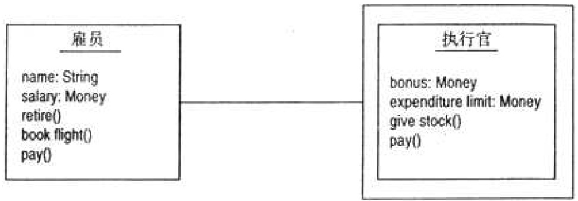  
图14-7雇员和执行官的概念模型  

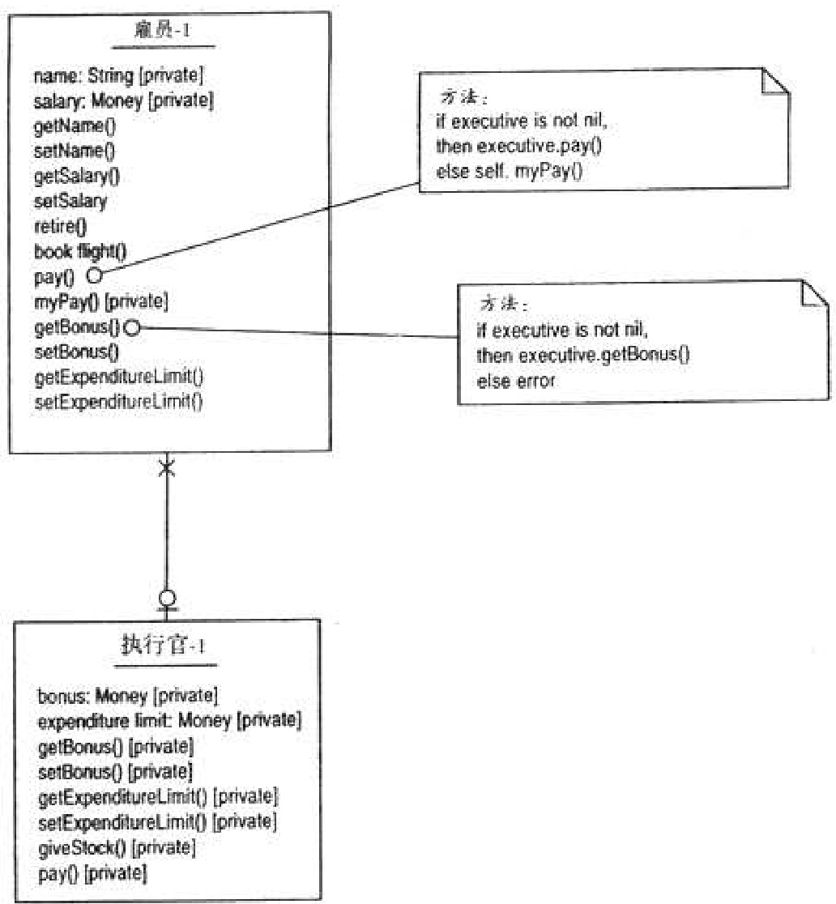  
图14-8图147使用委托给一个隐裁类的实现模型  

这种方法的逻辑结论是图14-9中显示的状态模式[31。在这种情况下，总有一个隐藏类存在。这些不同的隐藏类都有一个公共抽象超类，它是自隐藏的。雇员只是把pay委托给它的隐藏类。不管存在的是哪一个子类，它都会正确地响应。这使我们可以增加新的子类型而不用改变雇员类，只要新的子类型不增加到雇员的接口上（一个类似的方法是信封/信惯用法[3]）  

使用一个隐藏类与只使用标志相比，主要的优点是它为复杂的子类型提供更多的模块性。它还避免了空间的浪费。  

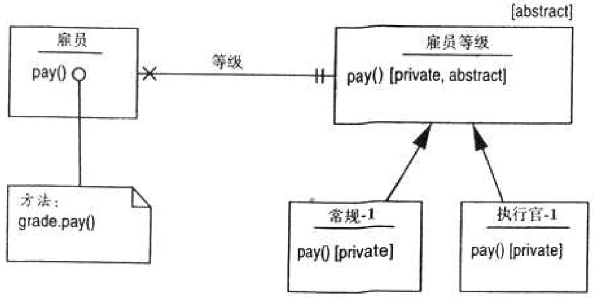  
图149用状态模式实现的雇员和执行官  

抽象的雇员等级类的一个实例总是存在的。任何依赖状态的行为都被声明为雇员等级上的一个抽象方法并且由子类实现。我使用一个萌头来显示子类关系（来自Rational的统一建模语言（UML）[1]）以便强调子类关系和子类型关系之间的区别。  

# 通过创建一个替换来买现  

处理类型改变的一个方法是：用一个子类实现子类型并且在重新分类时去删除旧的对象并用正确类的一个新对象来代替它。这样就充许程序员在仍然提供动态分类的情况下保持维承和方法选择的优点。  

执行这种方法的过程是：在新的类中创建对象，把旧对象的所有公共信息复制到新对象，把所有指向旧对象的引用变为指向新对象，并最后删除旧对象  

在很多环境中最大的问题是找到所有指向旧对象的引用并把它们转移到新对象。如果没有内存管理这几乎是不可能的。任何没有捕提到的指针都会变成悬挂指针并导致难以调试的崩溃。因此，我们不推荐将这种方法  

用于 $\cdot\mathbb{C}\!+\!+$ ，除非使用某个能够可靠地找到所有引用的内存管理方案。有内存管理的语言可以很容易地找到这些引l用：Smalltalk提供一个方法（名字为become）进行引用的置换。  

如果所有的引用都能够被找到和改变，那么这种方法似乎是可能的。它的缺点是复制公共信息和寻找并改变引用所消耗的时间。时间的总量随环境变化很大，这最终决定了这个方法是否合适。  

14.2.6泛化的接口  

所有五种实现都工作得很好，而且都在面向对象编程中得到正规的使用。为了使每种实现都成为概念泛化的一个替代方案，我们需要使它们有一个单独的接口。  

00编程中一个有争议的回题是：是否应当有一个操作返回一个对象的分类。这样的操作通常是重要的一一否则我们如何能够得到一组人并过滤使其只留下女人？然而，这样的操作也会带来危险，即程序员在一个case语句中使用它从面破坏多态性和它带来的好处。在OO编程的结构内部，对于解决这个难题看起来几乎无能为力。返回一个对象的分类的操作总是必需的，因而应当提供它。然而，为工好的编程风格：我们不应当用这样一个操作来代替多态性。作为一个通用的指导方针，应当将对分类信息的请求作为一个查询之内纯粹信息收集的一部分或者是为了接口的显示。  

为工找出一个对象的分类，有一些现存的惯例。Smal山talk和c $^{++}$ 的程序员都使用名为isStateName的操作来确定一个对象是否处于某个确定的状态。Smalltalk有一个消息iskindOf：aClass可以确定类的成员资格。 $\mathrm{C++}$ 在运行时不保存类信息（虽然这会被即将发布的标准改变）然面：只要需要，有时也提供能够有效给出这种信息的操作。  

有两个主要的命名方案可供使用。第一个方案是使用命名形式isTypeName。第二个方案是提供一个带参数的操作，如hasType（TypeName）。第一个方案是使用标志和隐藏类的一般约定。它在目前的情况下工作得很好，但是适用于子类型化时有一个问题。如果我们想要给一个现存的类增加一个新的子类，则我们需要给超类和子类一起增加isTypeName操作。否则在超类上调用isTypeName就会产生错误。hasType方案的可扩展性更好，因为能够增加一个子类而不用对超类进行任何改变。要记住：在任何情况下我们想要的都是类型信息，而不是类信息。  

对于类型变化，不存在典型的命名标准。像makeTypeName或classityAsTypeName这样的名字都是合理的（我更喜欢前者）。这些操作应当负责从任何不相交的类型中撤消分类。因此，一个完整的划分只需要拥有和划分中的类型一样多的修改者。不完整的划分需要某种办法达到不完整的状态。要达到该目的可以通过为划分中的每个类型提供declassityAsTypeName方法，或者通过提供一个单独的declassifylnPartitionName操作。要注意：那些不可能是动态的划分不应该拥有这些修改者。  

当使用这些修改者时，关联所暗示的问题与在创建和删除之下讨论的问题相似。因此，在一个分类程序中强制映射需要参数，并且撤销分类能够导致与单个和多重删除类似的选择。  

并不是所有的子类型都是动态的，但是关于是否使一个划分成为动态的决定依赖于模型是概念模型还是接口模型。在概念建模中，把一个划分标志为不可改变是一个强约束并且通常很罕见。虽然有人争论说对大多数的应用而言我们不会想要把人们从男性改变为女性，但这种类型改变在概念上不是不可能的。即使在现在的先进医学产生以前，这样的改变也可能是需要的。一个公司可能认为一个人是女性但后来发现他是男性。这样的发现应通过一个类型改变进行概念化的处理。  

大多数语言很少处理类型改变的事实促使我们减少正在进行的类型改变的总数。因此，当一个划分只在非常罕见的情况下才是动态的时，在一个规约模型中声明它是静态的就是合理的。这些罕见的情况通常是由于标识的错误或者用户的失误，由用户显式地创建一个替换对象就能够处理它们。这是一个纯梓的概念模型和一个基于概念的规约模型之间区别的又一个来源。  

现在需要简单说一说类型访问者的实现。系统中的每个类都将需要一个hasType操作。这个方法将对所有用类实现的类型进行参数检查。如果已经使用标志，那么就要检查标志以便测试这个类型，即使不存在标志，类基本上也总会实现一个特殊的类型并且必须检查这个类型。如果这些测试的任何一个都返回“真”（True），则返回“真”。可是如果没有任何类的类型匹配：那么就调用超类上的方法并返回其结果。如果没有超类型，就返回“假”（False）。因此实际上，一个发送到层次底端的消息将沿着层次上升直到它碰到一个匹配，或者运行完毕到达顶端并返回“假”。这个机制使扩展类型层次变得简单，因为只有实现了类型的类才需要为该类型进行检查。  

对象创建  

在创建新对象所需要的机制中，既有用一个类直接实现的机制又有间  

接实现的机制。  

14.3.1创建的接口  

每个类必须有一种方法来创建它所实现的类型的实例。创建意味着不仅要组织一个新的实例对象，而且要满足对该对象的各种约束以使其成为一个合法对象。  

所有强制的关联必须在创建操作中得到填充（一个完整的创建方法[11）。这意味着创建操作必须有针对每一个强制操作的参数。类似地，在完全的划分中用类实现的任何子类型必须通过参数来选择。强制情况和不变的关联或者非强制的划分也应当通过参数来选择。  

由于实现环境中的其它假设，有时很难使用默认对象创建机制来做到这点。工厂方法[3]应当在这种环境中使用。  

我们也应该允许在创建参数中包括可选择的、易变的特征。但是、较好的方法是首先创建对象然后向它发送必需的消息来设置这些特征。  

14.3.2创建的实现  

所有面向对象语言都有它们自己的创建新对象的约定，通常，这些约定提供存储的分配和域的初始化，然面，初始化程序并不总是通过参数来设置强制特征的合适地方。  

在Smaltalk中，通常的习惯用法是使每个类支持一个能够带参数的创建消息（通常称为new）。在创建的过程中，它总是被安排给新对象以发送一个没有参数的初始化消息。这个初始化对于把多重映射的实例变量设置到一个新的集合是有用的，但不能支持初始化关联，因为它没有参数最好是使用KenrBeck的创建参数方法模式[1]，它通过一个特殊的方法来设置这些初始参数  

$C++$ 为初始化提供一个构造函数。它能够做很多事情，但有时关于构造函数的语义会出现问题。通常最好只在另一个创建操作的内部使用构造函数：对这种情况，“四人帮”的创建模式[41特别有用  

14.4对象析构  

既然对象会产生，那么它们就可能会消亡。不是所有的对象都能够被析构，一些对象必须永远存在（例如医疗记录）。即使这样，它们也可能在一个系统中被析构而保存到其它地方  

析构对象的最大问题是忍受结果，例如，从图14-10中删除订单的-个实例，如果有任何订单项连接到它，就会产生问题，这此订单项必须有一个订单（强制关联），所以如果我们只是删除订单，那么订单项就会违背它们的约束。  

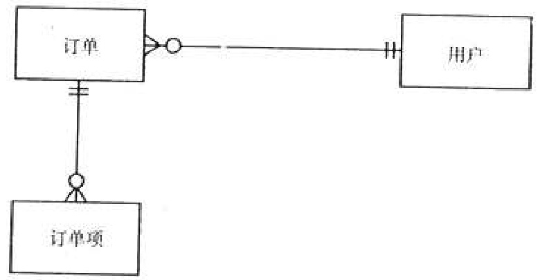  
图14-10用户和订单的例子  

这个问题有两个解决方法。第一个方法是单一删除一更宽容的、更温和的方法。如果删除导致任何剩余的对象违背它们的约束，那析构就会失败。另一方面是多重（或者级联）删除一猛烈的、恶意的方法。如果这个删除使一个订单项违背它的约束，则这个对象也会被删除。如果任何事物有一个强制映射连接到这个对象，那么那些依赖对象就一起被删除一在整个信息库中产生连锁反应。  

在实际中，删除能够有不同程度的级联。析构操作对于一些映射可以是多重的，面对其它的映射则是单一的。这是完全允许的，但是它必须保证析构要么全有要么全无。  

这些问题增加了在没有内存管理的环境（像 $\mathrm{C++}$ ）中对引用的考虑。单一和多重删除应当确保对象不破坏它们的基数约束，并且存储管理要避免悬挂指针。  

14.4.1析构的接口  

不同的面向对象环境拥有它们自已的析构方法。所有能够析构的对象应当有一个完全单独的析构操作。这是一个程序员所有的需要，但是它把安排事物析构顺序的责任推到用户身上。一些强烈的删除能够和一个完全单独的析构一起被提供。然而，必须弄清楚析构对于哪些映射是多重的。  

14.4.2析构的实现  

就是在析构中，内存管理的存在使其自身的作用充分体现出来。它几乎没有使析构方法本身有什么不同，但是确实影响了错误的结果。  

在两种情况下都很重要的是：将要被析构的对象要使它们到有关联被析构。如果删除是单一的，那么就要禁止整个删除并且不对信息库进行任何改变。迄今为止进行的任何操作都要被回滚。对于没有内存管理的系统最后一步是重新分配存储。对于有内存管理的系统，不会进行显式的重新分配一因为所有连接都被删除，所以对象会孤立而死并且被作为无用单元回收  

14.5入口点  

现在对于连接的对象有一个设计完善的结构。从任何对象来使用类型模型都很容易决定如何遍历到另一个对象。然而，仍然存在一个重要的问题：我们在最开始的时候是如何进入对象结构的呢？对于那些使用传统的、尤其是关系数据库的人：这个问题可能显得奇怪，因为这些数据库的人口点是记录类型。获得数据包括从记录类型开始和选择单个的记录。然而，从一个类型的所有实例的列表开始并不总是最有效的方法。特别是面向对象系统能够提供不同的访问形式，这些形式更有效并能够提供其它有用的能力。  

我们不需要所有类型的所有实例的一个列表。考虑图14-11中的例子。由于订单项的所有实例都连接到订单的一个实例，因此就不需要保持一个从订单项类型到其所有实例的引用。如果我们认为很少有任何人请求所有的订单项，不管订单或者产品，那么我们就能够忽略这个引用。如果那种不太可能的情况发生，即某个人确实想要一个所有订单项的列表，那么我们提供这个列表的方法是先得到订单的所有实例的一个列表然后通过映射遍历到订单项。因此，我们能够节省用于保存到订单项的所有实例的所有引用所需要的存储，代价是一层的间接引用，当然前提是我们可能需要订单项的所有实例。这完全是一个实现权衡。在一-个关系数据库中，不需要考虑这种权衡，因为数据库使用固定的表。  

同样的问题能够扩展到订单。我们可能认为：如果一个人想要通过键人一个订单号来选择一个订单，则需要订单的所有实例。既然订单号通常是一个字符串，那么经常就不保存从字符串到订单的引用而是需要订单的所有实例。然面，我们可以争论说：实际上一旦找到用户，则订单总是会被访问。至于是否保存指针又是一个实现问题。  

这个问题不能扩展到用户，因为用户缺少任何强制联系。因此对于一个用户，不和任何其它对象发生联系是可能的。所以关于用户的所有实例的一个列表是必要的，这样可以确保能够找到这样的一个用户。这个保存列表的必要性就是使用户成为一个人口点的原因。  

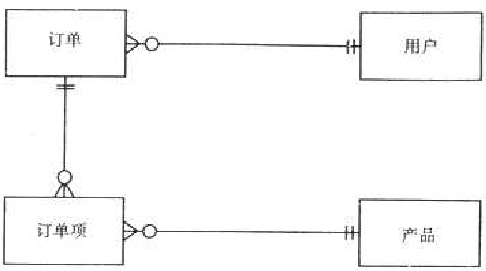  
图1411用户、订单、产品的例子  

要注意：决定哪个对象类型应当是人口点完全是一个概念上的问题。没有强制联系的对象类型必须是人口点。那些有强制联系的对象类型能够保存实例的一个列表，但是这根本不能使它们成为概念的人口点。  

14.5.1查找对象的接口  

对于所有类型来说，有一个返回当前类型的所有实例的操作是有用的。这样一个操作对于二个方向上的指针对于反向遍历查找指向某个对象的其它对象是很重要的。  

提供根据某种标准查找一个实例的操作通常都是有用的。一个例子是findCustomer（customerNumber）。虽然很难给出使用这样一个操作的通用规则，但是一般来说，最自然的方法就是使用遍历。因此，与请求查找用户是ABC的所有订单”相比，请求“用户ABC的所有订单”在概念上更简单。这会导致由查询的逼历表达所引发的优化向题，但是这能够在用户的访问者内部得到解决。  

当查找被应用于基础类型时，这个选择就不再适用，而一个通用的查找程厅是一个更好的选择。然而，即使这样也应当尽可能用通用的方法来进行。最简单的方法是请求一个类的所有实例，然后使用返回集合上的内置选择操作。对于有很多实例的类，这种方法工作得不好。下一个方法是提供一个把任何布尔操作作为一个参数的选择操作。这在类的接口上只用一个操作就实现了最大的灵活性。然而，这在一些语言中比其它语言要困难得多。只有当这些方法都用尽了并且使用一个更通用的方法太昂贵时，我们才可以使用带有持殊参数的查找。我们必须注意不要使一个类的接口膨胀。  

要注意的是：这些查找实例的操作对于非人口点和对于人口点同样正确。实际上，实例访问者应当采用相同的模式。  

人口点需要一个额外的操作使一个对象装配在结构中。只是创建一个对象并不能把它装配在结构中，尤其如果它和结构中的任何对象都没有明系。因此，人口点对象需要一个操作把它们安插在结构中。  

以上的接口评论对于内存系统是正确的。当使用数据库时会出现一此稍微不同的特征。不同的数据库管理系统（OODBMS或者关系接口）有它们自己的约定。实用的方法是使用这些约定时带有以下的附带条件，即应当使尽可能多的接口独立于数据库管理系统的细节。  

14.5.2查找操作的实现  

实现一个人口点的通常方法是通过某个聚合类。这个聚合可以是一个特殊的单独类（例如用户列表）或是类中的一个静态域。向一个类型请求它的实例意味着返回聚合的对象。因为存在多值关联，所以重要的一点是：聚合应当是不可改变的除非通过人口点的接口。  

一个非人口点通常也有一个返回所有实例的操作。这能够通过从一个人口点开始的遍历来实现。选择和查找工作使用类似的方法。  

14.5.3使用类或者登记表对象  

人口点的接口和实现都可以用类或者登记表对象来完成。人口点的一个基于类的实现导致每个人口点类都保存它的实例的一个聚合作为一个类或者静态变量。另一种方法是拥有一个单独的登记表对象，它为每个人口点类保存一个聚合。使用登记表方法的主要优点是它允许存在独立的登记表，可能针对不同的上下文。因此，如果两个临床部门想要维护疾病的不同实例，这就能够通过为每个临床部门使用一个单独的登记表来实现。  

在接口中，区别存在于程序员把查找消息发送给类还是发送给一个登记表对象。使用一个登记表就从每个类上除去了这个职责，但是登记表对于每个人口点类都需要至少一个查找操作。如果查找操作也被用于非人口点，那么登记表对于每个类都需要至少一个查找操作。当程序员需要理解和在不同的上下文之间切换时使用一个登记表是有用的。如果只使用一个单独的上下文，则它就能够被设置成全局的并且基于类的操作能够委托给 适当的登记表。  

14.6实现约束  

类型模型帮助定义一个类型必须满足的约束。基数和划分都意味着约束。越复杂的情况需要越复杂的类型。本书中使用的短的和长的语义声明都常常意味着更复杂的约束。  

约束一般不影响编程语言中类的显式接口。Eiffel是一个例外，其中背它的任何约束的状态  

据库系统尤其重要。  

$C++$   $\hat{\mathcal{H}}^{*}$  

不正确，但它能够为事件图6提供设计模板模式。在最近的儿年中关于关系中相当明显  

在最近的儿年中，已经有人数较少但是重要的一群开发者强调这种转这些模板的模式将会成为文献的一个常规部分。  

1 Beck,K.SmalltalkBest Practi Ce Patterns Volume 1:CodingEnglewood Cliffs,NJ: Prentice-Hall,inpress. 2.  

3. Coplien,J.O.Advanced C++Programming Stylesand IdiomsReading,MA: Addison-Wesley.1992.

 4. GammaE.,RHelm,R.Johnson,and J.Vlissides.Design Patterns:Elements of Reusable Object-Oriented Software.Reading,MA:Addison-Wesley,1995.

 5. LewisS.The Art and Science of Small talk Hemel HempsteadUK:Prentice-Hall Intermational,1995.

 6. Martin,J.and J.J.Odell.Object-OrientedMethods:Pragmatic Consideraiions Englewood Cliffs,NJ:Prentice-Hall,1996

 7. Musser,  $\mathrm{D}.\mathrm{R}_{i}$  and A.Saini.STLTutorial and Reference Guide.Reading.MA: Addison-Wesley,1996. B. Shlaer,S.,and S.J.Mellor.A deeper look at the transition from analysis to design." JournalofObject-Oriented Programming 5,9(1993).pp.16-21.  

# 第15章关联模式  

在分析和设计方法中，关联是一个通用构造。通常，一个关联意味着一个相应特殊的情况会不断重现。可以引进一个专门的符号，但是对这种情况建模而不用这个符号也是可能的。思考这个问题的一个有用方法是把这种情况看作一个模式。这个关联模式能够以一个基础形式进行描述，或者能够引进一个新的符号作为一个简写。这两者在意义上是相等的。  

本章关注三个这样的情况。当你想要把一个关联看作一个类型，通常是给它一些特征时，一个关联类型（参见15.1节）就出现了。一个带键值的映射（参见15.2节）是用来为一个映射提供一个类似查找表或者字典的行为。这些模式中的每个模式都使用大量带有额外符号的方法。重要的是理解在符号之后的模式。一个方法可能不支持一个额外的符号，所以知道没有这个符号时如何工作是很重要的。尤其当你已经习惯于一个支持某个符号的方法而要转变到一个不支持该符号的方法时，或者当你在两个方法之间转变而一个方法不支持一个符号时，更显示其重要性。  

即使你的方法为一个关联模式使用一个符号，理解符号如何联系到更简单的思想也是重要的。如果情况是罕见的，那么通常更好的方法是不引人一个额外的符号来记忆，而是使用基础形式  

第三个关联模式是历史映射（参见15.3节）。我们能够用历史映射来记录一个映射的值的改变历史（例如一个雇员的工资历史）。这是我所知道的任何方法中的专门符号都不支持的。然而，这对很多信息系统来说都是一个必需的模式。当需要一个历史映射时，引进一个符号作为关联模式的一个简写是很有价值的。如果不仅领域改变而且我们关于领域的知识在不同的地方也发生改变时，就会出现特殊的复杂性：这就产生了二维历史（参见15.3中的子小节）  

有几个因素影响使用符号或者基础形式之间的选择。在概念上，主要的权衡在于符号提供的简明性和符号带来的额外记忆之间。在一个规约模型中，一个符号意味着软件中的一个不同接口。这个接口使用起来很可能比从基础形式转变而来的接口更方便。然而，我们总是能够把操作添加到  

操作，但是避免了额外的符号。  

使用符号还是基础形式是一个选择的问题。在本章中，我会指出我的偏爱（我要强调的是这些偏爱与客户的愿望相比只能放在第二位）。作为一名顾回，使客户的生活更便利是我的工作。  

关联模式在元层起作用：它们是用来描述建模语言的模式，而不是用来描述模型本身的模式。我用术语元模型模式来概括地描述这类模式。其它的元模型模式可以用来描述泛化、状态模型或者任何其它建模技术中的元层概念。  

15.1关联类型  

当我们想要给一个关系增加一个属性时，就会出现一种普通的建模情况。例如，一个早期的模型表明一个人被一个公司雇佣，如图15-1所示。后来的工作显示我们应当记录雇员开始受雇的日期，并且它必须位于这个关系上。我们能够使用一个符号（例如Rumbaugh的领形符号[2]）把开始日期属性漆加到关系上，如图15-2所示。  

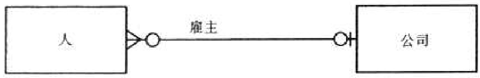  
图15-1人和公司之间的简单关系  

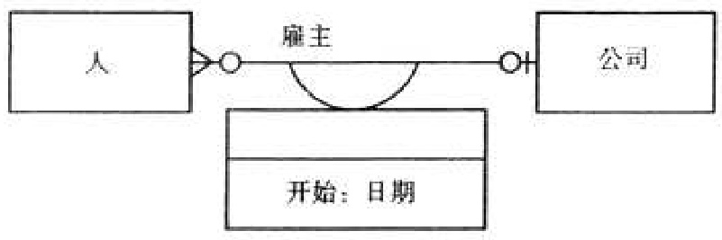  
图15-2在图15-1中添加一个开始日期属性  

本图使用了Rumbaugh的领形符号。  

如果一个建模方法不支持用这种方法把一个属性添加到一个关系上，那么还有许多替代方案。在我们的例子中：一个替代方案是把开始日期添加到人上。因为依据定义一个人只能有一个公司，所以不存在多义性的危险。我们可能会认为开始日期属性确实是关系的一部分，但是这只能被理解为语义上的吹毛求疵。一个更合理的反对理由是：除非存在一个雇主否则开始日期不应当有数值。这可以用一个规则来解决，虽然这通常是一个不够完美的解决方法，特别是因为大多数方法都不能很好地支持这种规则。当两个映射都是多值映射时，这个方法就不能在关系上使用，如  

图15-3所示。既然一个人的每个技能都有一个不同的资格，那么就不可能把数字放在人上。  

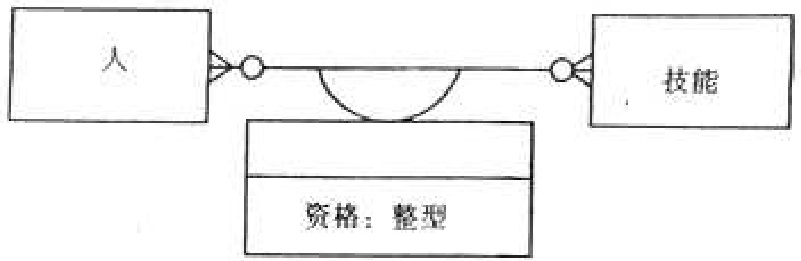  
图15-3两个映射都是多值映射的关系  

在不支持关联类型的方法中，我们可以引进一个额外的类型，如图15-4所示（注意基数是如何从图15-1中转变过来的）。这样非常好地处理了这种情况。新的类型可能稍微有些不自然、但是所有的模型都包含一定数量的人工成分，因为它们描述一个真实情况所用的形式化程度比自然语言中存在的形式化程度要大得多。这两个模型之间最重要的区别之一在于接口含意。在图15-2中，人有一个返回关联的公司的getEmployer操作。图15-4中的模型有一个不同的接口，它返回雇佣关系对象。雇佣关系对象需要一个额外的消息来得到公司，所以我们需要把原来的关联变成一个派生的关联，如图15-5所示。  

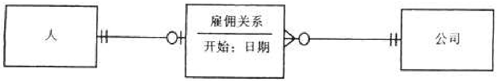  
图15-4增加一-个雇佣关系类型作为开始日期的拥有者  

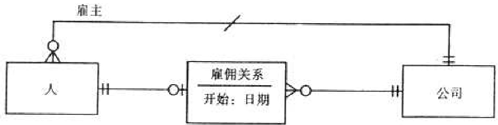  
图15-5用一个派生的映射重建雇主映射  

通过考虑图15-3中显示的多对多关联，我们能够考虑得更巧妙一点。图15-6同样引进一个新的类型。如果只是增加资格类型，那么在第一个检查上会工作得很好，因为它允许一个人有很多资格，并且因此可以有多重技能，每个技能都有一个资格值。问题是这个模型允许的太多，因为它也允许相同的技能对应多个资格。为了消除这个问题，我们需要建立针对资格的附加的惟一性规则，以便指明每个资格必须有一个惟一的人和技能的组合。  

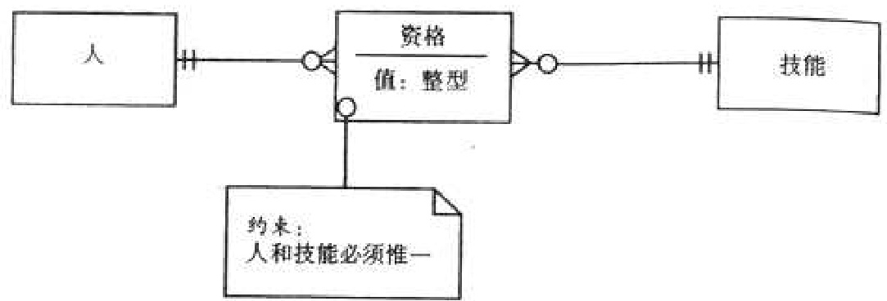  
图15-6用一个新类型来处理图15-3  

这个问题通常不被使用关联类型符号的建模者所注意。图15-7是这个符号的另一个典型应用，这里关系处理这样的一个理解，即一个人可以是很多公司的雇员并且这些雇佣关系中的一部分可能已经结束，这样一来我们就有了雇佣关系的一个历史。一个人对同一家公司有两个时期的工作经历是非常可能的。因此我们不能增加一个图15-6中所显示的那种风格的约束。一般来说，问题是我们不知道是否要将一个关联类型解释为拥有约束。  

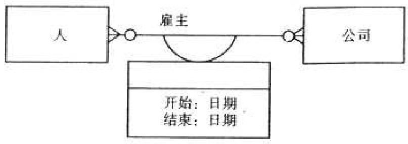  
图15-7雇佣关系的关联类型  

实际上，建模者使用关联类型符号时同时应用这两种解释。这并不是它本身的缺点，但是他们应当说清楚他们所指的是哪一个。使用图15-7是合理的，但是在那种情况下必须为图15-3的情况使用一个规则，这个规则与图15-6中的规则是类似的。如果建模者想要使用图15-3的例子作为通用的解释，则他们就不能使用图15-7形式的模型：他们必须使用一个新的类型作为替换。  

基本上，我不倾向于使用关联类型符号。除非它们包括一个明确的规则，例如一性的规则，否则我不认为它们为额外的符号增加了很多价值。惟一性是有用的，但是它很少被正确使用，以至于我宁愿使用一个额外的类型然后增加惟一性规则以使其明确。  

带键值的映射描述一种技术，它在分析中反映为使用字典（带索引的查找表，也称为maps[1]或者关联数组）实现关系的技术。在图15-8和图15-9中显示使用它的例子。我们主要考虑的是记录某种特殊的产品在一个特殊的订单上有多少。这个例子的标准数据模型显示在图15-8中。图15-9中显示的模型使用带键值的映射符号，它集中于询问和改变一个订单拥有某种产品的数目。图15-8对此进行结算的方法是：产品能够回答它被订单预定并在每个订单中预订了多少。  

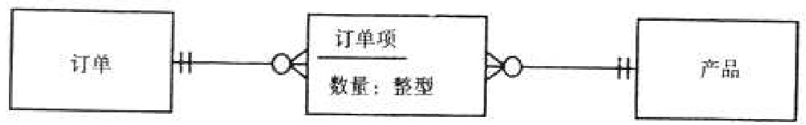  
图15-8一个标准的订单、订单项的模型  

  
图15-9使用一个字典来建模图15-8  

这些模型解释的一个重要部分是它们如何影响类型的接口。图15-8的模型意味着在订单和产品上有一个getLineltems接口。图15-9的模型意味着在订单上有一个getAmount（product）的接口。对产品意味着没有接口。为了找出一个产品在不同的订单中的使用，将需要对所有的订单实例询问它们是否有这个产品的一个数目，这样做有点过于迁回曲折。另一个区别在于询问一个订单上现存有哪些产品。对于图15-8，这只需要询问一个订单找到它的所有订单项然后询问每个订单项的产品。对于图15-9，这需要向一个订单询问数目的字典，然后请求它的键：订单将必须提供getAmounts操作以便允许对它的字典（或者更严格的是一个拷贝）进行访向。否则，我们将需要对订单访问产品的每一个实例。  

带键值的映射符号能够用来处理惟一性约束。图15-8中的模型通常都伴随一个规则，这个规则说明在一个订单内对某个产品只能存在一个订单项。我们不会想要为30个小配件设置一个订单项而为同一个订单中20个小配件设置另一个单独的订单项。一个更好的建议是针对50个小配件只有一个订单项。对于图15-8，这需要一个规则，但在图15-9中这很明显，因为一个订单对一个产品只能有一个数量。  

我们需要考虑的是：如果向一个订单询问一个不在它上面的产品的数目，这个订单应当如何响应。在这个例子中，一种看起来合理的方法是返回0，并使带键值的映射成为强制的。在其它的情况下，我们可能想要一  

个无效的（null）返回，这将使那个映射成为可选的。  

如果两种表达方法都是有价值的，那么就意味着可以同时使用它们两个。可以使用一个规则或者一个派生标记注释出余，如图15-10所示。 $\scriptstyle\longmapsto$  具有适应性而图15-9的方法增加一个非常有用的简写行为，并且使惟一性很明显。  

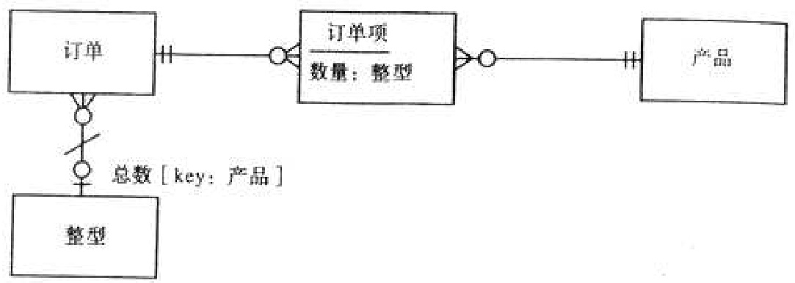  
图15-10同时使用两种表达方法，把一个标记为派生的  

我发现带键值的映射符号是一个非常有用的构造。使用它还是使用一个额外的类型依赖于情况和我所要强调的。虽然没有它我肯定能够生存，但是我经常发现它是一个便利的构造。然而，注意不要过度使用它。通常，额外的类型对于额外的信息和行为是重要的。在图15-8中，我们可以容易地为订单项增加一个价钱，若使用图15-9这将是难以使用的。自然地，图15-10中鱼和熊掌兼得”的答案是一个通常的选择。  

15.3历史映射  

对象不仅代表真实世界中存在的对象：它们还经常代表对那些曾经存在但已经消失的对象的记忆。使用对象来代表记忆是完全可以接受的一关于存在的记忆对人们来说通常和存在本身一样真实一但重要的是能够说明两者的区别。考虑记录一个人的工资的问题。在任何一个时刻一个人都有一个单独的工资，如图15-11所示。然而，随着时间流逝工资可能会改变。这本质上并不能阻止图15-11作为一个模型，除非我们需要记录工资的历史。如果所有我们想要的就是记录过去的工资，那么图15-12将实现这个功能，前提是给工资的修改者增加把旧的工资添加到一个旧工资列表中的能力。通过使用一个列表，我们不仅能够记录以前的工资而且能够保存它们所应用的顺序。  

图15-12可能对很多情况都适用，但是它无法帮助我们回答这个问题：JohnSmit在1997年1月2日的工资是多少？”为了回答这个问题我们需要图15-13中所建议的更复杂的方法。这个模型赋予我们记录工资和它们的历史的能力。然而我们需要一个额外的规则：一个人的工资不能有重叠的时间段。这个规则通常是隐含假定的，不经常被显式指出一并因此常被遗忘。  

  
图15-11在任何时间点一个人只有一份工资  

  
图15-122一个记录过去工资的模型  

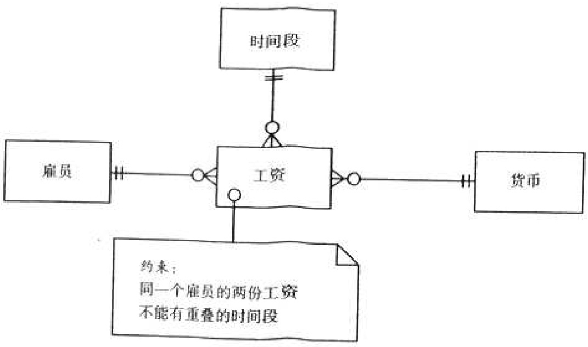  
图15-13工资历史的一个完全记录  

图15-13中显示的模型提供了我们所需要的能力，但是它相当笨拙。由于没有查看隐含的规则，一个雇员每次只能有一个工资的要点被丢失。两个类型之间的一个关联现在变成四个类型和三个关联。这会极大增加一个图的复杂性，尤其如果有很多这样的历史关系。为此所建议的接口也是相当笨拙的。上一段中问题的答案包括：询问JohnSmith的所有工资，然后选择时间段包括1997年1月2日的那一个。  

我经常使用图15-14中显示的模型，它合并图15-13中方法的灵活性和图15-11中快照图表的经济性。所有细节都隐藏在小面重要的历史关键字的后面。我已经引人一个新的符号，只要我适当定义，它是完全可容许的。  

我将放弃一个数学的定义，取而代之的是指出用关键字定义的接口。图15-11意味着一个getSalary（）的访问者返回工资的数值，而由一个setSalary（Money）的修改者改变它。图15-14意味着一个不同的接口：访问者getSalary（）仍然存在但是这次它返回工资映射的当前数值。这由getSalary（Date）支持，它返回映射在所提供日期的数值。getSalary（）等同于getSalary（Date:：now)  

  
图15-14用一个更简单的符号来描述图15-13的能力  

更新要稍微复杂一些。我们能够用一个setSalary（Money.Date）的操作把一个开始于某个特殊日期的新的工资添加到历史中。这对于附加改变是一个好接口，但如果旧的记录也需要修改，它就不够有效。一个set Salary History（Dictionary（key:TimePeriod,value:Money)）操f作和- 个getSalaryHistory（的操作会是我们最好的选择。这样一来，客户能够把当前工资的历史作为一个字典得到，能够使用标准的字典操作，而且随后能够一起修改整个记录。这比一次修改一条记录要好，因为规则是在任何日期一个届员必须有一个工资。如果更改是每次对一条记录进行，那么将很难在每次改变之后保证规则的正确性。把整个记录取出，改变它（不 用规则检查）并且立刻把它全部替换，这样更容易管理。  

很明显，这里建议一个带时间段关键字的字典实现。这样一个实现很容易支持接口所需要的所有行为并且是这种方法的一个简单应用。我们甚至能够更进一步，引进一个专门的类来处理历史的聚合。  

就我所知，历史符号现在还没有被任何方法论者所提出。它是很有价值的，因为它简化一种既普遍又手的情况。理想的解决方法是拥有一个有完全“时间旅行”能力的对象系统。这样一个系统不是完全牵强的，它的到来将消除对历史的任何专门处理的需要。  

本节也是一个通用要点的一个特殊情况。在建模中，你可能遇到一个对模型来说既普通又棘手的重复情况。不要害怕引人一个新符号来简化这种情况，但是你必须正确定义它。要考虑的关键权衡是在新结构带来的简明性和符号需要的额外记忆之间。一个好的符号是一个折衷，提供优雅的表示，但不是一个很复杂的符号。这个权衡对所有的项目是不同的，因此不要害怕对这些事情做出你自已的决定。  

建模原则：如果你遇到一个难以建模的重复情况，可以定义一个符号。  

然而，我们只有当造成的简化性超过了记忆额外符号的困难时才会定义一个符号。  

上面的讨论集中于能够检索一个对象的某个属性在过去某一点的数值。很多系统有一个更大的复杂性，它来源于系统不会及时地收到改变信息这样一个事实。  

想像我们有一个工资单系统，其中记录一个雇员有一个开始于1月1日的100美元/天的工资率。在2月25日我们用这个工资率运行工资单系统。在3月15日我们得知，该雇员的工资率从2月15日起变为110美元/天。当询问这个雇员对象在2月25日的工资率是多少时它应当如何回答呢？这个问题有两个答案：这个雇员在那时认为工资率是多少和这个雇员现在认为工资率是多少。这两个工资率都很重要。如果我们需要回顾2月25日工资单的运行以便看到那些数字是如何计算的，那么我们就需要看到旧的数字。如果我们需要处理一个新的授权，可能为了以前没有报告的儿个小时的加班，那么我们就需要这个工资率成为我们现在对它的理解。  

其实按照生活中的实际情况，事情可能会变得更糟糕。假定我们进行了相关的调整并且制定了最近的加班报酬，所有这些都已经在3月26日的一次工资单的运行中被执行。在4月4日我们被告知，雇员的工资率又被变为112美元/天，从2月21日生效。现在，雇员对象对于在2月25日它的工资率是多少就能够给出三个答案了！  

一般来说，为了处理这种问题，我们需要一个二维历史。依照我们在过去的其它时间点的知识，我们询问雇员在过去的某个点的工资率是多少。因此这需要两个日期：工资率可适用的日期和我们的知识基于的日期，如表15-1所示。  

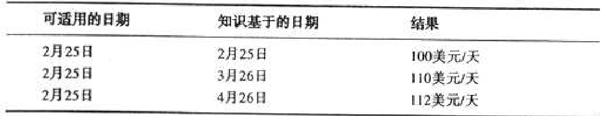  

一维的例子实际上不得不在以下两者之间进行选择：把可适用的日期和知识的日期等同看待，或者总是把知识的日期看作“现在”。  

给历史增加完全的二维能力肯定会增加大量的复杂性，并且并不总是值得的。重要的是，要观察为什么这些不同的比率可能是需要的。在这个  

种情况的另一个方法是把关于如何制造一个工资单计算的所有信息嵌人到这个工资单计算的结果中。如果这个信息只会被人检查而不会被执行，那么可以把它作为一个文字的属性。计算调整能够通过指向计算结果的引用来实现一使用的比率不是必需的。即使需要比率，制作一个拷贝也被认为是更安全的。如果所有这些都就绪，那么只需要一个一维历史就能够执行有追溯效力的授权（例如迟报的两个小时的加班）  

二维历史也影响放置在事件上的时间点。除非我们确信我们总是在事件一发生就知道，否则关于任何事件我们需要两个时间点：当事件发生时的时间点和当我们的系统注意到这个事件的时间点。（这个的例子包括在6.1节讨论的条目的两个时间点，和在3.8节讨论的双时间记录模式。  

参考文献  

1.Musser,D.R.,and A.Saini.STL Tutorial and Reference Guide.Reading,MA: Addison-Wesley,1996 2.Rumbaugh.J."OMT:The object model."Journalof Object-Oriented Programming 7.8(1995}.Pp.21-27.  

你认为这本书怎么样？你发现这些模式有用并且对它们感兴趣么？虽然我希望这样，但我也希望你感到不满足一还有更多的要说，更多的要理解。本节讨论下一步将如何去做。  

你能做的一件事情是试验这些模式。阅读一本关于模式的书实际上只是让你感觉到有哪些模式存在。当我阅读“四人帮”的《设计模式》时，我体验到了他们的思想。然而，为了学习那些模式是如何工作的，我需要试验它们。在阅读之后，关于“四人帮”的模式仍然有很多方面我并不真正赞同和理解，但是我知道，实践和更多的阅读将增长我的理解。  

当你试验这些模式时，请让我了解你的工作。是否有些模式没有被很好解释？还有我应当考虑的其它变形吗？请给我发电子邮件，让我知道你的想法，以便我能更广泛地传播这个信息。（我的电子邮件地址是100031.3311@compuserve.com。)  

本书的最大问题之一是存在如此多的疏漏。我已经从一些领域描述了模式，但是还有很多没有提到的其它领域存在的需要理解的模式。即使在我已经提到的领域中也还能发现更多的模式。并且我所描述的模式是不完全的：关于如何使用它们、存在什么变形、出现什么实现问题、能够怎样测试它们和如何得到最优的性能，都有很多需要学习。  

本书反映了我的知识的不完全的状态。为更进一步，你需要看一看模式团体正在进行的不断增长的工作。其它的模式书籍正在出版，并且更多的模式书籍会在今后的几年中很快出现。虽然现在像这样的关于分析模式的书还没有很多，但我希望本书将会鼓励更多这样的书出现。在很多方面，如果本书能够终止无休止地连续出现分析和设计书籍，并且开创新的模式书籍的热潮，那么这可能是本书的最大意义。  

获得模式信息的最好途径之一是万维网。RalphJohnson的模式主页量有价值的在线信息。  

现在，许多会议都包括关于模式的演讲和讨论。然而最关注模式的会议是PatternLanguageofProgramming（PLoP），每年的9月在伊利诺伊州的AllertonPark召开。这个会议是一个特殊的事件，最特别的是论文的表述方法。每篇论文不是进行正式的陈述，而是在一个由多位作者参加的专题讨论会上由其他作者对其进行批评。结果是对每篇论文进行了引人人胜的讨论，在讨论中作者们大量地学习到其他人是如何看待他们的工作。  

下一步是写一些你自己的模式。这不是一个令人畏惧的实践。我发现模式团体对新思想是开放的，并且很热切地希望更多的人们编写模式。PLoP是提交模式的一个极好的论坛，它为了解模式开发的整个领域提供了一个顶级的会议地点。你也可以在网络上发布模式一波特兰模式库就是专门为这个目的设计的。我也想在本书的网络站点上发布其他人的分析模式。实际上我希望本书将来的版本会包括其他作者的模式，并且我的角色能够变得更像一个编辑而不是一个作者。  

一开始，我之所以写这本书是因为我想要读像这样的一本书。现在仍然是这样。我希望本书和其后续的相关书籍将意味着未来一代的软件项目不用在一片空白的基础上开始。  

# 参考文献  

1. Gamma,E.,R.Helm,R.Johnson,and J.Vlissides.Design Patterns:Elements of Reusable Object-Oriented Software.Reading.MA:Addison-Wesley.1995.  

# 第三部分  

附录  

# 附录A 技术和符号  

为了编写像这样的一本书，我需要使用一些建模技术，但是我并不想用太多的时间来讨论它们。毕竟这是一本关于模式的书，而不是一本关于建模技术的书（有大量关于这方面的书）。对于这些技术至今都没有标准，所以我不得不选择那些我感觉正确并且不过于异类的东西。我发现没有一种方法包含所有的东西并且我喜欢从不同的方法中融合一些技术。在这个附录中我将讨论我所使用的技术和它们的符号。  

A.1类型图  

类型图显示一个系统的结构视图。它集中描述系统中对象的类型和它们之间存在的不同种类的静态关系。两种最重要的关系是关联（一个客户租借了许多盘录像带）和子类型（护士是一种人）。  

在这个区域存在着关于符号的最有争议的论点。每个人都选择他们自已的、完全不同的符号。因此存在大量广泛类似的技术可供本书选择。从中挑选一种不是一件容易的事情。  

一个强有力的竞争者是Rational软件公司的统一建模语言（UML）[2]。但本书使用这种方法存在两个问题。首先是时机的问题。本书写于1994年到1995年间，而UML在本书完全起草之后才刚刚发布。就在我写这些时，那些符号只是适用于一个预先发布的形式，并且Rational正在讨论在发布正式版本之前对UML进行重大改变。第二个问题是UML集中于实现建模而不是概念建模一一而本书集中于概念模式。  

我为类型图选择了0del1[5]的符号，主要是因为他的方法在主要的00方法中是最概念化的。然而为了更好地适应我的需要，我在一些地方对它进行了修改。  

绝大多数的方法都有某种结构化建模技术的形式。由于我的目的是写一本这方面的教科书，因此Odell[5]是最适合本书的，他使用了一个非常  

以便提供实现的视角。Cook和Daniels[4]提供关于结构化建模的最严格定义的描述，因此值得阅读。  

A.1.1类型和类  

析和设计方法都不明显地区分它们。  

息系统中是最有用的视角。  

规药模刑是可以用来定义系统中软件构件的接口的模型。它可以是隐 $\mathrm{C++}$  void set BirthDate(Date)  

比很名显式接口装我电名的信点。 $\mathrm{C++}$ 和Smalak的接口去大入里大丁密跟随概含模型的隐式模型相比化本容易理解。  

实现模型直接位于一个类的内部。无论作为文档还是对于类的设计者，它们都是有用的。它们不应当被类的任何客户使用，除非它们是在阐明整个项目中使用的通用实现原则。  

概念模型和隐式规约模型儿乎一样。因此你能够把本书中的类型图既看作概念模型又看作隐式规约模型。如果这两者之间显然有区别，那么我就在正文中指出。本书中只有少量的实现模型，我都在文中标记出来。不过，我使用和其他模型相同的符号来实现模型。  

第14章讨论类型模型如何联系到实现模型。如果一个模式的实现引人了超出第14章范围的内容，则此时实现将与模式一起被讨论。  

A.1.2关联、属性和聚集  

关联描述类型的实例之间的关系（一个人为一家公司工作，一家公司有一些办公室，诸如此类）。关联的一个精确解释依赖于它们是否是一个概念模型、规约模型或者实现模型的一部分。一个概念上的解释仅仅声明在对象之间存在一个概念的关系。在职责方面，它们负责相互之间的了解。因此，在一个订单和一个客户之间的一个关联被理解为这个订单知道它的客户并且反之亦然。在一个规约模型中，存在访问和更新关系的操作；一个显式规约模型显示模型上的操作和它们的名称。一个实现模型把一个关联解释为一个指针或者其它引用的存在。要注意的重要一点是：在概念和规约模型中关联并不表明数据结构。因此封装得到保护。  

我想要区分关联和映射。一个映射（有时称为角色）是从一个类型到另一个类型的有向连接。一个关联包含一个或者两个映射。一个单向的关联只是一个映射并且能够被看作等同于一个映射。一个双向的关联包含两个映射，这两个映射称为是相互反向的。这个反向与数学上的反函数是完全不同的。它在本质上意味着如果你遍历一个映射和它的反向映射，你将得到一个包含你的起点的对象聚合。因此如果一个客户通过它制定的订单的集合来遍历，则这些订单中的每个都指回那个客户。术语“源”（或者“领域”）指出映射来自的类型，术语“目标”（或者“值域”）指出映射指 向的类型。（例如，在一个从客户到订单的映射中，客户是源而订单是目标。）当一个名称和一个关联一起出现时，这个名称是其中一个映射的名称。你能够通过这个名称到关联的位置来说明它是哪一个映射：目标在前边，源在后边，名称在左边。  

关于双向关联的价值存在一些争论。在概念上所有的关系都是双向的。考虑一个人和他的生日之间的一个关联。如果说在一个日期和那天出生的人们之间存在一个关联，这在概念上是完全具有意义的。但是在一个规约模型中却不是正确的。一个日期，如果对所有引用它的事物都在这个日期中建立一系列操作，那么将使这个日期的接口膨胀到一个不合理的程度。关于双向关联的另一个问题是它增加了类型之间的耦合。这会使复用更加困难。很多人使用单向关联来减少类型之间的依赖性。相反的论证是在信息系统中大量的工作是通过类型之问的连接进行遍历。当这些连接主要是单向时，就更难以找到回来的道路。一个类似的情况是试图在一个城市中找到你自己的位置：单向的道路使整个事情变得更加困难，即使你了解这个城市。  

本书中的模式指明双向关联。但你使用这些模式时，你能够选择使用双向关联或者单向关联。你工作的应用应当对使用什么方向的关联和丢弃哪些关联提出建议。你的选择并不真正影响模式。如果你使用双向关联，你能够使用14.1节中的模式来帮助你实现它们  

关联的一个关键方面是基数（有时称为多重性）。它规约的事情就像一个人能够为多少家公司工作和一个母亲能够有多少个孩子。一个基数是映射而不是关联的一个特征：每个映射有它自己的基数。有很多基数的符号；图A-1显示本书中使用的一些符号。上界为1的映射被称为是单值的，上界大于1的映射被称为是多值的。多们的映射被假定去描述一个集合，除非有其它的指定（通过一个简短的语义说明）  

在本书中我把一个属性和一个单值映射等同看待。有时我在一个类型的矩形内部显示一个属性，有时使用一个关联。区别只是在于符号上的便利。  

一些方法使用聚集关系，它们是部分/整体的关系（例如：一个锤子由一个头部和一个手柄组成）。在本书中我很少使用聚集。我并没有发现这个概念对领域模型有很大的用处，因为它的大多数语义是关于所有关联的。因此它成为另一个需要记忆和争论的符号，并且争论的结果通常对两方面都不很重要。然而，我确实在应用层使用了它（参见13.6节）。  

派生的（或者计算的）关联描述如何能够基于基础关联来定义其它的关联。（因此祖父关联是用父亲关联所跟随的父辈关联定义的。）一个概念模型上的派生映射表明一个映射是基于这个模型上存在的其它映射。在一个规约模型上，它表明对一个派生映射而言访问者的结果和使用下层映射的组合相同。这样一来，派生映射也能够被看作是在派生映射和基础映射  

之间的一个约束。对于下层数据结构而言，把一个映射标记为派生映射除了这个约束外没有别的重要意义。实现者可以选择任何数据结构，只要类型的使用者得到的印象是：派生映射是依据这个模型而派生的。在一个实现模型上，派生映射表明被存储的数据和数据上的方法之间的区别。  

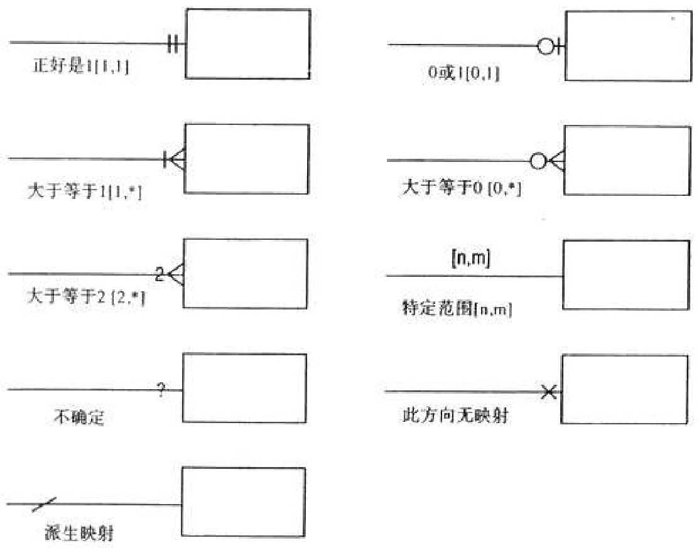  
图A-1本书中使用的基数的符号  

在关联主题上存在很多其它的变形。我试图尽可能使问题简单。在第15章中，把一些有用的变形作为关联模式进行讨论。  

A.1.3泛化  

让我们把一个商业实体的私人客户和企业客户作为泛化的一个典型例子。客户的这两个类型是不同的，但也具有很多相同点。这些相同点可以放在一个通用的客户类型中，而私人客户和企业客户作为子类型。  

同样，这个现象在建模的不同级别有不同的解释。如果企业客户的所有实例通过定义也是客户的实例，那么在概念上我们能够说企业客户是客 户的一个子类型。在一个规约模型中，企业客户的接口必须符合客户的接口。也就是说，企业客户的一个实例能够用在使用一个客户的任何场合，并且调用者不需要担心实际上存在的是一个子类型（可替换性原则）企业客户对某个命令的响应可以和另一个客户不同（多态性），但是调用者不用担心这个区别。  

在OO语言中，继承和子类化（subclassing）是一种子类继承超类的数据和操作的实现方法。它和子类型化（subtyping）有大量的相同之处，但是也存在重要的区别。子类化只是实现子类型化的一种方法（参见14.2节）。没有子类型化也能够使用子类化一一但是大多数的作者确实都不赞成这种实践。更新的语言和标准越来越强调接口继承（子类型化）和实现继承（子类化）之间的区别。  

关于一个对象和一个类型之间的关系有两个问题。首先，一个对象具有一个能够从多个超类型继承的单独类型（单分类），还是具有多个类型（多重分类）？多重分类和多重继承是不同的。多重继承中一个类型能够有很多超类型，但是每一个实例都属于一个可能有多个超类型的单独类型。多重分类允许一个对象属于多个类型而不用为此定义一个专门的类型。我们可能有私人客户、企业客户和重要客户作为客户的子类型。一个客户可能既是私人客户又是重要客户。在多重分类中我们能够把私人客户类型和重要客户类型都赋予一个对象（用一个继承它们的客户）。如果没有多重分类，我们必须显式定义一个重要私人客户类型。如果有大量的子类型，我们最终会得到大量难以管理的组合。  

从概念上说，多重分类是一个更加自然的思考方法。然而，大多数的00语言以及主流的 $C++$ 和Smalltalk都使用单分类的方法。大量的方法也使用单分类。这个权衡是介于一种需要花更多努力才能转变成代码的在概念上更自然的方法，和一种比较易于转变成代码但是受实现束缚更多的方法之间。我更喜欢那种更加概念化的方法，并且在本书中使用多重分类。  

当使用多重分类时，我们必须说明在把子类型分组到划分中时哪些组合是合法的，如图A-2所示。同一个划分中的类型是不相交的：也就是说，没有对象可以是单个划分中多于一个类型的实例。因此超类型不可能既是子类型-1又是子类型-2。一个不完整的划分意味着超类型的一个实例不一定是这个划分中的某个子类型的实例。一个完整的划分意味着超类型的每个实例必须也是这个划分中某个子类型的实例。  

第二个向题是一个对象是否能够改变它的类型。例如，当一个银行的账目透支时，它在本质上改变它的行为，有几个操作（撤销，关闭）被额盖。动态分类允许对象在子类型化结构的内部改变类型，但静态分类不可以。同样地，主要的00语言和大多数00方法都是静态的，并且这里适用的是和单/多重分类相同的权衡。本书采用更加概念化的动态分类方法。  

看待动态分类的一个方式是它统一了状态和类型的概念。当使用静态分类时，我们必须注意把依赖状态的行为与子类化区别对待。动态分类把它们同样对待。  

对动态分类的使用发现概念模型和实现模型之间的一个细微区别。在一个概念模型中所有子类型化都被看作动态的，除非用一个简短的语义说明[immutable]（不变的）显式地定义。这不仅反映世界上可能发生的变化而且反映我们关于它们的不断变化的知识。对一些业务而言，真实的情况可能是一个私人客户不能变成一个企业客户。一个客户，我们认为是私人客户而实际上是企业客户，这种情况也是可能的。这样一来，我们关于世界的知识意味着一个动态的分类，即使世界本身是静态的。信息系统通常建立在我们关于世界的知识上，因此子类型化在概念上是动态的。  

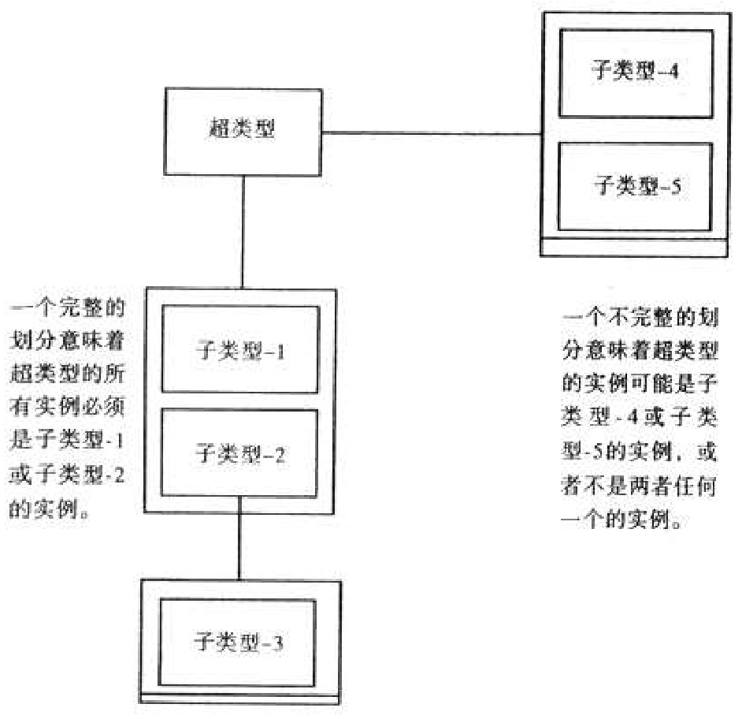  
图A-2泛化的符号  

超类型的一个实例可能是子类型-1和子类型-4，但不可能是子类型-1和子类型-2。  

然面，我们不能忽略处理动态分类的额外的复杂性。因而，概念上的动态子类型化在一个规约模型中通常被声明为静态的。这有效地说明虽然我们知道分类可能改变，但是它的发生如此罕见足以使我们不想付出额外的努力（和费用）来支持它。如果它真的发生，用户不得不用复制和替换来处理这种情况。在很多情况下，这种动态的罕见性足以使这种方法值得使用。长期的灵活性能够通过确保访问者接口在两种情况下相同来维持。  

最后，决定一个划分是静态的还是动态的依赖于应用，所以我没有试  

为了简单化，我建议你尽可能使用静态分类。  

如果你正在使用一个不使用多重动态分类的方法，那么你将需要用14.2节中提出的模式来转变这些模型。  

虽然在谈论类型时我们会大量谈到关联和子类型，但它们并不是全部。我可能有一个人寿保险对象，它具有针对保险客户和受益人的映射。我能够使用基数约束来捕捉一些说明，例如只有一个保险客户但是可能有很多受益人：然面，这些约束不允许我们说明保险客户一定不是一个受益人。为了这样做，我们需要一个更加灵活的约束。约束是关于一个类型的一个必须总是为真的逻辑表达式。约束通常被00方法忽略，虽然它们早就已经在Eiffel中存在（其中它们被称为不变式）。  

我使用语义说明来表达约束，如图A-3所示。简短的语义说明表示那些能够总结成几个词语的通用情况，并且被放在一个方括号中添加到图上。表A-1列出本书中使用的简短的语义说明。  

适用于一个类型的简短的语义说明  

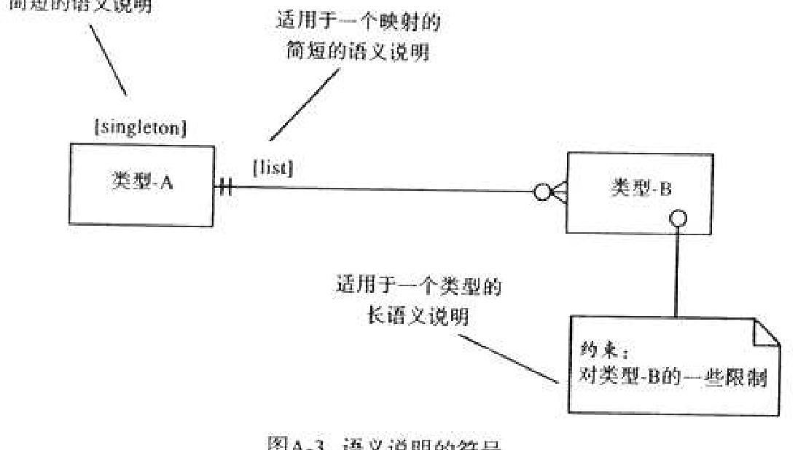  

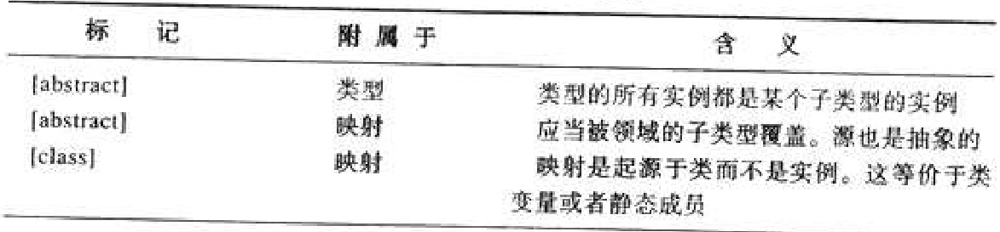  

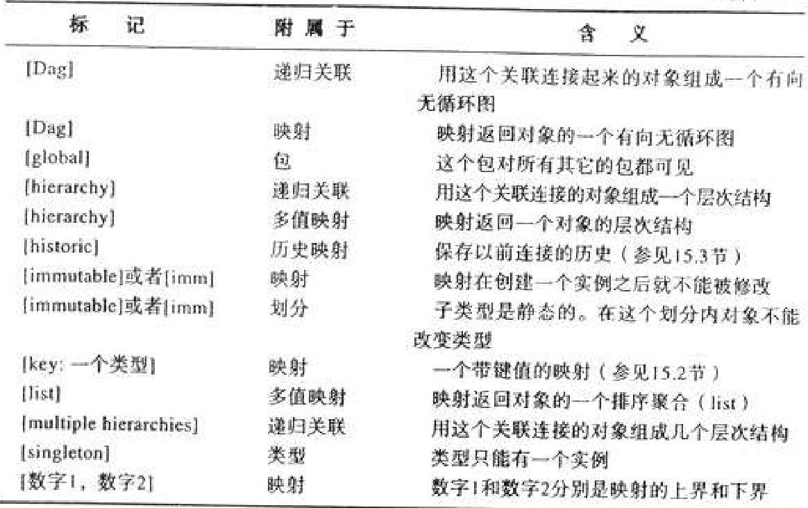  
不是所有的事情都能用一个简短的语义说明来表达。当需要更多的空间时，我使用一个长语义说明，它在一个卷角方框中容纳更多的文本。一个长语义说明有一个头部指明它描述的内容。表A-2列举了这些头部。  

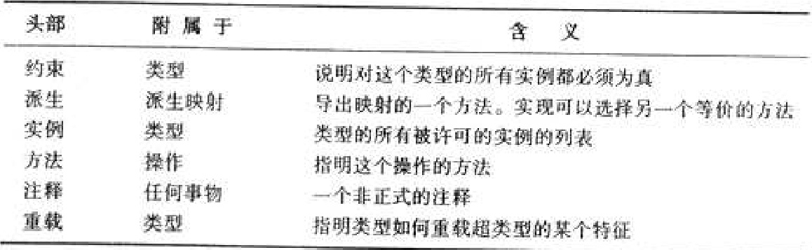  
不是所有的方法都提供捕捉语义说明中显示的那种信息的方法。然而，不要使大量这样的信息丢失是很重要的。方法渐渐提供某种能够用这种方式使用的可视化注释，它与长语义说明类似。  

在传统的数据建模中世界通常被划分为实体和属性。这个划分有些随意。实际上它总是被归结为属性，这些属性是由环境支持的基础数据类型一通常是整数、实数、字符串、日期或者可能其它的一些类型。  

用对象系统，我们能够很容易地定义新类型，它们具有大量与这些内置类型相同的特征。Smalltalk中一个经典的例子是分数。在Smalltalk中一个分数就像任何其它数字一样工作；实际上如果我们在Smalltalk中执行1/3那么答案就是分数1/3，而不是某个假无穷循环小数。  

在开发系统时，我们必须使用这些类型。一个典型的例子是对货币价值的处理。在一个数据库中一辆小汽车的价值通常被作为一个数字处理，然而说一辆小汽车价值10000是没有意义的。币种总是重要的。通过使用对象，我们实际上可以定义一个既知道数字又知道币种的货币类型。它能够执行加法（核对币种匹配）并且能够创建一个用正确方法安排格式的打印输出。  

表A-3列举了本书中使用的基础类型。  

  

关于基础类型的重点是：从一个基础类型到一个非基础类型的映射是不会被实现的。否则，基础类型会得到一个巨大的接口，这个接口挤满到每个使用它的类型的访问者。这样既难操纵又不可复用。一个概念模型能够显示存在一个映射，因为概念上这个映射确实存在，但是一个相应的规约模型却不能存在。  

一些作者喜欢把这些种类的类型称为文字（literal）：然而，其它一些作者用术语“文字”代表非对象类型（例如 $\mathrm{C++}$ 中的实型），这就是我使用术语“基础类型”的原因。  

我不想对本书中的基础类型进行完整详细的说明。这作为留给读者的一个练习（或者一个未来的版本）。这些类型的一部分在Cook和Daniels的书[4]中有详细的说明。  

A.2交互图  

交互图显示几个对象如何合作完成某件事情。一个交互图中有一些代表对象的垂直线。这些线之间的箭头代表对象之间发送的信息，顺序是沿着页面从上到下，如图A-4所示。交互图被广泛地应用并且易于遵循。我所做的一个不寻常的事情是用一个双头箭头来显示同一个信息被发送到多个对象，这可能发生在一个循环中或者在一个聚合上送代时。我也偶尔使用一个虚线来显示一个返回值：我并不总是这样做，但是当事情纠缠不清的时候，这样做是有用的。  

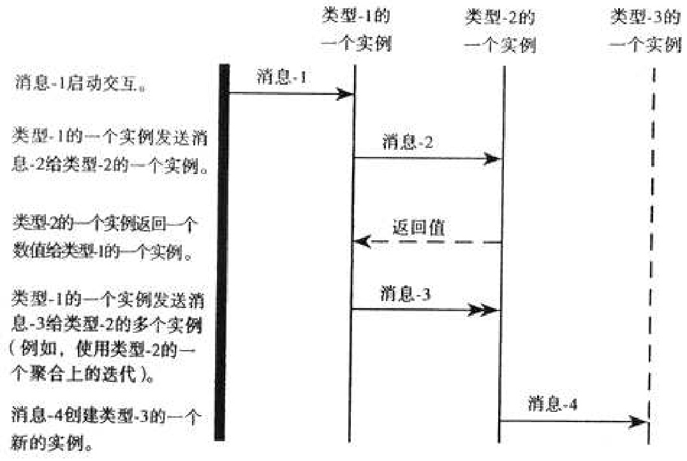  
图A-4交互图使用的符号  

在本书中我大量使用交互来显示行为。通常，我把它们和一个事件图联合使用（参见A.3节），因为这两种方法可以很好地相互补充。事件图用一种鼓励并行的方式定义行为，然而它们没有指明哪一个对象做什么。交互图显示这种行为如何能够在对象之间进行分配，但是取消了并行性和准确的行为逻辑。  

你可能更熟悉用方框之间带编号的消息表示的交互图，这些方框与沿页面的直线是等同的。我更喜欢沿着页面的直线这种形式，因为我认为它使人更容易看到消息的顺序。  

既然交互图如此简单，那么如果你以前没有使用过它们，你就不再需要关于它们的更多指南。更多的细节来自Booch[1]。  

A.3事件图  

事件图是我使用的另一种形式的行为模型。虽然它们比交互图更加复杂，但是它们确实允许规约完整的控制。它们也能够表达在业务建模中非常有用的并行行为。  

一个事件图中的方框表示操作，这些操作的完成标记了一个事件。一个触发规则表明一个事件触发一个操作。当一个事件类型上定义了多于一条的触发规则时就出现并行性。因此在图A-5中标记在操作-1末端的事件类型并行触发了操作-2和操作-3。这意味着操作-2和操作-3能够以任何顺序发生或者同时发生。并行性也会伴随着-个多重触发而发生，它用一个 双头箭头表示。这表明这个事件多次触发操作，例如在一个聚合上发生送代时。在直线上的标签表明是在哪一个聚合上发生送代。  

如果一个触发规则经过一个控制条件指向一个操作，那么只有在这个控制条件（一个布尔表达式）为真时这个操作才被调用。控制条件通常用来同步并行的线程。每一个线程都触发这个条件，该条件被设计成只有在正确的同步点时才为真。  

两个通用的控制条件是“与”条件和z条件。“与”条件只有当所有输人的触发规则都激活一次时才为真。它表示为在菱形中有一个&。z条件是当图中没有操作被触发运行时为真，也就是说，当所有都安静下来并且整个图进人睡眠时才为真。它表示为在菱形中有一个z（就像在zzzzzz中）。一个z条件通常用在图的结尾以同步图的终点。  

另一个有条件的逻辑是划分的逻辑，就像在操作-3上的。这个事件派生子类型时依赖于操作的输出。一个触发规则可以放在超类型事件上，表明无论什么输出都会激活一个触发。划分的工作方法和在结构模型中一样。一个事件能够有很多定义在它上面的划分，一个划分内能够有任意数量的事件，并且划分可在相互之间任何想要的深度上定义。任何事件都是每个划分中惟一一个事件类型的一个实例。  

事件图是概念上的，在图中只说明某个过程是如何工作的，而没有说明哪一个对象执行这个过程。因此它很好地补充了交互图。关于事件图的指南参见Odell[5]  

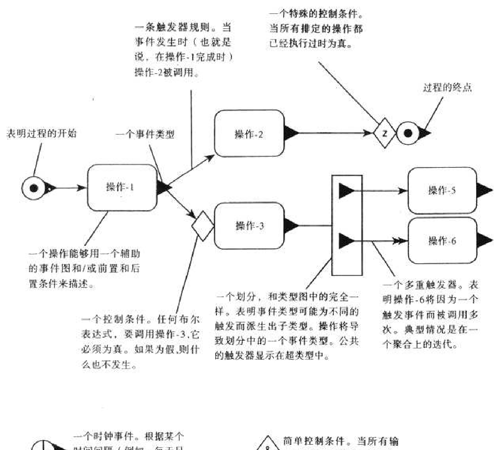  
图A-5事件图的符号  

# A.4状态图  

状态图通过描述一个对象能够进人的不同状态和它如何改变状态来定义单个对象的行为。状态图在OO方法中最广泛的应用形式是Harel状态图。在本书中我使用这种形式的一个子集。一个状态图是为单个类型画的，它描述这个类型的每个实例的行为。  

每个状态图用一个方框来表示，如图A-6所示。方框用变迁连接起来，这些变迁显示一个对象如何从一个状态变迁到另一个状态。变迁用造成这个变迁的事件来标记。如果一个变迁有一个守护条件，那么只有当事件发生并且守护条件的计算值为真时变迁才能发生。守护条件是一个布尔表达  

式。如果一个变迁有一个动作，那么在变迁到新状态的过程中执行这个动作。状态能够被泛化成为超状态。一个超状态能够被用来定义随后可适用于所有子状态的变迁。  

  
图A-6本书中状态图的符号  

关于Harel状态图的一个简单指南参见Booch[1]。要得到一个更加全面的处理，最好的来源是Cook和Daniels[4]。本书中我没有太多地使用状态图，而且也确实没有借助Harel状态图的力量，但是它们偶尔会突然出现。  

A.5包图  

在大型模型中我们需要一种方法来组织类型图中出现的大量类型。一个单独的大型类型图不仅对人来说太复杂而难以理解，而且对软件来说也难以管理。虽然一个大型的类型图对一个人来说能够被分割成很多页，但是这些页的随意选择对于控制软件没有什么作用。如图A-7所示，包图提供了一种更加可控的机制。  

一个包（也称为分类领域、群集或者子系统）是一组类型（或者类）。一个类型只能属于一个包。通常类型被指定到一些包中，这样 $\smile$ 来那些合作的类型一般也被放在相同的包中。在一个包中，任何类型都能够访回同一个包中的任何其它类型的所有特征。  

包通过可见性关系连接起来。如果一个客户类型想要使用另一个包中的一个服务器类型，那么在这个客户类型和服务器类型之间必须存在一个可见性关系。这对任何服务一调用一个操作、约束一个属性或者传递一个参数一都是需要的。  

可见性和前提是不同的。一个前提意味着一个包需要另一个包出现在函数中。前提是可传递的：如果包C是包B的一个前提，并且包B是包A的一个前提，那么包C是包A的一个前提。这种传递性对可见性是不成立的。包A可能没有到包C的可见性：实际上，包B可能是被专门设计成对包A隐藏包C的一这是层次构架的本质。前提和可见性总是被混淆，因为编程语言通常把两者合并起来。 $C++$ 头文件和Envy前提定义了前提并且给予了到所有前提的可见性，这就使我们无法用一个包来隐藏另一个包。所有的可见性必须在一个包中显式定义。因此在图A-7中，风险管理应用包必须具有一个到合同夹包的显式可见性以便能够使用它的服务。如果这个可见性不存在，那么合同夹包将仍然是一个前提（通过评估包），但是将没有可见性。可见性意味着前提但是反过来却不成立。  

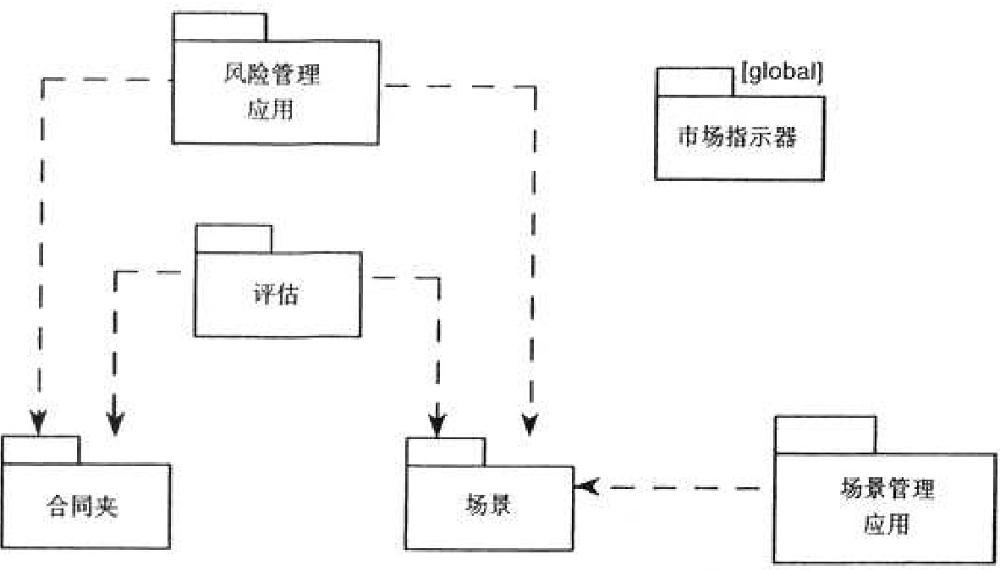  
图A-7描述包的符号  

这个图是从图11-3中得到的。这里我对包使用Rational软件公司的统一建模语言（UML）的符号[2]，因为我发现它比Booch的原始符号更清晰。  

在一个包的内部，类型可以是公有的也可以是私有的。公有类型可以被具有可见性的包看到；私有类型只能被同一个包中的类型使用。包能够被指定为全局的，在这种情况下所有其它的包都具有到它的可见性。这对通用的构件（例如整数、字符串和聚合）是必需的。  

当开发一个大型系统时，我们试图把包之间的可见性最小化以便使这  

个系统具有更少的依赖性并且因此变得更加容易管理。在本书中我主要在第11章和第12章中讨论包。  

虽然这种类型的模型主要是针对较大的系统，但是它在方法中被讨论的次数并不多。Booch[1]介绍了我在这里所使用的基本思想，但是它的描述非常简要，主要是因为没有一个实际的例子很难讨论这个课题。RobertMartin解决了这个缺乏的问题，他给出一些使用包模型的例子[6]。  

# 参考文献  

1. Booch,G.Object-Oriented Analysis andDesign with Applications[Second Edition).Redwood City.CA:Benjamin/Cummings,1993.

 2. Booch,G.andJ.Rumbaugh.Unified Method for Object-Oriented Development Rational Software Corporation,Version 0.8,1995.

 3. Gamma,E.,R.Helm,R.Johnson,and J.Vlissides.Design Patterns:Elements of Reusable Object-Oriented Software.Reading.MA:Addison-Wesley.1995.

 4. Cook,S.and J.Daniels.Designing Object Systems:Object-Oriented Modelling with Syntropy.Hemel Hempstead,UK:Prentice-Hall International,1994.

 5. Martin.J.andJ. Odell.Object-Oriented Methods:A Foundation Englewood Cliffs NJ:Prentice-Hall,1995. 6 Martin,R.C.Designing Object-Oriented  $\overleftrightarrow{\mathrm{G}}\mathrm{++}$  Applications Using the Boo ch Method Englewood Cliffs,Nj:Prentice-Hall,1995  

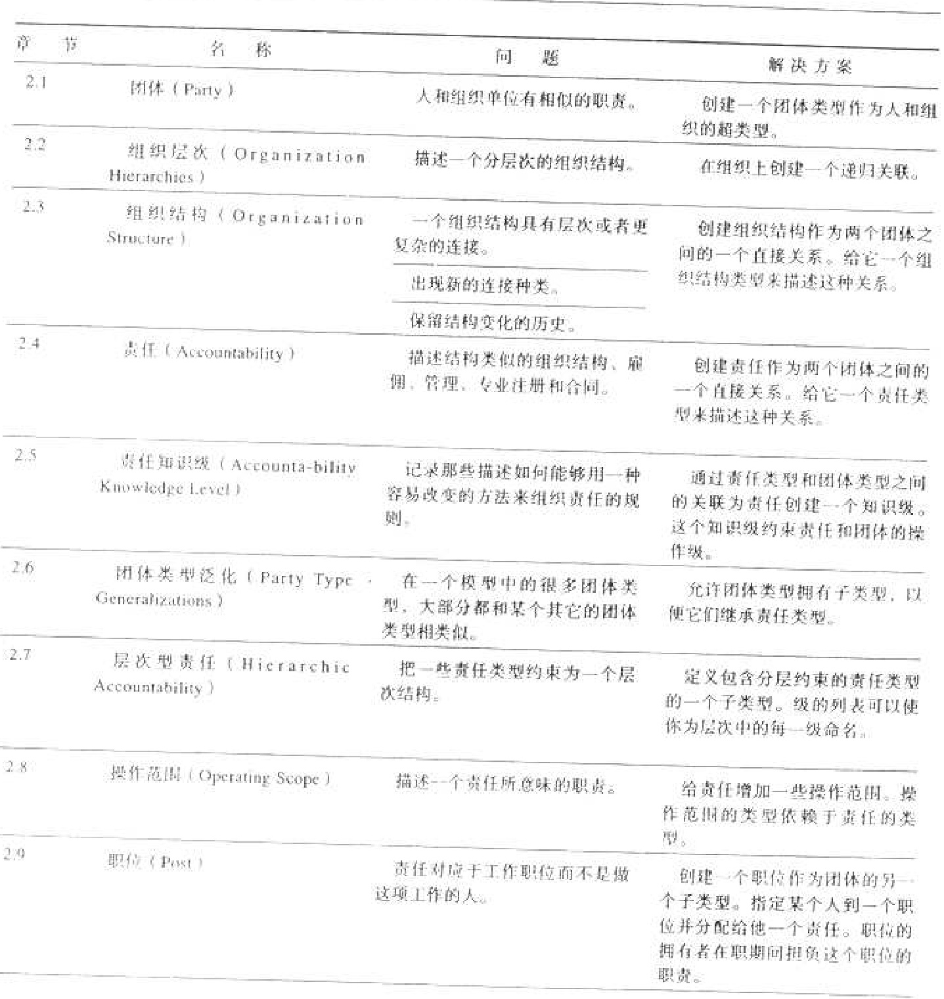  

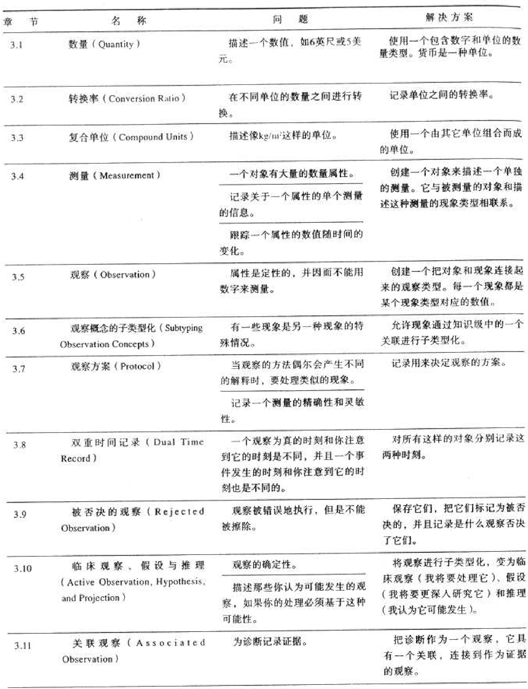  

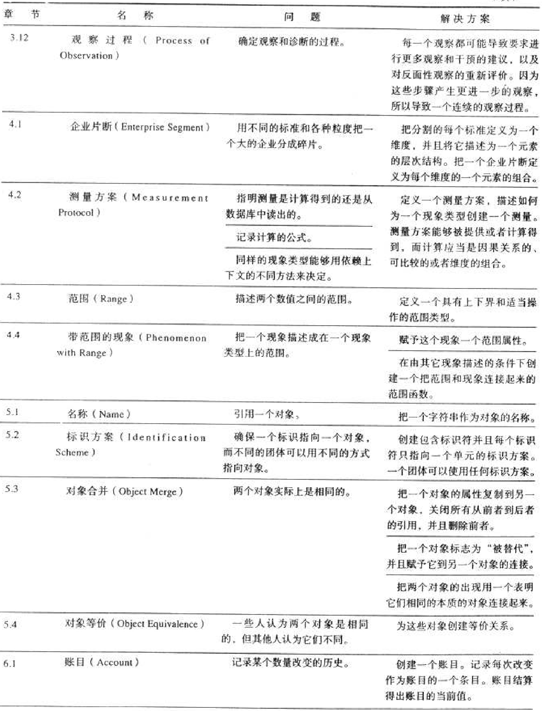  

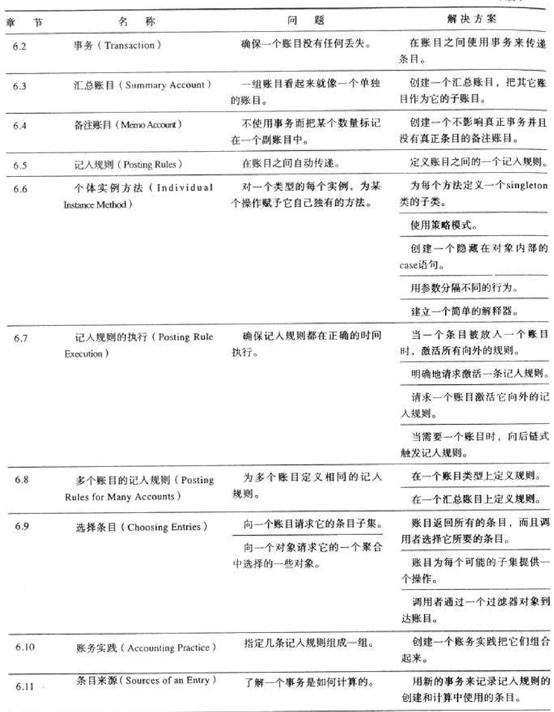  

  

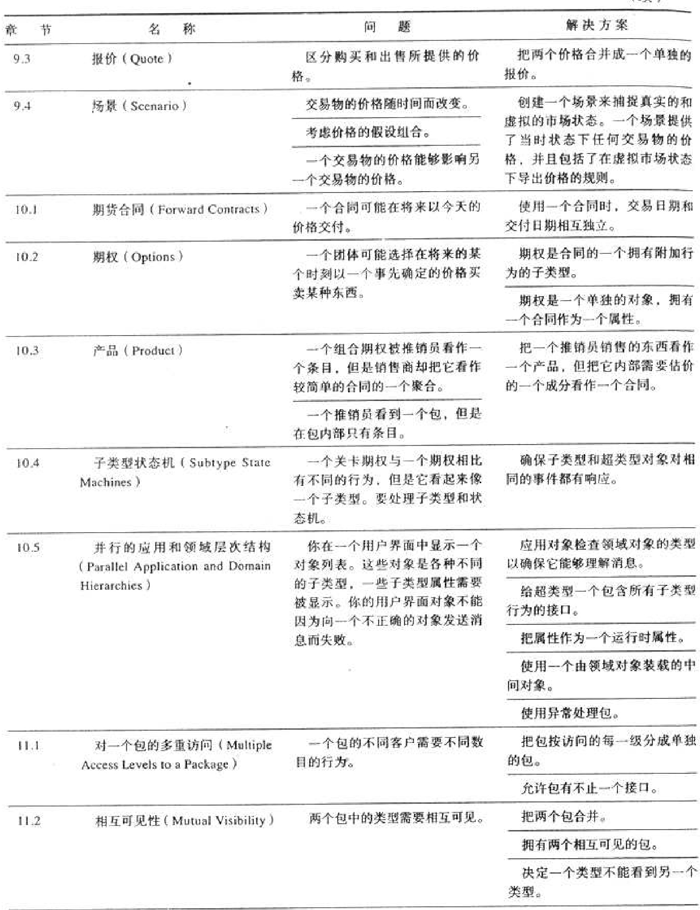  

  

300  

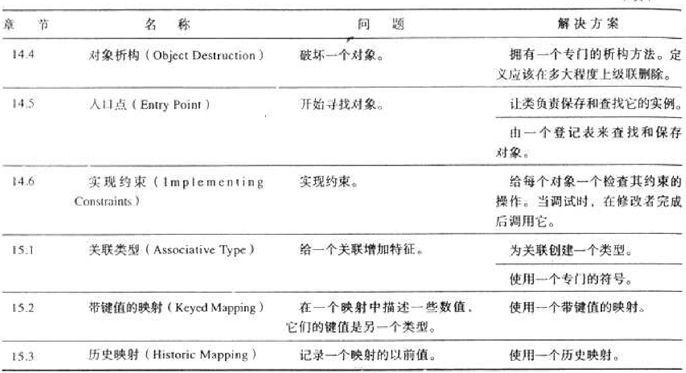  

# 索引  

#  

# A  

Abandonedactions（被放弃的动作），157，160-161，337Absence（缺乏）cale gory observation（分类观察）.46 observation co ncc pts（观察概念）47 Abstract（抽象）mapping（映射）.136.322 postingrule（记人规则）.151 type（类型），322Access0rs（访f同者）.275-277，278.280Account（账目）Summary account bookingentries t0multiple accounts,97,127-132,337 corresponding（对应的）.96，124-125，337derived（派生的），130-131filter（过滤器），119，120generally（通常）.95，97.98memo（备注）,96，103-104，336pattern（模式），335posting（记人），141sign（符号）.97 specializedmodel（专门化模型），96.125-127，337statement（声明），97Account-basedfiring（基于账目的触发），112-113.143Accountability（责任）abstraction（抽象），23generally（通常），17-18、22-24hierarchic（层次的）.17.28-30.332 knowledgelevel（知识级），17.2427.332operating scopes（操作范围）.30-32  

organizationhierarchies（组织层次），17，19.21.331organization structure（组纳结构），17，21-22.331party（团体），17,18-19party type generalizations（团体类型泛化）.17.27-28 332 pattern（模式），331post（职位），17，32-33Accountingandinventory（账务和库存）。参见Account；Entry:Individual instance mcthod balance sheets and income slatements（结算单和所得计 算书）.96.123-124，337 palterns（模式）.134postingruleexecution（记人规则的执行），96，111-115336 postingrules（记人规则），96，104-105.336postingrules formany accounts（到多个账目的记人规 则）.116-118,336 praclice（实践），119-122practicepattern（实践模式），96.337spccialized accountmodel（专门化的账目模型），96Total Telecommunicationsexanple（TT集团的例子）usein（用在），133-134ransactions（事务）.95-96，98-101 Accountingframework（账目框架），132ACM。参见Aroma Coffee Makers（ACM）Action（动作）abandoned（放弃的）.157,160-161.337 completed（完成的），157，160-161，337implemented（执行的）.157，158-160，168，337proposed（建议的）.157、158-160，168.337  

Active observation（临床观寨）.36.49-50，334 Actual status（实际状态）.69-71 Acyclicgraph structure（非循环图结构）。参见DAG(directed acyclic graph) Aggregation intype diagrams（类型图中的聚集），315318 Alexander，Christopher（亚历山大·克里斯托夫），5，6Analysis（分析）design techniques（设计技术），3generally（通常）.1pattern（模式），310Anderson.Bruce,5 Application（应用层）。参见ParallclapplicationApplication facadc（应用外观）commonmethods（公共方法），257，262-264contentsofafacade（外观的内容），257，259-262domainmodel（领域模型），visibilityto（到的可见性）.221 generally（通常），257-258healthcareexample（医疗保健的例子），257-259methods for facade alttributes（外观属性的方法），260262 multiple facades（多重外观），257，267-269operalions（操作）.257.264-265 typeconversion（类型转换），257.265-267Applicationlogic（应用逻辑层）。参见Presentationandapplication logic Architecture（构架）。参见Layeredarchitectureforinformation systems; Three-tier architecture: Two-tier architecture Arguments（参数）.67 AromaCoffeeMakers（芳香咖啡机制造公司）（ACM）accountability（责任）.31 actualversusplanned status（实际状态与计划状态），71dimensionsof（维度），60enterprisesegments（企业片断），61-65framework（框架）useofresulting（使用最终框架）82-83  

location dimension（位置维度），63organizationhicrarchies（组织层次），19-20performance analysis（性能分析），57Asset（资产）.157.168-172 Associatedobservation（关联观察）defined（定义的），36linking of knowledge and operational levels（知识级和 操作级的连接）50-51 pattern（模式），334triggerrule（触发器规则），52Associationobjects（关联对象），bidirectionalimplementation（双向实现）、280Associationpatterns（关联模式）associativetype（关联类型），297、298-301generally（通常）、297-298historicmapping（历史映射），297.303-307keyedmapping（带键值的映射），297.301-303two-dimensional history（二维历史），298Associations（关联）defined（定义的），297one-way（单向）.277 quantity inmodeling（建模中的数量），38recursive（递归的），322Associations（关联）.implemcntationof（关联的实现）。Bidirectional associations derivedmappings（派生映射），281fundamental types（基础类型），277gcnerally（通常）.272,274interface（接口），275-277nonsetmappings（非集合映射），281pattern（模式）.341type diagrams（类型图）use in（用在），315-318unidirectional（单向的），274-275,278.316Associative type（关联类型）.297.298-301.342 Atomicunit（原子单位），39-41Attributes（属性）object information（对象信息），35phenomenon withrangc（带范围的现象），78-80  

quantity（数量）97-98 quantityinmodeling（建模中的数量），38typcdiagrams（类型图）.uscin（用在）.315-318  

# B  

Backward-chained firing（向后链式触发），114Balancc sheets（结算单）.96.123-124.337 Bags（袋）account（账目），98collections（集合），273mappingswith（映射）.39-41 protocol components（方案构件），165Bank（银行）derivativestradingsystem（派生交易系统）.240）245-246 foreign exchange derivatives trading system（外汇派 生交易系统）。参见TradingBaringsBankcollapse（巴林银行倒闭）.205-206Barieroption（关卡期权）.211 Beck,Kent,5.133,289 Behavioralmeta-model（行为的元模型），163Bidirectionalassociations（双向关联）implemention（实现），274-275.278-281type diagrams（类型图），316Black-Scholes analysis（Black-Scholes分析）derivative contract（派生合同），determiningvalue of（确定派生合同的价值）.245options（期权），determiningvalueof（确定期权的价值）.201-202 riskevaluation（风险评估），205Blockmethod in Smalltalk（Smalltalk中的块方法），108Booch.324 Booking cnt ric s to multiple accounts（登记条目到多个账 日）.97.127-132,337Boolean（布尔型）contractattribute（合同属性），177fundamental type（基础类型）.324porifolio（合同夹），usein（用在），180-182  

BPR（Business process re engi ncc ring）（业务过程重组）10 Broker（代理）.interface（接口），253Browser（览器）.217.218.221-222 Business process reengineering（BPR）（业务过程重组 (BPR））.1O  

# C  

#  

associationinterface（关联接口），277collectionclasscs（聚合类），273-274constraints（约束），implementation of（实现），294contracts（合同），use in（用在），181cxceptionhandling（异常处理），223external iterator（外部迭代器）.98 historyof（历史），5modelprototypes（模型原型），58objeclcreation（对象创建），289quoles（报价），usein（用在），186.188Total Telecommunications cxample（TT集团的例子），usein（用在），133type checking（类型检查），218Calculatedmeasurementprotocol（计算测量方案），66-70Call（看涨（期权））.在期权合同中（inoption-contract）202-204 Calls（呼叫），phone（电话）separationintodayandevening（分成白天和夜晚两类），143-145 settingupof（建立），134，142-143time（时间），chargingfor（按时间收费），145-148Cardinality（基数）keyedmapping（带键值的映射），usein（用在），60type diagrams（类型图）.usein（用在），317Cascadingdelete（级联删除），290Category（分类）absence（缺乏）.46mappingtophenomenontype（到现象类型的映射）. 43-45  

pattern（模式）.8  

prescnce（存在）.46Causalmeasuremcntsprotocol（因果测量方案）.58.68-73 Classmapping（类映射）.322 Classes（类）collection（聚合），273combination（组合）282 entry point（人口点）usein（用在），293-294Classification（分类），318-321Coad,Peter,6 Combinationoption（组合期权），206Comparativemeasurementsprotocol（比较测量方案），58，68-75 Comparativestatustype（比较状态类型），71-72Completedactions（完成的动作），157.160-161.337Compoundunit（复合单位）bags（袋），useof（使用）.39-41defined（定义的），39paltern（模式），332quantily pattern extension（数量模式扩展），use in（用在）35Conceptualmodel（概念模型）analysis and design（分析和设计）.compared（比较的）。analysisand design techniques（分析和设计技术），usein（用在），3business process reengincering and（业务过程重组）.10 contract（合同）.176-177 creation of（创建），2individualinstance method（个体实例方法），106quantity（数量），usein（用在）.38software language（软件语言），expressionof（表示），3software technology（软件技术），independentof（独立于）4 type diagrams（类型图），use in（用在），314-315Conceptual schema（概念模式），242oncurency（井发性），244onformance（致性）.211-214,215-216onstraint（约束）  

implemeniationof（实现），294,342phenomenon withrange atribute（带范围属性的现象）79 type（类型），323Constructorparameter method（构造器参数方法），138Consumable（消耗品）.157.168-172Containers（容器），273.278Contract（合同）。参见Derivative contract；Forwardcontract generally（通常）.175.176-180package（包）.231-233pattem（模式），338selectors（选择器），182-184spot（现货）.198 Control condition（控制条件），140Conversionratio（转换率）generally（通常），35individualinstancemethod（个体实例方法），39monetaryvalues（金钱数值），39pattern（模式），332scenarios（场景），used toconver（用来转换）39unit conversion（单位转换），38Cook.211,213.324-325 Coplien,Jim.5 Copy andreplace（复制并替换），inobject merge（在对象合井中）.90 Corporatefinanceobservations（公司财务观察）。参见Aroma Coffe Makers（ACM）;Measurement protocolenterprise segment（企业片断），58.59-65framework（框架），uscof（使用），82-83generally（通常）.57-58range（范围）.58.76-77Corresponding account（对应账目），96.124-125.337CosmosClinical Process Model（Cosmos临床过程模型）patternsused in（使用的模式），158Cosmosproject（Cosmos项目）accountabilitymodel（责任模型），development of（开发）.18  

applicationfacade（应用外观）.modelbascdon（基于的模型）.258-259healthcare modeling（医疗保健建模）.36 ayercdarchitectureforinformationsystems（信息系统的分层构架）240objectofcare（关照对象），59observations（观察）.49 Counterparty（对方团体）.178 Creationofobjects（对象创建），289，342Creationparamclermethod（构造参数方法），138.289Cross-productcontrolcondition（叉积控制条件）.140Cross-ratcelement（交叉汇率元素），192-194Cunningham.Ward,5.310 Currency（货币）.fundamcntaltype（基础类型）.324  

# D  

DAG（directedacychicgraph）（有向非循环图），166-168322 Daniels.211.213,324-325 Database（数据库），用在两层构架中（useintwo-1ierarchitecture）,240-242Databaseinteraction（数据库交互）domaintier（领域层），linkingtodatasources（连接到 数据源）252generally（通常）.240.251-252interactiondiagram（交互图），254interfacetier（接口层）.252-256 pattern（模式）.341Datefundamentaltype（日期基础类型），324Defaultmethod（默认方法），261-262Deletionofobjects（对象耐除），290Dependence（依赖性），162.166-167Derivative contract（派生合同） domainhierarchics（领域层次结构）.198.216-223 forwardcontract（期货合同），197.198-200opti0ns（期权），197.200-205parallelapplication（并行应用层），198.216-223product（产品），197-198.205-211  

subtype statemachines（子类型状态机），198,211-216Derivative trade（派生交易）。参见Derivative contractDerivalives trading system for a bank（—个银行的派生交 易系统），240.245-246Derivedaccount（派生账目），130-131Derivedmappings（派生映射），281,317-318,323Design analysis（设计分析），1Design templates（设计模板）associations（关联），implementationof（实现），272274-281 constraints（约束）.implementationof（实现），273294 design templates for other lechniques （其它技术的设计模板），273.295entrypoint（人口点），273.291-294generalization（泛化），implementation of（实现）.273,281-288 generally（通常），271-272goalsof（目标）.272 modelimplementation（模型实现）.uscin（用在）. 137 objectcreation（对象创建），273.289objectdestruction（对象析构），273，290-291Destructionofobjects（对象的析构），290-291.342Diagrams（图）event（事件），326-327interaction（交互），325-326package（包），328-330state（状态），327-328Diagrams（图）.type（类型）nssociations（关联），aributes（属性），aggregation（聚集）.315-318fundamental types（基础类型）.323-325 generalization（泛化），318-321generally（通常），313-314semantic statements（语义声明），321-323typeandclass（类型和类），314-315Dictionary（字典）  

collecticn（聚合）.273 historicmapping（历史映射），usein（用在）.305keyedmappings（带键值的映射），usein（用在），301Digitalk Smalltalk.参见Smalltalk Dimension（维度）combination（组合）.58 combinationprotocol（组合方案），74-75defined（定义的），63cntcrprisesegment（企业片断）.58.60-65 propertiesof（属性）.64-65 Dircctedacyclicgraph（有向非循环图）（DAG），166168,322 Domain experts（领域专家）.involvement in conceptual modeling（包含在概念建模中）.3Domain framework（领城框架），243-244Domainhierarchies（领域层次结构）.198，216-217，340 参见ParallelapplicationDomaintier（领域层）.242-245.252 Double entry accounting（双条日账目）.98-99 Dualtimerecord（双时间记录），36,47-48.333Duration（持续时间）.fundamentaltype（基础类型 $\smash{\}_{k}$ 324 Dynamic classification（动态分类）.320  

# E  

Each-entrypostingrule（每条目记人规则），143Eagerfiring（急切触发）.111-112 Edwards,John.10 Eiffel,294.321 Einsteinianmodel（爱因斯坦模型）.developeruscof（开 发人员使用2Eligibility condition method（资格条件方法）.uscin postingrules（用在记人规则中）.118 Encapsulation（封装），274Enterprise segment（企业片断）dimension（维度），definingof（定义），63-64dimensionelements（维度元素）.60-62 dimensionlevcltype（维度层类型）63  

gencrally（通常），58,59hierarchiesof（层次），59-60objectofcare（关照对象）.59paltcrn（模式），334propertiesof（属性）.65 top ofhierarchy（顶层），60Enterprise-widemodeling（企业范围内的建模），235Entry（条目）accounting（账务）.usein（用在），95bookingtomultipleaccounts（登记到多个账目），97.127-132,337 choosingof（选择），96,118-119,337doubleentryapproach（双条目方法），98-99memo（各注）.129-130 sourcesof（来源）.96,122-123.337 storingof（存储）.119 Entrypoint（人口点）classes（类），useof（使用），293-294findoperations（查找方法），implementation of（实现）293 generally（通常），273.291-292interface forfindingobjects（查找对象的接口），292-293pattem（模式），342registrarobjects（登记表对象），useof（使用）.293-294Equivalanceofobjects（对象等价）.85.92-93.335 Essence/appearancemodel inobjectmerger（对象合并中的本质/表象模型）.91-92Event diagrams（事件图），326-327Extermalitcrator（外部选代器），98.279Extermal schema（外部模式），242  

# F  

Facade（外观）。参见Application facadeapplicationlogictier（应用逻辑层）.usein（用在），247 client/serverenvironmcnts（客户/服务器环境）strelchingin（延伸于）.250-251 databascinterfacetier（数据库接口层）.usein（用在）253  

multiple（多重），267-269Filter（过滤器）account（账目），119,120portfolio（合同夹），181-184Findargumcntsoperation（查找参数操作），74-75Findoperations（查找操作），293Firing approachesin posting rule execution（记人规则执行 中的触发方法）account-based（基于账目），112-113backward-chained（向后链式）.114 comparisonof（比较）,114-115 cager（急切）.111-112 posting-rule-based（基于记人规购），113-114Fixedformatofapaften（-个模式的固定格式），6Flags（标志），generalizaton implementation（泛化实现），283-284 Focalevent（焦点事件）.63 Foreign cxchange derivatives trading system for a bank( 个银行的外汇派生交易系统），176Forwardcontract（期货合同）datecalculation（日期计算）.199-200defined（定义的），198generally（通常），197patcrn（模式）.339tenor（期限），198-199Framework（框架）.accounting（账务）.132 Frameworksandpatterns（框架和模式）.11-13Function（函数）outcome（输出）,157.172-174.338range（范图）.58,80-81start（启动），157.172-174.338Fundamental（基础的）enterprise segment（企业片浙）.65 lypes（类型），277.324G  

GangofFour（“四人帮”）creationpauterns（创建模式），289  

delegation（委托/授权），usedindesign（用在设计中）314 initialpublicationof（初始发布），5patternsof（模式）.110.309software interface and implementation differences（软件 接口和实现差别），4softwarepattcrns（软件模式），influenceon（影响），6eneralization（泛化）、implementationof（实现）delegationtoahiddenclass（授权给一个隐藏类）.284286 ags（标志），283-284generally（通常），273.281-282has Type operation（hasType操作）,288 inheritance（继承）.282interfacefor（接口）,287-288multiple inheritance combination classes（多重继承组合 类），282pattern（模式），342rcplacement（替换），creationof（创建），286typediagrams（类型图），usein（用在），318-321lobalpackage（全局包），322raphs（图）directed a cyclic graph（有向非循环图）（DAG）,166-168 322 plansandprotocolsusedas（用作计划和方案），166-168  

# H  

HasTypeoperation（hasType操作），implementation of（实现），288Hay,David,4.5.132 Healthcare example of application facade（应用外观的医 疗保健的例子），258-259Hedge（套利），defined（定义），177-178Hiddenclass（隐藏类），284-286Hierarchicaccountability（层次型责任）acyclicgraph structure（非循环图结构），28generally（通常），17  

leveled（分级的）.29-30 multivaluedmapping（多值映射）：322pattern（模式）.332recursivcassociation（递归关联），322rebalancingofsubtypes（子类型的重新权衡），30summaryaccounts（汇总账目），101-103ype（类型），28-29HillsideGroup（山边小组），historyof（历史），SHistoricmapping（历史映射）generalls（通常）,297.303-305.322pattcrn（模式）.342two-dimensionalhistory（二维历史），305-307Humanartifact（人工制品），conceptualmodelas（概念模型作为）2Hypothesis（假设）.36.49-50.334  

# 一  

Idea（思想），defined（定义）.8Identificationscheme（标识方案）.85.88-89，335ldentifier（标识符），85.87Immutable（不变的）mapping（映射）.322 partition（划分），322Implementedaction（执行的动作）generally（通常）.157pattern（模式），337planning（计划）.158-160 resource allocation（资源分配）.168 Implementingassociations（实现关联）。参见Associations，implementation of Implementinggeneralization（实现泛化）。参见 Generalization,implementation of 1ncomestatemcnt（所得计算书），96.123-124.337Individualinstancemethod（个体实例方法）calculatedmeasurementprotocol（计算测量方案）.68 conversionfromCelsiustoFahrenheit（从摄氏温度到华 氏温度的转换），39generally（通常）.96.106  

implementation（实现），choosingof（选择）.110-111intemalcase siatement（内部case语句），108-109interpreterimplementation（解释器的实现），110parameterizedmethodofimplementation（使用参数化方法实现）.109-110pattern（模式），336postingrules（记人规则），usein（用在）.105singletonclassofimplementation（使用Singleton类实现）106-107strategypatternofimplementation（使用策略模式实现）107-108 Information systems（信息系统），layeredarchitecture（分层构架）Layered architecture forinformation systens Inheritance（继承）.generalization implementation（泛化 实现），282Instantiation of knowledge level（知识级的实例化）.26 Instances（实例）.323 Integer（整型）.fundamental type（基础类型），324Interactiondiagram（交互图），325-326Interface（接口）broker（代理），253destruction（析构），290-291generalization（泛化）287-288 Internal case statement（内部case语句），use in individualinstancemethod（用在个体实例方法中），108-109Internalschema（内部模式），242Interpreterimplementation（解释器实现），useinindividualinstancemethod（用在个体实例方法中）110 Intervention（干预），defined（定义）.53-54Invariantcheck（不变式检查）.138 Inventory and accounting（库存和账务）。参见Accounting and inventory Iterator（选代器），98.279  

# J  

Johnson,Ralph,S,310  

# K  

Keyedmapping（带键值的映射） associationpattcrns（关联模式）.usein（用在），297301-303 enterpriscsegment（企业片断），usein（用在）.60pattern（模式）.342scmanticstatement（语义声明），323Keyedoutput（带键值的输出），useinTotalTelecommunicationsexample（用在TT公司的例子中）135Knock-in（插人型），212-214.215Knock-out（剔除型），211Knowlcdgelevel（知识级）accountability（责任），24-27.332generally（通常），17instantiationof（实例化）26 operationallevelsand（操作级和），24-26.50-51outcomefunctions（输出函数），173phenomenontype（现象类型），41.42planningpatterns（计划模式）.165postingrules（记人规则）.116-18 startfunctions（启动函数），173  

# L  

Layeredarchitectureforinformationsystems（信息系统的分层构架）databaseinteraction（数据库交互），240.251-256generally（通常），225.239-240presentationandapplicationlogic（表示层和应用逻辑 层），240,245-251three-tierarchitecture（三层构架），240，242-245.255256 wo-tierarchitecture（两层构架），240-242Lazychccking（消极检查），170-171Legalvaluesmethod（合法数值方法），26l.262,263Lewis,273 List（列表），collection（聚合）.273，322Logic（逻辑）。参见Presentationandapplicationlogic  

Logicaldatamodel（逻辑数据模型）.243Long（多头）contracts（合同），usein（用在），177-178options（期权）.uscin（用在），202-204  

# M  

Magnitude（数量），fundamental type（基础类型），324Mapping（映射）。参见Historicmapping；Keycdmapping；Multivalued mapping:Single-valued mapping abstract（抽象），136.322arguments（参数），listof（列表），67association（关联），comparisonto（用来比较），317categorytophenomenon type（到现象类型的分类），4345 class（类），322derived（派生的），281，318directedacyclicgraph（有向非循环图），322identification scheme（标识方案），uscin（用在），8889 immutable（不变的），322nonset（非集合的），281number（数目），322trigger（触发/触发器），137Mappingwithbags（使用bags的映射），39-41Measurement（测量）calculated（可计算的），67generally（通常），35.41operational level（操作级），42pattern（模式）.333phenomenon type（现象类型），41-42Measurementprotocol（测量方案）arguments（参数）.listof（列表），67calculated（计算出来的），66，67-68.69-70causal（因果关系的），58，68-70comparative（比较的），58.68-70corporate analysis（公司分析），65-66creation foraphenomenon type（一个现象类型的创建）58  

crcationof（创建）.71-73 defined（定义的）.58 dimensioncombination（维度组合），73-76pattern（模式），334range functions（范围函数），81source（来源），66statustype（状态类型），58.69-71Mellor.21l.295 Memocntry（备注条目）.129-130Memo account（备注账目），96，103-104.336Mentalmodel（智力模型），creationof（创建），1-2Meta-model（元模型）behavioral（行为的），163defined（定义的）.26 pattern（模式），298Method（方法），operation（操作），323Methodsforfacadeattributcs（针对外观属性的方法）260-262 Model（模型）。参见Conceptualmodelchoosingof（选择）.2 Einsteinian（爱因斯坦理论的），2implementation（实现），315logical data（逻辑数据），243Newtonian（牛顿学说的），2specializedaccount（专门化的账目），96.125-127.337specification（规约），314-315structural（结构的）.in Total Telecommunications example（在TT集团的例子中），134-136type（类型），10Modeling（建模）derivatives（派生的），197enterprise-wide（企业范围内的）.235examples for（例子）.8 implementationtechnique（实现技术），177Modelingprinciples（建模原则）abstract interface（抽象接口）.providingof（提供），182.196 absuractsupertypes（抽象超类型），useof（使用），187abstracttype（抽象类型）.providingof（提供）.187accountvalue（账目数值），98alternative approaches（替代方法），choiceof（选择）204 association（关联）.one-wayortwo-way decision（单 向或者双向决定）232atributescombined intonewtype（组合成一个新类型的属性）.186conceptualmodelslinkedto interfaces（连接到接口的念模型）4 conservation（守恒），principle of（原理），99date calculations inforwardcontracts（期货合同中的日期计算）200derivedfeatures（派生特征），179derivedmarkers（涨生标记）：useof（使用），203design templates（设计模板）.272feature（特征），markingof（标记），203model（模型），divideintolevels（划分成不同的层次） $^{26}$ modelmodificationandlypechanges（模型修改和类型改变），22modeling alternatives（建模选择），choiceof（选择）204 models（模型），usefulnessof（使用）.2.13multiple attributes interacting with behavior（与行为交 互的多重属性）38mutuallyvisiblepackages（相互可见的包），232notation（符号），definingof（定义），305operational level（操作级），42patternsas startingpoint（作为起点的模式），13portfolio（合同夹），useof（使用），181postconditionofobjects（对象的后置条件），216process（过程），making into a featureofa type（被放置在类型的一个特征中），195product/contractsplit（产品/合同分割）.210 responsibilities（职责），allocationof（分配），211responsibilities（职责），separation of（分离），210scenarios（场景），useof（使用），191setsoffeatures（成组的特征），179  

state chants（状态图），generalizationeffects（泛化效果）216 subtyping（子类型化），useof（使用），208supertype andsubtypegeneralizations（超类型和子类型泛化）186 supertypelogic（超类型逻辑），24type associations（类型关联），42Modifiers（修改者），275.276.280Monetary values（金钱数值）.37-39 Money（金钱）.fundamentaltype（基础类型）.324 Multilegged transaction（多题事务）defined（定义的），96generally（通常），99-101TotalTelecommunicationsexample（TT集团的例子）.用在（usein）.138Multiple（多重的）access levels to a package（到-个包的访问层次）. 226-230,340 classification（分类）.319-321 delete（删除），290hierarchies（层次结构）.322 sourceprotocol（起源方案）.67 visibility（可见性）.227-230 Multiplicity（多重性），317Multivaluedmapping（多值映射）accountingstructure（账务结构），137associations（关联），interfacefor（接口）.275-276associative type（关联类型），usein（用在），299bidirectional implementation（双向实现），278hierarchy（层次结构）.322 typediagrams（类型图），usein（用在），317Mutualvisibility（相互可见性），230-233，340  

# N  

Nameofobjects（对象的名称），85.86-87.335Newtonianmodel（牛顿学说的模型）2 NHSCommonBasicSpecification（NHS通用基础规约）  

Non-cntry point（非人口点）.293 Non-sccnarioapproach（非场景方法），190Nonfundamentalobject（非基础对象），65Nonsetmappings（非集合映射）：281Note（注意），323Number（数字型），fundamental type（基础类型），324Numbermapping（数字映射），322  

# 0  

Objectcreation（对象创建），289.342Objectdestruction（对象析构），290-291.342Objectequivalcnce（对象等价），85.92-93.335Objectmerge（对象合并）copy andreplace（复制井替换），90essence/appearancemodel（本质/表象模型）.91-92 generally（通常），85.90paticm（模式），335superseding（替代），85,90-91Object-oriented（面向对象）analysis（分析），38language（语言）.89technique（技术），4Object technologyreuse（对象技术复用），11Objects（对象），findingof（寻找）.292-293Objects（对象），referringto（引1用）equivalence（等价），92-93identification scheme（标识方案）.88-89 merger（合并），90-92name（名称），86-87Observation（观察）active（临床的），36，49-50.334associated（关联的）.36.50-51.334 category（分类），43-46generally（通常），42-43patterm（模式），333phenomenon types（现象类型），43planningprocess（计划过程），usein（用在）。172-174processof（过程），36.51-55,334  

qualitaive information（定性的信息），use in（用在），35 qualitativemeasurements（定性的测量），43rejected（被否决的），36.48，333Obscrvationconcept（观察概念）absence andpresence（缺乏和存在），usein（用在）.46-47 controlcondition（控制条件）.53subtyping（子类型化）.35.46.333 supertypeofphenomenon（现象的超类型），46Odell.Jim businessmodeling（业务建模），10powertype（强力类型），25-26structuralmodelingtechnique（结构化建模技术），323type diagrams（类型图），314One-wayassociation（单向关联），277One-waypricing（单向定价），186.18700 association intcrface（关联接口）.275commonmethods（公共方法），263computer system（计算机系统）.85 databases（数据库）.useininformationsystems（用在信息系统中）.244-245generalization（泛化），281implementingassociations（实现关联），274separationofresponsibilities（职责的划分），210techniques（技术），3，10typeconversion（类型转换），265visibility（可见性），235OOPSLA，历史（historyof），5Operating scope（操作范围）defined（定义的），17.31generally（通常），30model（模型），31pattern（模式），332type（类型），32Operationallevel（操作级）knowledge（知识），linkto（连接），S0-51  

measurement（测量），42planningpatterms（计划模式），165postingrules（记人规则）.116-118 Opcrations inapplicationfacades（应用外观中的操作）264-265 Option（期权）bamier（关卡），211Black-Scholes analysis（Black-Scholes分析）,201-202callandput（看涨（期权）和看跌（期权）），202-204combination（合并），206compound（复合），defined（定义的），204eventdiagram（事件图），201generally（通常），197,200Harel statechant（Harel状态图），201hedging（套利），177-178longsandshorts（多头和空头），202-204pattern（模式），339structureof（结构），202subtyping（子类型化），204-205Organizationhierarchy（组织层次）structurewithexplicitlevelmodel（具有显式层次模型的结构）.20modelingwith（建模），17patterm（模式），331supertypemodel（超类型模型），20twohicrarchiesmodeled（两层结构建模的），21Organization structure（组织结构）pattem（模式），331patternrequirement（模式需求），17rule（规则），additionof（加法）.21-23typedrelationship（类型化的关系），21-22Outcome functions（输出函数）.157,172-174,338 Output（输出）account（账目），defined（定义的），117TotalTelecommunicationsexample（TT集团的例子），usein（用在）135 Overload（重载），323  

# P  

Package（包），322。参见TradingpackagesPackagc diagrams（包图）,328-330Parallelapplication（并行应用）domainmodel（领域模型），visibilityof（可见性）221-222 cxceptionhandling（异常处理），223generally（通常），198,216-217pattern（模式）.340run-timeattribute（运行时属性），219-221supertypeencompassinginterface（包含接口的超类型），218-219 typechecking（类型检查），218Parameterized method（参数化方法），use in individualinstancemethod（用在个体实例方法中）.109-110Parent-component association（父构件关联），useinprotocol（用在方案中），166Partition（划分），immutable（不可变的），322Party（团体）accounts（账目）.usein（用在），125address book model（通讯簿模型）.18.19 comtract package（合同包）.relationship between（之间 的关系），231-232defined（定义的），17paltern（模式），331post subtype（职位子类型），32Partytype（团体类型）generalizalinns（泛化），17,27-28.332singleinheritancehierarchy（单继承层次结构），27-28Pattern（模式）。参见Associationpatterns;Designtemplates:Planning Alexander，Christopher（亚历山大·克里斯托夫），5.6analysis（分析），310categoriesof（分类），8defined（定义的），8domains（领域）.outside（外部的）.9-10fixed format（固定格式）.6  

frameworks and（框架和）.11-13 historyof（历史），4-5literaryform（描述格式），6-7meta-model（元模型），298namingof（命名），7origins of（来源），8-9parisof（部分），6planning（计划），165portfolio（合同夹），historyof，（历史）7tableof（表），331-342useof（使用），11-13Patterm Languageof Programming（PLoP) conference（程序设计的模式语言（PLoP）会议），5.310Phenomenon type（现象类型）categories（分类），mappingfrom（映射来源），43-45measurementand（测量和），41-42measurement protocol（测量方案），67observationconceptasasupertype（作为超类型的观察概念）46 qualitativephenomena used todescribe（描述使用的定性现象），58Phenomenonwithrange（带范围的现象）atribute（属性），58.78-70function（功能），58,80-81generally（通常），S8,77-78pallern（模式），335Phone（电话），settingupnew service（建立新服务），在inTotal Telecommunicationsexample（TT集团的例子中）,138-141。参见Calls.phoncPlan（计划），157,162-164,338Planned status（计划的状况），69-71Planning（计划）abandoncd actions（放弃的动作），157，160-161completedactions（完成的动作），157.160-161generally（通常），157-158graphs（图），用作（useas），166-168implementedactions（实现的动作），157.158-160outcomefunction（输出函数）.157.172-174  

plan（计划），157.162-164prcposedactions（建议的动作），157.158-160protocol（方案），157,165-168resourceallocation（资源分配），157.168-172startfunction（启动函数）.157.172-174 suspension（挂起）.157.161-162 Pattern Languageof Programming conference（PLoP)（程序设计的模式语言（PLoP）会议），5.310Pointers used in bidirectional implementation（在双向实现 中使用的指针），278-279Polymorphism（多态性）accountentriesoperation（账目条目操作），usein（用在），137measurementprotocol（测量方案），usein（用在），58.71 subtype of detail account（细目账目的子类型）.136 Portfolio（合同夹）browser（浏览器），217defined（定义的），180dynamic（动态的），withfilters（带过滤器），181filters（过滤器），181-184generally（通常），175pattern（模式），338persistent（永久的），184transient（瞬时的）.184 PorlandPatternRepository（波特兰模式库），310Post（职位）generally（通常），17partysubtype（团体子类型），32-33pattern（模式），332Postingaccount（记人账目），141Posting-rule-basedfiring（基于记人规则的触发），113-114 Postingruleexecution（记人规则的执行）account-bascdfiring（基于账目的触发），112-113backward-chainedfiring（向后链式触发）.114 firingapproachcs（触发方法），comparisonof（对比），114-115  

generally（通常）.96eagerfiring（急切触发）.111-112 pattern（模式），336posting-rule-basedfiring（基于记人规则的触发），113114 Postingrules（记人规则）each-entry（每个条目）.143generally（通常），96,104-105manyaccounts（多个账目），96.116-118,336pattern（模式），336reversibilityof（可逆性），！05structureof（结构），151-152transactions（事务），abandoningof（禁止），105transform（转换），146-147Powertype（强力类型）.25Practicalconlextofpatterns（模式的实践上下文），8Practice（实践），accounting（账务）.119-122，337Prerequisite（前提），329-330Presence（存在）categoryobservation（分类观察）、46observation concepts（观察概念）.47 Presentationandapplicationlogic（表示层和应用逻辑层）applicationlogictier（应用逻辑层），246-247 applications（应用），buildingof（建立），245clicnt/serverscnvironmcnts（客户/服务器环境），250-251generally（通常），240,255-256logic split（逻辑分割），249-250matrix（矩阵），buildingof（建立），246pattern（模式），341presentationtier（表示层），246riskreport facade（风险报告外观），247-248riskreportpresentation（风险报告表示），247visibilitiesbetweendomains（领域之间的可见性），248-249 Primaryparty（主要团体），178Principleofconscrvation（守恒原理），99Private type（私有类型），227Processofobservation（观察的过程）  

abstraction（抽象），54-55generally（通常），36，51pattern（模式），334triggerrule（触发器规则）.51-54Product（产品）combination（组合），common（公共的），209generally（通常），205-206linktocontracts（到合同的连接），210pattern（模式），197-198.339spread（差价）.207 straddle（约期套购），205-206subtyping（子类型化），208Projection（推理），36，49.334Proposedaction（建议的动作）generally（通常的），157pattern（模式），337planning（计划），158-160resourceallocation（资源分配），168Protectionproxy（保护代理），279Protocol（方案）。参见Measurementprotocoldefined（定义的），46graphs（图），useas（用作），166-168multiple source（多重来源），67multiplevisibility（多重可见性），usein（应用于），228mutualvisibilities（相互可见性），232pattern（模式），333.338planning（计划），157，165-168observation（观察），35-36valueof（数值），46-47Proxy（代理）.protection（保护）.279Publictype（公有类型），227Put（看跌（期权）），inoptioncontract（在期权合同中）.202-204  

# Q  

Qualitative（定性的）measurements（测量），43phenomena（现象），58  

Quantity（数量）attribute（属性）.97-98 defined（定义的），35，37fundamcntaltype（基础类型），324measurementsasatributes（作为属性的测量）.37monetaryvalucs（金钱数值）.37-38 object-orientedanalysis（面向对象分析），usein（用在）38 pattern（模式），332unit（单位），purposeof（目标），inassociationname（在关联名称中），36Quote（报价）abstract（抽象），187.188generally（通常），175numbersubtype（数字子类型），186one-waypricing（单向定价），186.187pattern（模式）.338two-waypricing（双向定价），185，187，188  

# R  

Range（范围）。参见Phenomenonwithrangecorporatefinance（公司财务），use：n（用在）76-77defined（定义的），58function（功能）.58.80-81fundamentaltype（基础类型），324pattern（模式）.335Ratio（比率），c0nversion（转换），35.38-39.332Rational Software'sUnified Modeling Language(UML) （Rational软件公司的统一建模语言（UML）），313-314Realnumbers（实数），fundamentaltype（基础类型），324Record（记录），objeinformation（对象信息），35Recursiveassociation（递归关联），322Registrarobjects（登记表对象），useof（使用）.293-294Rejectedobservation（被否决的观察），36，48.333Relationaltechnique（关系技术），4Replacement（替换），use ingeneralization implementation（用在泛化实现中），286Resourceallocation（资源分配）.157.168-172.338  

Rctrievalmethod（检案方法），260-261.262，263Reuseofobjecttechnology（对象技术的复用），11Revcrsibilityofpostingrules（记人规则的可逆性），105Rule（规则），useinorganizationstructure（用在组织结构中）.21-23 Rumbaugh.21l.298-299 Run-timeattribute（运行时属性），219-221  

# S  

# Scenario（场景）  

buildingof（建立）191-196 cachingpolicy（缓存策略），196cros5-rateelemcnt（交叉汇率元素），192-194defined（定义的）.180 dcrivedissuc（派生的问题），192elements（元素）.calculationof（计算），192elements（元素）.referencingof（引i用）.193 gencrally（通常），39.175hard-coding（硬编码）.194 interactiveformulabuilder（交互式的公式生成器），194interpreter（解释器），194multiplenccesslevelstoapackage（到一个包的多重访问层次），226-230pattern（模式），339sourcedclement（起源元素）：192strengthsof（长处/优势）.189-190 timepoint（时间点），addingtoquote（加到报价上）188-189 Schema（模式）。参见Three-tierarchitectureSelector（选择器），contract（合同），182-184Semanticstatements（语义声明），321-323Sequence（顺序），dependencyof（依赖性），162Set（集合）collections（聚合），273proposed plan actions（提议的计划动作）.165 Shlaer,211,295 Shor（空头）contracts（合同），usein（用在）.177-178  

options（期权）usein（用在），202-204Simpleintcrpreter（简单解释器），67Singleclassification（单分类），319Singledelete（单个删除），290Single-valucdmapping（单值映射）associationinterface（关联接口），275category（分类），change lophenomenon type（变成理象类型）.44-45 pointers（指针），278structure（结构），useinimplementationof（用在实现中）.137typediagrams（类型图），usein（用在），317Singleton class（Singleton-类）individualinstancemethod（个体实例方法），用在（uscin）,106-107TotalTelecommunicationsexample（TT集团的例子）usein（用在），145type（类型），322Smalltalk associationinterface（关联接口），277blockmethod（块方法），108colleclions（聚合），273conccptualmodeling（概念建模），usein（用在），3constraints（约束），implementationof（实现），294contracts（合同），usein（用在）、181exceptionhandling（异常处理），223informationsystemsapplications（信息系统应用），usein（用在），244objectcreation（对象创建），289quotes（报价），usein（用在），186Total Telecommunicationsexample（TT集团的例子）,usein（用在），133Software（软件）implementation（实现），defined（定义的），4interface（接口），defined（定义的），4language（语言）.3patterns（模式）。参见Patternprotocol（方案），166  

Sourccmeasurementprotocol（源测量方案），66Splitprocessrule（区分过程规则），146Spotcontract（现汇合同），198Spread（差价），defined（定义的）.207 StandardTemplateLibrary（STL）（标准模板库）.273Starschema（星形模式）defined（定义的），60-61focalevent（焦点事件），63Start function（启动函数），157.172-174.338Statustype（状态类型）defined（定义的），58measuremeatprotocol（测量方案），usein（用在），69-72 StandardTemplateLibrary（STL）（标准模板库）.273Storage schema（存储模式），242Storingentries（存储条目），119Straddle（约期套购）.205-206Statecharts（状态图）,conformanceof（一致）.211-214 Statediagrams（状态图），327-328Strategy pattern（策略模式），use in individual instancemethod（用在个体实例方法中），107-108Stretchingofafacade（一个外观的伸展），250-251String（字符串）fundamental type（基础类型），324identificationscheme（标识方案），88-89Structural constrain r（结构化约束）.170 Structuralmodels（结构化模型），inTotalTelecommunicationsexample（在TT集团的例子中），134-136Structure（结构），implementationof（实现），inTotalTelecommunicationsexample（在TT集团的例子中），137-138 Subclassing（子类化）.318 Subtype statemachines（子类型状态机）barricroption（关卡期权）.211 conformance（一致性），problemswith using（使用的问题），215-216generally（通常），198pattern（模式），339  

statecharts（状态图），conformanceof（-致）.211-214Subtyping（子类型化）observationconcept（观察概念），35，46.333packages（包），233-234.340relationshipbetweenfacades（外观之间的关系），268Summaryaccount（汇总账目）generally（通常）.96.101-103multiple（多重的），127-129pattern（模式），336postingrulesformanyaccounts（多个账目的记人规则）usein（用在），116-118Superseding（替代）.85.90-91 Supertypeobservationconcept（超类型观察概念），46Suspension（挂起）,157,161-162.338Symmetricproperty（对称属性），125  

# T  

Tax,calculation of（税.计算），inTotalTelecommunicationsexample（在TT集团的例子中）.148-150Telephoneutilityexample（电话效用的例子）。参见TotalTelecommunications(TT) Templates（模板），design（设计）.137Temporalresource（临时资源），157Tenor（期限）.197.198-199 Text（文本）.fundamentaltype（基础类型）.324Three-schemaarchitecture（三模式构架）。参见Three-tierarchitecture Three-tierarchitecture（三层构架）domaintier（领域层）.locationof（位于），243-245255 generally（通常），240.242-243pattern（模式），34）Tilakchart（Tilak图）,64Time（时间），fundamcntaltype（基础类型）、324Timeperiod（时间段），fundamentalIype（基础类型）324 Timereference（时间基准），fundamentaltype（基础类型）324  

Timepoint（时间点），fundamentaltype（基础类型），324Total Telecommunications（TT集团）（TT）account-basedfiring（基于账目的触发），implementationof（实现）.134,143 accountingpracticediagrams（账务实践图），153-154billing plan（收费方案），133calls（呼叫），settingupof（建立），134,142-143framework（框架），150.152-153generally（通常），133-134newphone service（新电话服务），134.138-141postingrules（记人规则），134,151-152separation of day and evening calls（区分白天和夜晚的 呼叫）.134.143-145 structuralmodels（结构化模型），134-136structure（结构）.implementationof（实现），134137-138 tax（税），calculationof（计算），134.148-150time（时间），chargingfor（按时间收费），134，145-148 Trading（交易）contract（合同），175.176-180portfolio（合同夹），175.180-184quote（报价）,175.185-188scenario（场景），175.180.188-196Trading packages（交易包）generally（通常），225-226multipleaccesslevels（多重访问层次），225,226-230.340 mutualvisibility（相互可见性），225.230-233privatetype（私有类型），227publictype（公有类型），227subtypingpackages（包的子类型化）.226.233-234. 340 Transaction（事务）。参见Multileggedtransaction；Two-legged transaction abandoningof（抛弃），105generally（通常），95-96,98-99pattern（模式），336  

Transfer transaction（传输事务）.126 Transform posting rule（转换记人规则）.146-147 Transformationpatterns（转换模式），defined（定义的）,271 Transivityproperty（传递属性），125Trigger（触发/触发器）account（账目），111-112mapping（映射）.137 observation（观察），processof（过程），51-54TotalTelecommunicationsexample（TT集团i的例子）,usein（用在），135Two-dimensionalhistory（二维历史），298,305-307Two-leggedtransaction（两事务）defined（定义的），96model（模型），100Total Telecommunicationsexample（TT集团i的例子），usein（用在），138，139Two-tierarchitecture（两层构架），240-242,340Two-waypricing（双向定价），185,187,188Type（类型）abstract（抽象），322associative（关联的），297.298-301,342checking（检查），218.276conversion（转换），265-267instances（实例），323mapping（映射），28model（模型），10。参见Designtemplatesoverload（重载），323singleton,322 Typediagram（类型图）aggregation（聚集），315-318associations（关联），315-318atributes（属性），315-318class（类），314-315defined（定义的），313fundamental（基础的），323-325generalization（泛化），318-321rulesandsemanticstatements（规则和语义声明），321  

# 323  

type（类型），314-315Typedrelationship（类型化的关系），useinorganizationstructure（用在组织结构中），31-22  

# U  

Unidirectionalassociations（单向关联），274-275，278316 UnifiedModelingLanguage（统一建模语言）（UML）313-314 Uniqueness constraint（惟一性约束），use in identificationscheme（用在标识方案中），88-89Unit（单位）atomic（原子的），39-41compound（复合的），35.39-41.332conversionratiousedtoconvert（转换使用的转换率）38-39 fundamentaltype（基础类型）.324purposeof（目标），inassociationname（在关联名称中）36 quantity combined with（与数量组合）.35  

reference（引l用），40Updatemethod（更新方法）.261.262，263  

# V  

Validationmethod（确认方法）.261.262.263Visibility（可见性）generally（通常），234-235multiple（多重的），227-228mutual（相互的），230-233.340package diagrams（包图），329-330subtyping（子类型化），136.233-234Visitorpaltemapproach（访问者模式方法），218Visual Basic,software components（VisualBasic，软件构件）11  

# W  

Wholevalue（完整的数值），quantityas（数量作为），37Wirfs-Brocksolution（Wirfs-Brock解决方案），227WorldWideWebsite（万维网站点）.309-310  

# 2772600  

# 软件工程技术丛书书目  

# 丛书编号  

1 Object-Onened andClassical Software Engine c ring.5E 1 Object-Oriented Software Engineering 1 Software Engineering:A Practitionet's Approach.5E Sofiware Engineering,6E Software Enginecring with Java Project-BasedSoftware Engineering:An Object-Oriented Approach Software Engineering Economics Software Cost Estimation With Cocoma Il Object-Oriented S of rw are Construction,2E Software for Use:A Practical Guide to The Models and Methods ofUsage-CenteredDesign

 1.1.1 Software Process Improvement:Practical Guidelines for Business Success

 1.1.1 Making Process Improvement Work

 1.1.2 The Road to the Unified Software Develop men Process

 1.1.2 The Unified Software Development Process

 1.1.2 The Rational Unified Process: An Introduction2E

 1.1.2 UML.andThe Unified Process:Practical Object-Oriented Analysis&Design

 1.1.2 The Unified Process Inception Phase

 1.1.2 The Unified Process Elaboration Phase

 1.1.2 The Unified Process Construction Phase

 1.1.2 The Unified Process Transition&Production Phase

 11.3 Managing Global Software Projects

 1.1.3 Software Proect Management:A Unified Framework

 1.1.3 How to Run Successful Projects lllTheSilver Bullet

 1.13 Successful Software Development.2E

 1.13 Six Sigma Software Develop nen

 1.1.3 ITProject Management:OnTrack from Star to Finish 1,1.3 Successful IT Project Delivery:Learning the lessons ofProject Failure

 1.1.3 Software Project Management.3E

 1.1.3 Architecture-Centric Software Project Management

 1.1.3 Mentoring Object Technology Projects

 1.1.3 Virtual Project Management

 1.1.3 AntiPatterns andPatterns in Software Configuration Management

 1.1:4 Handbook of Software Quality Assurnce,3E

 1.1.4 Software Reliability Engineering.

 1.1.4 lmp le men ting 1 SO 9001:2000 The Journey from Conformance to Performance

 1.1:4 CMMIDistilled:A Practical Introduction to Integrated Process Improvement  

  

Daryl Kulak 用例：通过背景环境获取需求（原书第2版）

1.4.1 UseCases:Requirements in Context Benjamin EKovitz 实用软件需求

1.4.1Practical Software Requirements面向模式的软件体系结构卷1：模式系统Frank BuschmannPattern-Oriented Software Architecture,Vol1:

 1.4.2 A System of Patterns 面向模式的软件体系结构卷2：用于并发和网Douglas Schmidt

1.4.2 Patem-OredSftwareArchiectureVolIl:Pals 络化对象的模式forConcurrent andNetworked Objects Markus Volter 面向模式的软件体系结构卷3：服务器组件模Server Component Patterns

 1.4.2 式——EJB描述的组件结构Gamma/Helm/Johnson 设计模式：可复用面向对象软件的基础

1.4.2 DesignPattens:Elements of ReusableObject-Oriented IVlissides Software MartinFowler 企业级应用体系结构模式

1.4.2 Pattems ofEnterprise Application Architecture David Dikel 软件架构：组织原则与模式

1.4.2 Software Architecture:Organizational Principlesand Patems Marcus Fontoura 框架体系结构的UML档案

1.4.2 The UML Profile for Framework Architectures Marc Sewell 软件架构师职业导读 Software Architect's Profession:AnIntroduction

 1.4.2 Ivan Kiselev 面向方面编程Aspect-Oriented Programming WsthAspect

 1.4.2 Stephen T.Albin 软件体系结构的艺术

1.4.2 The Art of Software Architecture Serge Demeyer 面向对象的再工程模式

1.4.2 Object-Oriented Reengineering Patters Peter Eeles 用RUP构建I2EE应用程序

1.4.3 Building J 2 EE Applications With The Rational Unified Process Carroll Morgan 从规范出发的程序设计

1.43 Programming from Specifications JohnWatkins 实用软件测试过程TestingIT:An Off-the-Shelf Software Testing Process Cem Kaner 软件测试经验与教训Lessons Leamed in Software Testing 计算机软件测试（原书第2版）CemKanerTesting Computer Software The Bestselling Software

 1.4.4 Testing Book Of AllTume2E EdwardKit 软件测试过程改进Software Testingin theReal World:Improving the

 1.4.4 Process 软件测试的有效方法（原书第2版）William E.PerryEffective Methods for Software Testing.2E

 1.4.4 Michael R.Fine 软件Beta测试BetaTesting for Better Software

 1.4.4 John D.McGregor 面向对象的软件测试APracticalGuide oTesting Object-Oriented Software

 1.4.4软件测试过程管理（原书第2版）RexBlackManaging the Testing Pro ceE

 1.4.4 Paul C.Jorgensen 软件测试（原书第2版）SoftwareTesting:A Crafsma'sApproach,2E

 1.4.4 DanielJ.Mosley 软件测试自动化Just Enough Software Test Automation

 1.4.4 Brian Marick 软件子系统测试The Craft of Software Testing:Subsystem Testing.

 1.4.4 Including Object Based and Obj c tO ien ted Test in Lydia Ash Web测试指南The WebTesting Companion:The Insidet'sGuideto

 1.4.4 Efficient and EffectiveTests Richard Hightower Java极限编程JavaTools for Extreme Programming:Mastering

 1.5 Open our ceo ol s lud ng nJ it nd Ca Tom DeMarco 敏捷软件开发生态系统Agile Software Development Ecosystems

 1.5 Scot W.Ambler 敏捷建模：极限编程和统一过程的有效实践

1.5 AgileModeling:Effective Practices For eXtreme Programming and The Uni fed Process 特征驱动开发方法：原理与实践Steve R.Palmer

1.5 A Practical Guide toFeature-Driven Development Laurie Wiliams 结对编程技术

1.5 Pair Programming Iluminated David Anderson 软件工程的敏捷管理Agile Manage me mt for Software Eng ince ring

 1.5  

# 作者  

1.1.4 CMM Implementation Guide

 1.14 Implementing the Capability Maturity Mio del

 1.1.4 Object-OrientedDefect Managemem ofSoftware

 1.1.4 Metrics andModelsn Su ft war eQuality Engine en ng

 1.1.4 Performance Solutions

 1.1.4 Peer Reviews in Software:A Practical Guide

 1.1.5 Practical Software Measurement

 1.1.5 SoftwareMetrisARigorusandPracicalApprch2E

 1.15SofwareAsssmentsBenchmarksandesPratices

1.2.1 The Object Prier:TheApplicationDevelopers.Guide toObject Oriertation and the UML,2E

 1.2.1 UMLand C++:A Pracical Guide to Object-Oriented Development,2E

 1.2.1 Object-OrientedMethods:Principles&Practices3E

 1.2.1 Principles of Obj ec-Oriented Software Development E

 1.2.1 Object Soutions:Managing the Object-OrientedProject

 1.2.1 An IntroductionTo Objeci-Oriented Programming.3E

 12.1 The Unified Modeling LanguageUser Guide

 1.2.1 The Un if d Mod ling Lang uae R ference Manal

 1.2.1 Applying UML and palterns:An Introduction to Object-Oriented Analysis and Design,1E

 1.2.1 Applying UMLandPattems:An Introduction to Object Oen tAn lysis and Deign and the Uni fed Pc essE

 1.2.1 Oe c tO dAn als is and Design wi App at nsE

 1.2.1 BusinessModling withUML:BusinessPartems atwok

 1.22 SoftwareReuse:Architecture Process and Organ zat in for Business Success

 12.2 Software Reuse Techniques: Adding Reuse to thc Systems Development Process

 1.22 Practical Sofrware Reuse:Strategiesfor Introducing Reuse Concepts in Your Organization

 1.22 Large-Scale Component-Based Development

 1.22 Componentbased Product LineEnginering withUML

 1.22 Business Component Factory

 1.4.1 Object-Oriented Analysis&Design

 1.4.1 Analysis Patterns:Reusable Object Models

 1.4.1 Requirements Analysis andSystemDesign Developing Information Systems with UML

 1.4.1 Systems Analysis andDesignina Changing World

 1.4.1 Advanced Use Case Modeling.VolI: Software Systems

 1.4.1 Requirements Engineering:A Good Practice Guide

 1.4.1 SoftwaseRequirements andEstimation

 1.4.1 Effective Requirements Practices

 1.4.1 Applying Use Cases:A Practical Guide,2E

 1.4.1 Managing Software Requirements

 1.4.1 Writing Effeetive Use Cases

 1.4.1 ProblemFrames AnalyzingandStructuringSoftware Development Problems  

CMM实施与软件过程改进Kim CaputoCMM实施指南 JanesR.Persse 面向对象的软件缺限管理Houman Younessi软件质量工程：度量与模型Stephen H.Kan软件性能工程Connie U.Smith软件同级评审Karl E.Wiegers实用软件度量 JohnMcGarry 软件度量（原书第2版）Norman E.Fenton软件评估、基准测试与最佳实践CapersJopes面向对象软件开发教程（原书第2版）Scot W.Ambler  

面向对象方法：原理与实践（原书第3版）面向对象软件开发原理（原书第2版）面向对象项目的解决方案面向对象编程导论（原书第3版）UML用户指南UML参考手册 UML和模式应用（原书第1版）  

大规模基于构件的软件开发Alan W.Brown基于构件的产品线工程：UML方法Colin Atkinson商业构件工厂PeterHerzum面向对象的分析与设计Andrew Haigh分析模式：可复用的对象模型MartinFowler需求分析与系统设计LceszekA.Ma  